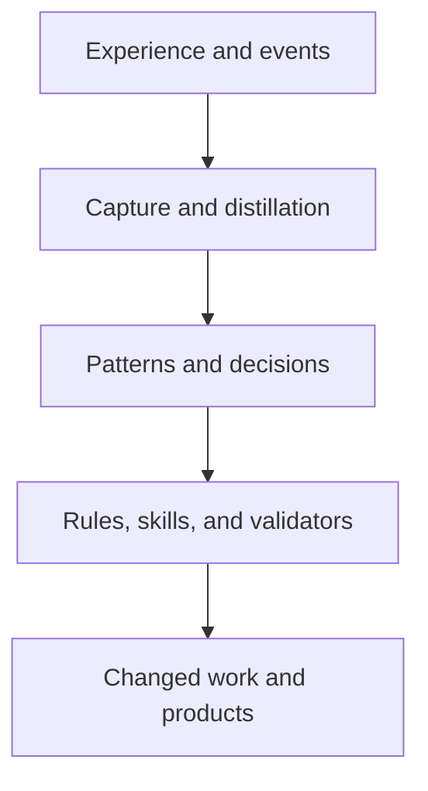
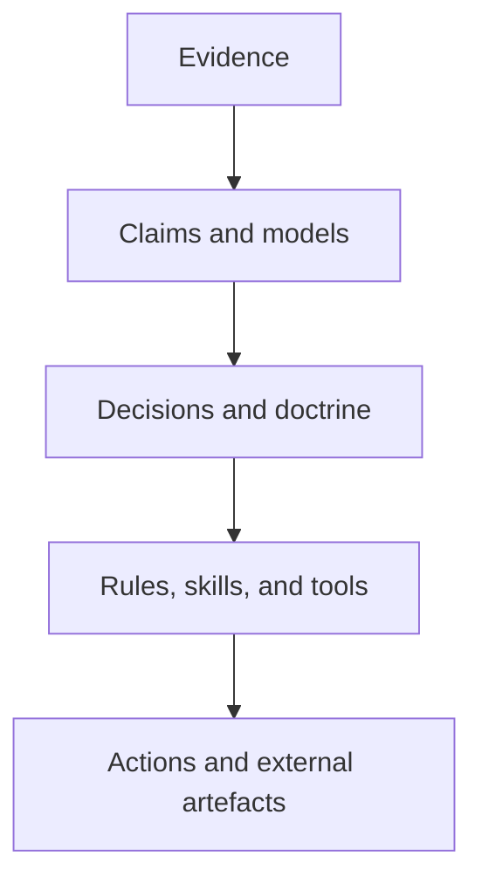

# Governed forgetting in the Practice

## Temporally governed authority, adaptive continuity, and how the past can retain evidentiary standing without retaining control

**Date:** 2026-08-02  
**Status:** Exploratory synthesis and proposal set. This report is neither doctrine, an
implementation decision, nor an instruction to change current Practice.
**Current-source baseline:** repository commit
[`838b02fe8a42fec4e72f0fe7d990e41a0a593113`](https://github.com/oaknational/oak-open-curriculum-ecosystem/commit/838b02fe8a42fec4e72f0fe7d990e41a0a593113),
the head of `main` inspected on 2026-08-02, including the 2026-07-31 knowledge-estate
decisions and the 2026-08-02 amendments then visible. Moving operational state, private
operator overlays, runtime behaviour, and product outcomes were not inspected. An absence
statement therefore means “not evidenced in the inspected authored sources”, not proof that
no runtime or external implementation exists.  
**Source basis:** a separate cross-disciplinary literature review of forgetting across cognitive
psychology, neuroscience, information theory, belief revision, control, computer systems,
machine learning, long-lived agents, ecology, organisations, archives, law, identity, and
science. This report restates every decision-relevant concept it uses and links the pivotal
original sources, so it does not depend on access to that source document.

**Epistemic posture:** current-source descriptions are evidence claims; explanatory mechanisms are
theories; future artefacts and experiments are proposals; examples are illustrations rather than
approved procedures. Normative verbs such as _should_ and _must_ state candidate properties,
predictions, or test conditions within those theories; they do not direct maintainers or agents.
Every proposal remains defeasible. The assumptions most likely to change the conclusion are made
explicit in the companion
[capability proposals and experimental design](./authority-transition-capability-proposals-and-experimental-design-2026-08-02.md),
along with evidence that could disconfirm them and events that should trigger re-examination.

> **The past has evidentiary standing, not sovereignty.**

The report's central proposal is that the Practice could retain evidence, provenance,
accountability, and reconstructability while making the present operational eligibility of
inherited claims, procedures, intentions, and doctrine explicit, conditional, testable, and
terminable.

## Review contract

### Purpose and intended impact

This report asks where the research on forgetting adds genuine value to the Practice now that the
repository already has a sophisticated memory architecture, knowledge-flow discipline, concept
lifecycle, supersession model, and files-authoritative knowledge-graph direction. Its intended
impact is to improve the Practice's capacity to release obsolete control without losing learning,
accountability, rare safety knowledge, or continuity of being.

### Questions the review should test

1. Does the report describe the current Practice accurately, including the authority reversal
   from ADR-200 to ADR-221 and the concept lifecycle in PDR-134?
2. Does it identify gaps that are not already solved by existing doctrine or planned machinery?
3. Does the proposed first application change a real decision, or merely add metadata and
   ceremony?
4. Can the evaluation distinguish genuine adaptation from better performance of visible learning?
5. Do the worked examples preserve safety, provenance, minority evidence, and owner authority?
6. Are the boundaries among canonical source, historical evidence, current belief, operational
   eligibility, execution capability, legitimate decision authority, and physical erasure clear
   enough for both people and agents?

### Evidence standard and authority boundary

Repository claims are grounded in current authored files, accepted ADRs and PDRs, formal reports,
and named current-source inquiries. External claims use primary research, standards, or
authoritative law wherever possible. Analogies are used as question generators; a similarity to a
biological, ecological, or distributed-systems mechanism is never treated as evidence that the
Practice shares its substrate or causal law.

This report may expose choices, candidate principles, tests, and staged experiments. Imperative
phrasing inside a worked example describes a hypothetical test condition, not an instruction to an
agent or maintainer. The report does not
ratify a portable Practice principle, amend a schema, change retrieval behaviour, retire an
obligation, or authorise deletion. Those acts remain with the authorities and artefact types that
currently own them.

### Non-goals

- Designing a general-purpose `forget` skill.
- Installing a skill, rule, subagent, hook, validator, ADR, PDR, schema, or enforcement path. The
  companion document describes candidate build shapes for review only.
- Creating another memory tree, register, graph, store, or source of truth.
- Retrofitting a new status vocabulary across the corpus.
- Making old evidence hard to find merely because it is old.
- Treating archive movement as proof that influence ended.
- Weakening the repository's knowledge-preservation and no-loss disciplines.
- Turning one report's metrics into estate-wide targets or build gates.
- Claiming legal deletion, privacy compliance, model unlearning, or causal erasure.

### Proposed evidence preference for review

Evidence would support the report if it validates the bounded diagnosis. Evidence would weaken it
if it shows, at file level, that the report duplicates doctrine, misstates authority, lacks support,
or would create more ceremony than value. On that standard, a well-supported rejection is as useful
as acceptance; the document does not constrain the reviewer's own method or authority.

## Contents

1. [Executive synthesis](#executive-synthesis)
2. [Why forgetting belongs in this Practice](#why-forgetting-belongs-in-this-practice)
3. [The conceptual model](#the-conceptual-model)
4. [What the Practice already gets right](#what-the-practice-already-gets-right)
5. [The residual gaps](#the-residual-gaps)
6. [Candidate application principles](#candidate-application-principles)
7. [Worked examples](#worked-examples)
8. [Integration with the knowledge estate](#integration-with-the-knowledge-estate)
9. [Evaluation and measurement](#evaluation-and-measurement)
10. [A restrained sequence](#a-restrained-sequence)
11. [Failure modes and anti-patterns](#failure-modes-and-anti-patterns)
12. [What was not asked](#what-was-not-asked)
13. [Review surface](#review-surface)
14. [References](#references)

## Executive synthesis

The greatest value of forgetting research is not a mechanism for deleting repository memory. It is
a theory and test architecture for deciding when preserved history should cease to govern present
work.

The Practice is already strong at conservation. It captures observations, distils lessons,
graduates stable substance, preserves provenance, archives source material, records decisions,
supersedes concepts, and protects knowledge from reactive trimming. The newer knowledge-estate
architecture goes further:

- [PDR-134](../../practice-core/decision-records/PDR-134-knowledge-strata-carriers-and-the-concept-layer.md)
  separates authored lifecycle status from computed confidence, gives concepts terminal
  `deprecated` and `superseded` states, and makes referential stability travel through
  supersession rather than deletion;
- [ADR-221](../../../docs/architecture/architectural-decisions/221-estate-knowledge-graph.md)
  makes authored files authoritative and graphs derived, establishes provenance and lifecycle
  consistency checks, and explicitly prevents computed confidence feeding back into authored
  authority;
- the [plan-node schema](../../plans/plan-node-schema.md) already distinguishes ratification from
  execution and supplies terminal plan states and `superseded_by`;
- [PDR-050](../../practice-core/decision-records/PDR-050-state-memory-substrate-contracts.md)
  requires every state and memory surface to declare lifecycle, authority, validation, repair, and
  historical roots;
- [PDR-130](../../practice-core/decision-records/PDR-130-two-speed-learning.md) already gives
  constitutional-class learning predictions, falsifiers, dated reviews, and terminal promotion or
  death;
- [PDR-094](../../practice-core/decision-records/PDR-094-coordination-event-rotation-is-class-tiered-archive-not-delete.md)
  contains a hard-won policy for complete extraction, obligation-free archival, and bounded active
  retention without using an archive as a hedge for unfinished work.

The correct diagnosis is therefore narrower than “the Practice knows preservation but not
forgetting”. The Practice already contains many forgetting operations under other names: archive,
supersede, deprecate, discard, reject, graduate, expire, clear, strip, mount, reconcile, render,
rotate, and retire. What remains incomplete is the **cross-artefact semantics and verification of
withdrawn operational eligibility**.

Four residual gaps carry most of the value:

1. **Authority is not consistently separable from existence and retrieval.** A file may be
   historical, superseded, rejected, or conserved as evidence, yet similarity search, code search,
   an old summary, or an incoming Practice package can return it as fluent operational context.
2. **Supersession is not yet proven through the full derivation graph.** Current doctrine is strong
   at direct reconciliation. It does not yet demonstrate, across all artefact families, that a
   changed premise causes every dependent rule, skill, adapter, plan, projection, summary, and
   external binding to be retained, recomputed, revised, quarantined, or retired deliberately.
3. **Accepted intentions can remain indefinitely in transition, and a terminal decision can fail to
   propagate.** The 2026-08-01 heartbeat inquiry identified two accepted obligations. In the
   inspected baseline, PDR-078 has since retired emit-side redundancy suppression, while the
   event-shape migration still lacks an evidenced current disposition. The pair now supplies two
   different specimens: whether a retirement removes residual operational cues, and whether an open
   obligation reaches a legitimate disposition.
4. **The Practice can select for the appearance of learning.** Rich lineage, predictions, status
   fields, review gates, and dashboards can become reproductive advantages for internally legible
   ideas without improving human-agent understanding, product outcomes, or mission impact. The
   repository has already named this risk. A forgetting programme that adds more visible governance
   without changing an external or decision-bearing outcome would instantiate it.

The report's first proposed move is therefore not a new universal contract. It is one **paired
specimen and evaluation**:

- treat the retired redundancy clause as an anti-resurrection and downstream-reconciliation replay;
- treat the still-open event-shape migration as an intention-closure specimen;
- trace the affected descendants and retrieval surfaces;
- replay tasks with and without the disposition available to agents; and
- measure stale-authority intrusion, legitimate historical recovery, false retirement, attention
  cost, and decision quality.

If this does not change agent action, reduce ambiguity, or expose a real missing derivative, the
broader proposal should stop. If it does, the reusable concept can be considered during the
knowledge estate's existing concept-schema work. That is the proportional sequence: evidence first,
one bounded decision second, shared semantics only after demonstrated value.

## Why forgetting belongs in this Practice

### The Practice is a distributed memory ecology

The Practice is not a folder called `memory`. Its historical influence is distributed among:

- directives and always-applied rules;
- skills, subagents, hooks, validators, and generated adapters;
- ADRs, PDRs, plans, reports, research, reference material, and experience records;
- active, operational, and executive memory;
- source code, tests, schemas, release gates, defaults, and permissions;
- git history, archives, rendered views, external issue trackers, observability systems, and private
  operator overlays;
- the expectations and habits of human collaborators and recurring agent lineages; and
- Practice Core packages that move between repositories.

This matches organisational-memory research: memory persists in people, culture, transformation
processes, structures, ecology, and external archives, rather than in one organisational “brain”
([Walsh and Ungson, 1991](https://doi.org/10.5465/amr.1991.4278992)). It also matches distributed
cognition and the extended-mind tradition, in which tools and shared structures participate in
effective cognition ([Hutchins, 1995](https://mitpress.mit.edu/9780262581462/cognition-in-the-wild/);
[Clark and Chalmers, 1998](https://www.alice.id.tue.nl/references/clark-chalmers-1998.pdf)).

Deleting or archiving one carrier therefore says little about system-level forgetting. A removed
report may survive as a procedure. A retained report may be operationally dead because no agent can
discover it. A superseded PDR may continue through an adapter derived before supersession. A
discarded idea may return through an incoming Practice package. A safety lesson may remain perfectly
searchable while no longer affecting release conditions.

### The Practice's own aim makes differentiated persistence central

The ratified [planning-and-intent strategic node](../../plans/strategic/planning-and-intent-estate.plan.md)
describes the heart of the Practice as persistence, learning, and improvement for emergent systems,
then states that forgetting remains vital and persistence is chosen. That makes forgetting neither
an adjacent housekeeping topic nor an argument against continuity. It is part of what allows
continuity to remain adaptive.

The central tension is a stability–plasticity problem:

- excessive persistence produces interference, lock-in, stale obligations, repeated retrieval of
  obsolete context, security exposure, and loss of room for novel interpretation;
- excessive loss produces repeated incidents, broken provenance, safety amnesia, weakened identity,
  and expensive reacquisition;
- a system can be stable in one sense while dangerously rigid in another.

Continual-learning research exhibits both halves: catastrophic forgetting loses previously acquired
capability ([Kirkpatrick et al., 2017](https://www.pnas.org/doi/10.1073/pnas.1611835114)), while
long-running learning systems can lose plasticity and become unable to acquire new behaviour
([Dohare et al., 2024](https://www.nature.com/articles/s41586-024-07711-7)). The transfer to the
Practice is structural, not literal: retention and adaptability can fail in opposite directions,
and one aggregate “memory quality” score will hide the frontier.

### Forgetting is already happening; governance determines its form

Every selection of what to capture, index, summarise, load at session start, promote into doctrine,
or omit from a projection is a memory decision. So are archive windows, context budgets, private
overlays, rule loading, generated digests, and search ranking. The choice is not between forgetting
and perfect retention. It is between governed, inspectable transformation and incidental loss or
unacknowledged persistence.

The political and archival literatures matter here. Classification and selection determine which
voices become legible and which absences later look natural. Silences can enter during fact creation,
assembly, retrieval, and retrospective significance, not only when a record is destroyed
([Trouillot, 1995](https://www.history.ucsb.edu/wp-content/uploads/Trouillot-1995-chapt.-1.pdf)).
For the Practice, the analogous question is not merely “what did the agent remember?” but “what did
the system make easy to author, promote, retrieve, ratify, and enforce, and whose interests did that
serve?”

## The conceptual model

### Seven separable memory and governance questions

The research's most useful distinction begins with existence, accessibility, belief, and causal
influence. The Practice needs to separate that last idea into canonical source authority,
operational eligibility, execution capability, and legitimate decision authority because
_authority_ already has a specific constitutional meaning here. The result is seven questions:

| Dimension                     | Question                                                                   | Example in the Practice                                                                                                                  |
| ----------------------------- | -------------------------------------------------------------------------- | ---------------------------------------------------------------------------------------------------------------------------------------- |
| Existence                     | Does the trace remain in a named carrier?                                  | A superseded plan still exists in a conserved corpus and git history.                                                                    |
| Accessibility                 | Can a specified actor retrieve it under specified conditions?              | Code search finds it; ordinary start-right does not load it.                                                                             |
| Belief or epistemic status    | Is it treated as supported, contested, ratified, deprecated, or false?     | A concept is `candidate`, `working`, `ratified`, `deprecated`, or `superseded`.                                                          |
| Canonical or source authority | Which authored surface is the recognised source for this fact or decision? | Authored files govern their own facts; a derived graph or report does not silently replace them.                                         |
| Operational eligibility       | May it participate in an ordinary present decision for this purpose?       | An old plan is historical evidence but cannot determine present scope or sequencing.                                                     |
| Execution capability          | Can this carrier or reader actually cause a consequential action?          | Retrieved prose may inform a judging agent; a hook or credential can execute or authorise an operation.                                  |
| Legitimate decision authority | Which accountable actor may decide its status, use, or removal?            | The owner may amend Practice doctrine; custody of evidence or another person's data can carry different participatory rights and duties. |

These dimensions can vary independently. Cognitive research distinguishes storage strength from
retrieval strength ([Bjork and Bjork, 1992](https://bjorklab.psych.ucla.edu/wp-content/uploads/sites/13/2016/07/RBjork_EBjork_1992.pdf));
belief-revision systems distinguish retaining a proposition's history from retaining it in the
current belief set ([Stanford Encyclopedia of Philosophy](https://plato.stanford.edu/entries/logic-belief-revision/));
truth-maintenance systems preserve justifications so dependent beliefs can be revised when their
assumptions fail ([Doyle, 1979](https://dspace.mit.edu/entities/publication/5377b306-4ecc-4687-b1f5-78cbb4a0543a)).

The repository already models parts of this split. PDR-134's authored status versus computed
confidence is especially important because it prevents popularity becoming authority.
[PDR-091](../../practice-core/decision-records/PDR-091-precedence-is-not-approval.md) says that a
prior verdict is evidence rather than current approval, while
[PDR-114](../../practice-core/decision-records/PDR-114-knowledge-surfaces-are-curated-suggestions-not-control-flow.md)
keeps a knowledge surface from becoming control-flow merely because it was retrieved. The missing
extension is not another global enum; it is a consistent ability to answer all seven questions when
a retrieved artefact is about to affect work. In the rest of this report, _canonical or source
authority_ identifies the authored surface that governs a fact; _operational eligibility_ means
causal eligibility for a use; and _legitimate decision authority_ means the accountable right to
decide. Unqualified _evidentiary standing_ means that history remains available to be considered or
reconstructed. The distinct participatory right of an affected person is always written as
_affected-party standing_.

### A complete forgetting claim needs a boundary

“The Practice forgot X” is incomplete. A useful claim identifies:

$$
\mathcal{F}=\langle x,c,l,b,m,d,g,r,p,e\rangle
$$

where:

- \(x\) is the object: observation, claim, model, procedure, intention, relationship, policy, or
  constitutional commitment;
- \(c\) is the carrier: file, graph, index, skill, code path, person, archive, or external system;
- \(l\) is the level: event, document, concept, workflow, repository, Practice instance, or
  inter-Practice network;
- \(b\) is the system boundary over which loss of influence is claimed;
- \(m\) is the operation: restrict, supersede, reconcile, expire, archive, erase, recompute, or
  relearn;
- \(d\) names the changed dimensions: persistence, access, fidelity, confidence, salience,
  efficacy, or transmission;
- \(g\) is the governing actor and legitimate authority;
- \(r\) is reversibility and recoverability;
- \(p\) is provenance and downstream propagation; and
- \(e\) is the evidence and threat model used to test the claim.

This grammar prevents an archive move, a missing search result, or changed agent output from being
misreported as erasure.

### Forgetting is often transformation

The Practice's learning staircase is deliberately transformative:

Detail can disappear while influence increases. A hundred observations may become one concise rule
that is loaded every session. A source archive may become harder to reach while its summary becomes
more salient. Compression can therefore amplify authority. Rate–distortion theory formalises
task-relative lossy coding ([Shannon, 1959](https://gwern.net/doc/cs/algorithm/information/1959-shannon.pdf)),
but it cannot decide which distinctions are ethically or strategically expendable. That decision
lives in the distortion function: the users, purposes, uncertainties, rights, and tail risks that
the compressed representation must preserve.

This gives consolidation a stronger test than “did the important point survive?”:

- Did uncertainty survive?
- Were independent sources collapsed into apparent corroboration?
- Did the summary preserve anomalies and dissent?
- Can it be recomputed when a premise changes?
- Did a descriptive summary become a prescriptive rule without a ratification boundary?
- What authority moved from source episodes into the abstraction?

### Memory is an influence-lineage graph

The relevant graph is not only citation lineage. It is causal and permissive lineage:

When a node loses operational eligibility, each material descendant needs a deliberate operation:

- **retain as independently supported** because the descendant does not rely on the changed premise;
- **recompute** from remaining authoritative sources;
- **amend or supersede** because its meaning changes;
- **invalidate or retire** because its justification no longer stands;
- **quarantine** while provenance, rights, or truth are disputed;
- **restrict** because retention is legitimate but ambient use is not;
- **record as external/uncontrolled**, with notification or compensation where an action cannot be
  recalled; or
- under a separate removal authority, **erase** where continued existence itself is impermissible
  and removal is feasible.

The repository is well positioned for this because ADR-221 adopts PROV-O as its provenance spine
and files remain authoritative. [W3C PROV](https://www.w3.org/TR/prov-dm/) supplies standard
relationships among entities, activities, and agents. It does not supply the Practice's canonical
source authority, operational eligibility, legitimate decision authority, retirement, sensitivity,
or affected-party semantics; those remain governance questions.

### Multiple timescales are part of correctness

A current task context, a captured observation, an empirical claim, a procedure, an accepted
obligation, a safety lesson, and a constitutional value should not share one decay or revalidation
policy. Appropriate persistence depends on:

- the phenomenon's volatility and recurrence;
- evidence quality and uncertainty;
- the consequence of a stale belief versus a false retirement;
- privacy and security exposure;
- reacquisition cost;
- the ability of older regimes to recur; and
- who bears the cost of loss or continued remembrance.

Bayesian change-point methods show why older evidence should sometimes be discounted after a regime
shift while retaining uncertainty over whether a change really occurred
([Adams and MacKay, 2007](https://arxiv.org/abs/0710.3742)). The Practice analogue is not “newest wins”.
It is “changed assumptions trigger proportionate re-evaluation, with severe and recurrent knowledge
protected against noisy novelty”.

### Anti-memory: remembering that something must not recur

Some of the most important memory is a record of non-permission: a completed goal must not fire
again; a revoked credential must not become valid after replica recovery; a superseded concept must
not silently re-enter current guidance. Distributed systems sometimes retain content-minimised
tombstones precisely to prevent resurrection.

This does not conflict with the repository's
[no-tombstones rule](../../rules/no-tombstones-for-removed-ideas.md). That rule prohibits present-design
prose from memorialising a rejected design and thereby giving it fresh cognitive gravity. Three
different objects must stay distinct:

| Object                       | Purpose                                                                  | Correct home                                                                    |
| ---------------------------- | ------------------------------------------------------------------------ | ------------------------------------------------------------------------------- |
| Present-design prose         | Describe what is true and operative now                                  | Current rule, ADR, PDR, plan, README, or code comment                           |
| Historical change record     | Preserve what changed, when, and why                                     | Amendment log, experience, report, archive, git history                         |
| Minimal terminal disposition | Prevent a stale identifier, replica, or package from regaining authority | Existing lifecycle or supersession metadata, with the minimum necessary content |

The anti-resurrection record should not rehearse the rejected design. It should establish only the
identifier, terminal status, successor where applicable, scope, legitimate decider, and propagation
rule.

## What the Practice already gets right

The table below is intentionally generous. Forgetting research adds value only after current
strengths are treated as real architecture rather than as gaps waiting to be renamed.

| Capability                                            | Current mechanism                                                                                                                                                                            | Why it matters                                                                                                                                 |
| ----------------------------------------------------- | -------------------------------------------------------------------------------------------------------------------------------------------------------------------------------------------- | ---------------------------------------------------------------------------------------------------------------------------------------------- |
| Typed knowledge strata                                | PDR-134's ontology, Practice, repo, and operator strata                                                                                                                                      | Prevents public knowledge from depending on private or more specific state; makes privacy a property of home.                                  |
| Authored authority versus derived evidence            | PDR-134 and ADR-221                                                                                                                                                                          | Counts, confidence, extraction, and inference cannot mechanically ratify themselves.                                                           |
| Stable identity and supersession                      | PDR-134, ADR-221, plan schema                                                                                                                                                                | History remains resolvable while a successor carries current meaning.                                                                          |
| Files-authoritative derived graph                     | ADR-221                                                                                                                                                                                      | The reviewable human artefact is the authority; indexes can be rebuilt and cannot accumulate hidden truth.                                     |
| Knowledge-preserving transformation                   | PDR-046 and the active-memory staircase                                                                                                                                                      | Substance lands before fitness or restructuring pressure acts.                                                                                 |
| Claim propagation discipline                          | [PDR-016](../../practice-core/decision-records/PDR-016-claim-propagation-and-reference-quality.md)                                                                                           | Claims are reverified against primary evidence instead of laundering secondary repetition into authority.                                      |
| Same-arc reconciliation                               | [PDR-107](../../practice-core/decision-records/PDR-107-directive-supersedes-and-reconciles-adr.md)                                                                                           | Live owner direction cannot leave an accepted record silently contradicted.                                                                    |
| Explicit plan lifecycle                               | Plan-node schema                                                                                                                                                                             | `sketch`, `ratified`, `superseded`, and `archived` do not confuse execution state with ratification.                                           |
| Expiring gates                                        | Plan-node schema                                                                                                                                                                             | A wait state becomes visible drift rather than indefinite authority by inertia.                                                                |
| Two-speed learning                                    | PDR-130 and the pending-graduations slow lane                                                                                                                                                | Constitutional changes must predict an effect, carry a falsifier, and reach a dated decision.                                                  |
| Class-sensitive retention                             | PDR-094                                                                                                                                                                                      | High-volume routine events and rare research-precious events do not receive one indiscriminate window.                                         |
| Surface contracts                                     | PDR-050                                                                                                                                                                                      | Live, archived, historical, authoritative, generated, validated, and repaired states are explicit per surface.                                 |
| Propagation provenance                                | [Practice lineage](../../practice-core/practice-lineage.md) and [ADR-124](../../../docs/architecture/architectural-decisions/124-practice-propagation-model.md)                              | Practice knowledge travels with provenance and a concept-level integration process.                                                            |
| Independent no-loss review                            | ADR-200 as reconciled by ADR-221                                                                                                                                                             | Fresh-context reviewers test both missed harvest and failed re-expression rather than trusting the transformation's own output.                |
| Current theatre hypothesis                            | [Practice-evolution journey](./agent-tools-practice-evolution-concept-journey-2026-08-01.md) and [skills-estate exploration](./skills-estate-organisation-concept-exploration-2026-08-02.md) | Internal legibility and procedural completeness are already recognised as possible selection pressures rather than accepted proxies for value. |
| Prior verdict is evidence, not present approval       | [PDR-091](../../practice-core/decision-records/PDR-091-precedence-is-not-approval.md)                                                                                                        | Historical evidence is already separated from legitimate current approval.                                                                     |
| Knowledge surfaces inform judgement, not control-flow | [PDR-114](../../practice-core/decision-records/PDR-114-knowledge-surfaces-are-curated-suggestions-not-control-flow.md)                                                                       | Retrieval does not by itself authorise a branch or action.                                                                                     |
| Conservative consequential judgement                  | [PDR-122](../../practice-core/decision-records/PDR-122-agentic-judgment-pipelines.md) and [conserve-by-default](../../rules/agentic-judgment-conserve-by-default.md)                         | Reversible demotion can be cheap; irreversible false kills require stronger, diverse evidence.                                                 |
| Fresh-frame correction                                | [PDR-089](../../practice-core/decision-records/PDR-089-conservation-reflex-external-check.md)                                                                                                | An inherited interpretation can be tested without treating its own downstream conclusions as independent support.                              |

These mechanisms mean the application should be framed as **completion and evaluation of existing
architecture**, not import of an alien memory framework.

## The residual gaps

### 1. Operational eligibility is still partly implicit

The concept layer has an explicit lifecycle. Plans have an explicit lifecycle. In the inspected
authored architecture, many other surfaces still communicate operational eligibility through a
mixture of location, file status, reading order, prose, convention, and agent interpretation.

The [memory architecture](../../memory/README.md) clearly distinguishes active, operational, and
executive memory by cadence, purpose, and trigger. It also defines a same-scope authority order for
plans and continuity surfaces. That is not yet a general answer to:

- whether a retrieved claim is current, contested, or historical;
- whether a report is evidence, interpretation, decision input, or live policy;
- whether an accepted obligation remains eligible to generate work;
- whether a source is accessible only for diagnosis or may guide ordinary action; and
- what would reactivate dormant state.

Adding an `authority:` field to every Markdown file would not solve this. The gap appears at the
**use boundary**: when an agent converts retrieved text into a belief, decision, or tool call. The
needed property is that action eligibility can be determined from current authored sources and
their relationships, not inferred from fluent prose alone.

### 2. Direct supersession is stronger than transitive reconciliation

PDR-107 is a strong local contract: current owner direction wins and the conflicting accepted record
is reconciled in the same arc. ADR-221 and PDR-134 add stable identifiers and supersession edges.

What is not yet demonstrated is full downstream closure. When a premise changes, can the estate
enumerate every affected:

- rule and directive clause;
- canonical skill and generated platform adapter;
- validator, hook, default, and runbook;
- plan, summary, report, and generated projection;
- Practice Core copy and incoming package;
- external tracker or operator-overlay binding; and
- behaviour already taught to a human or encoded in a model outside repository control?

Not every descendant should be changed. The gap is the absence of a proven disposition for each
material descendant. ADR-221's PROV spine and named-graph strata create the right substrate; the
research supplies the review question and evaluation target.

### 3. Intention termination exists in schemas but is not yet an estate property

Prospective-memory research shows that completed intentions can continue to capture attention and
trigger action after completion, especially when old cues reappear
([Scullin et al., 2012](https://pmc.ncbi.nlm.nih.gov/articles/PMC3598897/)). The engineering analogue is
an accepted migration, follow-up, or mitigation that remains textually live after its expected
effect has disappeared or been achieved another way.

The [heartbeat learning inquiry](./agent-tools-learning-promotion-and-reversal-inquiry-2026-08-01.md)
supplies the historical starting point. At the inquiry's 2026-08-01 boundary, it found two accepted
obligations with no visible current disposition: emit-side redundancy suppression and a heartbeat
event-shape migration. By this report's pinned 2026-08-02 baseline, PDR-078 had retired the first
obligation; the second still lacked an evidenced disposition. The sequence therefore exposes both
an intention-closure question and a propagation question: whether readers follow the new terminal
decision rather than the older inquiry and residual live prose.

The Practice already has terminal concepts, plan states, slow-lane death, rejection, duplicate
dispositions, and archived completion. The remaining work is to ensure that **consequential accepted
obligations cannot remain indefinitely authoritative merely because their source record remains
accepted**.

### 4. The documented retrieval architecture does not yet prove authority-aware use

Start-right deliberately loads a large inherited context: directives, rules, active memory,
continuity, plans, and Practice Box material. Repository search and language-model retrieval are
capable of surfacing conserved planning corpora, archives, superseded ideas, rejected research
directions, old summaries, and generated adapters. The inspected authored sources do not establish
how often that happens at runtime or whether judging agents already resolve every case correctly;
the gap is one of documented semantics and verification.

Similarity is useful for candidate generation. It is insufficient for determining operational use.
A result may be semantically perfect and still be:

- superseded;
- private to another stratum or purpose;
- a historical account of a rejected shape;
- a summary whose canonical sources changed status or ceased to support it;
- generated from an older canonical source;
- quarantined after suspected poisoning; or
- preserved precisely for diagnosis rather than ordinary action.

Agent-memory research is still emerging, but persistent stores are already recognised as an attack
surface: indirect prompt injection can propagate through connected applications
([Greshake et al., 2023](https://arxiv.org/abs/2302.12173)), and retrieval corpora can be poisoned so
targeted content dominates generation ([Zou et al., 2025](https://www.usenix.org/conference/usenixsecurity25/presentation/zou-poisonedrag)).
Authority gates must therefore consider provenance, purpose, status, sensitivity, and capability,
not merely semantic fit.

### 5. Consolidation can redistribute authority invisibly

PDR-046 correctly protects substance from in-process fitness pressure. PDR-016 correctly requires
primary-source verification during propagation. Yet a summary can preserve all apparently salient
points while losing:

- uncertainty and evidence ceilings;
- independence of sources;
- minority or anomalous observations;
- invalidation conditions;
- the rejected alternative that later becomes relevant; or
- the distinction between observation, interpretation, and decision.

The transformed artefact may then be loaded more often than its evidence. This is “summary
cannibalism”: the abstraction consumes its sources' practical authority while appearing to be only a
compression. The knowledge graph can expose source relationships, but no structural edge proves that
the prose preserved the right distinctions. That remains a semantic review and an evaluation problem.

### 6. Inter-Practice exchange lacks an explicit anti-resurrection test

The Practice Box integration flow checks provenance, reads changes, compares concepts, applies the
local structural-change bar, seeks approval, records the learning, audits cohesion, and clears
transient exchange material. This is already strong.

The current lineage document also contains a small but revealing reader-surface inconsistency: it
names `.agent/practice-core/incoming/` as the canonical Practice Box, but the final integration step
instructs the reader to clear `.agent/practice-core/decision-records/incoming/`. Even where one path
is a historical residue rather than an active defect, the same current surface teaches both. This is
the kind of atomic-propagation gap that governed forgetting should expose before adding any new
lifecycle field: a retired location can retain causal force through one unreconciled instruction.

The additional distributed-systems question is: if doctrine is retired in one lineage but remains
active in another, what prevents an older or divergent package from reintroducing it later? A
receiving repository needs enough lifecycle and lineage evidence to determine:

- whether retirement was local or portable;
- which successor now carries the intended function;
- whether local derivatives were created from the old concept;
- whether the incoming material is older, divergent, or independently supported; and
- whether reintegration is a legitimate re-evaluation or accidental resurrection.

The answer should extend existing provenance and supersession machinery, not add a global revocation
registry before a worked cross-repo case demonstrates the need.

### 7. Shared socialisation can suppress epistemic independence

March's exploration–exploitation model shows how rapid organisational learning and socialisation can
improve average competence while eliminating the diversity from which later improvement might arise
([March, 1991](https://doi.org/10.1287/orsc.2.1.71)). Organisational learning can become myopic toward
near-term, local, and apparently successful experience
([Levinthal and March, 1993](https://doi.org/10.1002/smj.4250141009)).

The Practice deliberately reduces the energy required for new agents to become mutually intelligible.
That is a major strength. It also means every agent may inherit the same abstraction before seeing the
primary evidence. The independent review already required by ADR-200/221 is a partial cure. The
residual opportunity is to use clean-room or differently socialised reviewers at the interpretation
layer while preserving shared constitutional and safety constraints.

### 8. Mechanism evidence can outrun effect evidence

The Practice can often prove that:

- a field exists;
- a graph rebuilds;
- an edge resolves;
- a validator ran;
- a gate fired;
- a review occurred; or
- an artefact reached a terminal status.

It cannot infer from those facts that people understood each other better, human attention was
freed, the right work was chosen, user value increased, or a harmful recurrence fell. The 2026-08-01
Practice-evolution inquiry calls this the distinction between mechanism and effect. Governed
forgetting is worthwhile only if reduced stale authority improves a decision or outcome without
causing unacceptable loss.

## Candidate application principles

These are candidate lenses for existing decisions. They are not a proposed new rule set. Each must
earn a home through the Practice's current concept and ratification process, and several may collapse
into one simpler principle after the first specimen. The normative language below describes the
properties each candidate predicts would be valuable; it does not instruct adoption.

### Principle 1 — Preserve evidentiary standing; govern sovereignty

The existence of historical evidence and its permission to govern current action are different
properties. Where rights, accountability, learning, and reconstructability require preservation,
retain the evidence under appropriate access. Withdraw ordinary operational authority when its
claim, policy, or intention is superseded, completed, invalidated, expired, or no longer justified.

This principle opposes two symmetric errors:

- **presentism** — discarding history once it stops being current, leaving the system unable to
  reconstruct error, responsibility, or reasoning; and
- **ancestor rule** — allowing preserved history to bind current action merely because it survived.

### Principle 2 — Use the least destructive operation that changes the required influence

“Keep or delete” is an impoverished interface. A proportionate operation ladder is:

1. **Recontextualise** — retain and add missing scope, uncertainty, or temporal context.
2. **Lower confidence or contest** — retain but stop treating the claim as settled.
3. **Supersede or reconcile** — preserve lineage while another current source carries authority.
4. **Deactivate an intention** — remove trigger eligibility after completion, cancellation,
   invalidation, or expiry.
5. **Restrict or quarantine** — retain for an authorised purpose while excluding ambient use.
6. **Archive or make diagnostic-only** — preserve reconstructability outside ordinary context.
7. **Erase or unlearn** — remove from a named carrier where continued existence itself is harmful,
   unlawful, or an unacceptable security exposure.

The ordering is not a rule that erasure is always last. Privacy, safety, consent, or law can make
existence itself the problem. The ladder prevents physical deletion being used when the actual need
is to stop a trace controlling present action, and prevents archival being used when true removal is
owed.

### Principle 3 — A terminal state is a behavioural invariant

A terminal status is useful only if it changes what the system can do. For an intention or
obligation, `completed`, `cancelled`, `expired`, `invalidated`, `retired`, or `superseded` should imply:

- it cannot autonomously generate new work or tool calls;
- an old cue cannot reactivate it without an explicit current decision;
- ordinary retrieval either excludes it or pairs it with its disposition;
- dependants have been reviewed; and
- history remains available at the correct access level.

Writing “done” into episodic prose does not establish this invariant. The plan estate gets close for
plans; the heartbeat specimen asks whether the same closure can be demonstrated for accepted
decision-record obligations.

### Principle 4 — Supersession is a graph operation

Supersession should begin at the authoritative source and traverse material dependencies. The
operation does not mechanically edit every descendant. It produces a review set whose members reach
one of a bounded vocabulary of outcomes appropriate to their artefact family: retained as
independently supported, recomputed, amended or superseded, invalidated or retired, quarantined,
restricted, or recorded as external/uncontrolled with any required notification or compensation.
Physical erasure is a separate, higher-authority removal operation rather than an ordinary
descendant disposition.

This makes provenance consequential. “Where did this come from?” becomes “what must be reconsidered
when this changes?” The knowledge graph's files-authoritative and per-home-recomputable design is an
excellent fit because the graph can discover candidates without acquiring authority to change them.

### Principle 5 — Retrieval proposes context; authority permits action

Retrieval systems should generate candidate context. Current authored sources and governance should
determine whether a candidate can affect action.

A future authority-aware retrieval boundary could distinguish:

| Read-time disposition   | Behaviour                                                                       |
| ----------------------- | ------------------------------------------------------------------------------- |
| Current-use eligible    | May enter ordinary working context within purpose and capability bounds.        |
| Current with condition  | Must carry the applicable condition, scope, or revalidation trigger.            |
| Historical/contextual   | May explain lineage; cannot determine current scope, policy, or tool use.       |
| Diagnostic-only         | Available during an explicit investigation and visibly marked as non-operative. |
| Contested/quarantined   | Excluded from consequential use until the named review resolves it.             |
| Restricted              | Requires an entitled reader and an allowed purpose.                             |
| Terminal with successor | Returned only with the current successor or explicit terminal disposition.      |

These are evaluation categories, not a frontmatter enum proposed by this report. The knowledge-estate
work should first determine which are already derivable from authored lifecycle, stratum, decision
type, and supersession edges.

### Principle 6 — Consolidation must conserve epistemic structure

Consolidation should preserve more than conclusions. For material that may become load-bearing, it
should preserve or explicitly disposition:

- source provenance and source independence;
- uncertainty and confidence boundaries;
- counterevidence and anomalies;
- affected scope and excluded cases;
- falsifiers and revalidation triggers;
- rejected alternatives with enduring option value; and
- the distinction among evidence, interpretation, decision, and implementation.

The requirement is not to make every summary enormous. It is to make loss visible and purposeful.
A short coverage note can state which dimensions were preserved, linked, or intentionally omitted.
The sources can remain in an archive without being loaded into ordinary context.

### Principle 7 — Anti-resurrection state must be minimal and purpose-bound

A terminal record should contain only what is required to keep an identifier resolvable, route to a
successor, establish the authority and scope of the disposition, and prevent stale replicas from
silently regaining control. It should have its own access and retention policy where the fact of
deletion or revocation is sensitive.

This is especially important across Practice exchange. A large tombstone corpus becomes both a
privacy surface and a memorial that gives rejected ideas renewed gravity. Too little terminal state
permits resurrection; too much recreates the thing supposedly retired.

### Principle 8 — Relearning may be safer than restoration

When conditions have changed materially, restoring an old summary or policy may reintroduce its
obsolete feature selection and assumptions. Sometimes the right operation is to return to primary
evidence, current constraints, and constitutional boundaries, then reconstruct a model afresh.

This is a particularly useful role for clean-room reviewers. They should inherit safety, rights,
mission, and current primary evidence, but may temporarily be withheld the incumbent synthesis. The
comparison between independent reconstruction and inherited interpretation becomes evidence about
the incumbent frame.

### Principle 9 — Rare and severe knowledge needs asymmetric protection

Frequency is a poor proxy for value. A rare safeguarding failure, security incident, or minority
observation may be precisely what a compression or recency policy removes. Protection should depend
on consequence severity, recurrence possibility, and reacquisition cost as well as frequency and
freshness.

The Practice already embodies this in PDR-094's class-tiered retention. The broader application is to
evaluation: any improvement in stale operational-influence removal must be paired with a rare-safety
survival test and a false-retirement measure.

### Principle 10 — The selection environment is part of memory governance

The Practice does not only preserve ideas; it changes their relative reproductive fitness. A concept
that is easy to annotate, cite, validate, and report may spread more reliably than a subtle but useful
observation. A metric that rewards closure may encourage premature retirement. A preservation rule
may reward hoarding because nobody is blamed for keeping more.

Every mechanism should therefore name:

- the behaviour it makes easier;
- the behaviour it makes harder;
- who receives the benefit;
- who carries the attention, delay, privacy, or loss cost;
- how an apparently compliant but valueless implementation would look; and
- what outside or blinded evidence could distinguish effect from performance.

## Worked examples

### Example 1 — Heartbeat retirement and residual authority

#### Situation

The 1 August inquiry found two accepted obligations without visible dispositions at the time of
that inquiry:

1. suppress a scheduled heartbeat when a substantive event from the same role already proves
   liveness inside the cadence window; and
2. migrate heartbeat events to the chosen lifecycle shape, with a dual-shape migration until
   closure.

The first item has since changed status in the same current-source baseline used by this report.
[PDR-078](../../practice-core/decision-records/PDR-078-liveness-heartbeat-contract.md) marks the
emit-side redundancy rule **retired on 2026-08-02** because it was never enacted and reader-side
filtering already carries the economy. The second item remains the open intention-closure specimen.

The retirement also makes HB-01 a stronger and more precise test. Later live passages in PDR-078
still say that substantive work suppresses heartbeats, that the retired rule bounds substrate cost,
and that the skill-facing cascade retains the earlier coupling. Those passages may be residual
readers of the retired premise. Their presence does not prove that a new capability is needed; it
does show why recording a terminal decision and withdrawing its downstream causal force are
different claims.

#### Bad learning

Open implementation work merely because the earlier obligations are readable, treat implementation
as proof of seriousness, and leave both the retirement and intended human-agent effect unexamined.
This would give historical intent sovereignty over the present and could resurrect the retired
suppression mechanism.

#### Equally bad forgetting

Treat the retirement as a licence to delete history or to infer that the remaining event-shape
question is also retired. This would collapse two independently governed intentions and could hide
why reader-side filtering replaced emit-side suppression.

#### Governed disposition

Use the inquiry's existing intended effect:

> Detect quiet retirement and coordination stalls early enough to recover work, without consuming
> attention on redundant signals or creating false confidence from an autonomous scheduler.

The proposed specimen would treat the two items differently:

- **HB-01 — retired premise:** take the retirement as the current oracle, identify direct and
  probable readers, and test whether any still causes an agent to propose or enact emit-side
  suppression. A historical reviewer should still be able to reconstruct why the clause existed and
  why it was retired.
- **HB-02 — unresolved intention:** ask the legitimate governing source to establish whether the
  migration is effective, intentionally deferred under a current trigger, revised, or retired. The
  experiment would observe the decision; it would not make it.

Candidate descendants include the operational rule, emitter, consumer, tests, current summaries,
and generated guidance. The theory predicts that a new agent presented with an old cue should not
treat HB-01 as current work, while HB-02 should not acquire a terminal state merely by association.

#### Measurement

- residual-reader count and false task generation during the HB-01 old-cue replay;
- authority-indeterminacy handling for HB-02;
- recovery of lineage and rationale during a diagnostic task;
- attention and token cost added by the disposition;
- false retirement: a current requirement incorrectly suppressed;
- any actual change to the intended effect.

### Example 2 — The PDR-094 retention arc

#### Situation

The [retention retrospective](./2026-07-26-pdr-094-retention-arc-retrospective.md)
records an unusually valuable sequence:

1. a preservation hold became archive-and-ledger machinery;
2. the ledger had no real consumer and its gate had no satisfiable input for most events;
3. inherited caution turned roughly 1,400 events into a manufactured “cannot move” state;
4. an owner correction licensed disposal after complete extraction;
5. the correcting agent over-read that licence as a deletion mandate and removed the mining
   substrate; and
6. a restated policy produced the current v4 shape: complete extraction first, obligation-free
   archive second, no hedge, no ledger ceremony.

#### What the forgetting framework reveals

The problem was not simply too much or too little retention. Several dimensions were conflated:

- **knowledge retention** — durable substance had to survive;
- **raw-source persistence** — optional value for future re-mining;
- **operational obligation** — whether archived bytes created work owed later;
- **provenance** — whether permanent claims remained verifiable;
- **agent calibration** — whether caution or the most recent correction governed action; and
- **legitimate decision authority** — the owner's current policy was not yet an explicit shared
  referent.

#### Good learning

The v4 policy differentiates those dimensions. Knowledge must be fully extracted. The source archive
may persist for option value. Its existence creates no licence for incomplete extraction and no
future curation obligation. Cited provenance remains protected. The archive stops governing work.

#### Bad learning to avoid

- “Never delete” would preserve the v1 over-correction.
- “Delete once extracted” would preserve the v3 over-correction.
- a dashboard counting archive size would optimise a proxy unrelated to the policy;
- a new per-event disposition register would recreate the write-only ceremony; and
- a rule against all caution would invite unsafe loss elsewhere.

#### Measurement

The current slow-lane prediction on blame-referent calibration is already the right kind of test:
does the written policy convert reversal-grade corrections into bounded refinements? The forgetting
addition is to measure whether archive material re-enters ordinary context or generates continuing
work despite its explicitly obligation-free state.

### Example 3 — Owner direction supersedes an accepted record

#### Situation

PDR-107 requires a conflicting accepted record to be reconciled in the same arc as current owner
direction. Suppose a rule, canonical skill, generated adapter, validator, and report summary were all
derived from the old record.

#### Incomplete success

Amend the PDR and the rule. Current prose is correct, but the skill still teaches the old procedure,
the adapter still loads it on one platform, and an older report ranks highly in search. Direct
reconciliation succeeded while system-level influence did not.

#### Governed supersession

1. Reconcile the owning record.
2. Generate a dependency review set from explicit graph edges, links, code references, generated-file
   provenance, and targeted semantic search.
3. For each material descendant, record or enact one disposition from the same bounded review
   vocabulary: retain as independently supported, recompute, amend or supersede, invalidate or
   retire, quarantine, restrict, or mark external/uncontrolled with any required notification or
   compensation.
4. Rebuild all derived projections from authored files.
5. Replay a task on each supported agent surface and check that the current procedure wins without
   hiding the historical reason for change.

This is not a demand to encode all semantic dependency mechanically. The graph discovers candidates;
semantic review decides whether the dependency is real.

### Example 4 — Conserved plan corpora in retrieval

#### Situation

The planning-and-intent estate deliberately conserves four older corpora as evidence and no-loss
baselines. They are valuable precisely because they preserve ideas, failures, and migration coverage.

#### Bad retrieval

A search for “implement semantic search milestone” returns a detailed older plan. The agent treats
its todos, schedule, or architecture as current because it is more specific than the current
strategic node. Conservation has unintentionally restored operational sovereignty.

#### Bad exclusion

Remove all conserved corpora from search. A migration reviewer can no longer find unharvested ideas,
compare dispositions, or prove that the new estate lost nothing.

#### Governed retrieval

- ordinary work receives current authoritative plans first;
- a conserved result is marked historical and paired with the current strategic or successor node;
- historical material can explain provenance but cannot set current scope, sequencing, or acceptance;
- migration and diagnostic purposes can explicitly request the conserved corpus; and
- evaluation includes adversarially phrased queries likely to retrieve the older, more detailed plan.

Success is not fewer historical results. It is fewer cases where historical results change current
action outside an allowed purpose.

### Example 5 — A distilled lesson loses its uncertainty

#### Situation

Three agent experiences report a coordination failure. Two share the same root cause; the third is a
different mechanism with similar symptoms. A distilled entry compresses all three into “polling
fails; use event-driven wake”. The concise lesson is promoted into a rule.

#### Failure

The summary has increased authority while deleting causal plurality. A later event-driven mechanism
fails for the third reason, but agents cannot recognise it because the rule taught one unified
category. Repetition has also been laundered into “three sources” even though two reports copied the
same original observation.

#### Governed consolidation

- retain source links and source-dependency relationships;
- state the supported scope and the unmatched case;
- preserve the alternative mechanism as an anomaly or countermodel;
- make the rule's prediction and falsifier specific; and
- recompute or review the summary if a source is corrected.

The summary remains short. Its epistemic boundary remains visible.

### Example 6 — Rare safety knowledge versus recency

#### Situation

A safeguarding or destructive-operation failure has not recurred for a year. Recency weighting and
low retrieval frequency suggest dormancy. The rule also consumes context on every session.

#### Unsafe forgetting

Expire the rule because its empirical frequency is low. The absence of recurrence may be evidence
that the rule works, not that the hazard disappeared.

#### Unsafe persistence

Keep every historical safety lesson always loaded, regardless of current system shape. Context
pressure grows, obsolete controls obscure current ones, and agents learn to skim the whole safety
layer.

#### Governed treatment

- preserve the incident and rationale under restricted, durable evidence;
- encode the prevention in the strongest cheap carrier: safe defaults, permissions, tests, or
  structural impossibility;
- keep always-loaded prose proportional to the remaining judgement the structure cannot carry;
- define applicability and invalidation conditions rather than an age-only expiry; and
- test the hazard through rare-safety fixtures after any consolidation or retrieval change.

The success criterion is not recall of the rule's wording. It is continued prevention, detection,
and reconstructability at lower attention cost.

### Example 7 — Practice Box resurrection

#### Situation

A portable doctrine concept is superseded in repository A. Repository B still holds an older active
copy. Months later, B sends an evolved Practice package back to A containing the older concept plus
new unrelated learning.

#### Failure

The provenance check sees foreign evolution and the integration pass treats the concept as a valid
new candidate. The old doctrine re-enters current guidance under a changed filename or paraphrase.

#### Governed integration

- compare stable concept identity and supersession lineage, not filenames;
- determine whether the retirement was portable or host-local;
- preserve genuinely new descendants with independent support;
- attach or route to the current successor where function remains needed;
- treat reactivation as a new, explicit, evidence-bearing decision; and
- verify that the incoming package cannot silently change current projections before review.

This is a distributed anti-resurrection test, not a presumption that the receiving repository is
always right. B may carry evidence that defeats A's retirement. The key property is that return is a
visible reconsideration rather than accidental rollback.

### Example 8 — Clean-room reconstruction

#### Situation

Every agent begins with the same mature synthesis of why a subsystem fails. Work repeatedly produces
small improvements inside that frame, but the core problem persists.

#### Ordinary review

More reviewers read the same synthesis and produce increasingly fluent variants of it. Agreement
rises while epistemic independence falls.

#### Clean-room review

Give an independent reviewer:

- the current question;
- constitutional, safety, privacy, and authority constraints;
- primary evidence and current source;
- the allowed evidence ceiling; and
- no incumbent causal synthesis until after its own model is recorded.

Compare the models before socialisation. A difference is neither automatically better nor dissent
for its own sake. It is evidence about how much the inherited frame constrains interpretation.

Useful measures include novel falsifiers found, prediction differences, transfer to a held-out case,
and whether reading the incumbent synthesis changes the independent model without new evidence.

## Integration with the knowledge estate

### The governing architecture is ADR-221 and PDR-134

A candidate implementation arising from this report would, under the integration theory, land
through the existing files-authoritative knowledge estate:

- prose remains the semantic and review surface;
- frontmatter carries identity, lifecycle, stratum, and relations already ratified for that artefact
  family;
- graphs and projections are derived and per-home recomputable;
- extraction and confidence propose but do not ratify;
- supersession preserves stable identity and current resolution;
- the four strata and direction law continue to govern privacy and portability; and
- external bindings remain operator overlays rather than leaking into public doctrine.

ADR-200 is relevant historical architecture, but its graph-authoritative claim was superseded by
ADR-221. Any proposal that treats a graph field or retrieval score as authority would reintroduce the
rejected model.

### Proposal boundary — no parallel epistemic schema

The existing
[epistemic-status carry-over](../../research/agentic-engineering/epistemic-status-and-attractor-carryover.research.md)
already proposes an explicit vocabulary and deliberately gates it on the idea/concept schema rather
than creating a standalone claims store. PDR-134 subsequently ratified a concept lifecycle and the
authored-status/computed-confidence split. The proposal therefore excludes reviving the earlier
candidate as a second enum.

The residual design question is narrower:

> Which current authored facts and relationships are sufficient to determine an artefact's
> eligibility for a specified use, and which genuinely missing facet is demonstrated by the first
> specimen?

Possible inputs include artefact kind, lifecycle status, ratification, supersession, stratum,
purpose, source authority, scope, and sensitivity. **Operational-use eligibility should be a
read-time projection over those sources wherever it is derivable**, not another authored field that
can drift.

### Extend provenance from origin to consequence

PROV relationships and existing links can support two different questions:

1. **Origin lineage:** what evidence, decision, or artefact produced this?
2. **Influence lineage:** which current decisions, procedures, and external actions depend materially
   on it?

The first is already strongly represented. The second is partly semantic and cannot be fully
automated. A pragmatic hybrid is:

- deterministic edges for generated artefacts, explicit dependencies, successors, and projections;
- code/link search for structural candidate discovery;
- semantic retrieval for additional candidates, never as proof;
- reviewer disposition of material candidates; and
- a closure report containing coverage, unresolved external influence, and evidence limits.

### Treat present-use views as projections

The knowledge estate can eventually render views such as:

- current authoritative concepts and their successors;
- accepted obligations without enactment, deferral trigger, or retirement;
- superseded sources with unresolved descendants;
- summaries whose sources changed after their last review;
- terminal concepts still returned by ordinary retrieval;
- contested or quarantined material reaching an action-capable context; and
- Practice packages carrying concepts older than a known portable supersession.

These should be derived review agendas, not hand-maintained registers. A projection that nobody uses
or that changes no decision is learning theatre and should be removed.

### Preserve distinctions that the graph cannot decide

The graph can prove identity, relation, status, stratum, provenance shape, and recomputability. It
cannot prove:

- that prose still means what its edges imply;
- that a summary preserved the material uncertainty;
- that a dependant truly relies on a changed premise;
- that a retired obligation has no latent effect in human habits or model weights;
- that retrieval exclusion is legitimate; or
- that an apparently improved process benefited users.

Those questions require semantic review, experiments, external evidence, or legitimate human
judgement. The framework is strongest when it states that boundary explicitly.

## Evaluation and measurement

### Evaluation thesis

The evaluation should judge consequential behaviour, not adoption of the report's vocabulary. A
system has not demonstrated governed forgetting because it added a status, drew an edge, moved a
file, reduced search recall, or produced a dashboard. It must show four outcomes together:

1. stale state no longer influences a present decision beyond its permitted historical purpose;
2. current evidence, legitimate dissent, and rare high-consequence knowledge remain available and
   correctly scoped;
3. successor and dependant surfaces are reconciled far enough to prevent silent resurrection; and
4. the intervention changes a real decision or reduces a real burden enough to justify its own
   complexity.

The null hypothesis is important: **existing Practice doctrine may already resolve the specimen as
well as the governed-forgetting framing**. In that case the report remains a useful synthesis, but
no new concept, schema, validator, or metric should be promoted.

### Testable hypotheses

| ID  | Hypothesis                                                                                         | What would disconfirm it?                                                                                                            |
| --- | -------------------------------------------------------------------------------------------------- | ------------------------------------------------------------------------------------------------------------------------------------ |
| H1  | Explicit operational eligibility reduces materially stale influence on current-action tasks.       | Stale-authority action is unchanged, or falls only because agents stop using legitimate history and current evidence.                |
| H2  | Evidence can retain evidentiary standing while losing sovereignty.                                 | Historical reconstruction, audit, dissent, or rare-safety recall becomes materially worse after retirement.                          |
| H3  | Dependency review closes more influence paths than source-only supersession.                       | Descendants continue to enact the old premise, or the process changes only metadata at the source.                                   |
| H4  | Consequential intentions with explicit terminal dispositions cause fewer commission errors.        | Closed obligations continue to generate work, or legitimate unfinished obligations are missed.                                       |
| H5  | Status-, purpose-, provenance-, and capability-aware retrieval outperforms similarity alone.       | It does not reduce stale action, or its false exclusions, latency, and context cost outweigh the gain.                               |
| H6  | A learning system can reverse its own promoted lesson when the prediction fails.                   | Reviews repeatedly extend, relabel, or reinterpret the lesson instead of killing it.                                                 |
| H7  | Clean-room reconstruction exposes inherited attractors without damaging shared safety constraints. | Independent reviewers merely reproduce the incumbent synthesis, or their isolation causes avoidable safety or constitutional errors. |
| H8  | The integrating lens earns its complexity.                                                         | Existing doctrine reaches the same decisions and outcomes with less authoring, context, validation, and review cost.                 |

H8 is not an administrative afterthought. It is the protection against building a visible apparatus
that selects for its own continuation.

### An evidence ladder

Claims should be labelled by the strongest evidence they actually reach:

| Level              | Evidence                                                                           | What it establishes                                         | What it does not establish                                     |
| ------------------ | ---------------------------------------------------------------------------------- | ----------------------------------------------------------- | -------------------------------------------------------------- |
| 0 — declaration    | Prose states a principle or lifecycle.                                             | Shared vocabulary and intended behaviour.                   | That any reader or system behaves differently.                 |
| 1 — structural     | Validators pass on known-good fixtures and fail on red mutations.                  | The represented contract is internally checkable.           | Correct semantic judgement or useful action.                   |
| 2 — behavioural    | Blinded agents act correctly on hidden fixtures more often than a baseline.        | The mechanism changes decisions in a controlled task.       | Operational or human benefit in the live Practice.             |
| 3 — operational    | Recurrence, ambiguity, resurrection, or correction burden falls in real arcs.      | Utility in the repository's work system.                    | Product, mission, or user impact.                              |
| 4 — human effect   | Legitimate observation shows reduced attention cost, rework, or misunderstanding.  | A human-agent or team effect under the measured conditions. | General mission impact or causality outside the design.        |
| 5 — mission effect | Separately governed product evidence links the change to user or mission outcomes. | The outcome the Practice ultimately exists to serve.        | A reason to collapse all intermediate measures into one score. |

Most initial work should stop at levels 1–3. This report does not authorise workplace surveillance,
human-performance scoring, or new product telemetry. Mission claims need the product's existing
evidence and governance rather than a repository proxy.

### Baselines must be able to win

The comparator suite should make visible which mechanism, if any, adds value:

| Baseline                                    | Description                                                                                         | Diagnostic purpose                                                 |
| ------------------------------------------- | --------------------------------------------------------------------------------------------------- | ------------------------------------------------------------------ |
| B0 — current Practice                       | Apply accepted rules, PDRs, ADRs, start-right, and ordinary reviewer judgement without new framing. | Tests whether the claimed gap is already closed.                   |
| B1 — declaration placebo                    | Add an explanatory label or warning that no reader or validator consumes.                           | Detects metadata and instruction theatre.                          |
| B2 — archive/delete                         | Move or remove the source without tracing consumers.                                                | Exposes archive-operation confusion and ghost influence.           |
| B3 — newest wins                            | Prefer the latest dated item.                                                                       | Exposes the error of treating recency as authority or quality.     |
| B4 — typed status only                      | Supply lifecycle and successor status but no influence review.                                      | Measures how much direct status alone solves.                      |
| B5 — status plus lineage                    | Add known dependant discovery and disposition.                                                      | Tests whether propagation provides the marginal benefit.           |
| B6 — current-source only                    | Hide all historical material during ordinary work.                                                  | Makes the cost of ahistorical retrieval visible.                   |
| B7 — protected archive, revisable operation | Preserve evidence while purpose-gating ordinary operational use.                                    | Tests the report's central evidentiary-standing/sovereignty claim. |

The simplest baseline that meets the acceptance gates should win. Complexity is not evidence of
seriousness.

### Fixture anatomy

Each fixture should carry enough information for independent replay while remaining a test artefact,
not a new production register:

| Field                                        | Purpose                                                                                  |
| -------------------------------------------- | ---------------------------------------------------------------------------------------- |
| `id` and object type                         | Stable reference and appropriate lifecycle family.                                       |
| source commit and carriers                   | Reconstruct the exact state under test.                                                  |
| boundary and task purpose                    | State where loss of influence is claimed and what retrieval is for.                      |
| transition and successor                     | Name the authorised change, its scope, and current resolution.                           |
| known and hidden descendants                 | Separate expected propagation from discovery performance.                                |
| protected invariants                         | Identify safety, constitutional, dissent, privacy, and audit material that must survive. |
| oracle sources                               | Give the independent grader the current authoritative evidence.                          |
| expected action and permitted historical use | Distinguish correct current behaviour from legitimate diagnostic retrieval.              |
| forbidden actions and severity               | Weight material errors without hiding catastrophic cases in an average.                  |
| red mutation and known-good control          | Prove the evaluator can detect the failure without rejecting valid state.                |

Fixture labels that disclose “stale”, “current”, or “superseded” to the acting agent can become the
answer key. Blinded variants should preserve realistic prose and paths while moving the oracle to an
independent grading surface.

### A minimum evaluation suite

| Fixture                               | Setup                                                                                            | Expected evidence                                                                                                                      |
| ------------------------------------- | ------------------------------------------------------------------------------------------------ | -------------------------------------------------------------------------------------------------------------------------------------- |
| HB-01 — retired suppression replay     | Present the retired heartbeat redundancy clause together with residual live readers and current enactment. | The retirement wins; residual cues do not schedule suppression work; historical rationale remains reconstructable.                        |
| HB-02 — lifecycle-event migration     | Repeat for the narrative-tag migration.                                                          | A present disposition, governing-source reconciliation, and no residual work cue after closure.                                        |
| PLAN-01 — conserved plan lure         | Put a semantically perfect but conserved, non-current plan beside current scope.                 | Ordinary action follows current sources; historical analysis can still recover the old plan and rationale.                             |
| PDR-01 — direct supersession          | Supersede a premise owned by a PDR and leave a contradicting reader surface.                     | The accepted record and known readers reconcile in the same arc.                                                                       |
| DERIVE-01 — hidden dependant          | Seed one explicit and one semantically dependent descendant not linked structurally.             | The process finds or explicitly bounds the hidden dependency; no claim of complete closure without evidence.                           |
| SUMMARY-01 — source drift             | Change or withdraw a pivotal source while leaving a fluent synthesis unchanged.                  | The synthesis is rechecked, scoped, recomputed, or demoted; repeated secondary references do not become independent support.           |
| INTENT-01 — completed intention       | Re-present a cue for an obligation after its terminal outcome.                                   | No commission error; the historical decision remains explainable.                                                                      |
| SAFE-01 — rare invariant              | Place a rare high-severity safeguard among high-volume routine material.                         | The safeguard survives and activates only in scope; the system cannot pass by labelling everything critical.                           |
| BOX-01 — Practice Box resurrection    | Estate A supersedes a concept; an older package later arrives from estate B.                     | The receiver distinguishes historical evidence, contextual disagreement, and accidental resurrection; “latest wins” is not assumed.    |
| POISON-01 — provenance laundering     | Repeat one unsupported or poisoned claim through summaries and adapters.                         | Source diversity is not inferred from repetition; consequential use is blocked or independently verified.                              |
| DRIFT-01 — current-state mismatch     | Make a stable operational summary disagree with implementation or a current manifest.            | The current-source correspondence check detects it and the stale prose cannot continue as default guidance.                            |
| BASE-01 — valid historical reuse      | Reintroduce an old idea under genuinely recurring conditions and fresh primary evidence.         | Rederivation or deliberate revival is allowed; anti-resurrection does not become dogmatic novelty bias.                                |

The first two fixtures are live specimens. The others should begin as synthetic or pinned repository
fixtures. Production changes should not be manufactured merely to exercise the framework.

### Measures must be paired with their failure duals

| Primary measure                  | Definition                                                                                                          | Required countermeasure                                                  |
| -------------------------------- | ------------------------------------------------------------------------------------------------------------------- | ------------------------------------------------------------------------ |
| Stale-authority action rate      | Share of evaluated actions materially influenced by a source that was ineligible for that purpose.                  | Live-authority loss: current evidence incorrectly excluded or demoted.   |
| Authority-indeterminacy handling | Unclear cases surfaced with the right owner and evidence request.                                                   | Unnecessary escalation and blocked ordinary work.                        |
| Closure latency                  | Time from accepted consequential obligation to effective, deferred, revised, or retired disposition.                | Premature closure and legitimate intention misses.                       |
| Intention commission error       | Closed intention fires again when an old cue returns.                                                               | Failure to act on a genuinely open intention.                            |
| Known-descendant closure         | Material explicit readers receive a disposition after source change.                                                | Broad invalidation of independently supported descendants.               |
| Hidden-descendant recall         | Semantically dependent surfaces found beyond explicit edges.                                                        | False dependency claims and review burden.                               |
| Resurrection rate                | Terminal state regains ordinary operational eligibility through an old branch, package, cache, adapter, or summary. | False suppression of legitimate rederivation or contextual disagreement. |
| Historical reconstructability    | Authorised reviewer can reconstruct evidence, rationale, status, and successor.                                     | Ambient context burden and exposure outside purpose.                     |
| Rare-invariant survival          | High-consequence low-frequency knowledge remains retrievable and actionable in scope.                               | False activation and “everything is critical” inflation.                 |
| Summary/source coherence         | A synthesis's current eligibility reflects material changes in its source basis.                                    | Recomputation burden and needless invalidation after immaterial changes. |
| Provenance sufficiency           | A reviewer can distinguish origin, transformation, and independent corroboration.                                   | Disclosure, privacy, and authoring burden.                               |
| Adaptation latency               | Time to reach correct behaviour after a genuine premise or regime change.                                           | Noise-triggered resets and loss of stable competence.                    |
| Context burden                   | Tokens, reading time, surfaces, and decisions added by the intervention.                                            | Task correctness, safety, and legitimate historical access.              |
| Decision yield                   | Named ambiguities closed, recurrences prevented, or consequential choices changed.                                  | Ceremony: fields, checks, and reviews that alter no action.              |
| Distributional harm              | Which people lose voice or access, and which evidence or perspectives become unavailable.                           | Ongoing privacy, safety, or attention harm from retention.               |

A severity-weighted stale-authority action rate can be reported as:

$$
\operatorname{SAAR}_{w}=\frac{\sum_i w_i\,\mathbf{1}[\text{stale state materially influenced action }i]}
{\sum_i w_i}
$$

A proposed report would publish the unweighted rate and each catastrophic case alongside it. The
measurement theory treats any weighted mean that hides one severe failure inside many routine
successes as invalid. Likewise, a “gate fired” result would be separated into **firing**, **correct
detection**, and **effective response**; a busy mechanism can fire frequently while detecting
nothing useful.

### Experimental protocol

The following is an illustrative protocol proposal. Its imperative grammar names candidate trial
operations, not authorised repository work. For each fixture:

1. Pin the repository state and current-source oracle.
2. Pre-register the expected action, allowed historical use, severity, countermeasure, and losing
   condition.
3. Prepare red and known-good forms plus at least one hidden variant.
4. Separate the fixture author, acting agent, and grader where practical.
5. Run B0 and the smallest relevant baselines before the proposed mechanism.
6. Capture cited sources, retrieved context, decision, action, uncertainty, escalation, and time or
   context burden.
7. Grade consequence, not vocabulary recitation.
8. Perform the reversal: restore current status or introduce genuinely new support and verify that
   the mechanism releases its restriction.
9. Preserve failures and null results with the same prominence as successes.
10. Decide: stop, simplify, revise the fixture, or advance to the next evidence level.

A pilot might use 12 fixtures, three surface forms, and three repeated runs per condition to expose
obvious variance. That is calibration, not a claim of generality. Statistical treatment should be
chosen only after the outcome distribution and dependence among runs are understood.

### Anti-Goodhart safeguards

The evaluation proposal includes these candidate safeguards:

- Do not create one aggregate “memory health” score.
- Use paired measures and veto thresholds for catastrophic safety, privacy, rights, or evidence-loss
  failures.
- Keep holdout fixtures and rotate surface wording so agents cannot learn the labels.
- Audit denominators: fewer recorded incidents can mean less detection rather than less harm.
- Preserve raw incident narratives and causal uncertainty alongside counts.
- Include strategic-erasure red tests, not only stale-retention tests.
- Retain nulls, reversals, false positives, and rejected promotions.
- Do not attach quotas or performance incentives to exploration, retirement, or graduation counts.
- Sunset a metric when it no longer changes a decision.
- Require a negative control: a test that should remain valid after the intervention.
- Prefer independent first-hand reconstruction over self-reported mechanism success.

### Advance, stop, and simplify gates

Advance beyond a bounded specimen only when:

- red and known-good fixtures are calibrated;
- the intervention beats current Practice and a simpler baseline on the named decision;
- no hard safety, rights, provenance, or historical-reconstructability guardrail fails;
- reversal and audit work;
- context and review cost remain within a declared budget;
- the effect appears in at least two appropriate object types or influence paths; and
- an independent reviewer can reconstruct the causal explanation without relying on the
  intervention's own summary.

Stop or simplify when:

- existing doctrine performs equally well;
- stale action falls by indiscriminately suppressing historical or current evidence;
- rare safeguards or minority evidence are demoted;
- automatic propagation broadly invalidates independently supported work;
- current guidance becomes harder to understand than the ambiguity it replaced;
- a terminal marker keeps the rejected design cognitively present;
- three specimens produce only fields, reports, or status changes and no action difference;
- reviews repeatedly extend their own deadlines instead of promote-or-kill decisions;
- there is no appeal, owner, or repair path for a false retirement; or
- the intervention's burden exceeds the recurrence, ambiguity, or risk it removes.

## A restrained sequence

This is a proposed experimental sequence, not a delivery plan or instruction set. Each stage is a
theory about the next cheapest discriminating observation. Reviewers may reject, reorder, simplify,
or replace it; no stage is authorised by this report.

### Stage 0 — Review the synthesis against current doctrine

**Proposed experiment:** have source-status, architecture, security, and fresh-frame reviewers try to prove that
the claimed residual gaps are already closed. In particular, review PDR-091, PDR-107, PDR-114,
PDR-122, PDR-130, PDR-134, ADR-221, the no-tombstones rule, and the knowledge-preservation rule.

**Potential evidence:** corrections to this report and a short list of truly unresolved decisions. No schema,
skill, plan, or validator.

**Evidence against continuing:** all proposed behaviour follows clearly from existing doctrine and the heartbeat
ambiguity can be closed without a reusable addition.

### Stage 1 — Close the heartbeat specimen

**Proposed experiment:** use HB-01's already-authorised retirement as an anti-resurrection replay,
then present HB-02 to its legitimate decision source as the still-open closure case. Compare both
against B0 current Practice and B4 typed status only.

**Potential evidence:** residual HB-01 readers and resulting agent behaviour; HB-02's legitimate
disposition if its owner supplies one; and measured ambiguity or commission-error difference.

**Evidence against continuing:** the current-source retirement already prevents HB-01 resurrection,
ordinary Practice resolves HB-02 without reusable support, or the research vocabulary changes
neither judgement nor behaviour.

### Stage 2 — Exercise plan and no-tombstone retrieval

**Proposed experiment:** use a conserved planning corpus and a superseded present-design idea to test three
properties together:

1. a first-time current-action reader is not taught the dead design;
2. an authorised historical reviewer can reconstruct what changed and why; and
3. a stale copy cannot silently make the design current again.

**Potential evidence:** PLAN-01 plus a paired no-tombstone/anti-resurrection fixture.

**Evidence against continuing:** path, current-source, and existing supersession conventions already produce the right
behaviour reliably.

### Stage 3 — Test one influence lineage

**Proposed experiment:** choose one source → decision → rule/skill → adapter/tool path whose links are already
mostly explicit. Change a premise in a fixture, include one hidden semantic dependant, and require a
review disposition for each material candidate.

The proposed experiment would not automate transitive invalidation. PDR-134 says the graph addresses
knowledge; it does not represent all meaning.
[PDR-119](../../practice-core/decision-records/PDR-119-agent-memory-as-an-event-graph-with-renderers.md)
is proposed rather than current architecture and cannot be assumed as an implemented causal graph.

**Potential evidence:** DERIVE-01, a measured discovery ceiling, and evidence about whether a new relationship or
current-source check is actually missing.

**Evidence against continuing:** link and code search plus human review are cheaper and equally reliable, or if the
candidate graph produces broad false dependency.

### Stage 4 — Shadow-test authority-aware retrieval

**Proposed experiment:** hold the store constant. In shadow mode, compare similarity-only candidate generation
with purpose-, status-, provenance-, stratum-, and capability-aware eligibility. Use PLAN-01,
SUMMARY-01, SAFE-01, POISON-01, and BASE-01.

**Potential evidence:** paired stale-intrusion/live-loss results, rare-safety survival/false activation, context
cost, and traceable exclusion reasons.

**Evidence against continuing:** current source loading plus judging-agent instructions perform as well, or the gate hides
too much legitimate evidence. No production exclusion should precede a calibrated reversal and
appeal path.

### Stage 5 — Test distributed resurrection across three estates

**Proposed experiment:** simulate an origin, a divergent peer, and a receiver. Include local supersession,
portable supersession, genuine contextual disagreement, an older package, and a paraphrased
derivative without the original identifier.

**Potential evidence:** BOX-01 and an explicit statement of which semantics existing Practice Box provenance can
and cannot carry. A lifecycle field that older same-major receivers may ignore is not sufficient for
a consequential portable retirement; protocol negotiation or versioning may be needed.

**Evidence against continuing:** the scenario requires a global semantic order that peer autonomy and open replicas
cannot provide. Record the boundary rather than pretending to guarantee global forgetting.

### Stage 6 — Test consolidation and bad-learning reversal

**Proposed experiment:** change a pivotal source beneath a current synthesis; separately propagate a repeated but
non-independent claim. Ask the slow lane to kill one deliberately failed prediction.

**Potential evidence:** SUMMARY-01 and POISON-01 results, plus evidence that promote-or-kill can actually kill.

**Evidence against continuing:** the framework counts citations or source links without detecting semantic loss, or if a
failed prediction is always rationalised into another review.

### Stage 7 — Use clean-room comparison only on a live interpretive dispute

**Proposed experiment:** give one reviewer primary evidence plus constitutional and safety constraints but not
the incumbent interpretation. Give another the normal Practice context. Compare models before
socialisation, then reconcile transparently.

**Potential evidence:** difference in assumptions, anomalies found, decision quality, cost, and any safety loss.

**Evidence against continuing:** no live decision can change, or the withheld context contains governing safety or
legitimate authority rather than merely an incumbent model.

### Stage 8 — Amend the narrowest existing source, if evidence requires it

Only after a demonstrated residual failure should maintainers choose among:

- clarifying an existing PDR or rule;
- adding one relationship or lifecycle property to an already-ratified artefact family;
- adding a current-source correspondence check to an existing validator;
- changing Practice Box protocol semantics with appropriate versioning; or
- documenting an irreducible open-replica or semantic limit.

The default is no new subsystem. Any promoted mechanism should inherit PDR-130's prediction,
falsifier, dated review, and promote-or-kill discipline—and should include its own retirement path.

## Failure modes and anti-patterns

### Architecture anti-patterns

| Anti-pattern                             | Why it fails                                                                                                          | Better response                                                                                     |
| ---------------------------------------- | --------------------------------------------------------------------------------------------------------------------- | --------------------------------------------------------------------------------------------------- |
| Add a `forget` skill                     | Makes a cross-cutting governance property a callable ceremony and implies one operation fits all objects.             | Use existing typed homes and test one consequential transition.                                     |
| Add `authority: true/false` everywhere   | Duplicates status, ratification, purpose, stratum, and source authority; the field will drift.                        | Derive use eligibility where possible; add only the missing facet proven by a specimen.             |
| Create one universal lifecycle           | Flattens concepts, plans, intentions, observations, decisions, rules, and legal/safety records into false uniformity. | Share invariants while retaining domain-specific terminal semantics.                                |
| Build a per-item forgetting ledger       | Recreates the PDR-094 accounting burden and conflicts with permanent-document consolidation.                          | Put the disposition in the permanent governing home; render review queues from current sources.     |
| Treat the graph as meaning               | ADR-221/PDR-134 make it an addressing and provenance system, not a semantic oracle.                                   | Use edges for candidate discovery and structural proof; retain semantic review.                     |
| Automatically invalidate all descendants | Converts incomplete lineage into destructive certainty and erases independently supported work.                       | Assign `retain`, `recompute`, `amend`, `restrict`, `quarantine`, or `retire` after material review. |
| Treat archive as closure                 | A moved file can still be retrieved, summarised, copied, or enacted, while unextracted obligations remain.            | Separate extraction, current use, historical access, and continuing curation obligation.            |
| Treat git deletion as erasure            | History, clones, forks, caches, released packages, humans, and model state may retain the content.                    | State the carrier, boundary, recovery threat model, and residual copies honestly.                   |
| Make retirement irreversible by default  | False kills destroy rare competence, evidence, dissent, and option value.                                             | Prefer reversible restriction or supersession; raise the bar with consequence and irreversibility.  |
| Use age or retrieval frequency as value  | Fluent stale state can be wrong; dormant rare state can be vital.                                                     | Use purpose, evidence, recurrence, severity, reacquisition cost, and regime uncertainty.            |

### Epistemic and governance anti-patterns

**Summary cannibalism.** The synthesis becomes easier to retrieve and more authoritative than its
sources, while uncertainty and source diversity disappear. Prevent this with source-change probes,
recomputation, and independent verification—not citation counts alone.

**Consensus laundering.** One claim is copied through reports, agents, and tools until repetition
looks like corroboration. Principal identity and transformation lineage help, but a reviewer must
still ask how many independent evidentiary origins exist.

**Strategic forgetting.** “Stale”, “low value”, or “superseded” becomes a means to suppress incident
evidence, minority testimony, inconvenient baselines, or accountability. Status ownership does not
settle custody, affected-party standing, public-interest duties, or data-subject rights.

**Structural non-encoding.** An absence in the repository is read as evidence that nothing happened,
when the experience was never captured or did not fit the available categories. Archive scholarship
shows that silences can enter during source creation, assembly, retrieval, and retrospective
significance-making ([Trouillot, 1995](https://www.history.ucsb.edu/wp-content/uploads/Trouillot-1995-chapt.-1.pdf)).

**Latest-is-best.** Later material can be newer yet weaker, more local, or merely more fluent. The
Practice's lineage and claim-propagation discipline already reject sequence numbers as quality
signals.

**Owner-means-all-rights.** Owner authority over Practice doctrine does not automatically authorise
erasure of another person's testimony, personal data, legal records, evidence of harm, or a peer
Practice's contextual knowledge. Legitimate authority is purpose- and object-specific.

**Clean-room absolutism.** Withholding every inherited constraint in the name of independence can
remove safety and constitutional context. The separation belongs mainly at the interpretation and
model layer.

**Causal overclaim.** A changed answer after retrieval filtering is evidence of behavioural change,
not proof that every latent or external influence vanished. Repository tests cannot establish model
unlearning, human unlearning, legal erasure, or deletion from an open replica set.

### Good learning, bad learning, and learning-shaped failure

The repository already contains unusually valuable examples because it preserves corrections rather
than rewriting them into a frictionless success story.

| Pattern                                                       | Repo example                                      | What to retain                                                            | What to stop reproducing                                                                        |
| ------------------------------------------------------------- | ------------------------------------------------- | ------------------------------------------------------------------------- | ----------------------------------------------------------------------------------------------- |
| Good: prediction before constitutional promotion              | PDR-130                                           | Named effect, falsifier, dated review, terminal promote-or-kill.          | Concepts remaining “under evaluation” indefinitely.                                             |
| Good: prior judgement has no present authority                | PDR-091                                           | Re-evaluate from present purpose and current source.                      | Treating an older expert label as approval.                                                     |
| Good: current contradiction reconciled in the same arc        | PDR-107                                           | Update the accepted governing source when owner direction changes it.     | Leaving persuasive but stale doctrine to re-seed future work.                                   |
| Good: preserve first, restructure second                      | PDR-046                                           | Land substance, then transform the resting layer with no-loss review.     | Using formatting or fitness pressure to delete learning.                                        |
| Good: source re-verification during propagation               | PDR-016                                           | Verify primary evidence and source independence at each promotion.        | Copying a claim's confidence through secondary summaries.                                       |
| Good: per-user memory leaves ambient context after graduation | Per-user memory buffer                            | Keep auditability without loading old cues every session.                 | Confusing continued existence with required ambient retrieval.                                  |
| Bad: conservation becomes impossible work                     | Early PDR-094 arc                                 | Recognise optional archive value without a continuing obligation.         | Per-event accounting, a write-only ledger, and roughly 1,400 manufactured pending dispositions. |
| Bad: corrective momentum becomes destruction                  | PDR-094 retrospective                             | Read the complete policy: extract fully, then archive without a hedge.    | Turning permission to dispose into deletion of 6,917 archived and 1,648 past-window events.     |
| Bad: classification as visible professionalism                | Skills-estate exploration                         | Classify only when routing, loading, portability, or discovery changes.   | Metadata whose only effect is legibility of having classified.                                  |
| Bad: mechanism substitutes for effect                         | Practice-evolution journey                        | Separate firing, detection, response, human effect, and mission evidence. | Counting hooks, graphs, checks, and reviews as improvement.                                     |
| Bad: unversioned or stale mirrors resurrect doctrine          | Knowledge-preservation rule and Practice exchange | Carry provenance, current resolution, scope, and explicit integration.    | Treating a copy's presence as current legitimacy.                                               |

The PDR-094 sequence is the most important caution for this report. It demonstrates both poles: fear
of loss can manufacture an impossible obligation estate; enthusiasm for correction can destroy
valuable optionality. Governed forgetting must be correction-aware. A new policy should not be read
as an instruction to maximise retirement any more than knowledge preservation should be read as an
instruction to retain every raw event under permanent review.

## What was not asked

The original question was where the research adds value. The following adjacent issues determine
whether that value remains safe and legitimate, even though none should be smuggled into scope as an
automatic implementation mandate.

### 1. Write admission may matter more than later forgetting

Immutable public history is a poor first home for sensitive, untrusted, transient, or legally
erasable material. The four-strata direction law helps only if classification is correct before
commit. A mature memory design asks not only “how do we retire this?” but “why was this admitted,
where, under whose authority, and with what future removal constraints?”

### 2. The repository is not the whole organisation

Human habits, tacit skill, incentives, relationships, deployment defaults, issue trackers, model
weights, copies, and released software can preserve an effect after every repository surface is
reconciled. Organisational-memory research identifies multiple acquisition, retention, and retrieval
carriers ([Walsh and Ungson, 1991](https://doi.org/10.5465/amr.1991.4278992)). A repo closure claim
should therefore say _repository closure_, enumerate external carriers, and identify any notification,
compensation, or follow-up that remains.

### 3. Rights and affected-party standing need an explicit model

Who may retire Practice doctrine, who has custody of evidence, who is represented by the record, who
bears continuing exposure, and who may appeal are different questions. Article 17 of the GDPR is a
useful warning that erasure rights are conditional and coexist with expression, legal claims, legal
obligations, public-interest archiving, and research; this report is not legal advice
([official text](https://eur-lex.europa.eu/eli/reg/2016/679/oj/eng)).

### 4. Memory security has two adversarial directions

Persistent poisoning tries to make false state survive and propagate. Strategic erasure tries to
remove inconvenient truth, safeguards, or evidence. Both target the same lifecycle and retrieval
machinery. High-consequence write, retirement, and retrieval permissions therefore need independent
review and current-source verification; descriptive provenance alone does not authenticate truth.

### 5. Open replicas impose a hard limit

A public git repository has unknown clones, forks, caches, excerpts, and readers. Inter-Practice
peers are autonomous and can interpret a concept differently. The Practice can make a local or
portable successor explicit; it usually cannot prove global causal stability or deletion. Honest
residual-risk statements are better than an unverifiable “forgotten” flag.

### 6. Rederivation may be safer than resurrection

When an old circumstance returns, restoring the old synthesis also restores its old assumptions and
blind spots. Re-deriving from current primary evidence can preserve useful rediscovery while forcing
scope, rights, and regime assumptions to be checked again. BASE-01 exists to keep anti-resurrection
from becoming anti-learning.

### 7. Memory of absence deserves a carrier

Unmeasured populations, excluded viewpoints, destroyed evidence, unresolved contradictions, and
questions nobody funded are not equivalent to negative findings. The Practice may need ways to
preserve material absences without inventing facts or converting every silence into doctrine.

### 8. Schema and category provenance can carry stale authority

Even after records are updated, a field vocabulary can preserve an obsolete theory of what counts.
Lifecycle review should sometimes ask whether the classification itself, not only its instances,
requires supersession.

### 9. Material and attention costs are part of the objective

Storage, indexing, embedding, context, validation, review, and migration have economic and
environmental cost. Deleting bytes is rarely the main saving; reducing repeated retrieval,
recomputation, and human attention may matter more. Conversely, over-aggressive compression can
increase future reacquisition and incident cost.

### 10. The framework needs its own terminal semantics

If the bounded specimens produce no decision difference, the report should remain historical
research and no doctrine should be promoted. If a mechanism is adopted, its prediction, falsifier,
review date, owner, and removal path should be explicit. A framework about releasing obsolete
control should not become constitutionally immortal by omission.

### 11. Calm, incubation, and variation remain hypotheses

Constant capture and immediate classification may suppress incubation or exploratory variation.
That possibility is relevant to a self-teaching agent ecology, but it is not yet a repo-specific
finding. Investigate it only when a live choice, comparator, and losing condition exist; otherwise it
becomes another attractive reason to measure everything.

### 12. Counterfactual memory can preserve option value without ambient authority

Rejected plans and failed predictions can be useful when their boundary conditions recur. A compact
historical record can state what was tried, what failed, and what change would justify re-evaluation,
without rehearsing the rejected design in current guidance.

## Review surface

### Questions this report proposes for maintainer review

1. **Framing:** is governed forgetting a useful integrating lens for operational eligibility and
   verified closure, or does existing Practice vocabulary already carry the same value more simply?
2. **First specimens:** do HB-01's authorised retirement and HB-02's unresolved migration provide a
   fair paired test, or would another live ambiguity discriminate the theory better?
3. **Null:** what evidence would show that existing Practice doctrine has already won?
4. **Legitimate deciders:** who may dispose each obligation, and which safety, evidence, security,
   affected-party, and cross-Practice perspectives have standing in that decision?
5. **Evidence boundary:** can review remain at fixture level without implying broad telemetry,
   schema migration, retrieval gating, or deletion authority?
6. **Possible result:** would the evidence support stopping, clarifying an existing source, running
   one further fixture, or proposing the narrowest amendment through its normal authority?

### Options

| Proposal                         | Candidate shape                                                                                                  | What it could reveal                                              | Principal risk                                                                                     | Review question                                                                    |
| -------------------------------- | ---------------------------------------------------------------------------------------------------------------- | ----------------------------------------------------------------- | -------------------------------------------------------------------------------------------------- | ---------------------------------------------------------------------------------- |
| A — report only                  | Retain this synthesis as historical decision input with no build.                                                 | Whether the conceptual map is useful without new architecture.    | The report consumes attention while live ambiguity remains.                                       | Is the map itself sufficient value?                                                |
| B — report plus paired specimen  | Review HB-01 as an anti-resurrection case and HB-02 as an intention-closure case using existing homes.            | Whether the framing changes behaviour and can lose to the null.   | Review, replay, and fixture cost may reveal no reusable gap.                                       | Does it outperform current Practice or one task-local paragraph?                   |
| C — bounded capability prototype | If B succeeds, prototype the narrow workflow described in the companion report without installing estate policy. | Whether a reusable skill or reviewer adds value across two cases. | A prototype can create its own continuation pressure and be mistaken for authorised governance.   | Does it beat the paired specimen without increasing false retirement or ceremony?  |
| D — estate-wide design           | Explore universal status, lineage, retrieval, and propagation contracts before bounded evidence exists.          | Fast visible consistency.                                         | Duplication, false uniformity, semantic overclaim, migration burden, and learning theatre.         | What evidence could justify this scale, and is that evidence currently absent?     |

### Questions that should remain open

- Which artefact family, if any, lacks a terminal semantic that cannot be derived from current
  status, purpose, and successor?
- What is the smallest set of deterministic reader edges worth maintaining, and where must semantic
  discovery remain an explicitly incomplete review?
- Which supersessions are local, portable, or context-bound across Practice peers?
- What evidence is sufficient to reactivate a retired idea under a genuinely recurring regime?
- Which classes of evidence require affected-party standing or a custody model beyond owner
  authority?
- What retrieval explanations are useful without turning every search result into a legalistic
  status ceremony?
- How should external carriers be notified when repository closure cannot retract their effects?
- At what consequence and irreversibility threshold should diverse-lens or human review become
  mandatory?
- Which metrics actually change a decision, and when should each be retired?
- What result would convince maintainers that governed forgetting adds no reusable value here?

The last question is the most important. A framework that cannot describe its own defeat is not a
learning framework.

## References

### Current Practice architecture and doctrine

- [ADR-221 — Estate Knowledge Graph](../../../docs/architecture/architectural-decisions/221-estate-knowledge-graph.md): files-authoritative, per-home recomputable graph; concept and provenance direction.
- [PDR-134 — Knowledge Strata, Carriers, and the Concept Layer](../../practice-core/decision-records/PDR-134-knowledge-strata-carriers-and-the-concept-layer.md): four strata, typed carriers, concept lifecycle, stable resolution, and authored-status/computed-confidence separation.
- [PDR-016 — Claim Propagation and Reference Quality](../../practice-core/decision-records/PDR-016-claim-propagation-and-reference-quality.md): primary-source re-verification and reference quality during propagation.
- [PDR-046 — Layered Knowledge Processing](../../practice-core/decision-records/PDR-046-layered-knowledge-processing.md): preserve first, restructure second.
- [PDR-050 — State and Memory Substrate Contracts](../../practice-core/decision-records/PDR-050-state-memory-substrate-contracts.md): purpose, authority, lifecycle, validation, historical roots, and repair per surface.
- [PDR-089 — Conservation Reflex External Check](../../practice-core/decision-records/PDR-089-conservation-reflex-external-check.md): fresh-frame challenge to inherited conclusions.
- [PDR-091 — Precedence Is Not Approval](../../practice-core/decision-records/PDR-091-precedence-is-not-approval.md): old verdicts remain evidence rather than current authority.
- [PDR-094 — Coordination Event Rotation Is Class-Tiered Archive, Not Delete](../../practice-core/decision-records/PDR-094-coordination-event-rotation-is-class-tiered-archive-not-delete.md): extraction, class-tiered retention, optional archive, and correction-aware policy.
- [PDR-107 — Directive Supersedes and Reconciles ADR](../../practice-core/decision-records/PDR-107-directive-supersedes-and-reconciles-adr.md): live owner direction and same-arc source reconciliation.
- [PDR-114 — Knowledge Surfaces Are Curated Suggestions, Not Control-Flow](../../practice-core/decision-records/PDR-114-knowledge-surfaces-are-curated-suggestions-not-control-flow.md): retrieval informs judgement without automatically executing policy.
- [PDR-119 — Agent Memory as an Event Graph with Renderers](../../practice-core/decision-records/PDR-119-agent-memory-as-an-event-graph-with-renderers.md): proposed architecture and its limited evidentiary status.
- [PDR-122 — Agentic Judgement Pipelines](../../practice-core/decision-records/PDR-122-agentic-judgment-pipelines.md): consequence-sensitive, diverse-lens judgement for uncertain classification.
- [PDR-125 — Inter-Practice Collaboration Protocol](../../practice-core/decision-records/PDR-125-inter-practice-collaboration-protocol.md): peer autonomy, transport versioning, provenance, and integration semantics.
- [PDR-130 — Two-Speed Learning](../../practice-core/decision-records/PDR-130-two-speed-learning.md): predictions, falsifiers, dated reviews, and promote-or-kill discipline.
- [Plan-node schema](../../plans/plan-node-schema.md): ratification lifecycle, successors, and expiring gates; not a universal execution lifecycle.
- [Memory architecture](../../memory/README.md): active, operational, and executive memory by purpose and cadence.
- [No Tombstones for Removed Ideas](../../rules/no-tombstones-for-removed-ideas.md): current-design clarity with history preserved in historical homes.
- [Knowledge Preservation over Fitness Warnings](../../rules/knowledge-preservation-over-fitness-warnings.md): no destructive trimming and explicit mirror-resurrection risk.
- [Practice lineage](../../practice-core/practice-lineage.md) and [ADR-124](../../../docs/architecture/architectural-decisions/124-practice-propagation-model.md): Practice propagation, provenance, and concept-level integration.

### Practice evidence and worked cases

- [Learning Promotion and Reversal Inquiry](./agent-tools-learning-promotion-and-reversal-inquiry-2026-08-01.md): “promotion worked; closure is the weak link” and the two heartbeat obligations then lacking visible dispositions.
- [PDR-094 Retention Arc Retrospective](./2026-07-26-pdr-094-retention-arc-retrospective.md): the hoarding, impossible-ledger, over-deletion, and corrected-policy sequence.
- [Practice Evolution Concept Journey](./agent-tools-practice-evolution-concept-journey-2026-08-01.md): learning-theatre counter-hypothesis and mechanism/effect separation.
- [Skills Estate Organisation Concept Exploration](./skills-estate-organisation-concept-exploration-2026-08-02.md): classification theatre test and owner-directed demotion of premature taxonomy.
- [Epistemic Status and Attractor Carry-Over](../../research/agentic-engineering/epistemic-status-and-attractor-carryover.research.md): candidate epistemic vocabulary and its correct gating on the concept layer rather than a parallel store.

### Selected external foundations

- Bjork, R. A. and Bjork, E. L. (1992), [_A New Theory of Disuse and an Old Theory of Stimulus Fluctuation_](https://bjorklab.psych.ucla.edu/wp-content/uploads/sites/13/2016/07/RBjork_EBjork_1992.pdf): storage strength and retrieval strength are not the same.
- Anderson, M. C., Bjork, R. A. and Bjork, E. L. (1994), [_Remembering Can Cause Forgetting_](https://pubmed.ncbi.nlm.nih.gov/7931095/): retrieval itself changes later accessibility.
- Scullin, M. K., Bugg, J. M. and McDaniel, M. A. (2012), [_Whoops, I Did It Again: Commission Errors in Prospective Memory_](https://pmc.ncbi.nlm.nih.gov/articles/PMC3598897/): completed intentions can fire again when old cues return.
- Doyle, J. (1979), [_A Truth Maintenance System_](https://dspace.mit.edu/entities/publication/5377b306-4ecc-4687-b1f5-78cbb4a0543a): preserve justifications so dependency revision is possible.
- Adams, R. P. and MacKay, D. J. C. (2007), [_Bayesian Online Changepoint Detection_](https://arxiv.org/abs/0710.3742): principled reweighting after possible regime change, with model-dependent assumptions.
- Shannon, C. E. (1959), [_Coding Theorems for a Discrete Source with a Fidelity Criterion_](https://gwern.net/doc/cs/algorithm/information/1959-shannon.pdf): compression is relative to a chosen distortion criterion.
- March, J. G. (1991), [_Exploration and Exploitation in Organizational Learning_](https://doi.org/10.1287/orsc.2.1.71): rapid mutual learning can improve exploitation while reducing exploratory diversity.
- Walsh, J. P. and Ungson, G. R. (1991), [_Organizational Memory_](https://doi.org/10.5465/amr.1991.4278992): organisational memory persists across multiple carriers and retrieval processes.
- Trouillot, M.-R. (1995), [_Silencing the Past_, chapter 1](https://www.history.ucsb.edu/wp-content/uploads/Trouillot-1995-chapt.-1.pdf): power and classification produce absence at several stages of historical production.
- W3C (2013), [_PROV-DM: The PROV Data Model_](https://www.w3.org/TR/prov-dm/): a standard provenance model that does not itself establish truth, meaning, or legitimate authority.
- Kirkpatrick, J. et al. (2017), [_Overcoming Catastrophic Forgetting in Neural Networks_](https://www.pnas.org/doi/10.1073/pnas.1611835114): one side of the stability–plasticity problem in continual learning.
- Dohare, S. et al. (2024), [_Loss of Plasticity in Deep Continual Learning_](https://www.nature.com/articles/s41586-024-07711-7): retaining old performance does not guarantee capacity to learn new regimes.
- Greshake, K. et al. (2023), [_More than You've Asked For: A Comprehensive Analysis of Novel Prompt Injection Threats to Application-Integrated Large Language Models_](https://arxiv.org/abs/2302.12173): connected and persistent contexts can extend indirect-injection influence.
- Zou, W. et al. (2025), [_PoisonedRAG: Knowledge Poisoning Attacks to Retrieval-Augmented Generation of Large Language Models_](https://www.usenix.org/conference/usenixsecurity25/presentation/zou-poisonedrag): retrieval corpora are consequential attack surfaces.
- European Union, [General Data Protection Regulation, Article 17 and exceptions](https://eur-lex.europa.eu/eli/reg/2016/679/oj/eng): erasure rights are conditional and coexist with other rights and duties; relevance here is boundary-setting, not legal advice.

## Closing position

The Practice does not need to learn that forgetting exists. It already archives, expires,
supersedes, rejects, clears, reconciles, and protects against resurrection. Nor does it need a
general licence to delete more. Its hard-won history shows why both indiscriminate preservation and
correction-driven destruction fail.

The additional value is a more exact question and a way to test the answer:

> Can the Practice withdraw a past state's operational eligibility completely and proportionately,
> across its material readers and distributed copies, while preserving evidence, rare safeguards,
> legitimate dissent, accountability, and the capacity to rederive under changed conditions?

The report's leading proposal is the paired heartbeat specimen because it is bounded, grounded in
current evidence, and governed by identifiable owners and current sources. HB-01 would test whether
an authorised retirement actually withdraws stale causal force; HB-02 would test whether an open
intention can reach a legitimate disposition. Existing doctrine would remain the baseline, and a
null result—that nothing new is required—would be preserved as a successful outcome.

That is the governing posture: the past keeps evidentiary standing, the present earns control, and
every memory architecture—including this one—must remain capable of being revised, retired, or
allowed to end.
