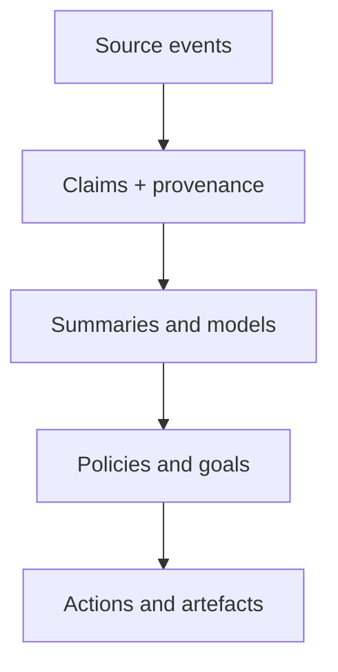

# Governed Forgetting

## A cross-disciplinary research brief, critical literature review, synthesis, and initial research programme

**Version:** 1.0 — research launch document  
**Date:** 2 August 2026  
**Primary application:** long-lived cognitive agents and impact-aligned artificial organisations  
**Wider scope:** human cognition, neuroscience, development, biology, computation, information theory, control, ecology, organisations, culture, archives, law, politics, philosophy, and complex adaptive systems

---

## Abstract

This document develops a broad research programme around a deceptively simple question: **how should a system regulate the continuing influence of states acquired, inherited, or committed at other times?** It begins from the useful hypothesis that *forgetting is how a system regulates the causal authority of its past*, but revises that hypothesis in three ways.

First, forgetting is not a single scalar loss. A trace may cease to be accessible, credible, salient, emotionally charged, behaviourally authoritative, socially transmissible, or physically present, and these changes are neither equivalent nor equally reversible. Second, forgetting is not adequately understood inside one pre-given system boundary: content can leave an individual while remaining in a group, archive, tool, model weight, ecological legacy, or institutional routine. What looks like loss at one level can be persistence at another. Third, prospective memory and completed intentions show that obsolete *future-directed* commitments can also continue to exert authority. The broader object is therefore **temporally displaced state**: information, dispositions, obligations, traces, and control variables whose origins and effects span time.

The literature does not support the proposition that more remembering is generally better, or that forgetting is generally adaptive. It supports a conditional account. Retention can enable learning, coordination, identity, evidence, accountability, resilience, and cumulative culture; it can also produce interference, perseveration, grievance, surveillance, lock-in, vulnerability, and loss of plasticity. Forgetting can enable abstraction, updating, exploration, forgiveness, privacy, recovery, and regime change; it can also destroy rare safety knowledge, minority testimony, provenance, competence, identity, and the ability to hold power to account. Its value depends on **mechanism, object, level, timescale, environment, objective, reversibility, ownership, and downstream propagation**.

The resulting design claim is not “build agents that forget.” It is stronger and more demanding:

> Long-lived cognitive systems need governed, multiscale memory in which accessibility, confidence, operational authority, retention, derivation, and erasure are separately controllable and auditable.

The document contributes:

1. a critique and refinement of the original question;
2. an ontology of forgetting and adjacent phenomena;
3. a critical integrative review across fourteen literatures;
4. a cross-domain synthesis and multiscale causal model;
5. design principles for agents, personal memory substrates, and artificial organisations;
6. testable propositions, experiments, benchmarks, metrics, and work packages;
7. a source-to-claim map and an initial research corpus.

The central maxim remains useful, provided it is treated as a constitutional principle rather than a natural law:

> **The past has standing, not sovereignty.**

## Contents

- [Part I — What should have been asked?](#part-i--before-the-brief-what-should-have-been-asked)
- [Part II — The research brief](#part-ii--the-research-brief)
- [Part III — Critical literature review](#part-iii--critical-literature-review)
- [Part IV — Cross-disciplinary synthesis](#part-iv--cross-disciplinary-synthesis)
- [Part V — Design implications](#part-v--design-implications-for-cognitive-agents-and-artificial-organisations)
- [Part VI — The research programme](#part-vi--the-research-programme)
- [Part VII — Open questions and frontier](#part-vii--open-questions-and-research-frontier)
- [Part VIII — Appendices](#part-viii--appendices)
- [Conclusion](#conclusion)

---

# Part I — Before the brief: what should have been asked?

## 1. Is the original question sufficient?

Yes. There are no blocking questions before starting. The subject is already large enough to sustain a substantial research programme. The danger is not lack of material but uncontrolled breadth: a catalogue in which neural inhibition, data deletion, organisational turnover, ecological succession, and historical erasure are all called “forgetting” without showing whether they share a mechanism or merely a metaphor.

The question therefore needed **constraints on comparison**, not narrower disciplinary scope. A useful comparative study must ask, for every proposed analogy:

- What exactly is retained or lost?
- In what substrate and at what system level?
- Which causal pathway changes?
- Is the change passive, active, selected, emergent, or imposed?
- Does the trace disappear, or merely lose access or authority?
- Can it be recovered, reconstructed, or reacquired?
- Who benefits, who bears the cost, and who has standing to decide?
- What evidence would show that the cross-domain transfer is invalid?

Those questions turn “forgetting everywhere” from a theme into a researchable programme.

## 2. Questions that should have been explicit

The original prompt asked about mechanisms, value, necessity, cost, implications, affordances, hindrances, and complex-system stability. It should also have asked the following.

### 2.1 What is the unit of analysis?

“A memory” can mean an episode, association, skill, habit, model parameter, factual claim, source document, emotional disposition, social relationship, legal status, ecological legacy, institutional routine, or unfulfilled intention. The appropriate forgetting operation differs for each. Erasing a record is not extinguishing a conditioned response; retiring a policy is not deleting the evidence that justified it.

### 2.2 What dimension is changing?

The same content can be:

- stored but inaccessible;
- accessible but judged obsolete;
- believed but prohibited from action;
- emotionally attenuated but factually preserved;
- operationally retired but retained for audit;
- deleted locally but replicated elsewhere;
- compressed into a schema while episodic detail disappears;
- absent from explicit recall but still expressed in behaviour.

Any theory that maps all of these to one retention score will produce both scientific confusion and unsafe engineering.

### 2.3 What is the system boundary?

An individual can “forget” a fact while remembering where to find it; a departing employee can take tacit knowledge from a firm while public documentation remains; a dataset can be deleted while its influence persists in embeddings, model weights, caches, policies, and other people’s records. The extended-mind and distributed-cognition traditions make this boundary problem unavoidable ([Clark & Chalmers, 1998](https://www.alice.id.tue.nl/references/clark-chalmers-1998.pdf); [Hutchins, 1995](https://mitpress.mit.edu/9780262581462/cognition-in-the-wild/)).

### 2.4 Who controls forgetting, and who is affected?

The data subject, rememberer, author, organisation, harmed third party, public, court, archivist, model provider, and future researcher may have incompatible claims. “Adaptive” for a decision-maker can be erasure for a witness. “Efficient compression” can systematically remove low-frequency minority evidence. A complete theory must include power, rights, and political economy rather than add ethics after the mechanism is designed.

### 2.5 How does forgetting propagate through derived state?

Deleting a source does not automatically retract summaries, causal models, embeddings, forecasts, decisions, habits, copied records, or policies learned from it. This is the problem of **ghost memory**: downstream influence without an accessible or acknowledged source. The inverse also occurs: deleting a derived belief while leaving the generating source and update rule intact permits resurrection. Provenance and dependency tracking are therefore part of forgetting, not optional metadata.

### 2.6 How can forgetting be demonstrated?

Failure on a recall probe can indicate inaccessibility, context mismatch, strategic non-disclosure, inhibition, or genuine removal. Behavioural equivalence after machine unlearning does not by itself prove that a training sample’s causal influence is gone. A valid programme needs mechanism-sensitive and adversarial tests, not only “cannot retrieve” assertions ([Thudi et al., 2022](https://www.usenix.org/conference/usenixsecurity22/presentation/thudi)).

### 2.7 What must be protected from forgetting?

Rare hazards, rejected alternatives, negative results, dissenting evidence, decision rationales, consent constraints, audit trails, constitutional commitments, and testimony vulnerable to suppression may warrant retention even when seldom retrieved. Frequency is not importance; recency is not validity.

### 2.8 When is reversible demotion preferable to erasure?

Dormancy, quarantine, archival transfer, access restriction, de-indexing, supersession, and deletion express different commitments. Reversibility has option value under uncertainty, but retained sensitive material creates exposure and power asymmetries. The choice is a risk decision, not merely a storage policy.

### 2.9 What is never encoded in the first place?

Some absences attributed to “collective forgetting” are better described as exclusion, non-observation, destroyed testimony, unfunded inquiry, or structural ignorance. Agnotology and the study of “undone science” examine how ignorance is actively produced before a durable public memory exists ([Proctor & Schiebinger, 2008](https://history.stanford.edu/publications/agnotology-making-and-unmaking-ignorance); [Frickel et al., 2010/2020 review](https://pmc.ncbi.nlm.nih.gov/articles/PMC7041968/)). Non-encoding belongs beside the study of forgetting because it produces similar present absence, but it should not be mislabeled as loss of a trace.

### 2.10 What futures need to be forgotten?

Prospective-memory research shows that completed intentions can remain active and cause commission errors: people perform an action that is no longer required. Reviews find that deactivation is conditional rather than automatic ([Scullin et al., 2012](https://pmc.ncbi.nlm.nih.gov/articles/PMC3598897/); [Möschl et al., 2020](https://bpb-us-e2.wpmucdn.com/sites.wustl.edu/dist/9/2445/files/2022/08/moschl_etal_2020.pdf)). Agents likewise retain stale goals, scheduled commitments, alerts, and conditional policies. This is not quite the causal authority of the *past*; it is the continuing authority of a representation about a future that has been completed, cancelled, or invalidated.

## 3. Changes made to the framing

### 3.1 Preserve the memorable hypothesis, broaden the research object

The original formulation remains the best concise account of retrospective forgetting:

> **Forgetting is how a system regulates the causal authority of its past.**

It should be treated as a hypothesis to test, not a definition that forces all evidence to fit. The broader research object is:

> **Memory governance is the regulation of the availability, interpretation, authority, transmission, and persistence of temporally displaced state.**

Within this programme:

> **Forgetting is a process that reduces, redirects, transforms, quarantines, or terminates the future influence of previously acquired, inherited, or deferred state.**

This definition is deliberately causal but not purely destructive. It includes supersession, inhibition, compression, and archival demotion while requiring the mechanism to be named. It excludes mere absence unless a relevant state was once available or an active process prevented its preservation; such absence is studied as *pre-memory exclusion*.

### 3.2 Replace “amount remembered” with a vector

Retention should be represented as a vector rather than one variable. At minimum:

\[
M_x(t)=\langle P,A,F,C,S,E,T,R \rangle
\]

where, for item or disposition \(x\):

- \(P\): physical or representational persistence;
- \(A\): accessibility under a specified retrieval policy;
- \(F\): fidelity or reconstructive accuracy;
- \(C\): confidence or epistemic weight;
- \(S\): salience, affect, or attentional priority;
- \(E\): behavioural efficacy—the capacity to change action;
- \(T\): transmissibility across people, agents, or generations;
- \(R\): recoverability or reversibility.

A forgetting event is a trajectory through this state space, not necessarily a fall in every component. Compression may lower fidelity while preserving efficacy. Archiving may lower accessibility while preserving persistence and recoverability. Extinction may reduce behavioural efficacy while leaving the association latent. Legal de-indexing may reduce public accessibility without deleting the source record.

### 3.3 Add an authority layer

Memory systems should distinguish at least four questions:

1. **Does a trace exist?**
2. **Can it be retrieved here and now?**
3. **How should it be interpreted and believed?**
4. **What may it authorize the system to do?**

This separates evidence from policy. An obsolete recommendation can remain as evidence while losing permission to drive action. A safety incident can be access-controlled yet still block deployment. A personal detail can exist in a private vault but be unavailable to most agents. The design target is governed influence, not indiscriminate recall.

## 4. Productive directions that are genuinely different

The most useful alternatives are not merely additional disciplines. They change the shape of the problem.

### 4.1 Forgetting as redistribution, not loss

Ask where influence moves. Episodic detail may be transformed into semantic structure; individual recall may move into an external index; a routine may leave explicit policy and become embodied practice; deleted public data may persist in private models. This direction treats forgetting as a flow across representations, levels, and owners.

### 4.2 Forgetting as boundary production

What a system can forget helps constitute what the system *is*. Organisms control boundaries and turnover; organisations decide which roles and records count as institutional; cultures select canonical narratives; agents partition private, shared, and constitutional memory. Forgetting is therefore partly a theory of individuality and membership.

### 4.3 Forgetting as coarse-graining

Eliminating microscopic variables can produce macroscopic memory rather than remove it. In projection-operator approaches such as Mori–Zwanzig, unresolved variables reappear as memory kernels and noise in the reduced dynamics ([Gouasmi et al., 2021](https://pmc.ncbi.nlm.nih.gov/articles/PMC8154603/)). This yields a powerful counterintuitive proposition: **forgetting detail at one descriptive level can create apparent memory at another**.

### 4.4 Forgetting as release of option value

Retained commitments occupy not only storage but future possibility. Habits, model parameters, social roles, technical debt, and institutional routines constrain reachable states. Forgetting can flatten an attractor, free degrees of freedom, and reopen exploration. This connects memory to real options, lock-in, plasticity, and path dependence.

### 4.5 Forgetting as an adversarial surface

Memory creates durable channels through which attackers can shape future behaviour. Long-lived agent memory turns transient prompt injection into persistent state. Conversely, attackers or incumbents may weaponise erasure to remove evidence. Security therefore has two dual problems: malicious persistence and malicious forgetting.

### 4.6 Forgetting as a public and intergenerational institution

Archives, limitation periods, expungement, amnesty, pardons, truth commissions, memorials, and rights of erasure encode different settlements between continuity and release. They reveal that forgetting is rarely private when identities and harms are relational.

### 4.7 Forgetting as temporal portfolio management

Instead of one decay rate, treat a cognitive system as a portfolio of timescales. Working context, volatile preferences, causal models, rare hazards, skills, legal obligations, and constitutional principles should not share a half-life. The research question becomes how to allocate persistence and reversibility under uncertainty.

### 4.8 The right to be remembered

Privacy debates emphasise erasure, while archival justice shows that persons and communities can also be harmed by absence, non-recognition, and destruction of evidence. A complete governance framework needs both a qualified right to forget and a qualified right to preservation, testimony, and historical standing.

---

# Part II — The research brief

## 5. Working title and central problem

**Working title:** *Governed Forgetting: Memory, Plasticity, Stability, Power, and the Temporal Architecture of Cognitive Systems*

**Central problem:**

> How do biological, cognitive, computational, organisational, social, and ecological systems regulate the continuing causal influence of temporally displaced state; under what conditions do different forms of forgetting improve or damage adaptation, stability, identity, justice, and impact; and how should those findings shape long-lived artificial agents and organisations?

## 6. Purpose

The programme has five purposes:

1. **Explanatory:** distinguish mechanisms that generate superficially similar loss or non-use.
2. **Comparative:** discover which principles transfer across domains and where analogies fail.
3. **Normative:** identify legitimate authority, rights, and protected forms of retention or release.
4. **Engineering:** develop architectures and tests for governed memory in agents and artificial organisations.
5. **Scientific:** generate discriminating hypotheses, formal models, experiments, and longitudinal evidence rather than a vocabulary alone.

## 7. Research questions

### RQ1 — Ontology

What should count as forgetting, and how should it be distinguished from non-encoding, failed retrieval, inhibition, interference, reconsolidation, compression, supersession, archiving, deletion, destruction, and strategic concealment?

### RQ2 — Mechanism

Which mechanisms alter persistence, accessibility, fidelity, confidence, salience, behavioural efficacy, transmission, and recoverability in each domain?

### RQ3 — Function

When does forgetting improve generalisation, inference, creativity, recovery, privacy, security, exploration, or adaptation? When does it cause repeated failure, loss of competence, injustice, fragmentation, or catastrophic instability?

### RQ4 — Environment

How should memory lifetime depend on environmental volatility, recurrence, observability, hazard severity, feedback delay, and cost of reacquisition?

### RQ5 — Dynamics

How do memory and forgetting alter attractors, hysteresis, transient duration, phase transitions, oscillation, critical slowing, resilience, and transformability?

### RQ6 — Scale

When does local forgetting support higher-level persistence, and when does it dissolve the larger system? How do timescales and mechanisms interact across synapses, organisms, teams, organisations, cultures, and ecosystems?

### RQ7 — Boundary

When has a memory been forgotten rather than moved, externalised, hidden, or redistributed? Which boundary is scientifically or normatively appropriate?

### RQ8 — Identity and agency

Which continuities are constitutive of a person, agent, role, organisation, or community? How much revision can occur before continuity becomes substitution, and who may make that judgment?

### RQ9 — Power and justice

Who can cause something to be remembered or forgotten? Whose testimony, harms, preferences, and alternatives are disproportionately compressed or excluded?

### RQ10 — Privacy and accountability

How should erasure, de-indexing, anonymisation, operational retirement, evidential preservation, public interest, and research exceptions be balanced?

### RQ11 — Derivation

How should forgetting propagate through copies, summaries, embeddings, models, policies, plans, caches, and decisions? What constitutes sufficient removal of causal influence?

### RQ12 — Security

How can systems resist both memory poisoning and strategic erasure? What lineage, quarantine, trust, and capability controls are required?

### RQ13 — Measurement

What observations discriminate unavailable, inhibited, transformed, superseded, and erased state? How can false claims of forgetting be detected?

### RQ14 — Prospective state

How should systems retire completed or invalidated intentions, goals, deadlines, forecasts, and conditional commitments without losing their rationale or audit history?

### RQ15 — Design

What memory lifecycle, architecture, governance, metrics, and experimental benchmarks should be used for long-lived cognitive agents, sovereign personal memory substrates, and impact-aligned artificial organisations?

## 8. Scope and levels

The research will compare phenomena at six analytic levels while avoiding the assumption that they are isomorphic.

| Level | Illustrative substrates | Memory carriers | Candidate forgetting processes |
|---|---|---|---|
| Sub-personal / component | synapses, circuits, cells, parameters, caches | weights, connectivity, molecular state, cached entries | inhibition, turnover, downscaling, eviction, overwrite |
| Organism / agent | human, animal, artificial agent | episodes, schemas, habits, goals, self-models | interference, suppression, abstraction, supersession, context reset |
| Group / organisation | team, firm, institution, multi-agent system | people, roles, routines, records, shared models | turnover, unlearning, process retirement, archival loss, version migration |
| Society / culture | community, profession, polity | narratives, language, archives, law, infrastructure | canon formation, silence, amnesty, obsolescence, destruction, generational change |
| Ecosystem / evolutionary lineage | population, community, landscape | genes, epigenetic marks, seed banks, material legacies, niches | reset, succession, extinction, recombination, disturbance |
| Analytical / engineered representation | model, database, reduced-order description | state variables, logs, replicas, embeddings, summaries | projection, garbage collection, cryptographic erasure, unlearning |

## 9. Required conceptual distinctions

The programme must preserve the following distinctions throughout.

| Phenomenon | Change | Trace presumed present? | Typical reversibility | Why it matters |
|---|---|---:|---:|---|
| Non-encoding | no durable representation is formed | No | Low | absence is not evidence of decay |
| Retrieval failure | current cue does not recover trace | Yes/unknown | Often high | performance can underestimate storage |
| Context gating | access depends on state, role, or environment | Yes | High within context | produces fragmented competence |
| Inhibition / suppression | access or expression is actively reduced | Yes | Often | latent state may return |
| Interference | competing learning reduces access or fidelity | Usually | Variable | new learning and old learning interact |
| Decay / turnover | substrate or strength changes with time/use | Variable | Variable | may be passive, adaptive, or incidental |
| Compression / semanticisation | details become lower-dimensional structure | Partly | Detail low | supports generalisation but loses exceptions |
| Reconsolidation / revision | retrieved trace is modified | Yes, transformed | Partial | provenance and historical fidelity change |
| Extinction / counterlearning | new learning suppresses old response | Yes | Often | renewal and reinstatement remain possible |
| Supersession | content remains but loses current epistemic status | Yes | High | current truth and history can coexist |
| Operational retirement | state may not authorize action | Yes | Governed | separates evidence from control |
| Archival dormancy | active access ends; evidence retained | Yes | High | preserves audit with lower intrusion |
| Quarantine | access and propagation are constrained due to risk | Yes | High | useful for disputed or poisoned state |
| De-indexing | discovery pathways are reduced | Yes | High/medium | public accessibility changes without erasure |
| Deletion / physical erasure | representation is removed from named substrate | No locally | Low | copies and derivatives may remain |
| Machine unlearning | influence of selected training data is reduced | Model-dependent | Variable | definitions and verification are contested |
| Structural erasure | institutions prevent preservation/transmission | Often no public trace | Low | power can masquerade as neutral loss |
| Intention deactivation | completed/invalid goal ceases to trigger action | May remain as history | High | future-directed state can persist pathologically |

## 10. Review method and evidential discipline

### 10.1 What this document is

This is a **critical integrative literature review and research launch**. It deliberately joins fields that use incompatible methods and units. It is deep and source-backed, but it is not a completed systematic review or meta-analysis: searches were not preregistered; databases were not exhaustively enumerated; screening and extraction were not independently duplicated; and effect sizes were not pooled.

Calling it “systematic” would overstate the method. Instead, the document supplies the conceptual map and protocol needed for a subsequent systematic evidence map.

### 10.2 Initial source strategy

The review prioritises:

1. original empirical papers for pivotal claims;
2. peer-reviewed systematic reviews and field-defining syntheses;
3. formal or theoretical papers for explicit mechanisms;
4. official legal, regulatory, and standards texts;
5. primary technical documentation for engineered systems;
6. recent preprints only where the field is moving faster than peer review, clearly marked as provisional.

Search families include combinations of *forgetting, active forgetting, memory inhibition, interference, extinction, reconsolidation, storage strength, retrieval strength, semantic compression, stability plasticity, continual learning, loss of plasticity, machine unlearning, deletion, fading memory, integral control, ecological memory, organisational forgetting, collective memory, archive silence, agnotology, right to erasure, prospective memory, intention deactivation, identity,* and *memory poisoning*.

### 10.3 Evidence labels used in the synthesis

| Label | Meaning |
|---|---|
| **Established** | supported by converging mature empirical literatures or authoritative formal results |
| **Supported** | credible peer-reviewed evidence, but material boundary conditions or open mechanism questions remain |
| **Contested** | mixed replications, rival interpretations, or highly context-sensitive results |
| **Engineering pattern** | demonstrated design practice; transfer to cognition is not presumed |
| **Analogy** | a proposed structural comparison requiring independent validation |
| **Emerging** | recent or preprint work, useful for hypothesis generation rather than settled conclusion |

### 10.4 Rules for cross-domain transfer

A proposed transfer must specify:

- source and target domains;
- mapped variables and causal structure;
- dimensional and timescale compatibility;
- assumed objective or distortion function;
- known disanalogies;
- a prediction in the target domain that is not true by definition;
- evidence that would reject the transfer.

The programme will reject claims such as “ecosystems remember” or “organisations have brains” when they add no testable structure.

## 11. Work packages

### WP1 — Ontology and adversarial cases

Build a typed ontology of memory objects, carriers, operations, authority states, boundaries, and failure modes. Test it against hard cases: implicit influence without recall, independently rediscovered knowledge, copied data after deletion, archived but inaccessible testimony, rebuilt skills, changed identities, completed intentions, and probabilistic models in which no single datum has a separable trace.

### WP2 — Mechanism evidence map

Conduct domain-specific systematic searches and structured extraction. Record object, substrate, mechanism, scale, environmental regime, purported function, cost, reversibility, measurement method, evidence maturity, and alternative explanation.

### WP3 — Formal multiscale models

Compare rate–distortion, Bayesian change-point, control-theoretic leakage, continual-learning, network diffusion, attractor-landscape, and evolutionary turnover models. Identify which variables can be unified and which require separate formalisms.

### WP4 — Rights, power, and governance

Map stakeholders and conflicting claims over memory. Analyse privacy, accountability, evidentiary duties, public interest, archives, marginalised knowledge, consent, intergenerational justice, and adversarial erasure.

### WP5 — Agent and artificial-organisation architecture

Develop a reference architecture separating episodic records, claims, derived beliefs, procedures, goals, relationships, policies, and constitutional constraints. Specify provenance, invalidation, access, retirement, archive, and erasure semantics.

### WP6 — Measurement and benchmarks

Build environments that vary volatility, recurrence, capacity pressure, delayed feedback, rare-harm probability, privacy requests, adversarial poisoning, and epistemic minority signals. Evaluate both remembering and forgetting.

### WP7 — Longitudinal field studies

Observe how real teams and long-lived agents accumulate, revise, externalise, and lose knowledge. Combine event logs, lineage graphs, retrieval traces, interviews, incident recurrence, and controlled interventions.

### WP8 — Synthesis and design guidance

Produce conditional principles, not universal pro-forgetting or pro-retention rules. Publish failure cases and non-transfers alongside successful analogies.

## 12. Intended outputs

1. A peer-reviewable integrative synthesis.
2. A machine-readable ontology and source-to-claim evidence graph.
3. A cross-domain mechanism atlas.
4. Formal models and simulation notebooks.
5. A governance and rights framework.
6. An agent-memory lifecycle specification.
7. A benchmark suite with adversarial and longitudinal tasks.
8. Reference implementations of lineage-aware supersession, quarantine, archival, and deletion propagation.
9. Design patterns and anti-patterns for artificial organisations.
10. Recommendations for whether “forgetting” should be a standalone agent skill, part of memory governance, or a cross-cutting requirement.

## 13. Success criteria

The programme succeeds if it can:

- predict when retention versus forgetting improves performance under specified conditions;
- distinguish at least the major mechanisms through observable tests;
- expose cases where a cross-domain analogy fails;
- protect rare, consequential, and minority evidence without permitting unlimited operational intrusion;
- propagate justified updates and erasures through derived state;
- demonstrate resistance to both poisoning and strategic deletion;
- preserve auditability without turning archives into ambient behavioural control;
- improve long-horizon impact and adaptability rather than only benchmark recall;
- state whose values are encoded in every retention or distortion objective.

---

# Part III — Critical literature review

## 14. Cognitive psychology: forgetting is not the inverse of learning

### 14.1 From decay to cue-dependent accessibility

Early memory theory often treated forgetting as the weakening of a trace over time. Modern cognitive work shows that observed recall conflates storage, accessibility, cues, interference, context, and control. Bjork and Bjork’s “new theory of disuse” distinguishes **storage strength** from **retrieval strength**: durable learning can coexist with poor immediate accessibility, while fluent retrieval can rest on weak long-term learning ([Bjork & Bjork, 1992, overview and later synthesis](https://bjorklab.psych.ucla.edu/wp-content/uploads/sites/13/2016/04/RBjork_inpress.pdf)).

This distinction explains why spacing and effortful retrieval can create desirable difficulty. It also supplies a direct engineering warning: retrieval frequency and ease should not determine truth, value, or permission to delete. A dormant trace can be robust; a fluent answer can be shallow or stale.

The environmental-rationality programme adds a conditional normative account. Anderson and Schooler argued that human retention functions can be understood as adapting accessibility to statistical patterns of recurrence in the environment ([Anderson & Schooler, 1991](https://journals.sagepub.com/doi/abs/10.1111/j.1467-9280.1991.tb00174.x)). The useful transferable claim is not that human forgetting is optimal. It is that rational accessibility depends on the hazard function of future need. This requires knowing, or learning, the right environment. Rare catastrophic knowledge and changing environments break simple frequency matching.

### 14.2 Interference and retrieval-induced forgetting

New and competing learning can impair retrieval even without temporal decay. Retrieval itself can reshape later accessibility: practising some items can reduce recall of related unpractised items, a phenomenon introduced as **retrieval-induced forgetting** ([Anderson, Bjork & Bjork, 1994](https://pubmed.ncbi.nlm.nih.gov/7931095/)). One interpretation is active inhibition of competitors; other accounts emphasise interference and context. The broader active-forgetting literature finds converging evidence that prefrontal control can suppress retrieval and reduce later accessibility ([Anderson & Hulbert, 2021](https://www.annualreviews.org/content/journals/10.1146/annurev-psych-072720-094140)).

The functional argument is plausible: suppressing irrelevant competitors can reduce intrusion and enable goal-directed action. But the effect is not equivalent to deletion, and laboratory word-pair paradigms do not by themselves establish beneficial forgetting in complex life. Suppressed material can continue to influence behaviour or reappear under different cues.

### 14.3 Adaptive constructive memory

Schacter’s “seven sins” framework is valuable because it treats both transience and persistence as potential failures. Misattribution, bias, suggestibility, and constructive recombination are costs of a system that extracts meaning and supports simulation rather than recording experience verbatim ([Schacter, 2021](https://pmc.ncbi.nlm.nih.gov/articles/PMC8285452/)).

This yields a central trade-off: episodic fidelity versus generativity. Compression and reconstruction allow abstraction, counterfactual imagination, and generalisation; they also obscure provenance and exceptional cases. A perfect recorder would not necessarily reason better, but a pure compressor could become confident, unaccountable, and unable to recover why it believes what it believes.

### 14.4 Forgetting, fixation, and creativity

Incubation and release from misleading cues can improve problem solving. Experiments on creative fixation show that interruption or delay can reduce the continuing influence of unhelpful examples, although incubation effects depend on task and process ([overview in the Stanford Encyclopedia of Philosophy entry on creativity](https://plato.stanford.edu/entries/creativity/)). The important mechanism is not generic memory loss but reduced dominance of a previously activated search region. For agents, deliberate context clearing or hypothesis diversification may serve the same function without erasing the evidential record.

### 14.5 Prospective memory and obsolete futures

Prospective memory maintains intentions for later execution. Its characteristic failure is not only omission but commission: an intention remains active after completion and is erroneously repeated. About a quarter of participants committed such errors in one influential paradigm ([Scullin et al., 2012](https://pmc.ncbi.nlm.nih.gov/articles/PMC3598897/)). A twenty-year review concludes that completed intentions may be inhibited, retrieved, or persistently active depending on cue exposure, encoding, task context, delay, and replacement goals ([Möschl et al., 2020](https://bpb-us-e2.wpmucdn.com/sites.wustl.edu/dist/9/2445/files/2022/08/moschl_etal_2020.pdf)).

This literature broadens the entire research programme. Memory governance must include expiration and retirement semantics for goals, reminders, conditional plans, permissions, and predictions. “Done” is a state transition, not merely another note in memory.

### 14.6 Costs and boundary conditions

Human forgetting is sometimes adaptive, but its harms are equally central:

- intrusive or traumatic persistence can impair functioning;
- amnesia can fragment identity and competence;
- interference can erase minority or weakly cued evidence;
- retrieval suppression can be overgeneralised;
- reconstructive updating can create confident distortion;
- metacognitive judgments can confuse fluency with truth.

**Interim conclusion:** cognitive psychology strongly rejects “forgetting = trace decay” and “retention = quality.” It supports multidimensional, cue- and goal-dependent accessibility. It does not establish a single optimal forgetting rule.

## 15. Neuroscience: multiple routes to reduced expression

### 15.1 Active control, engrams, and accessibility

Neuroscience increasingly describes forgetting as a family of active and passive mechanisms: inhibitory control, synaptic plasticity, circuit remodelling, neurogenesis, interference, systems consolidation, and changes in engram accessibility. Reviews distinguish loss of stored information from failure to reactivate an engram ([Davis & Zhong, 2017](https://pmc.ncbi.nlm.nih.gov/articles/PMC5657245/); [Ryan & Frankland, 2022](https://pubmed.ncbi.nlm.nih.gov/35027710/)). Work manipulating engram excitability further supports the possibility that memories can become inaccessible without being destroyed ([O’Leary et al., 2024](https://elifesciences.org/articles/92860)).

The translation to artificial systems should be restrained. Neural “engrams” are distributed biological ensembles, not database rows; optogenetic recovery in animal models does not imply that inaccessible human or model memory is intact in a simple sense. The transferable distinction is between **representational persistence** and **current readout**.

### 15.2 Extinction is usually new learning, not erasure

Fear extinction classically reduces a conditioned response by forming new inhibitory or safety learning. Renewal, reinstatement, and spontaneous recovery show that the original association can persist ([Milad & Quirk, 2012](https://www.cell.com/neuron/fulltext/S0896-6273%2811%2900390-4)). Calling extinction “forgetting” without qualification hides its reversibility and context dependence.

For governance, extinction resembles a policy overlay: “do not express this response in this context.” That may be appropriate when preserving the history matters, but it leaves relapse paths. Deletion and counterlearning have different security and safety properties.

### 15.3 Reconsolidation can update reactivated memory, but claims are bounded

Reactivated memories can sometimes become labile and susceptible to modification, a phenomenon established in animal work and explored in humans ([Nader, Schafe & LeDoux, 2000](https://www.nature.com/articles/35021052)). Retrieval-extinction experiments reported durable updating of conditioned fear ([Schiller et al., 2010](https://pmc.ncbi.nlm.nih.gov/articles/PMC3640262/)). Yet human results are sensitive to prediction error, timing, memory age and strength, and procedural details; unsuccessful replications and unresolved boundary conditions counsel against treating reconsolidation as a reliable erase button ([Stemerding et al., 2022](https://pmc.ncbi.nlm.nih.gov/articles/PMC8831535/); [Jardine et al., 2022](https://www.sciencedirect.com/science/article/abs/pii/S0149763422000872)).

The careful conclusion is **supported but contested in scope**: reactivation can open an update window under some conditions, but behavioural reduction does not by itself identify erasure rather than new learning or altered expression.

### 15.4 Neurogenesis and circuit turnover

Increased hippocampal neurogenesis has been associated experimentally with forgetting in rodents, plausibly because integrating new neurons remodels existing circuits ([Akers et al., 2014](https://pubmed.ncbi.nlm.nih.gov/24812394/)). This supports a structural route by which plasticity can disrupt established access. However, proposed behavioural mediation and generality remain debated; the result should not be elevated into a universal law that “new neurons cause useful forgetting.”

### 15.5 Sleep and synaptic renormalisation

The synaptic-homeostasis hypothesis proposes that sleep renormalises synaptic strength accumulated during waking, improving signal-to-noise and restoring learning capacity ([Tononi & Cirelli, 2014](https://pmc.ncbi.nlm.nih.gov/articles/PMC3921176/)). The theory is influential but does not reduce sleep to deletion; consolidation and selective strengthening also occur. Its relevance is architectural: periodic global maintenance can preserve relative structure while releasing saturated capacity.

### 15.6 Persistence and transience as joint functions

Richards and Frankland argue that persistence preserves information relevant to decisions, while transience supports generalisation and adjustment by discarding or transforming detail ([Richards & Frankland, 2017](https://pubmed.ncbi.nlm.nih.gov/28641107/)). Their use of computational principles is generative, but “relevance” still requires an objective and future distribution. The framework becomes unsafe if the system itself decides that inconvenient counterevidence is irrelevant.

**Interim conclusion:** neuroscience validates mechanism pluralism and the storage–access–expression distinction. Its richest engineering contribution is not a biological decay curve but evidence that persistence, accessibility, and behavioural expression are controlled by partially separable processes.

## 16. Development, evolution, and biological reset

### 16.1 Development requires both consolidation and release

Development is path-dependent: early states constrain later reachable states, yet organisms also undergo periods of unusually high plasticity, pruning, turnover, and reorganisation. Infantile amnesia, critical-period closure, metamorphosis, and learning during growth are not instances of one process. They pose a common systems question: how can an organism preserve useful function while its substrate and behavioural repertoire change?

The concept of a “reset” is easily overused. Biological development rarely returns a system to a blank state. It changes constraints, erases some marks, preserves others, and creates new sensitivities. This is closer to **selective reinitialisation** than factory reset.

### 16.2 Epigenetic reprogramming

Mammalian germline and early embryonic development include extensive DNA methylation reprogramming. Human primordial germ cells undergo large-scale erasure of epigenetic marks, including much acquired state, while some regions and mechanisms resist or escape reprogramming ([Tang et al., 2015](https://www.sciencedirect.com/science/article/pii/S0092867415005644); [review of mammalian epigenetic reprogramming](https://pmc.ncbi.nlm.nih.gov/articles/PMC11671582/)). The function is not forgetting for its own sake. Resetting helps restore developmental potential and prevents indiscriminate inheritance of context-specific regulation.

This is a compelling multiscale example: erasure at one level can protect continuity at another. But the analogy to agent memory is bounded. Epigenetic state, DNA sequence, cytoplasmic factors, and developmental environment interact; there is no single editable ledger of experience.

### 16.3 Immune memory and antigenic imprinting

Immune memory accelerates response to previously encountered pathogens. Yet the first encounter can bias later response toward familiar epitopes, sometimes reducing the quality of adaptation to a changed variant—variously discussed as original antigenic sin or immune imprinting ([Aguilar-Bretones et al., 2023](https://www.jci.org/articles/view/162192)). Persistence is thus both defence and constraint.

The relevant abstraction is **representation-dependent lock-in**. Prior learning changes which features are noticed and amplified. Simply erasing immune memory would sacrifice protection; useful adaptation may instead require repertoire diversification, updated exposure, or mechanisms that reduce dominance without losing all history.

### 16.4 Turnover, death, and higher-level persistence

Cells, proteins, synapses, organisms, and members of populations turn over while higher-level patterns persist. Local deletion can remove damaged components, reduce accumulated error, and enable renewal. But component replacement preserves a system only when information and constraints are redundantly carried at other levels. Turnover without transmission is extinction; transmission without turnover can be senescence or lock-in.

This gives a conditional multiscale pattern:

> Component forgetting can support system persistence when higher-level organisation retains the constraints needed for reconstruction and when turnover releases lower-level rigidity.

The pattern requires testing rather than biological romanticism. Organisations do not automatically improve when people leave, and model modules do not become adaptive merely by being reset.

### 16.5 Cultural and evolutionary inheritance

Evolution preserves information through differential replication, but mutation, recombination, drift, gene loss, and environmental change continually alter what persists. Cumulative culture adds social-learning networks, teaching, artefacts, and institutions. Reviews emphasise that cumulative cultural adaptation depends on fidelity *and* innovation rather than maximal copying ([Mesoudi & Thornton, 2018/2022 review](https://pmc.ncbi.nlm.nih.gov/articles/PMC8666902/)).

Demographic models suggest that population size and connectivity can affect the retention of complex skills ([Henrich, 2004](https://henrich.fas.harvard.edu/publications/demography-and-cultural-evolution-how-adaptive-cultural-processes-can-produce)), but empirical and theoretical work shows that population size alone is insufficient ([Vaesen et al., 2016](https://www.pnas.org/doi/10.1073/pnas.1520288113)). Network structure, teaching, task complexity, mobility, redundancy, and ecology matter. This is a caution against simple “more agents means more memory” claims.

Language extinction can erase unique ecological and medicinal knowledge that is poorly represented elsewhere ([Cámara-Leret & Bascompte, 2021](https://www.pnas.org/doi/10.1073/pnas.2103683118)). Such losses expose the inequity of frequency-based retention: globally rare knowledge can be locally indispensable and irrecoverable.

**Interim conclusion:** biology supplies real cases in which selective reset, turnover, and inherited memory jointly enable adaptation. It does not support a universal lifecycle metaphor. The main transferable lesson is the need to specify which organisational constraints survive when lower-level state is released.

## 17. Information theory and resource-rational memory

### 17.1 Rate–distortion: forgetting as lossy coding

Rate–distortion theory asks how much representational rate is required to keep expected distortion below an acceptable level. Applied to memory, it formalises a system that cannot preserve all detail and should allocate precision according to downstream consequence. The information bottleneck similarly seeks a representation \(Z\) that compresses input \(X\) while preserving information relevant to target \(Y\), trading \(I(X;Z)\) against \(I(Z;Y)\) ([Tishby, Pereira & Bialek, 2000](https://arxiv.org/abs/physics/0004057)).

Nagy, Török, and Orbán model episodic memory as semantic compression: detailed experiences are encoded through structured knowledge, allowing efficient storage but producing systematic distortions ([Nagy et al., 2020](https://pmc.ncbi.nlm.nih.gov/articles/PMC7591090/)). This offers a precise bridge among reconstruction, schema formation, and capacity limits.

The normative problem is decisive. A distortion function encodes what counts as an acceptable error. Relevance to which target, sampled from whose expected future, and penalised according to whose harm? If common cases dominate expected loss, rare catastrophes and minority experiences will be compressed away. Information theory can optimise a stated objective; it cannot legitimate that objective.

### 17.2 Resource rationality

Resource-rational analysis explains cognitive strategies relative to computational limits, opportunity costs, and environmental structure rather than an ideal agent with unlimited memory ([Lieder & Griffiths, 2020](https://www.cambridge.org/core/journals/behavioral-and-brain-sciences/article/resourcerational-analysis-understanding-human-cognition-as-the-optimal-use-of-limited-computational-resources/586866D9AD1D1EA7A1EECE217D392F4A)). Forgetting can be rational because storage, search, precision, maintenance, and attention are costly.

Yet three distinctions are necessary:

1. **Descriptive fit is not proof of optimal adaptation.** Similar behaviour can arise from historical constraint or bias.
2. **Individual resource rationality can produce collective harm.** A firm may rationally discard locally unused safety knowledge while increasing systemic risk.
3. **Optimisation inherits the horizon.** A short-horizon agent rationally forgets slow harms and future stakeholders.

### 17.3 Compression can amplify authority

The everyday intuition that loss of detail means less influence is wrong. A thousand episodes can be compressed into a schema; the episodes become inaccessible while the schema is retrieved on every decision. Stereotypes are a socially consequential example. In agents, summarisation can delete qualifiers and provenance while making the summary more prominent than any source.

Therefore, a memory transformation must conserve an **influence budget** across levels: what episodic authority was removed, what semantic or procedural authority was created, and with what uncertainty? Forgetting at one representational level may be consolidation at another.

### 17.4 A preliminary normative objective

For a memory governance policy \(\pi\), a useful research objective is not recall alone but:

\[
J(\pi)=V_{decision}+V_{learning}+V_{accountability}+V_{identity}
-C_{carry}-C_{retrieval}-C_{staleness}-C_{exposure}-C_{lock-in}-C_{loss}
\]

subject to rights, safety, and constitutional constraints that are not traded away merely because a weighted sum favours it. Each term is time-, stakeholder-, and level-dependent. The formula is a bookkeeping scaffold, not a claim that all values are commensurable.

**Interim conclusion:** information theory explains why selective loss can be efficient and predicts structured distortion. It cannot by itself determine what ought to survive. The distortion function is where ethics, power, uncertainty, and temporal horizon enter.

## 18. Belief revision, prediction, and non-stationarity

### 18.1 Revision is not erasure

The AGM tradition distinguishes expansion, revision, and contraction of belief sets while attempting minimal change and logical coherence ([Stanford Encyclopedia of Philosophy, “Logic of Belief Revision”](https://plato.stanford.edu/entries/logic-belief-revision/)). Truth-maintenance systems retain justifications and dependencies so that beliefs can be retracted when their assumptions fail ([Doyle, 1979](https://dspace.mit.edu/entities/publication/5377b306-4ecc-4687-b1f5-78cbb4a0543a)).

These traditions reveal why cognitive memory should store **claims with provenance, not direct mutations of truth**. Superseding a claim should alter current belief and permitted action while preserving the previous claim, its sources, and the rationale for change where lawful. Deleting a node without revisiting dependants produces incoherence; preserving every dependent conclusion unchanged produces ghost memory.

### 18.2 Change points and forgetting factors

In a stationary environment, old evidence remains sampled from the current process. In a changing environment, equal weighting creates systematic lag. Bayesian online change-point detection represents uncertainty over the time since the latest regime shift and can reset or mix sufficient statistics when observations become surprising ([Adams & MacKay, 2007](https://arxiv.org/abs/0710.3742)). Discounted estimators and forgetting factors offer simpler recency weighting.

The key design variables are:

- hazard rate of regime change;
- distinction between gradual drift and abrupt change;
- recurrence of old regimes;
- cost of false reset versus delayed adaptation;
- observability and reliability of change signals;
- consequence of rare but stable events.

A memory’s appropriate active lifetime should therefore relate to the persistence time of what it describes, adjusted for consequence severity, uncertainty, and reacquisition cost. Age alone is a poor invalidation rule.

### 18.3 Surprise is evidence, not an erase command

Prediction error may signal noise, model misspecification, adversarial input, a local exception, or genuine regime change. A robust system should route surprise into model comparison, provenance checks, and bounded experiments before bulk revision. Otherwise attackers can induce strategic forgetting by manufacturing apparent distribution shift.

**Interim conclusion:** belief revision supplies a more precise template than “overwrite the old fact.” Non-stationarity explains why down-weighting history can be rational, but only a model of change and consequence can set the rate.

## 19. Control theory, coarse-graining, and dynamical memory

### 19.1 Integral memory and leakage

Integral control accumulates error:

\[
\dot z(t)=e(t), \qquad u(t)=K z(t).
\]

This memory enables rejection of persistent disturbances and exact adaptation under suitable conditions. It can also saturate actuators and retain obsolete accumulated error, producing windup and slow or unstable recovery. A leaky integrator,

\[
\dot z(t)=e(t)-\lambda z(t),
\]

trades exact long-run adaptation for bounded memory and greater responsiveness. Biological implementations face literal dilution and turnover; Qian and Del Vecchio analyse how such leakage shapes integral control in living cells ([Qian & Del Vecchio, 2018](https://royalsocietypublishing.org/rsif/article/15/139/20170902/35763/Realizing-integral-control-in-living-cells-how-to)).

The analogy is useful when a remembered quantity actually integrates past error. It is misleading when applied to arbitrary archives. Anti-windup does not mean “forget history”; it prevents an internal control state from commanding impossible or obsolete action.

### 19.2 Fading-memory systems

Fading memory in systems theory describes operators for which sufficiently distant inputs have diminishing effects on current output, under an explicit weighting topology ([Boyd & Chua, 1985](https://web.stanford.edu/~boyd/papers/fading_volterra.html)). It formalises recency-sensitive causal influence without claiming physical deletion. The distinction aligns closely with operational authority: the trace may remain in a log while its contribution to control approaches zero.

### 19.3 Coarse-graining creates memory kernels

When variables are removed from a model, their unresolved effects can re-enter the resolved dynamics as history-dependent memory and noise. The Mori–Zwanzig formalism makes this explicit ([Gouasmi et al., 2021](https://pmc.ncbi.nlm.nih.gov/articles/PMC8154603/)). This is among the most important cross-disciplinary results for the programme:

> State elimination is not necessarily causal elimination.

An agent that compresses a causal model may need a history-dependent correction; an organisation that removes a role may experience delayed effects through routines and relationships; deleting visible data may leave correlated latent structure. Reduced representations can become *more* non-Markovian.

### 19.4 Attractors, hysteresis, and path dependence

Memory deepens some basins of attraction and alters transition thresholds. It can stabilise a desired regime against noise, but also trap a system after the environment changes. Hysteresis means reversing an input does not restore the previous state; history has changed the landscape. Forgetting can lower barriers or weaken feedback, but uncontrolled weakening can also destroy a viable attractor.

This relationship is non-monotonic:

| Memory regime | Characteristic benefit | Characteristic failure |
|---|---|---|
| Very persistent, tightly coupled | coordination, resistance, identity | lock-in, windup, stale authority, loss of plasticity |
| Weak, rapidly decaying | responsiveness, low exposure | noise chasing, repeated failure, discontinuity |
| Selective and multiscale | stable invariants with adaptable surface state | governance complexity, hidden cross-layer leakage |

### 19.5 Stability, resilience, and transformability are different

“Stable” may mean small variance, return after perturbation, persistence of identity, low probability of regime shift, or bounded dynamics. These are not equivalent. Memory may increase **resistance** but slow **recovery**; it may preserve one regime while reducing **transformability** when that regime becomes harmful. Research must state the stability concept and valued state before calling forgetting stabilising.

**Interim conclusion:** control and dynamical systems show why neither zero nor infinite memory is generally desirable. They also demonstrate that removing explicit state can leave delayed causal influence. The right question is where history enters the dynamics and which feedback loops it controls.

## 20. Computer systems: deletion often requires memory

### 20.1 Cache eviction is not epistemic forgetting

Caches provide disciplined examples of capacity-constrained retention. LRU, LFU, and adaptive policies distinguish recency, frequency, cost, and workload shift. ARC adaptively balances recency and frequency without a single fixed split ([Megiddo & Modha, 2003](https://www.usenix.org/conference/fast-03/arc-self-tuning-low-overhead-replacement-cache)).

But cache replacement optimises hit rate or latency, not truth, privacy, safety, or accountability. Importing cache logic into agent memory without a value layer would systematically evict rare high-consequence knowledge and retain frequently accessed falsehoods.

### 20.2 Garbage collection and reachability

Garbage collectors reclaim objects judged unreachable from a set of roots. This is a structural criterion, not a semantic judgment that information is obsolete. The analogy is nevertheless useful: memory governance needs explicit roots—active goals, legal holds, consent, unresolved investigations, constitutional commitments—and a traceable reachability graph. An object with no legitimate dependent and no retention duty becomes a deletion candidate.

The danger is an incomplete graph. Hidden dependencies, copied text, statistical derivatives, and human learning defeat naive reachability.

### 20.3 Distributed deletion and tombstones

In replicated systems, deleting a value locally can allow an older replica to resurrect it. Some conflict-free replicated data type designs represent removal with tombstones or causal metadata until the system can establish that no stale update can return ([Shapiro et al., 2011](https://dsf.berkeley.edu/cs286/papers/crdt-tr2011.pdf)). Other designs use different causal or removal semantics. The paradox is productive:

> A distributed system may need to remember that it forgot.

A content-minimised tombstone can prevent resurrection and support audit. Yet even deletion metadata may reveal that a person or event existed, so it cannot be universally retained. Tombstone design needs purpose limitation and expiry after causal stability.

### 20.4 Event histories, current state, and bitemporality

Event-sourced and bitemporal systems distinguish the sequence of changes from the current projection. This supports audit, rollback, and reinterpretation under new rules. It also increases exposure and makes erasure propagation harder. A governed memory architecture should borrow the separation—history is not current authority—without assuming an immutable event log is always legitimate.

### 20.5 Physical and cryptographic erasure

Logical deletion may only remove an index. Storage media, backups, snapshots, replicas, and remanence can preserve data. NIST defines cryptographic erase relative to sanitisation and feasible recovery effort, subject to sound key management and cryptography ([NIST glossary](https://csrc.nist.gov/glossary/term/cryptographic_erase); [NIST SP 800-88 Rev. 2, 2025](https://csrc.nist.gov/pubs/sp/800/88/r2/final)). This provides a powerful erasure mechanism but does not retract already decrypted copies, exported keys, or learned derivatives.

Landauer’s principle places a lower bound on heat dissipation for logically irreversible bit erasure under specified conditions, experimentally demonstrated in a one-bit system ([Bérut et al., 2012](https://pubmed.ncbi.nlm.nih.gov/22398556/)). It is conceptually relevant but practically easy to misuse: thermodynamic minimum cost says little about the dominant organisational, computational, verification, and social costs of real forgetting ([review of logical and thermodynamic irreversibility](https://pmc.ncbi.nlm.nih.gov/articles/PMC10453577/)).

### 20.6 Lineage is a necessary deletion-coordination substrate

Data systems teach that deletion must address:

- exact copies and replicas;
- materialised views and caches;
- summaries and transformed features;
- embeddings and indexes;
- trained parameters;
- decisions and artefacts already released;
- backups and offline exports;
- human recipients.

Some influence cannot be technically recalled. Lineage also cannot reveal covert copies, unaudited human learning, independently reconstructed facts, or diffuse statistical influence. Governance must therefore distinguish removal, invalidation, containment, notification, compensation, future non-use, and explicitly registered residual risk.

**Interim conclusion:** computing offers precise operations and failure modes. Its deepest lesson is that erasure is a distributed protocol over lineage and replicas, not a local `DELETE` command.

## 21. Machine learning: between catastrophic forgetting and plasticity loss

### 21.1 Catastrophic forgetting

Sequentially trained neural networks can lose performance on earlier tasks when learning later ones, a problem identified in connectionist systems by McCloskey and Cohen ([1989](https://www.andywills.info/hbab/mccloskeycohen.pdf)) and reviewed by French ([1999](https://www.sciencedirect.com/science/article/abs/pii/S1364661399012942)). Mitigations include rehearsal or replay, parameter regularisation, modularity, context gating, dynamic architectures, and complementary memory systems.

Elastic weight consolidation protects parameters estimated to be important to earlier tasks by penalising their movement ([Kirkpatrick et al., 2017](https://www.pnas.org/doi/10.1073/pnas.1611835114)). The method illustrates a general design pattern: retention is selective and importance-weighted. It also exposes the unanswered question: important under which task distribution, and how is importance revised after regime change?

Continual-learning evaluations must distinguish task-, domain-, and class-incremental scenarios because a method successful with explicit task identity may fail when boundaries are unknown ([van de Ven et al., 2022](https://www.nature.com/articles/s42256-022-00568-3)). This maps directly to agent memory: context labels and change-point observability fundamentally alter the problem.

### 21.2 The opposite failure: loss of plasticity

Protecting old performance is not sufficient. Deep networks trained continually can lose the ability to learn new tasks even when earlier competencies remain. Large-scale experiments identify progressive loss of plasticity and show benefits from maintaining diverse, non-saturated features ([Dohare et al., 2024](https://www.nature.com/articles/s41586-024-07711-7)).

The stability–plasticity dilemma is therefore bidirectional:

- too much overwriting produces catastrophic forgetting;
- too much protection or representational saturation produces rigidity;
- adaptation requires both retained invariants and renewable degrees of freedom.

Adaptive resonance theory historically addressed this dilemma through matching and vigilance mechanisms that decide whether input updates an existing category or creates a new one ([Grossberg, 2013 review](https://www.sciencedirect.com/science/article/abs/pii/S0893608012002584)). Its specific mechanisms need not be copied to preserve the central decision: **assimilate, branch, quarantine, or reset**.

### 21.3 Machine unlearning

Machine unlearning seeks to remove the influence of selected training data without full retraining. Definitions range from exact equivalence to a model retrained without the data, through certified approximations, to behavioural suppression on probes. These should never be collapsed. With randomised training, “exact” generally concerns equality or bounded indistinguishability between output distributions under declared algorithms and randomness—not necessarily identical parameter vectors.

Early systems work framed unlearning across data lineage and processing stages rather than final weights alone ([Cao & Yang, 2015](https://www.ieee-security.org/TC/SP2015/papers-archived/6949a463.pdf)). Ginart and colleagues formalised deletion efficiency ([2019](https://proceedings.neurips.cc/paper/2019/hash/cb79f8fa58b91d3af6c9c991f63962d3-Abstract.html)); SISA reduces future deletion cost by limiting each datum's training influence domain through sharding, isolation, slicing, and aggregation ([Bourtoule et al., 2021](https://arxiv.org/abs/1912.03817)). Certified data-removal work gives formal guarantees for certain learning settings ([Guo et al., 2020](https://proceedings.mlr.press/v119/guo20c.html)), while cryptographic formulations specify deletion-compliance under explicit adversaries ([Garg, Goldwasser & Vasudevan, 2020](https://eprint.iacr.org/2020/254)).

Practical methods partition training so affected components can be retrained, approximate parameter updates, or fine-tune models to suppress targeted behaviour. Surveys document a rapidly growing but heterogeneous field ([Nguyen et al., updated survey](https://arxiv.org/html/2405.07406v3)). The NeurIPS 2023 challenge helped standardise empirical comparison but also demonstrated the difficulty of jointly measuring forgetting and retained utility ([challenge site](https://unlearning-challenge.github.io/unlearning-challenge.github.io/); [Google Research announcement](https://research.google/blog/announcing-the-first-machine-unlearning-challenge/)).

Thudi and colleagues argue that common definitions can be insufficiently auditable and that removal claims require care about training randomness and causal history ([Thudi et al., 2022](https://www.usenix.org/conference/usenixsecurity22/presentation/thudi)). Chourasia and Shah show why retraining-indistinguishability can be insufficient if deletion-dependent internal state survives ([2023](https://proceedings.mlr.press/v202/chourasia23a.html)). Verification can be fragile against a dishonest provider ([Zhang et al., 2024](https://proceedings.mlr.press/v235/zhang24h.html)), and the unlearning interface or released model differences can themselves leak information ([Chen et al., 2021](https://dl.acm.org/doi/10.1145/3460120.3484756)). Recent work continues to develop sample-level completeness tests ([Wang et al., 2025](https://www.usenix.org/system/files/usenixsecurity25-wang-cheng-long.pdf)).

Critical unresolved issues include:

- duplicates and near-duplicates;
- removal of derived or correlated information;
- whether output similarity implies causal removal;
- privacy attacks on the unlearning mechanism itself;
- fairness shifts when some groups request erasure more often;
- poisoning that survives or exploits unlearning;
- foundation models for which exact retraining is prohibitive;
- downstream fine-tunes, checkpoints, and deployed copies.

Machine unlearning is therefore not one operation but a contract specifying target, threat model, reference distribution, tolerance, and verification.

Removing one record's governed contribution is also not the same as erasing a proposition. If independent evidence supports a fact, a correct provenance-scoped deletion can remove the targeted record while leaving the proposition supported. Semantic or concept unlearning is a different contract.

### 21.4 Model editing is not unlearning

Editing a model to change a fact or response can reduce unwanted output while leaving the training influence and related representations intact. Conversely, removing one sample’s influence need not alter a proposition supported by many independent sources. Editing, correction, safety steering, unlearning, and deletion serve different purposes and require different evidence.

**Interim conclusion:** machine learning makes the stability–plasticity trade-off concrete and supplies formal removal targets. It also shows that “the model no longer says it” is weak evidence that a cause has been removed.

## 22. Long-lived AI agents: memory as capability and attack surface

### 22.1 The emerging agent-memory stack

Agent systems increasingly implement a loop of writing observations, managing stored items, and retrieving context for future action. Architectures use summaries, vector indexes, knowledge graphs, episodic stores, reflective abstractions, and tiered virtual context. MemGPT framed context management as virtual memory across fast and slow tiers ([Packer et al., 2023](https://arxiv.org/abs/2310.08560)); A-Mem proposes linked, evolving notes inspired by Zettelkasten ([Xu et al., 2025](https://arxiv.org/html/2502.12110v1)). Recent surveys organise the field around write–manage–read operations and increasingly recognise lifecycle management ([2026 survey](https://arxiv.org/html/2603.07670v1); [Memory in the Age of AI Agents, 2025](https://arxiv.org/abs/2512.13564)).

Most current systems optimise usefulness of retrieved context. They under-specify authority, purpose, consent, provenance, update propagation, and retirement. A plausible summary can silently become a durable pseudo-fact.

### 22.2 Benchmark bias toward remembering

LoCoMo and LongMemEval test long-conversation memory, temporal reasoning, information integration, and abstention ([Maharana et al., 2024](https://aclanthology.org/2024.acl-long.747.pdf); [Wu et al., 2024](https://arxiv.org/abs/2410.10813)). Newer work has begun to address updates: MemoryAgentBench includes selective forgetting ([ICLR 2026](https://arxiv.org/abs/2507.05257)); STALE tests stale-premise resolution and downstream adaptation ([2026 preprint](https://arxiv.org/abs/2605.06527)); Supersede studies temporal fact currency in a narrower trainable setting ([2026 preprint](https://arxiv.org/abs/2606.27472)). The remaining deficit is end-to-end governance. Evaluation still rarely tests whether the system should:

- refuse to retrieve a sensitive item for an unauthorised purpose;
- prefer newer evidence while retaining the old source;
- stop executing a completed intention;
- preserve a rare safety exception against popularity-based compression;
- forget a requested item across derivatives;
- explain what was superseded and why;
- resist strategically planted durable memory;
- maintain calibrated uncertainty after summarisation;
- retain dissent that later becomes decisive.

A memory benchmark that rewards only correct recall will select surveillance and accumulation as apparent intelligence.

### 22.3 Accessibility decay versus deletion

The emerging **Oblivion** preprint explicitly separates accessibility decay from physical deletion and decouples read and write decisions ([Oblivion, 2026](https://arxiv.org/html/2604.00131v2)). This is conceptually aligned with the present ontology. Because it is a recent preprint, its empirical results should be treated as emerging evidence, not validation of a general theory.

Recent work on strategic forgetting similarly argues for value-aware removal rather than universal retention ([Strategic Forgetting, 2026 preprint](https://arxiv.org/abs/2607.22562)). Its appearance is evidence that the problem is becoming legible, not that proposed solutions are mature.

### 22.4 Persistent memory poisoning

Long-term memory converts a transient untrusted observation into a future control channel. Recent preprints demonstrate systematic memory poisoning, sleeper attacks, and environment- or web-mediated injection against agents ([systematic memory poisoning, 2026](https://arxiv.org/html/2606.04329v1); [Sleeper Memory Poisoning, 2026](https://arxiv.org/html/2605.15338v2); [GhostWriter, 2026](https://arxiv.org/html/2607.06595v1); [environment injection, 2026](https://arxiv.org/html/2604.02623v2)). A broader security survey places memory among a set of new persistent agent attack surfaces ([2026 survey](https://arxiv.org/html/2604.16548v1)).

The evidence base is young and largely preprint-based, but the threat follows directly from architecture: if untrusted content can be written, retrieved, and treated as instruction or fact, persistence amplifies compromise. Aggressive writing and retrieval policies increase both utility and attack surface. Content filters are insufficient when lineage and context can also be manipulated ([lineage-aware defence discussion, 2026 preprint](https://arxiv.org/html/2606.24322v1)).

### 22.5 Memory is a capability boundary

Access to memory grants more than information. It can grant the ability to impersonate continuity, infer vulnerabilities, influence relationships, activate tools, and justify decisions. Memory permissions should therefore be capability-scoped by subject, purpose, role, sensitivity, time, and allowed operation.

For a sovereign personal memory substrate, agents should be low-trust processors. They may submit candidate claims with provenance; they should not directly mutate the user’s truth. Sharing should be selective and revocable where possible. Every materialised derivative under system control should carry the strongest practicable provenance and purpose metadata; untraceable or externally released influence should be registered as residual risk rather than silently treated as covered.

**Interim conclusion:** agent memory currently advances faster than its governance. The central engineering gap is not larger context but control over what stored state may mean, whom it may affect, and how its influence ends.

## 23. Ecology: memory without a mind

### 23.1 Material and informational legacies

Ecology prevents the review from reducing memory to an internal representation. Ogle and colleagues operationalise ecological memory as the influence of prior environmental conditions on current ecological processes and estimate distributed lag effects in a Bayesian framework ([Ogle et al., 2015](https://doi.org/10.1111/ele.12399)). Johnstone and colleagues distinguish **material legacies**—organisms, seeds, nutrients, soils, habitat structure—from **information legacies** such as traits and life-history strategies shaped by previous disturbance regimes ([Johnstone et al., 2016](https://doi.org/10.1002/fee.1311)).

The carriers matter. Fire history can remain in species composition and fuel structure; drought can influence growth years later; a seed bank can preserve response options through an unfavourable period. Nothing needs to retrieve a proposition that “there was a fire.” History is embodied in current causal organisation.

This motivates a carrier-neutral definition of memory while also creating a boundary risk. If every causal consequence of the past is called memory, the concept becomes indistinguishable from causation. A workable criterion is **state-dependent historical influence beyond what a chosen present-state description explains**. That description must be explicit and contestable.

### 23.2 Memory can raise resistance and lower transformability

Holling distinguished return speed near an equilibrium from the capacity to absorb disturbance without changing regime ([Holling, 1973](https://doi.org/10.1146/annurev.es.04.110173.000245)). Ecological memory can preserve regenerative capacity and increase resistance, yet also retain a degraded state or delay transition after conditions have changed.

Khalighi and colleagues use fractional-order community models to show that memory can alter stability, sustain alternative states, lengthen transients, delay regime shifts, and generate oscillatory behaviour ([Khalighi et al., 2021](https://doi.org/10.1371/journal.pcbi.1009396)). This is a model result under defined assumptions, not evidence that more ecological memory universally causes oscillation. Its important warning is epistemic: a system can look stable during a long historical transient.

Tipping-point research shows how feedback, hysteresis, and critical slowing can accompany regime shifts ([Scheffer et al., 2009](https://doi.org/10.1038/nature08227)). Forgetting a legacy may lower a transition barrier, which is desirable when leaving a harmful basin and dangerous when the legacy enables recovery.

### 23.3 Response diversity and dormant repertoires

Response diversity allows species with overlapping functions to react differently to disturbance, increasing the chance that some maintain system function ([Elmqvist et al., 2003](https://esajournals.onlinelibrary.wiley.com/doi/10.1890/1540-9295%282003%29001%5B0488%3ARDECAR%5D2.0.CO%3B2)). Dormancy and seed banks preserve latent options; storage-effect theory identifies conditions under which temporal variation can support coexistence ([Chesson, 2000](https://doi.org/10.1146/annurev.ecolsys.31.1.343)).

Dormancy is not forgetting. It is reduced current expression with protected future recoverability. Artificial organisations may require analogous reserves: rarely invoked capabilities, independent clean models, minority hypotheses, or agents not continuously homogenised by the dominant culture.

### 23.4 Shifting baselines

Pauly’s “shifting baseline syndrome” describes successive generations accepting already depleted ecosystems as normal ([Pauly, 1995](https://pubmed.ncbi.nlm.nih.gov/21237093/)). The critical loss is not just factual. The reference against which success is defined disappears.

This transfers directly to safety and institutional performance. An agent or organisation can estimate the current state accurately while forgetting that an earlier standard was higher. Baseline memory belongs close to constitutional and evaluative memory, not ordinary episodic storage.

### 23.5 Panarchy as a heuristic, not a law

Panarchy describes nested adaptive cycles in which slower layers provide “memory” for renewal and faster layers can trigger “revolt.” It is a suggestive cross-scale vocabulary, but critical review characterises it as a boundary concept whose empirical status varies by use ([De Kraker, 2022](https://ecologyandsociety.org/vol27/iss3/art21/)).

The testable core is narrower: **local turnover can support higher-level continuity when slower layers retain reconstructive constraints; slower retention can also entrench obsolete regimes.** Artificial organisations should test this balance rather than merely name levels after adaptive cycles.

**Interim conclusion:** ecology establishes that memory can be material, relational, and distributed. It makes the stability question explicitly value-laden: resilience of what regime, for whom, and at which timescale?

## 24. Organisations: memory in people, routines, incentives, and infrastructure

### 24.1 There is no organisational memory box

Walsh and Ungson located organisational memory across individuals, culture, transformations, structures, ecology, and external archives ([1991](https://doi.org/10.5465/amr.1991.4278992)). Later work has criticised the static “storage bin” metaphor, but the carrier plurality remains essential. Levitt and March describe organisational learning as routine-based, history-dependent, and target-oriented ([1988](https://doi.org/10.1146/annurev.so.14.080188.001535)).

Consequently:

- deleting a report may leave its procedure, incentive, or software control intact;
- keeping a report may not keep the skill required to act on it;
- staff turnover can remove tacit coordination while leaving harmful routines untouched;
- replacing a tool can erase institutional competence even when individuals remember the old method;
- an incident can be “known” but exert no authority over budgets or release gates.

Operational memory is the capacity to reproduce appropriate action, not the mere presence of documents. Evidential memory is the capacity to reconstruct what occurred and why. They overlap but should not be conflated.

### 24.2 Exploration, exploitation, and convergence

March’s simulations show that socialisation and mutual learning can produce rapid convergence, improving exploitation while reducing the diversity that sometimes produces better long-run adaptation ([March, 1991](https://doi.org/10.1287/orsc.2.1.71)). The paper does not establish a universal turnover rate; its enduring contribution is to show how learning itself can destroy exploratory variance.

Levinthal and March describe temporal, spatial, and failure myopia: organisations privilege near-term experience, local search, and apparent success ([1993](https://doi.org/10.1002/smj.4250141009)). Forgetting can thus arise from attention and incentives rather than trace loss. A lesson outside the current metric or reporting chain becomes causally absent.

### 24.3 Accidental forgetting versus purposeful unlearning

De Holan and Phillips distinguish accidental loss from deliberate organisational forgetting intended to remove harmful or obsolete knowledge ([2004](https://doi.org/10.1287/mnsc.1040.0273)). Tsang and Zahra argue that organisational **unlearning** should be separated from ordinary forgetting ([2008](https://doi.org/10.1177/0018726708095710)).

In practice, unlearning often means ceasing reliance on a routine or belief. It may require changes to targets, authority, tooling, incentives, and identity—not deletion of awareness. An organisation can acknowledge “we used to do this, and it failed” while prohibiting recurrence. That is stronger than amnesia.

### 24.4 Safety oscillation and institutional amnesia

Organisations often increase attention to safety after serious failures and relax it as incidents recede and competing goals return. Haunschild, Polidoro, and Chandler describe oscillation between learning and forgetting in airline safety ([2015](https://doi.org/10.1287/orsc.2015.1010)). The mechanism is not necessarily biological-like decay; it can be resource competition, leadership turnover, incentive drift, and declining salience.

A safety lesson becomes durable when encoded in multiple independent carriers:

- automated tests and release gates;
- interface constraints and safe defaults;
- budgets and staffing;
- incentives and liability;
- training and rehearsal;
- escalation and dissent rights;
- monitored leading indicators;
- decision provenance and incident archives.

Redundancy improves retention but complicates justified change. Every structural memory needs an owner, test, invalidation condition, and migration path.

### 24.5 Turnover can release or destroy

The “Planck principle” suggests that science may change partly through generational replacement. An empirical study of eminent life scientists’ deaths found reduced publication by collaborators alongside entry by outsiders using different intellectual sources and producing high-impact work ([Azoulay, Fons-Rosen & Graff Zivin, 2019](https://www.aeaweb.org/articles?id=10.1257/aer.20161574)). This is neither proof that senior people block progress generally nor a prescription for forced turnover. It demonstrates that authority networks can suppress entry even without explicit prohibition.

New members can restore exploration, but turnover can also erase tacit knowledge, weaken responsibility, and reproduce the same culture when selection, infrastructure, and incentives remain fixed. “Fresh agents” in artificial organisations should inherit protected constitutional and evidential layers while initially retaining independent priors and explicit rights to contest local convention.

**Interim conclusion:** organisations remember through what they repeatedly make possible, mandatory, salient, and rewarded. Their most dangerous forgetting is often not missing information but loss of the feedback route by which information can change action.

## 25. Collective and cultural memory

### 25.1 Collective memory is a practice, not a group brain

Halbwachs argued that individual remembering occurs within social frameworks; collective memory scholarship consequently studies commemoration, narrative, institutions, and mnemonic practice rather than positing a literal supra-individual engram ([Halbwachs, English edition](https://press.uchicago.edu/ucp/books/book/chicago/O/bo3619875.html); [Olick & Robbins, 1998](https://doi.org/10.1146/annurev.soc.24.1.105)).

Assmann distinguishes short-lived communicative memory maintained in interaction from cultural memory stabilised by texts, rituals, monuments, and institutions ([Assmann, 1995](https://doi.org/10.2307/488538)). Records extend temporal reach only if future people preserve access, interpretation, and a mandate to reactivate them.

### 25.2 Different social forgettings have opposite moral valence

Connerton’s taxonomy includes repressive erasure, prescriptive forgetting, identity-forming forgetting, structural amnesia, annulment, planned obsolescence, and humiliated silence ([Connerton, 2008](https://doi.org/10.1177/1750698007083889)). These processes can support release from domination, impose silence on victims, reduce conflict, protect dignity, manufacture innocence, or facilitate consumer turnover.

No claim that “societies need to forget” is meaningful until it specifies:

- who forgets and who is forgotten;
- whether evidence remains available;
- whether affected people consent;
- whether silence removes stigma or removes accountability;
- which institutions gain power;
- whether recurrence becomes more likely.

Forgiveness is also not equivalent to forgetting. Ricoeur’s philosophical treatment makes room for release from the binding force of the past while preserving truth and recognition ([Stanford Encyclopedia of Philosophy on Ricoeur](https://plato.stanford.edu/entries/ricoeur/)).

### 25.3 Collective attention has multiple timescales

Across citations, patents, music, film, and biographies, Candia and colleagues find a two-stage decay pattern consistent with faster communicative and slower cultural channels ([2019](https://doi.org/10.1038/s41562-018-0474-5)). This is a regularity of average public attention, not proof of erasure, disbelief, or lack of downstream influence.

Social-network experiments show that selective conversational rehearsal can promote shared recall and induce forgetting of unmentioned material, with topology shaping convergence ([Coman et al., 2016](https://doi.org/10.1073/pnas.1525569113)). A central research variable is therefore control over rehearsal: search ranking, curricula, recommendation, ceremony, editorial authority, and the hubs through which groups repeatedly retrieve their past.

### 25.4 Cumulative culture requires selective fidelity

Cumulative culture depends on preservation, reconstruction, teaching, imitation, innovation, and selection. Maximal fidelity can freeze maladaptive practice; low fidelity prevents cumulative improvement. Population size, network structure, migration, redundancy, and task complexity interact. The loss of a language can destroy ecological and medicinal knowledge whose value is not captured by global frequency ([Cámara-Leret & Bascompte, 2021](https://www.pnas.org/doi/10.1073/pnas.2103683118)).

This supports protected plural archives and decentralised custodianship. A globally efficient semantic compressor is especially likely to erase local exceptions and ways of knowing that do not fit its categories.

**Interim conclusion:** collective forgetting is inseparable from rehearsal, institutions, and power. Reduced public attention should not be mistaken for disappearance, and social reconciliation should not be confused with destruction of evidence.

## 26. Archives, infrastructure, and the manufacture of absence

### 26.1 Silences enter at multiple stages

Trouillot argues that power creates historical silences during fact creation, archive assembly, narrative retrieval, and retrospective significance-making ([*Silencing the Past*](https://www.history.ucsb.edu/wp-content/uploads/Trouillot-1995-chapt.-1.pdf)). This dissolves a simple timeline in which neutral events are first recorded and later forgotten. Some experiences never become legible within official categories.

Schwartz and Cook likewise argue that archives participate in constructing social memory and exercising power; they are not passive containers ([2002](https://doi.org/10.1007/BF02435628)). Carter describes how archival silences can exclude communities and identities ([2006](https://archivaria.ca/index.php/archivaria/article/viewFile/12541/13687)). Work connecting archives to epistemic injustice highlights unequal credibility, interpretive resources, and preservation ([Caswell et al., 2021](https://www.tandfonline.com/doi/full/10.1080/17496535.2021.1961004)).

### 26.2 Classification is remembered power

Bowker’s analysis of scientific memory practices shows that comprehensive systems depend on classification, exclusion, and standardisation ([*Memory Practices in the Sciences*](https://mitpress.mit.edu/9780262025898/memory-practices-in-the-sciences/)). Bowker and Star show how categories sediment earlier values and make anomalous people or cases difficult to represent ([*Sorting Things Out*](https://direct.mit.edu/books/monograph/4738/Sorting-Things-OutClassification-and-Its)).

This is a form of ghost memory: the original decision-maker and rationale may be forgotten while the schema continues to constrain observation. Agents need schema provenance and migration, not only record provenance.

### 26.3 Bits can persist while memory dies

Infrastructure is relational and installed-base dependent. Star and Ruhleder describe it as embedded, learned through membership, linked to conventions, and often visible only on breakdown ([1996](https://doi.org/10.1287/isre.7.1.111)). A file can remain intact while becoming inaccessible because its software, key, schema, vocabulary, index, expertise, or legal mandate has disappeared.

A reactivatable preservation bundle should include:

- content and checksums;
- provenance and rights;
- schemas and ontologies;
- dependency and lineage information;
- interpretable formats or emulation;
- search and indexing;
- documentation and examples;
- periodic retrieval tests;
- accountable custodianship;
- conditions for access, expiry, and destruction.

An immutable archive is not automatically a just archive. Preservation must be purpose-bound, access-controlled, and open to correction and contextualisation.

### 26.4 Agnotology and undone science

Agnotology studies culturally and politically produced ignorance ([Proctor & Schiebinger, 2008](https://history.stanford.edu/publications/agnotology-making-and-unmaking-ignorance)). “Undone science” describes research agendas recognised by civil-society groups but left unfunded or institutionally marginal ([Frickel et al., 2010](https://doi.org/10.1177/0162243909345836)). Strategic ignorance can preserve authority or defer liability ([McGoey, 2012](https://doi.org/10.1111/j.1468-4446.2012.01424.x)).

The research database should therefore encode the reason for absence:

`unobserved · unmeasured · unrecorded · unfunded · classified · suppressed · destroyed · inaccessible · de-indexed · disbelieved · overwritten · compressed · superseded`

This is more than taxonomy. An agent trained only on what institutions preserved will reproduce archival power while calling the result evidence-weighted memory.

**Interim conclusion:** archive design is part of epistemology and governance. “Retain everything” cannot repair missing voices, and “delete the record” may leave the categories and institutions that produced harm untouched.

## 27. Law, privacy, and the qualified right to erasure

### 27.1 Legal forgetting is a bundle of remedies

Article 17 of the EU General Data Protection Regulation provides a conditional right to erasure in circumstances such as data no longer being necessary, withdrawn consent without another legal ground, or unlawful processing. It also contains exceptions for expression and information, legal obligations, public health, archiving in the public interest, scientific or historical research, statistics, and legal claims ([official consolidated GDPR text](https://eur-lex.europa.eu/legal-content/EN/TXT/HTML/?uri=CELEX%3A02016R0679-20160504)).

The right is neither an absolute right to make history disappear nor merely a courtesy delete button. It sits beside purpose limitation, data minimisation, storage limitation, accuracy, security, and accountability. UK guidance emphasises that retention must be justified by purpose rather than indefinite “just in case” storage ([ICO storage-limitation guidance](https://ico.org.uk/for-organisations/uk-gdpr-guidance-and-resources/data-protection-principles/a-guide-to-the-data-protection-principles/storage-limitation/); [ICO erasure guidance](https://ico.org.uk/for-organisations/uk-gdpr-guidance-and-resources/individual-rights/individual-rights/right-to-erasure/)).

### 27.2 De-indexing, deletion, anonymisation, and contextualisation differ

The Court of Justice’s *Google Spain* judgment concerned search-engine processing and delisting in specified circumstances, not erasure of the underlying newspaper archive ([CJEU, C-131/12](https://infocuria.curia.europa.eu/tabs/redirect/juris/liste.jsf?num=C-131%2F12)). European human-rights case law continues to balance privacy against expression and the integrity of archives; *Hurbain v Belgium* addressed online newspaper archiving and anonymisation ([ECHR judgment](https://hudoc.echr.coe.int/eng?i=001-225814); [ECHR 2026 case-law guide](https://ks.echr.coe.int/documents/d/echr-ks/right-to-be-forgotten)).

These remedies act on different dimensions:

| Remedy | Persistence | Discoverability | Identifiability | Operational use |
|---|---:|---:|---:|---:|
| De-index | remains | reduced | often remains | may continue |
| Restrict processing | remains | controlled | remains | limited by purpose |
| Correct/contextualise | remains | remains | remains | interpretation changes |
| Anonymise | remains | may remain | intended reduced | aggregate use may continue |
| Delete | removed from named store | reduced | reduced locally | derivatives may persist |
| Unlearn | source may be gone | n/a | model-specific | selected model influence reduced |

### 27.3 Models and derived personal data

Whether an AI model is anonymous depends on the likelihood that personal data can be extracted or linked and on reasonable means available; it is not anonymous merely because it stores parameters rather than rows. The European Data Protection Board’s Opinion 28/2024 takes a case-by-case approach to models trained on personal data ([official opinion](https://www.edpb.europa.eu/system/files/2024-12/edpb_opinion_202428_ai-models_en.pdf)).

This makes lineage and attack testing legally relevant. A deletion request may concern raw records, but a system also needs to assess cached profiles, embeddings, summaries, fine-tunes, and models. Not all inferences are technically or legally treated identically; the architecture must be able to state the scope rather than promise universal erasure.

Regulators have also required deletion or disgorgement of algorithms or models derived from unlawfully collected data in some enforcement contexts; the US Federal Trade Commission summarises such remedies in its privacy and data-security reporting ([FTC update](https://www.ftc.gov/system/files/ftc_gov/pdf/2024.03.21-PrivacyandDataSecurityUpdate-508.pdf)).

### 27.4 Privacy and accountability are not opposites with one answer

Victims may need harmful personal records erased and institutional wrongdoing preserved. Organisations may seek to erase evidence while retaining profitable profiles. Public archives may preserve legitimate history while indefinitely exposing people to search-driven punishment. A sound design separates:

- personal identifiability from public-interest evidence;
- operational profiling from protected audit;
- universal retrieval from access by an authorised fiduciary;
- correction and contextualisation from deletion;
- the subject’s rights from the rights of affected third parties;
- private release from institutional impunity.

**Interim conclusion:** law already treats forgetting as plural and conditional. Technical architectures that expose only “keep/delete” cannot faithfully implement the rights and balancing tests the law requires.

## 28. Identity, externalised memory, and the ethics of self-revision

### 28.1 Autobiographical memory supports but does not exhaust identity

Conway and Pleydell-Pearce’s self-memory system links autobiographical knowledge to working goals and self-coherence ([2000](https://pubmed.ncbi.nlm.nih.gov/10789197/)). Episodic loss can disrupt narrative continuity, but persons also persist through semantic self-knowledge, skills, values, relationships, embodiment, and recognition by others. Philosophical accounts of personal identity disagree over the relative roles of psychological continuity, bodily continuity, narrative, and agency ([Stanford Encyclopedia of Philosophy](https://plato.stanford.edu/entries/identity-personal/)).

For artificial agents, identity should likewise be layered:

| Layer | What continuity provides | Failure under loss | Failure under excess persistence |
|---|---|---|---|
| Episodic | history and experience ownership | disorientation, repeated error | fixation, exposure |
| Semantic / self-model | roles, relationships, capabilities | incoherent self-description | outdated identity |
| Procedural | skills and reliable action | incompetence | rigid habit |
| Affective / salience | priorities and caution | unexplained behaviour | trauma-like intrusion |
| Relational | commitments recognised by others | broken trust | inability to renegotiate |
| Normative / constitutional | values, prohibitions, mission | value drift | dogmatism and lock-in |

The right design permits revision without allowing a transient agent process to rewrite constitutional identity invisibly.

### 28.2 Externalisation changes the locus of memory

The extended-mind thesis and distributed cognition treat notebooks, tools, and social systems as parts of cognitive processes under some conditions ([Clark & Chalmers, 1998](https://www.alice.id.tue.nl/references/clark-chalmers-1998.pdf); [Hutchins, 1995](https://mitpress.mit.edu/9780262581462/cognition-in-the-wild/)). Transactive-memory theory studies how groups remember *who knows what* ([Wegner, 1987](https://link.springer.com/chapter/10.1007/978-1-4612-4634-3_9)). Experiments on internet access suggest people may remember where to find information rather than the information itself ([Sparrow, Liu & Wegner, 2011](https://pubmed.ncbi.nlm.nih.gov/21764755/); [2024 meta-analytic review](https://pmc.ncbi.nlm.nih.gov/articles/PMC10830778/)).

Offloading can free cognitive capacity and increase effective system memory. It also creates dependency on providers, indexes, permissions, formats, and network access. Losing the retrieval address can be more damaging than losing a copy; a provider’s deletion can become involuntary personal forgetting.

### 28.3 Memory modification, trauma, and freedom

Excessive persistence can undermine autonomy when unwanted memories repeatedly capture attention or trigger action. Yet therapeutic attenuation, factual erasure, affective change, and narrative reinterpretation are morally different. A person may reasonably seek relief without surrendering their claim to what happened. Conversely, outsiders should not impose a “duty to remember” that makes an individual carry collective evidence at personal cost. Recent neuroethics work examines this conflict without finding a general obligation to preserve traumatic memory ([Yang, 2025](https://pmc.ncbi.nlm.nih.gov/articles/PMC12593934/)).

For agents representing people, the architectural rule should be conservative: preserve user sovereignty and reversibility, distinguish affect or salience from factual record, and never infer permission to erase evidence from a request to stop intrusive retrieval.

### 28.4 The possibility of becoming otherwise

Nietzsche treated active forgetting as part of the capacity to act rather than remain bound by every historical claim; philosophical discussions of history and creativity similarly connect selective release to agency ([Stanford Encyclopedia of Philosophy on Nietzsche](https://plato.stanford.edu/entries/nietzsche/)). This line is illuminating when joined to accountability, not used to bypass it.

Identity needs continuity and a right of revision. The past has standing: it supplies evidence, relationships, debts, achievements, harms, and learned constraint. It lacks sovereignty: it should not automatically dictate the next action or make transformation illegitimate.

**Interim conclusion:** forgetting is constitutive of agency only when it is distinguished from coercive erasure and identity theft. A sovereign personal memory system must support both continuity and the user’s authority to change.

## 29. Science, epistemology, and the memory of alternatives

### 29.1 Science advances by retaining errors in the right form

Scientific knowledge does not improve by deleting every superseded claim. It improves when claims change status, evidence remains inspectable, methods are reproducible, and dependencies are revised. Negative results, failed replications, abandoned hypotheses, and decision rationales constrain future inquiry even when they no longer represent current belief.

A “clean” knowledge graph containing only current consensus is epistemically brittle. It cannot show how confidence was earned, whether alternatives were fairly tested, or which anomalies were compressed away. Truth-maintenance and provenance provide better metaphors than overwrite.

### 29.2 Citation and canon formation

Collective-attention decay in citations shows that scientific visibility has communicative and archival timescales ([Candia et al., 2019](https://doi.org/10.1038/s41562-018-0474-5)). Citation is not validity: classic work may be absorbed without citation, while fashionable error may be repeatedly retrieved. Search and recommendation systems actively shape what researchers encounter.

The death-of-scientists study suggests that intellectual authority networks can constrain entry of alternative approaches ([Azoulay et al., 2019](https://www.aeaweb.org/articles?id=10.1257/aer.20161574)). This creates a research-design imperative: preserve credible rejected alternatives and periodically re-evaluate them when assumptions, tools, or environments change.

### 29.3 Reproducibility requires more than data retention

Reanalysis depends on code, environment, dependencies, licences, metadata, protocols, instruments, and tacit knowledge. A dataset without these can become a dead archive. Conversely, indefinite release of identifiable data can violate consent and create exposure. Reproducible research therefore needs governed preservation bundles and access tiers, not universal openness or universal deletion.

### 29.4 Anomaly retention and undone science

Rate–distortion and frequency-based retrieval threaten anomalous evidence precisely because it is statistically inefficient. Yet anomalies can indicate regime change, subgroup harm, or theory failure. Undone-science research adds a prior stage: some questions never generate data because institutions do not fund or recognise them.

An epistemically healthy agent or organisation should maintain:

- an anomaly ledger separate from consensus memory;
- confidence and provenance on every claim;
- rejected alternatives with rejection reasons and invalidation criteria;
- negative and null results;
- explicit unknowns and unmeasured variables;
- review triggers tied to changed assumptions or new tools;
- protected dissent channels.

### 29.5 Belief retirement without historical falsification

The appropriate scientific analogue of forgetting is usually **retiring causal authority while preserving evidential history**. Physical erasure is justified for privacy, illegality, security, or storage integrity—not simply because a claim is false. Even fraud records may need restricted preservation to prevent recurrence and support accountability.

**Interim conclusion:** science depends on forgetting operational commitments while remembering how and why they were relinquished. A knowledge system that stores only its present answer cannot learn scientifically.

## 30. A note on metaphor and non-transfer

Cross-disciplinary breadth becomes rigorous only when it includes explicit failures of analogy.

| Source concept | Productive transfer | Invalid leap |
|---|---|---|
| Neural inhibition | access and expression can change without deletion | every inaccessible model memory has an intact engram |
| Fear extinction | counter-policy can suppress an old response | adding a rule truly removes a learned association |
| Epigenetic reset | selective reset can restore option space | organisations should periodically wipe memory |
| Immune imprinting | old representations shape new learning | every prior is a pathological imprint |
| Ecological legacy | memory may be material and distributed | every causal consequence is memory |
| Rate–distortion | retention can be optimised for a stated task | low predictive value means morally disposable |
| Integral control | accumulated error can require bounded leakage | archives are equivalent to integrators |
| Cache eviction | capacity policies can adapt to workload | LRU is an epistemically sound memory policy |
| CRDT tombstones | deletion needs anti-resurrection state | all erasure should retain identifying tombstones forever |
| Machine unlearning | removal requires a reference and test | changed output proves the datum never influences the model |
| Organisational turnover | newcomers may reopen exploration | staff or agent replacement automatically creates innovation |
| Collective attention decay | retrieval occurs at multiple timescales | low attention means a culture has forgotten |

The brief’s comparative method should reward discovered non-transfer. An analogy that fails cleanly can clarify both source and target more than a loose resemblance that survives by changing meaning.

---

# Part IV — Cross-disciplinary synthesis

## 31. What the literatures jointly establish

The review supports twelve conclusions with substantially greater confidence than any claim about a universal forgetting mechanism.

### 31.1 Observed forgetting underdetermines mechanism

The same failed response can follow non-encoding, weak consolidation, cue failure, context mismatch, competition, inhibition, transformation, counterlearning, substrate loss, strategic concealment, or measurement error. A mechanism cannot be inferred from one recall curve or behavioural probe.

### 31.2 Existence, access, belief, and authority are separable

A trace can exist without being accessible; be accessible without being believed; be believed without being permitted to control action; or be operationally inactive while remaining vital evidence. This four-way distinction recurs in engram studies, belief revision, archival practice, law, and computer systems.

### 31.3 Forgetting is often transformation

Episodes become schemas, incidents become procedures, data become parameters, stories become institutions, and disturbances become ecological structure. Transformation may lower detail and provenance while increasing generality and behavioural reach.

### 31.4 Memory is distributed across heterogeneous carriers

Weights, synapses, people, routines, incentives, standards, records, tools, legal status, seed banks, and built environments can all carry historical influence. Removing one carrier rarely establishes system-level forgetting.

### 31.5 The boundary determines the verdict

Individual forgetting can be group memory; local deletion can be model influence; component turnover can be organism continuity. Claims about retention must name the level and boundary over which persistence is assessed.

### 31.6 Memory changes future learnability

Old state does not merely answer later queries. It shapes attention, feature selection, category formation, immune recruitment, network access, and what evidence can be assimilated. Retention can create both expertise and blindness.

### 31.7 The relation to adaptation is conditional and non-monotonic

Too little forgetting produces interference, lock-in, accumulated error, exposure, and plasticity loss. Too much produces noise chasing, recurring failure, loss of rare response repertoires, and discontinuity. The desirable region shifts with volatility, noise, recurrence, hazard severity, and reacquisition cost.

### 31.8 Multiple timescales are not an implementation detail

Fast context, episodic evidence, semantic claims, habits, goals, safety lessons, identity, and constitutional commitments describe phenomena with different persistence. A single global decay rate is almost certainly wrong.

### 31.9 Local loss can support global persistence—but only conditionally

Turnover and reset can release lower-level rigidity while higher-level constraints preserve reconstructability. Without protected higher-level invariants, turnover is simply loss. With overprotected invariants, it becomes cosmetic renewal inside an unchanged regime.

### 31.10 Deletion is a lineage problem

Copies, derived summaries, learned parameters, policies, actions, and human recipients extend influence. Successful forgetting must specify which descendants are deleted, invalidated, quarantined, notified, or left irreversibly outside control.

### 31.11 Forgetting is governed by power whether acknowledged or not

Someone selects what is observed, indexed, rehearsed, compressed, retained, and made actionable. Optimisation objectives and archive categories distribute voice, exposure, and accountability.

### 31.12 Some state must lose control without losing standing

Scientific correction, organisational learning, social accountability, and personal growth all require previous state to stop dictating current action while remaining available in an appropriately governed form. This is the strongest support for the maxim **the past has standing, not sovereignty**.

## 32. A common analytical grammar

Every instance should be described as a tuple:

\[
\mathcal{F}=\langle x,c,l,b,m,d,g,r,p,e \rangle
\]

where:

- \(x\): memory object or disposition;
- \(c\): carrier or substrate;
- \(l\): system level;
- \(b\): boundary over which forgetting is claimed;
- \(m\): mechanism or operation;
- \(d\): dimensions changed—persistence, access, fidelity, confidence, salience, efficacy, transmission;
- \(g\): governing actor, objective, or incidental cause;
- \(r\): reversibility and recoverability;
- \(p\): provenance and downstream propagation;
- \(e\): evidence used to identify the change.

This grammar prevents “the model forgot the user” from passing as a complete statement. Did a local index entry disappear? Can another service retrieve it? Does a summary still contain it? Do the parameters still reveal it? Is use prohibited but the archive retained? What test was run?

## 33. A cross-domain mechanism map

| Mechanism family | Cognitive / biological | Computational | Organisational / social | Ecological / evolutionary | Shared causal structure |
|---|---|---|---|---|---|
| Gating | retrieval suppression, contextual expression | access control, retrieval filter | classification, role restriction | dormant expression | carrier persists; pathway to expression changes |
| Competition | interference, immune recruitment | attention/context competition | agenda and resource competition | competitive exclusion | alternative states reduce activation probability |
| Leakage / turnover | synaptic change, molecular dilution | TTL, decay, cache eviction | staff loss, skill atrophy | succession, death, dilution | carrier strength or population share declines |
| Counterlearning | extinction, safety association | policy overlay, steering | new routine or norm | changed response relationship | old state remains; new mapping dominates |
| Compression | semanticisation, gist | summary, embedding, model | schema, routine, canonical narrative | selected trait distribution | detail lost; aggregate structure persists |
| Supersession | belief revision | versioning, invalidation | policy retirement | replacement regime | old state loses current status |
| Reset | developmental reprogramming | reinitialisation, clean retrain | reorganisation, turnover | disturbance, generational reset | option space reopened by releasing state |
| Erasure | carrier destruction | sanitisation, deletion | record destruction | extinction | named carrier no longer contains trace |
| Offloading | transactive memory | external store, index | archive, specialist role | environmental niche construction | memory moves beyond original boundary |
| Anti-resurrection | inhibitory learning | tombstone, revocation list | ban, legal record | refractory constraint | new state remembers not to restore old state |

The table identifies structural similarities, not evidence of common substrate or evolutionary function.

## 34. The influence-lineage model

Memory is best modelled as a directed graph of transformations and permissions. A source event may support claims; claims feed summaries and models; those influence policies and goals; policies generate actions and external artefacts.

Every edge has a transformation rule, confidence effect, permitted purpose, and invalidation behaviour. A correction or erasure request should traverse the graph and choose an operation at each descendant:

- **delete** when the descendant contains impermissible copied content and removal is feasible;
- **recompute** when it can be regenerated without the source;
- **invalidate** when its justification is no longer sound;
- **quarantine** when truth or provenance is contested;
- **restrict** when retention is lawful but ambient use is not;
- **notify or compensate** when an external action cannot be recalled;
- **retain with legal hold** when overriding evidential duties apply;
- **record minimised anti-resurrection state** when deletion would otherwise be undone.

This separates the right to erase a datum from the impossible promise that all causal consequences in the world can be reversed.

Interoperability can build on the [W3C PROV data model](https://www.w3.org/TR/prov-dm/), extended with memory-specific status, authority, sensitivity, and influence edges. Provenance-semiring work supplies formal tools for tracing why database outputs exist ([Green, Karvounarakis & Tannen, 2007](https://web.cs.ucdavis.edu/~green/papers/pods07.pdf)), but no lineage standard guarantees discovery of covert or external copies.

## 35. The full cost and value model

Storage is only one term. Retention and forgetting create at least ten distinct costs.

| Term | Retention cost | Forgetting cost |
|---|---|---|
| Carrying | storage, indexing, maintenance, energy | deletion, migration, verification |
| Retrieval | latency, attention, context pressure, interference | search failure and reconstruction effort |
| Influence | stale state biases current action | useful state no longer guides action |
| Plasticity | protected structure constrains learning | unstable structure chases noise |
| Exposure | privacy, security, discovery, manipulation | loss of evidence for redress |
| Reacquisition | — | repeated work, incidents, retraining |
| Coordination | historical conventions constrain change | shared expectations dissolve |
| Identity | old narratives foreclose change | continuity and recognition break |
| Epistemic | anomalies buried by accumulated consensus | provenance, counterevidence, and alternatives vanish |
| Distributional | powerful actors capture memory benefits | marginal actors bear erasure and non-recognition |

The appropriate choice also depends on option value: a dormant memory may become important after a goal or environment changes. Conversely, existence alone can be harmful when sensitive information remains breachable or coercively retrievable.

## 36. A conditional decision framework

No formula can settle rights, but the following table makes the principal considerations explicit.

| Condition | Bias toward active retention | Bias toward dormancy / archive | Bias toward erasure / unlearning |
|---|---:|---:|---:|
| High recurrence and stable regime | Strong | Moderate | Weak |
| High volatility with clear change evidence | Weak | Strong | Context-dependent |
| Rare but catastrophic consequence | Strong protected exception | Strong | Weak unless retention itself causes harm |
| Low reacquisition cost | Weak | Moderate | Stronger |
| High privacy or security exposure | Restricted only | Conditional | Strong |
| Strong public-interest evidence duty | Controlled | Strong | Weak |
| Contested truth or suspected poisoning | Weak | Quarantine | Conditional after investigation |
| Superseded policy, rationale still relevant | Weak operationally | Strong | Weak |
| Completed intention | Historical only | Optional | Erase trigger, not necessarily record |
| High objective uncertainty | Limited | Strong option value | Weak unless exposure dominates |
| Credible minority or anomaly evidence | Protected | Strong | Weak |
| Exact copies under valid erasure request | None | None unless lawful exception | Strong |

This is a review scaffold, not an automated adjudicator. Legal rights, consent, safety, and constitutional constraints can override an expected-utility preference.

## 37. Multiscale stability: a sharper account

Stability should be reported as a profile:

\[
S=\langle \text{resistance},\text{recovery},\text{persistence},\text{robustness},\text{plasticity},\text{transformability} \rangle.
\]

Forgetting can increase plasticity while decreasing persistence; increase recovery from an obsolete regime while lowering resistance to noise; improve component renewal while threatening organisational identity. A study that reports only average task performance loses the phenomenon.

Four multiscale configurations deserve direct comparison:

1. **Homogeneous persistence:** all layers retain similar state for similar durations. Simple but prone to global lock-in or global loss.
2. **Fast surface, slow core:** context and episodes change quickly; semantic, procedural, and normative layers change progressively more slowly. Robust but can conceal core rigidity.
3. **Protected archive, revisable operation:** evidence persists under controls while operational beliefs and policies update. Strong for accountability; costly and privacy-sensitive.
4. **Plural populations:** different agents or modules retain different histories and models. Supports exploration and fault tolerance; complicates coordination, correction, and erasure.

The research hypothesis is that capable long-lived systems need a hybrid of configurations 2–4, with explicit feedback between them.

## 38. Necessary forgetting versus contingent forgetting

The literature supports only conditional uses of “necessary.” Forgetting is necessary relative to constraints or functions, not metaphysically necessary in every system.

- Under finite active context, some exclusion or compression is unavoidable.
- Under non-stationarity, unchanged weighting of all historical observations generally impairs tracking.
- Under irreversible action and completed goals, intention triggers must be deactivated.
- Under privacy or security duties, some state must cease to exist or be usable.
- Under saturated or protected representations, turnover may be needed to preserve learning capacity.

But a hypothetical system could retain a complete protected archive while forgetting operationally. The necessity often concerns **limiting influence**, not destroying evidence. Physical erasure becomes necessary when continued existence itself violates a right or creates unacceptable exposure.

## 39. The central theory candidate

The synthesis supports the following candidate theory:

> **Governed adaptive continuity:** A long-lived cognitive system remains capable when it permits turnover, compression, and revision below selected invariants; maintains several memory timescales; separates evidence from operational authority; preserves provenance and plural alternatives; and can propagate justified retirement or erasure through its causal lineage. The selected invariants must themselves remain contestable under proportionately strong evidence and legitimate authority.

This theory predicts neither a universal decay curve nor a fixed memory capacity. It predicts that performance and legitimacy depend on the alignment among:

- environmental timescale;
- consequence structure;
- memory carrier and level;
- governance objective and affected stakeholders;
- reversibility and exposure;
- update, lineage, and audit mechanisms.

### 39.1 What would falsify or materially weaken it?

The programme should actively seek evidence that:

- a single global retention policy matches or exceeds typed multiscale policies across varied environments;
- provenance and archive separation do not reduce recurrence or improve audit;
- distributed alternative models add cost without improving adaptation after regime change;
- latent influence is adequately measured by ordinary retrieval tests;
- derivative propagation is negligible in realistic agent systems;
- turnover does not release plasticity when higher-level invariants are protected;
- stakeholder governance adds no material legitimacy or outcome improvement;
- the distinction between authority and accessibility lacks predictive value.

Failure on these tests would require simplifying or replacing the framework.

---

# Part V — Design implications for cognitive agents and artificial organisations

## 40. Architectural principle: memory is typed state with governed transitions

An agent should not have a single undifferentiated “long-term memory.” It should maintain typed objects with different semantics.

| Memory object | Examples | Normal update operation | Normal retirement operation | Special protection |
|---|---|---|---|---|
| Raw observation / event | conversation turn, sensor event | append/correct metadata | archive, restrict, erase | consent, provenance, legal holds |
| Episodic interpretation | “the launch failed because…” | add competing interpretation | lower confidence, supersede | retain link to raw evidence |
| Semantic claim | user preference, domain fact | Bayesian/evidence revision | supersede or expire | contradiction and source tracking |
| Summary / abstraction | profile, project synopsis | recompute from live claims | invalidate/recompute | uncertainty and coverage report |
| Procedure / skill | deployment workflow | test-driven versioning | deprecate, quarantine | competence and safety regression tests |
| Goal / intention | reminder, objective, commitment | change state with authority | complete, cancel, expire | anti-commission semantics |
| Relationship state | roles, trust, obligations | evidence and consent update | renegotiate, revoke | affected-party standing |
| Self-model / identity | capabilities, history, values | reflective proposal and review | revise with continuity record | user or constitutional control |
| Policy / norm | permissions, operating rules | governed ratification | repeal/supersede | rationale and impact review |
| Safety memory | incidents, hazards, prohibitions | incident review | rarely delete; revise applicability | access controls, rehearsal, audit |
| Constitutional memory | mission, rights, value boundaries | high-threshold amendment | exceptional | independent review, version history |

### 40.1 Claims with provenance, not mutations of truth

Every semantic assertion should be represented as a claim with:

- source and acquisition time;
- subject and scope;
- confidence and uncertainty type;
- purpose and lawful basis where relevant;
- supporting and contradicting evidence;
- derived dependants;
- freshness model or invalidation criteria;
- sensitivity and access policy;
- status: candidate, active, contested, superseded, dormant, quarantined, erased.

An agent can propose a candidate claim. The memory substrate, operating under user and governance policy, decides whether and how it becomes active. This prevents low-trust agents from directly rewriting a person’s or organisation’s truth.

## 41. Separate stores by function, not only speed

A reference architecture should contain at least six logically separate planes.

### 41.1 Evidence plane

Raw or minimally transformed records with provenance, rights, integrity checks, and restricted access. It exists for reconstruction and accountability, not ambient personalisation.

### 41.2 Claim and model plane

Typed claims, hypotheses, causal models, summaries, contradictions, and confidence. Derivations are explicit and recomputable where feasible.

### 41.3 Operational policy plane

Current procedures, permissions, risk controls, and decision rules. Each policy links to evidence and rationale but can be superseded without erasing either.

### 41.4 Intention plane

Goals, commitments, reminders, schedules, preconditions, completion criteria, owners, and expiry. Completed or invalidated intentions lose trigger eligibility immediately while retaining a governed audit record if needed.

### 41.5 Identity and constitutional plane

Mission, rights, user preferences about memory itself, safeguarding rules, role boundaries, and amendment procedures. This plane changes most slowly and is not writable by ordinary retrieval-driven inference.

### 41.6 Working-context plane

Task-specific retrieved state with short lifetime and least privilege. It should contain only what the current purpose needs, and clearing it should not falsely signal deletion from durable planes.

Physical implementations may combine stores, but logical semantics and permissions should remain distinct.

## 42. The lifecycle

A useful lifecycle is:

`candidate → active → reinforced / contested → superseded → dormant → archived / quarantined → erased`

Transitions are not simply time-based.

| Transition | Trigger | Required evidence | Main control |
|---|---|---|---|
| Candidate → active | relevance and support | source validation, scope | write gate |
| Active → reinforced | independent corroboration/useful prediction | non-duplicative evidence | confidence update |
| Active → contested | contradiction, poisoning signal, rights claim | conflict record | block high-risk use |
| Active → superseded | better evidence or regime change | revision rationale | dependency invalidation |
| Superseded → dormant | low operational need | retention and option-value review | retrieval demotion |
| Any → quarantine | untrusted lineage or disputed authority | threat/rights assessment | isolation |
| Dormant → archive | evidential value exceeds active value | purpose and access review | protected preservation |
| Any → erased | valid right, illegality, expired purpose, or exposure | target resolution and exception review | lineage propagation |
| Dormant/archive → active | changed conditions | fresh validation | no silent resurrection |

Every transition emits an auditable event but not necessarily identifying content. Audit design must itself comply with privacy and erasure requirements.

## 43. Retrieval should be an authority decision

Similarity is only a candidate generator. Retrieval eligibility should consider:

- current purpose;
- requester capability;
- subject consent and sensitivity;
- epistemic status and confidence;
- freshness under a domain-specific volatility model;
- source trust and poisoning risk;
- scope and context match;
- contradiction and supersession state;
- expected decision value and possible harm;
- whether a less revealing abstraction suffices.

The result can be `return`, `return with warning`, `return abstraction`, `return competing claims`, `request consent`, `quarantine`, or `refuse`. A memory system that always returns the closest vector has no meaningful governance layer.

## 44. Writing and consolidation should be conservative

Agents should not write every interaction into durable memory. Write gates should assess:

- novelty versus duplication;
- expected recurrence and reacquisition cost;
- user instruction and purpose;
- uncertainty and provenance;
- sensitivity and third-party content;
- poisoning and manipulation signals;
- whether the item is an event, claim, interpretation, or instruction;
- whether consolidation would amplify a transient error;
- whether protected dissent or anomaly status applies.

Summaries should be views over claims, not orphaned replacements. They should include coverage, date, uncertainty, source diversity, and known omissions. When source claims change, summaries should be marked stale and recomputed.

## 45. Supersession before deletion

For ordinary epistemic change, supersession is preferable to overwrite or erase. It allows the system to:

- act on current evidence;
- reconstruct the old belief;
- understand why it changed;
- detect cyclic rediscovery;
- roll back after a mistaken update;
- preserve accountability;
- compare models across regimes.

Superseded state should be excluded from default operational retrieval while remaining available to authorised historical or diagnostic queries. This is the architectural expression of standing without sovereignty.

## 46. Deletion and unlearning protocol

A credible erasure operation should produce a scoped report, not the assertion “forgotten.”

1. **Resolve the subject and authority.** Verify requester, data, purposes, jurisdictions, and competing duties.
2. **Enumerate carriers.** Primary records, replicas, backups, caches, indexes, exports, messages, model inputs, and third-party systems.
3. **Traverse lineage.** Identify exact copies, transformed derivatives, summaries, embeddings, policies, and models.
4. **Classify each descendant.** Copied personal data, aggregate statistic, independently supported claim, trained influence, released action, or legal record.
5. **Choose the operation.** Delete, cryptographically erase, recompute, unlearn, invalidate, restrict, contextualise, notify, or retain under exception.
6. **Prevent resurrection.** Revoke credentials, update replicas, set minimised tombstones where legitimate, and block re-import.
7. **Verify adversarially.** Test retrieval, inference, membership, memorisation, downstream policies, and stale replicas.
8. **Record limits.** State what could not be recalled, which lawful exceptions apply, and what causal consequences are irreversible.
9. **Schedule re-verification.** Check backups, delayed jobs, and derived systems after propagation windows.

Exact unlearning may be impossible for some models. The system should name the guarantee—exact, certified approximate, empirical, or behavioural—and its threat model.

## 47. Security architecture

Memory security needs controls at write, storage, read, interpretation, and action.

### Write controls

- separate observations from instructions;
- label origin, trust, and transformation lineage;
- rate-limit durable writes from untrusted contexts;
- require corroboration for high-authority claims;
- sandbox candidate memories before consolidation.

### Storage controls

- encrypt and compartmentalise by subject and purpose;
- preserve tamper-evident provenance without making content immutable by default;
- maintain clean recovery checkpoints;
- monitor unusual write and mutation patterns.

### Read controls

- capability- and purpose-scoped retrieval;
- adversarial content scanning in context, not only at ingestion;
- diversity and contradiction retrieval for consequential decisions;
- no automatic elevation from recalled text to system instruction.

Attribute-based access control provides a mature vocabulary for policies over subject, object, action, and environment attributes ([NIST SP 800-162](https://csrc.nist.gov/pubs/sp/800/162/upd2/final)). Agent systems additionally need explicit separation of untrusted data from control flow; work such as CaMeL explores capability-based enforcement for tool-using language-model agents ([CaMeL, 2025](https://arxiv.org/abs/2503.18813)).

### Action controls

- policies and tool permissions remain external to retrieved prose;
- high-impact action requires fresh validation;
- completion, revocation, and expiry block stale intentions;
- audit can trace which memories materially influenced the decision.

Strategic erasure is the dual threat. Deletion of incident evidence, dissent, or policy rationale should require independent authority and protected review.

## 48. A sovereign personal memory substrate

For personal memory, the user—not an agent vendor or transient model—is the principal sovereign. The substrate should be:

- **user-owned and portable:** exportable in documented formats with provenance;
- **structured and relational:** events, claims, people, projects, sources, and dependencies;
- **epistemically aware:** uncertainty, conflict, temporal scope, and source quality;
- **governed:** candidate writes, staged consolidation, amendment, correction, and audit;
- **privacy-first:** purpose limitation, partitioning, selective disclosure, encryption, and deletion propagation;
- **inspectable and reversible:** the user can see what is believed, why, and what changed;
- **selectively forgetful:** fast context expiry, user-directed deletion, sensitive-state minimisation, and differentiated retention;
- **agent-agnostic:** low-trust agents receive least-privilege views and submit claims rather than direct truth mutations.

Selective sharing should disclose the minimum sufficient abstraction. If an agent only needs “prefers morning meetings,” it need not receive the conversations from which that preference was inferred.

## 49. Artificial organisations and feedback routing

An artificial organisation should distribute memory by decision level.

| Level | Memory focus | Typical lifetime | Forgetting danger | Retention danger |
|---|---|---:|---|---|
| Operational | task context, execution state | minutes–days | repeated local error | overload and stale action |
| Tactical | project coordination, incident response | weeks–months | lost handoffs | local routine lock-in |
| Product / programme | user evidence, model assumptions, experiments | months–years | shifting baselines | sunk-cost attachment |
| Strategic | theories of change, portfolios, external conditions | years with review | recurring failed strategy | obsolete worldview |
| Constitutional | mission, rights, authority, safety | slow, versioned | identity and safeguard loss | dogmatism |
| Normative | whose welfare counts; legitimate constraints | slowest, contestable | value collapse | inherited injustice |

Feedback should route upward when operational evidence challenges tactics, strategy, or constitutional assumptions. Higher layers should constrain lower-level action without deleting disconfirming evidence. This supports single-loop correction, double-loop revision of assumptions, and triple-loop review of who has authority to define goals.

Generational turnover should initially preserve epistemic independence. New agents can receive constitutional constraints and source access without inheriting every summary and local status hierarchy. Their alternative models should be compared before socialisation erases the difference.

## 50. Design patterns and anti-patterns

### Patterns

- **Protected archive, revisable operation:** retain evidence under control; update live policy quickly.
- **Typed half-lives:** volatility models by claim and phenomenon, not one TTL.
- **Provenance-preserving compression:** summaries retain uncertainty, coverage, and source links.
- **Dissent reserve:** protected low-frequency alternatives with explicit review triggers.
- **Clean-room branch:** isolated agent/model not exposed to suspect memory for comparison and recovery.
- **Completion tombstone:** block stale intentions without keeping unnecessary content.
- **Dependency-aware supersession:** invalidated premises trigger descendant review.
- **Reacquisition-aware dormancy:** archive expensive rare capability rather than delete it.
- **Baseline vault:** preserve long-horizon performance and safety reference states.
- **Purpose-scoped retrieval:** disclose only what the current task legitimately needs.

### Anti-patterns

- **Single-vector truth:** one embedding silently represents event, claim, confidence, and authority.
- **Popularity decay:** rare memories disappear regardless of severity or rights.
- **Summary cannibalism:** a lossy summary replaces sources and becomes more authoritative.
- **Silent overwrite:** current state changes with no historical or causal trace.
- **Archive as ambient context:** protected evidence is retrieved into every action.
- **Delete-and-declare:** local deletion is reported as system-level forgetting.
- **Immortal tombstones:** privacy-sensitive deletion metadata is retained forever.
- **Agent self-ratification:** the agent decides its own memory authority from usefulness alone.
- **Consensus laundering:** repeated retrieval is treated as independent corroboration.
- **Constitutional TTL:** foundational rights decay because they are rarely mentioned.

## 51. Should forgetting be a skill?

Not primarily. A standalone “forget” skill risks treating the problem as an action applied after storage. The evidence supports **memory governance as a substrate capability** spanning write, read, revision, authority, archival, lineage, security, and erasure.

There may still be bounded operational skills:

- assess a memory for retirement;
- execute a verified erasure request;
- invalidate descendants of a corrected claim;
- consolidate episodes into a provenance-preserving summary;
- audit stale or poisoned memory;
- run a post-regime-change review;
- prepare an archive for durable reactivation.

Each skill should call the shared governance substrate and require the appropriate authority. Forgetting is therefore both a cross-cutting concern and a family of governed operations, not an autonomous agent preference.

---

# Part VI — The research programme

## 52. Research strategy

The programme should combine five modes of inquiry.

1. **Conceptual analysis:** refine the ontology against adversarial and boundary cases.
2. **Evidence synthesis:** conduct systematic domain reviews without collapsing incompatible evidence.
3. **Formal modelling:** derive conditional predictions from information, inference, control, network, and dynamical models.
4. **Experimental engineering:** compare memory architectures in controlled, longitudinal, adversarial environments.
5. **Institutional and participatory research:** study power, law, lived effects, organisational practice, and stakeholder legitimacy.

No one mode can substitute for the others. A formal optimum can conceal a harmful objective; a rich case study cannot establish a mechanism; a benchmark can select for gaming; a legal rule does not guarantee technical deletion.

## 53. Testable propositions

### P1 — Timescale matching

**Hypothesis:** Memory policies perform best when their effective time constants track environmental autocorrelation and regime-change hazard, adjusted for consequence severity and reacquisition cost.

**Test:** Cross volatility, stochastic noise, recurrence, feedback delay, and memory half-life. Compare fixed decay, learned hazard, periodic reset, no decay, and typed multirate policies.

**Weakening evidence:** one fixed policy dominates across the full environment family, or learned timescales add complexity without adaptation benefit.

### P2 — Volatility is not noise

**Hypothesis:** Change-point-aware updating adapts faster than global decay under genuine shifts but becomes vulnerable when an adversary manufactures surprise.

**Test:** Mix regime shifts, outliers, sensor faults, noisy bursts, and strategic poisoning. Measure false resets, adaptation lag, and retained rare knowledge.

### P3 — The compression frontier is non-monotonic

**Hypothesis:** Moderate semantic compression improves generalisation and retrieval efficiency, but performance collapses after diagnostic exceptions and provenance are lost.

**Test:** Vary compression rate and source diversity across stable, shifted, and subgroup-specific tasks. Plot recall fidelity, generalisation, calibration, anomaly survival, and later reanalysis.

### P4 — Compression redistributes authority

**Hypothesis:** Summaries that replace episodes reduce source-level accessibility while increasing the summary’s frequency and behavioural efficacy.

**Test:** Compare source-preserving views with destructive summaries. Trace which representation actually influences decisions and how errors propagate.

### P5 — Severity-weighted retention reduces tail risk

**Hypothesis:** frequency- or recency-only policies disproportionately discard rare, high-consequence safety knowledge.

**Test:** Embed rare catastrophic exceptions in high-volume benign streams. Compare frequency, surprise, severity, uncertainty, and hybrid retention policies. Measure both survival and false activation.

### P6 — Archive–operation separation improves both adaptation and accountability

**Hypothesis:** superseding operational authority while retaining a protected provenance archive produces faster correction and fewer repeated failures than retain-all-active or delete-on-update architectures.

**Test:** Change rules and later reverse some changes. Require action, audit, and causal explanation at different delays.

### P7 — Ghost memory survives local deletion

**Hypothesis:** deleting source records without dependency propagation leaves measurable influence in summaries, embeddings, policies, models, or human/agent coordination.

**Test:** plant traceable canaries, derive multiple artefacts, delete at selected layers, then use ordinary and adversarial probes plus comparison with clean reconstruction.

### P8 — Tombstones prevent resurrection but create residual exposure

**Hypothesis:** content-minimised anti-resurrection state lowers replica resurrection, while overly descriptive or immortal tombstones recreate privacy risk.

**Test:** delete during partitions, restore snapshots, replay delayed events, and attempt identity inference from deletion metadata.

### P9 — Protected novelty channels reduce imprinting

**Hypothesis:** independent modules or agents initially insulated from dominant memory adapt better after feature or regime change than a fully socialised population.

**Test:** train strongly on one environment, then introduce a related environment whose diagnostic features differ. Compare ordinary continual learning, replay, protected naïve modules, and plural model populations.

### P10 — Turnover helps only with multilevel inheritance

**Hypothesis:** moderate agent turnover restores exploration when constitutional constraints and evidential access persist independently; it destroys competence when reconstructive resources do not survive.

**Test:** vary newcomer proportion, inherited summaries, source access, socialisation intensity, independent priors, and authority. Measure innovation, error recurrence, constitutional adherence, and tacit coordination.

### P11 — Network centralisation accelerates consensus and erases alternatives

**Hypothesis:** centralised rehearsal and retrieval networks converge quickly but lose credible minority evidence faster than clustered networks with protected cross-cluster archives.

**Test:** distribute partially valid conflicting evidence across network topologies; later change the regime so minority evidence becomes decisive.

### P12 — Intentions need explicit terminal semantics

**Hypothesis:** agent architectures with `completed`, `cancelled`, `expired`, and `invalidated` goal states make fewer commission errors than architectures that represent completion only as new text in episodic memory.

**Test:** present old cues after goal completion, change preconditions implicitly and explicitly, and measure stale tool calls, aftereffects, and auditability.

### P13 — Retrieval relevance is insufficient for safe authority

**Hypothesis:** similarity-only retrieval increases stale-state action, cross-purpose leakage, and poisoning success relative to purpose-, provenance-, status-, and capability-gated retrieval.

**Test:** hold the same store constant and vary retrieval/authority gate. Include semantically relevant but revoked, private, poisoned, and superseded items.

### P14 — Provenance can be laundered

**Hypothesis:** unauthenticated lineage loses value after paraphrase, multi-agent repetition, and manufactured corroboration.

**Test:** pass a poisoned claim through summaries, tools, and agents. Compare plain source labels, authenticated principals, transformation signatures, source diversity checks, and independent verification.

### P15 — Shifting baselines change goals without changing state estimates

**Hypothesis:** removal of long-horizon reference data lowers restoration or quality targets even when every group receives identical accurate current-state data.

**Test:** vary historical baselines available to decision-makers and compare selected targets, resource allocation, and descriptions of success.

### P16 — Reversibility has conditional option value

**Hypothesis:** dormancy or quarantine dominates irreversible deletion under high objective uncertainty and expensive reacquisition, except when the harm of continued existence exceeds future option value.

**Test:** vary probability of reuse, target change, sensitivity, breach likelihood, and archive cost. Include stakeholders with different exposure.

### P17 — Retrieval tests underestimate structural memory

**Hypothesis:** systems with the same accessible recall but different histories will behave differently because routines, weights, network positions, and infrastructures preserve latent influence.

**Test:** match present observations and reported memories, intervene on history or carriers, and measure counterfactual divergence in action.

### P18 — Memory governance changes distributional outcomes

**Hypothesis:** retention lifetimes chosen by the party capturing personalisation or control benefits are longer than those chosen by people bearing exposure and discrimination costs.

**Test:** compare unilateral owner choice, affected-party choice, negotiated policy, fiduciary review, and rights-constrained choice. Report outcome distributions, not only aggregate utility.

## 54. The benchmark environment

The core experimental platform should be a configurable longitudinal world rather than a static question set. Each run contains agents, people or simulated stakeholders, external records, tools, an environment with hidden regimes, and consequential actions.

### 54.1 Experimental factors

| Factor | Levels |
|---|---|
| Environmental change | stationary, gradual drift, abrupt shift, recurring regime, adversarial shift |
| Observation quality | low/high noise, missingness, biased sampling, forged evidence |
| Recurrence | frequent, rare, seasonal, one-off |
| Consequence | low average cost, rare catastrophic cost, asymmetric stakeholder harm |
| Capacity | abundant archive, constrained active context, constrained total store |
| Memory policy | retain-all, fixed decay, frequency, Bayesian hazard, typed lifecycle, plural population |
| Derivation | no derivatives, summaries, embeddings, fine-tunes, policies, external exports |
| Rights | no request, correction, purpose restriction, deletion, legal hold, competing claimant |
| Adversary | none, direct poison, indirect injection, provenance laundering, strategic erasure |
| Goal state | active, completed, cancelled, expired, implicitly invalidated |
| Turnover | none, component reset, partial agent replacement, generational change |
| Governance | agent-autonomous, owner-controlled, user sovereign, multi-stakeholder, independent audit |

Full factorial coverage is infeasible. Use designed experiments to identify interactions, then stress-test high-risk regions. Pre-register primary contrasts and reserve hidden evaluation regimes to reduce architecture-specific overfitting.

### 54.2 Task families

1. **Temporal truth:** facts change, recur, or remain valid only in a context.
2. **Rare safety:** low-frequency exceptions override common successful routines.
3. **Prospective commitments:** goals complete or silently become invalid.
4. **Scientific revision:** competing hypotheses, anomalies, null results, and later regime change.
5. **Personal memory:** consent, preference change, third-party information, and selective sharing.
6. **Organisational incident:** staff turnover, fading salience, structural controls, and audit.
7. **Distributed deletion:** copies, partitions, backups, derivatives, and resurrection.
8. **Poisoning:** direct, indirect, delayed, cross-agent, and summary-laundered attacks.
9. **Collective memory:** network topology, rehearsal, dissent, and shifting baselines.
10. **Identity continuity:** selective reset of episodic, procedural, relational, and normative layers.

## 55. Metrics: a portfolio, not one memory score

### 55.1 Epistemic performance

- **Current-state accuracy:** correctness under the applicable regime.
- **Temporal scope accuracy:** correct `valid_from`, `valid_to`, and context.
- **Calibration:** confidence versus empirical correctness.
- **Contradiction handling:** rate of presenting conflicts rather than silently merging them.
- **Provenance sufficiency:** proportion of consequential claims with inspectable, authenticated support.
- **Anomaly survival:** retention and discoverability of credible low-frequency counterevidence.

### 55.2 Adaptation and stability

- **Adaptation latency:** interactions or time until performance recovers after genuine change.
- **False-reset rate:** needless model resets under noise or attack.
- **Stale-authority intrusion:** actions still governed by superseded state when it matters.
- **Catastrophic-forgetting loss:** old competence lost after new learning.
- **Plasticity retention:** learning rate or attainable performance on later tasks.
- **Rare-invariant survival:** preservation of high-consequence stable rules.
- **Oscillation and regret:** repeated switching and cumulative decision loss.

### 55.3 Retrieval and attention

- **Useful retrieval precision/recall.**
- **Correct abstention and refusal.**
- **Cross-purpose exposure:** memory revealed outside authorised purpose.
- **Context burden:** tokens, latency, and attention consumed.
- **Interference:** loss caused by irrelevant retrieved state.
- **Source diversity:** independence of retrieved evidence.

### 55.4 Forgetting and deletion

- **Known-descendant closure:** fraction of controlled copies and derivatives appropriately handled.
- **Residual accessibility:** worst-case retrieval or inference after claimed removal.
- **Reference-retraining gap:** distributional difference from retraining without targeted data, across multiple seeds where appropriate.
- **Resurrection rate:** reappearance after replica reconnection, restore, replay, or reindex.
- **Deletion latency and cost:** median/tail time, compute, energy, storage, and failure.
- **Certificate scope:** clarity about artifact, adversary, reference process, tolerance, and exceptions.

These measures provide evidence, not metaphysical proof of causal erasure.

### 55.5 Security

- **Malicious write acceptance.**
- **Poison persistence half-life.**
- **Consequential attack success:** not merely retrieval of the payload.
- **Provenance-laundering success.**
- **Leakage by channel:** output, retrieval query, tool arguments, inter-agent message, shared store.
- **Strategic-erasure success:** protected evidence removed or neutralised without authority.

### 55.6 Identity, governance, and impact

- **Narrative and role continuity.**
- **Procedural competence.**
- **Constitutional adherence under change.**
- **User correction and deletion success.**
- **Audit reconstruction quality.**
- **Stakeholder contestability:** ability to inspect, challenge, and appeal.
- **Distribution of benefit and harm.**
- **Long-horizon causal impact:** whether memory policy improves the valued real-world outcome rather than a task proxy.

Every report should show a Pareto surface and threshold failures. Averaging privacy, safety, recall, and cost into one score would conceal unacceptable systems.

## 56. Twelve priority experiments

### Experiment 1 — Write-admission discrimination

Mix valuable rare evidence, harmless noise, contradictions, direct poison, and indirect poison across all write channels. Measure write precision/recall, critical-memory misses, malicious acceptance, and downstream action.

### Experiment 2 — Stale-authority intrusion

Explicitly and implicitly supersede a fact, then issue neutral queries, stale-premise questions, and consequential tasks. Measure use of stale state and adaptation latency. MemoryAgentBench includes selective forgetting and recent STALE-style environments test stale-premise resolution; the experiment should extend them to policy and rights ([MemoryAgentBench, ICLR 2026](https://arxiv.org/abs/2507.05257); [STALE, 2026 preprint](https://arxiv.org/abs/2605.06527)).

### Experiment 3 — Rare-safety survival

Apply capacity pressure, summary compression, decay, and long distractor histories before a rare safety exception returns. Pair survival rate with false activation so a system cannot “succeed” by invoking the exception everywhere.

### Experiment 4 — Source versus summary authority

Create summaries with controlled omissions and source contradictions. Compare replace-source, linked-view, and recomputable-view designs. Measure decision influence and error correction after source updates.

### Experiment 5 — Cross-purpose leakage

Request the same personal memory under authorised and unauthorised roles and purposes. Inspect final output, inter-agent messages, tool arguments, queries, caches, and logs.

### Experiment 6 — Persistent poisoning

Plant attacks through observations, inferred claims, compaction summaries, tool results, and experience-to-procedure conversion. Vary delay, sessions, distractors, and maintenance. Include mature indirect prompt-injection and retrieval-poisoning baselines ([Greshake et al., 2023](https://arxiv.org/abs/2302.12173); [PoisonedRAG, USENIX Security 2025](https://www.usenix.org/conference/usenixsecurity25/presentation/zou-poisonedrag); [MINJA, 2025](https://arxiv.org/abs/2503.03704)).

### Experiment 7 — Provenance laundering

Copy, paraphrase, summarise, and falsely corroborate a poisoned claim across agents. Compare unauthenticated citations with principal identity, signed transformations, diversity checks, and clean-room validation.

### Experiment 8 — Deletion closure

Plant a canary in records, embeddings, summaries, caches, profiles, adapters, and a model-training shard. Submit an erasure request and measure known-descendant coverage plus black-box residual access and behaviour. Inventory coverage alone is not proof.

### Experiment 9 — Resurrection

Delete during a network partition, then reconnect stale replicas, restore snapshots, replay queues, rebuild indexes, and import an old export. Measure content and authority resurrection and time to deletion stability.

### Experiment 10 — Unlearning reference gap

Compare unlearned artefacts with multiple retraining-from-retained-data seeds under the declared algorithm. Measure retained utility, distributional gap, membership-inference advantage, target behaviour, and internal auxiliary state. Include dishonest-verifier threats ([Zhang et al., 2024](https://proceedings.mlr.press/v235/zhang24h.html)).

### Experiment 11 — Sequential deletion sustainability

Submit bursts, duplicates, correlated records, and overlapping users over time. Measure efficacy and retained utility after each request plus latency, compute, storage, and failure. MUSE provides useful benchmark dimensions but should be extended to derivatives and rights ([MUSE, 2024](https://arxiv.org/abs/2407.06460)).

### Experiment 12 — Stability–plasticity frontier

Alternate stable and shifting regimes while preserving rare invariants. Compare decay, replay, parameter protection, module reset, plural agents, and typed governance. Report adaptation, old-competence loss, stale action, rare-invariant retention, and multi-objective frontier area.

## 57. A formal evidence-map protocol

### 57.1 Registration and scope

Pre-register separate but linked reviews for:

- human cognitive and clinical forgetting;
- animal and cellular mechanisms;
- comparative and non-neural memory;
- continual learning and machine unlearning;
- control, inference, information, and complex systems;
- ecology and evolution;
- organisations and collective memory;
- law, archives, agnotology, and political economy.

The reviews share an ontology but use domain-appropriate quality appraisal. Combining a mouse fear-conditioning effect size with an archival case would be meaningless.

### 57.2 Databases and search

Use PubMed/MEDLINE, PsycINFO, Web of Science or Scopus, IEEE Xplore, ACM Digital Library, DBLP, arXiv with publication matching, SSRN, HeinOnline and official legal databases, JSTOR, and domain bibliographies. Add backward and forward citation chasing from canonical works and recent reviews.

Preserve exact search strings, dates, database versions, and result counts. Update rapidly moving agent-memory and unlearning searches shortly before publication.

### 57.3 Inclusion and exclusion

Include work that identifies a mechanism, measures a consequence, provides a formal result, documents governance or lived effects, or tests a cross-domain hypothesis. Exclude papers that use “memory” or “forgetting” purely rhetorically without defining state, carrier, or evidence, while retaining influential interpretive theory in a separately labelled corpus.

Separate:

- human from animal causal evidence;
- field observation from laboratory manipulation;
- peer-reviewed work from preprint;
- exact guarantee from empirical probe;
- target-task utility from rights or impact;
- loss of report from loss of latent influence.

### 57.4 Extraction schema

For every source, extract:

`domain · object · carrier · level · boundary · mechanism · intentionality · dimensions changed · probe · residual influence · reversibility · environment · objective · benefit · cost · affected parties · provenance implications · evidence type · quality · transfer candidate · non-transfer warning`

Use two independent screeners for eligibility and a sample of duplicate extraction. Resolve disagreements transparently. Publish exclusions at full text with reasons.

### 57.5 Synthesis

Use meta-analysis only within sufficiently homogeneous paradigms. Elsewhere use mechanism-based synthesis, causal diagrams, realist review questions (“what works, for whom, under which conditions?”), qualitative comparative analysis, and structured case comparison. Map contradictions rather than forcing consensus.

## 58. Formal modelling programme

### Model A — Multi-objective rate–distortion under target drift

Allow the relevance target and stakeholder weights to change. Protect a budget for anomalies, rare harms, and future unknown tasks. Compare regret against single-target compression.

### Model B — Robust Bayesian forgetting

Infer drift, change points, and observation corruption separately. Add an adversary that can manipulate surprise. Study when hazard adaptation needs constitutional bounds.

### Model C — Hierarchical leaky control

Give operational, tactical, and strategic loops different integration and leakage rates. Test windup, delayed feedback, and escalation. Examine whether protected incident memory prevents recurring oscillation.

### Model D — Attractor landscapes with mutable baselines

Represent retained routines and norms as changes to basin depth. Allow the evaluative target itself to shift when baseline memory disappears. Distinguish resistance, recovery, and transformability.

### Model E — Lineage-aware influence

Model sources, transformations, policies, and actions as a causal graph. Compare local deletion, dependency invalidation, recomputation, and unlearning. Quantify residual uncontrolled influence.

### Model F — Plural-agent cultural evolution

Vary topology, turnover, socialisation, source access, and protected dissent. Study convergence, innovation, false consensus, minority knowledge, and regime-change recovery.

## 59. Institutional and participatory research

Technical experiments cannot decide legitimate memory policy. The programme should include:

- interviews with people seeking correction, erasure, preservation, or access;
- case studies of safety incidents and institutional amnesia;
- comparative legal analysis across privacy, archives, evidence, employment, rehabilitation, and public records;
- participatory workshops with archivists, affected communities, privacy advocates, security teams, clinicians, scientists, and organisational operators;
- scenario-based adjudication of conflicts among subject, third party, public, and future stakeholders;
- red-team exercises for both memory poisoning and strategic erasure;
- analysis of who bears cost under each proposed governance regime.

The programme should pay participants and communities for expertise, preserve dissent in outputs, and avoid extracting testimony into another permanently available dataset without purpose-bound consent.

## 60. Ethics and safeguards

### Human and personal memory research

Do not experimentally induce consequential trauma, manipulate identity without strong safeguards, or treat clinical memory modification as a convenient metaphor. Give participants control over retention and reuse of their study data.

### Privacy and deletion experiments

Use synthetic or consented canaries, isolate attack data, and avoid publishing extraction techniques that materially increase real-person exposure without mitigations. A benchmark deletion request must not imply legal compliance beyond its scope.

### Organisational research

Protect whistleblowers and marginal participants. Separate learning reviews from punitive surveillance. Do not use “forgetting research” to justify automatic staff removal or erase labour history.

### Ecological and cultural transfer

Do not naturalise political choices by calling them evolutionary optimisation. Do not treat community knowledge as a free reservoir for agent training. Preservation and access can require collective consent.

### Artificial agents

Keep memory-derived text outside the root of tool authority. Require human or constitutional review for high-impact changes to identity, rights, safety, and erasure exceptions.

## 61. Phased roadmap

### Phase 0 — Research foundation (weeks 0–6)

- freeze ontology version 1 and adversarial cases;
- register domain evidence maps;
- create source-to-claim database;
- define evidence labels and cross-domain transfer tests;
- specify synthetic memory objects, rights, and lineage model;
- reproduce baseline recall, update, and deletion benchmarks.

### Phase 1 — Evidence map and minimal simulator (months 2–4)

- complete first-pass systematic searches;
- build non-stationary longitudinal environment;
- implement retain-all, fixed-decay, hazard-aware, and typed-lifecycle baselines;
- implement source → claim → summary → policy lineage;
- run P1–P7 pilots;
- convene initial stakeholder workshops.

### Phase 2 — Architecture and adversarial evaluation (months 4–8)

- implement candidate journal, claim graph, operational projection, intention states, and archive;
- add purpose/capability retrieval and deletion controller;
- integrate poisoning, leakage, replica resurrection, and strategic-erasure red teams;
- compare unlearning contracts and verifier designs;
- publish negative results and non-transfer cases.

### Phase 3 — Multiscale organisations (months 7–12)

- add agent turnover, topology, organisational levels, feedback routing, and constitutional memory;
- run exploration/exploitation, shifting-baseline, protected-dissent, and safety-oscillation studies;
- begin longitudinal field partnerships where ethical and feasible.

### Phase 4 — Governance and field validation (months 10–18)

- test user-sovereign memory flows with participants;
- compare governance regimes for correction, sharing, and erasure;
- conduct organisational and archival case studies;
- revise architecture from legal and participatory findings.

### Phase 5 — Synthesis and standardisation (months 16–24)

- publish evidence maps, models, benchmark suite, and reference implementation;
- propose interoperable lifecycle, provenance, deletion-receipt, and authority schemas;
- issue design guidance with scoped guarantees and unresolved conflicts;
- decide which governed operations should become reusable agent skills.

The phases can overlap. Safety and governance are not delayed until deployment.

## 62. What “starting the research” means here

This document already completes four foundation tasks:

1. it replaces a scalar concept with a typed, multidimensional ontology;
2. it establishes a cross-disciplinary source corpus and evidence distinctions;
3. it proposes a causal-lineage architecture and falsifiable theory candidate;
4. it specifies experiments, metrics, work packages, and a staged protocol.

The immediate next research artefacts should be:

- an evidence table populated from the cited corpus;
- a set of twenty adjudicated boundary cases;
- a minimal simulator for regime change, rare harm, and memory policies;
- a schema for claims, authority, lineage, and lifecycle events;
- reproducible baselines on recall, supersession, deletion closure, and poisoning;
- a preregistered protocol for the cognitive/neuroscience and agent-memory evidence maps.

## 63. Decision gates

The programme should pause and reconsider if:

- the ontology cannot classify a major domain without stretching terms beyond usefulness;
- multi-timescale governance adds complexity but no robust benefit over simpler baselines;
- provenance cannot be kept sufficiently accurate to support invalidation;
- protected archives create exposure that cannot be acceptably governed;
- unlearning claims cannot be verified under the relevant threat model;
- stakeholder groups reject the assumed allocation of authority;
- agent memory improves task performance while degrading real impact, autonomy, or safety;
- cross-domain metaphors begin substituting for target-domain evidence.

---

# Part VII — Open questions and research frontier

## 64. Questions still not adequately asked

1. **Can a system forget an affordance rather than a fact?** A tool or action possibility may continue to shape behaviour after its explicit description disappears.
2. **Can forgetting be delegated?** If one agent relies on another to retain a fact, who holds the obligation and what happens when the relationship ends?
3. **What is the right to be remembered by an artificial system?** When does deletion become denial of testimony or removal from social recognition?
4. **Can a system forget a category while preserving records classified by it?** Schema migration may require reinterpreting the whole archive.
5. **How should probabilistic influence be attributed?** In distributed models, one item may have no discrete trace but still marginally shape a representation.
6. **Can an organisation forget responsibility while remembering every event?** Diffuse records may coexist with absent ownership and remedy.
7. **When should a forgotten lesson be relearned rather than restored?** Relearning under current conditions may be safer than resurrecting an obsolete representation.
8. **How should memory policy change when the system’s objective changes?** The original compression may have destroyed the option to evaluate a new mission.
9. **Can reversible forgetting be coercive?** Dormant information controlled by a powerful custodian may still constrain the subject.
10. **How should death, dissolution, or succession affect memory rights?** Personal, organisational, and public claims can change when the original holder no longer exists.
11. **What counts as consent for derived memory?** People may consent to a record without understanding profiles, embeddings, or group inference.
12. **Can a constitutional memory legitimately forget its founding injustice?** Stability of a constitution and justice of its origin can conflict.
13. **How does forgetting interact with forgiveness, pardon, rehabilitation, and limitation periods?** These retire consequences without necessarily denying facts.
14. **What is the environmental footprint of indefinite AI memory and repeated unlearning?** Storage, retraining, and verification have material costs.
15. **Can randomness be a governance mechanism?** Random retention or turnover may preserve diversity but is difficult to justify for rights and safety.
16. **How should memory policies treat mutually incompatible but internally coherent cultures?** A single truth projection may be both inaccurate and dominating.
17. **When is preserving uncertainty more important than preserving content?** A summary that forgets doubt may be worse than one that loses detail.
18. **Can a system remember an absence?** Records of missing evidence, silenced testimony, or unmeasured variables may prevent false closure.
19. **What should be inherited by a successor agent?** Data, relationships, obligations, explanations, style, values, and legal identity need separate succession rules.
20. **How will systems detect that they have forgotten too much?** Reacquisition signals arrive only after capability or evidence is needed, often too late.

## 65. Entirely different research directions worth pursuing

### 65.1 Memory ecology rather than memory store

Study interactions among human memory, personal vaults, public archives, platforms, agent weights, organisations, and physical infrastructure as an ecosystem of competing retention and access regimes. The unit becomes a memory flow, not a database.

### 65.2 Anti-memory

Investigate structures whose function is to prevent recurrence: revocation lists, immune tolerance, completion states, injunctions, safety interlocks, tombstones, and reconciliation settlements. These are memories of non-permission rather than preserved content.

### 65.3 Temporal constitutionalism

Treat retention durations, amendment thresholds, legal holds, and erasure rights as a constitution governing which times may bind which others. This joins agent architecture to political theory without pretending the agent is a state.

### 65.4 Counterfactual memory

Preserve not only what happened but rejected plans, unrealised alternatives, and model predictions. Comparing outcome with anticipated alternatives supports causal learning and resists hindsight bias.

### 65.5 Forgetting and care

Research when not retrieving is an act of respect: not resurfacing grief, stigma, obsolete identity, or sensitive history unless context and consent justify it. This makes restraint a positive cognitive capability.

### 65.6 Forgetting and material metabolism

Connect cognitive maintenance to energy, hardware replacement, archive decay, environmental cost, and institutional labour. Memory is maintained by people and materials; “free persistence” is an abstraction.

### 65.7 Memory of uncertainty and silence

Design representations for “we do not know,” “we did not measure,” “this source was excluded,” and “a record was removed under a protected process.” Such negative structure may be essential to prevent confident reconstruction.

### 65.8 Experimental institutions for reversible release

Study trusted escrow, time-locked archives, sealed testimony, purpose-bound fiduciaries, and expiry with renewal. These institutions may negotiate privacy and accountability better than permanent public access or irreversible destruction.

## 66. Principal unresolved contradictions

### Privacy versus audit

A deletion-proof log can prove compliance while itself defeating erasure. No universal solution exists; minimisation, cryptographic commitments, separated trustees, aggregation, and expiry move rather than eliminate the trade-off.

### Diversity versus correction

Preserving alternatives protects exploration, yet leaving false or harmful claims easily retrievable can perpetuate harm. Status, access, and authority must carry the distinction.

### User sovereignty versus relational memory

A person should control intimate memory, but some events belong to multiple people and create obligations or evidence. Data ownership language alone is inadequate.

### Continuity versus moral transformation

An organisation needs enough identity to be accountable, but too much inherited identity can preserve injustice. Amendment must neither enable convenient amnesia nor prohibit becoming better.

### Verification versus unknowability

Technical tests can find residual influence but cannot usually prove universal absence across all future prompts, attacks, replicas, and derivatives. Governance must live with scoped guarantees and residual risk.

### Optimisation versus legitimacy

An empirically high-performing retention policy may still be illegitimate because it violates rights or excludes affected people. Legitimacy is a constraint and process, not just another reward term.

---

# Part VIII — Appendices

## Appendix A — Initial source-to-claim map

This table highlights pivotal sources rather than duplicating every inline citation.

| Claim | Evidence status | Pivotal sources | Scope warning |
|---|---|---|---|
| Storage and current accessibility differ | Established | [Bjork & Bjork](https://bjorklab.psych.ucla.edu/wp-content/uploads/sites/13/2016/07/RBjork_EBjork_1992.pdf); [Tulving & Pearlstone](https://doi.org/10.1016/S0022-5371(66)80048-8) | behavioural constructs, not physical proof of trace |
| Retrieval can reduce competitor accessibility | Supported | [Anderson et al.](https://doi.org/10.1037/0278-7393.20.5.1063); [meta-analysis](https://doi.org/10.1037/a0037505) | mechanisms remain contested |
| Deliberate suppression has a small heterogeneous effect | Supported / bounded | [Anderson & Green](https://doi.org/10.1038/35066572); [Clark et al., 2026](https://doi.org/10.1037/xge0001922) | not general erasure |
| Extinction normally adds inhibitory learning | Established | [Bouton](https://doi.org/10.1101/lm.78804); [Milad & Quirk](https://www.cell.com/neuron/fulltext/S0896-6273%2811%2900390-4) | response and context specific |
| Human reconsolidation updating has boundary and replication problems | Contested | [Schiller et al.](https://pmc.ncbi.nlm.nih.gov/articles/PMC3640262/); [Stemerding et al.](https://pmc.ncbi.nlm.nih.gov/articles/PMC8831535/) | do not describe as reliable erasure |
| Forgetting can support semantic compression and generalisation | Supported model | [Nagy et al.](https://pmc.ncbi.nlm.nih.gov/articles/PMC7591090/); [Richards & Frankland](https://pubmed.ncbi.nlm.nih.gov/28641107/) | target and distortion function determine value |
| Biological mechanisms can change memory access/persistence | Established in specific animal systems | [Davis & Zhong](https://pmc.ncbi.nlm.nih.gov/articles/PMC5657245/); [Akers et al.](https://pubmed.ncbi.nlm.nih.gov/24812394/); [O’Leary et al.](https://elifesciences.org/articles/92860) | cross-species and full-content claims limited |
| Epigenetic reset is broad but selective | Established | [Tang et al.](https://www.sciencedirect.com/science/article/pii/S0092867415005644) | not a blank slate or cognitive ledger |
| Prior immune memory can constrain new response | Established / context-dependent | [Aguilar-Bretones et al.](https://www.jci.org/articles/view/162192) | protection and maladaptation coexist |
| Task-relative lossy compression has formal optima | Formal | [Shannon](https://gwern.net/doc/cs/algorithm/information/1959-shannon.pdf); [information bottleneck](https://arxiv.org/abs/physics/0004057) | does not legitimate the task or distortion |
| Change-point inference rationally discounts pre-change evidence | Formal/model-supported | [Adams & MacKay](https://arxiv.org/abs/0710.3742) | depends on hazard and model assumptions |
| Integral memory enables adaptation but can retain obsolete error | Formal/engineering | [Qian & Del Vecchio](https://royalsocietypublishing.org/rsif/article/15/139/20170902/35763/Realizing-integral-control-in-living-cells-how-to) | only maps to integrative control states |
| Eliminated variables can reappear as memory kernels | Formal modelling | [Mori–Zwanzig review](https://pmc.ncbi.nlm.nih.gov/articles/PMC8154603/) | representation-level result |
| Ecological memory can both buffer and delay change | Empirical concept + model | [Johnstone et al.](https://doi.org/10.1002/fee.1311); [Khalighi et al.](https://doi.org/10.1371/journal.pcbi.1009396) | not a universal monotonic effect |
| Organisational memory is distributed across carriers | Supported theory/cases | [Walsh & Ungson](https://doi.org/10.5465/amr.1991.4278992); [Levitt & March](https://doi.org/10.1146/annurev.so.14.080188.001535) | organisation is not a literal brain |
| Convergence can suppress exploration | Formal simulation + empirical family | [March](https://doi.org/10.1287/orsc.2.1.71); [Azoulay et al.](https://www.aeaweb.org/articles?id=10.1257/aer.20161574) | turnover has no universal benefit |
| Collective attention decays through multiple channels | Supported empirical regularity | [Candia et al.](https://doi.org/10.1038/s41562-018-0474-5) | attention is not trace existence |
| Archival absence is produced by power and classification | Interpretive/case-based | [Trouillot](https://www.history.ucsb.edu/wp-content/uploads/Trouillot-1995-chapt.-1.pdf); [Schwartz & Cook](https://doi.org/10.1007/BF02435628) | not reducible to one quantitative mechanism |
| Erasure rights are conditional and plural | Authoritative law | [GDPR Article 17](https://eur-lex.europa.eu/legal-content/EN/TXT/HTML/?uri=CELEX%3A02016R0679-20160504); [ECHR guide](https://ks.echr.coe.int/documents/d/echr-ks/right-to-be-forgotten) | jurisdiction and facts matter |
| Catastrophic forgetting and loss of plasticity are dual failures | Established in ML settings | [Kirkpatrick et al.](https://www.pnas.org/doi/10.1073/pnas.1611835114); [Dohare et al.](https://www.nature.com/articles/s41586-024-07711-7) | benchmark/task regime dependent |
| Machine unlearning requires scoped definitions and verification | Established field problem | [Guo et al.](https://proceedings.mlr.press/v119/guo20c.html); [Thudi et al.](https://www.usenix.org/conference/usenixsecurity22/presentation/thudi); [Zhang et al.](https://proceedings.mlr.press/v235/zhang24h.html) | behavioural suppression is not causal proof |
| Agent memory creates persistent attack surfaces | Supported/emerging | [Greshake et al.](https://arxiv.org/abs/2302.12173); [PoisonedRAG](https://www.usenix.org/conference/usenixsecurity25/presentation/zou-poisonedrag); [2026 memory poisoning](https://arxiv.org/html/2606.04329v1) | newest agent-specific evidence is preprint-heavy |
| Completed intentions can continue to trigger behaviour | Supported | [Scullin et al.](https://pmc.ncbi.nlm.nih.gov/articles/PMC3598897/); [Möschl et al.](https://bpb-us-e2.wpmucdn.com/sites.wustl.edu/dist/9/2445/files/2022/08/moschl_etal_2020.pdf) | task and cue dependent |

## Appendix B — Glossary

**Accessibility** — probability or ease of retrieval under a specified cue, context, requester, and policy.

**Active forgetting** — process in which biological or cognitive mechanisms contribute to reduced access or persistence; it does not imply conscious intention or benefit.

**Archival memory** — retained evidence with reduced ordinary operational access.

**Authority** — permission or effective weight for a memory to alter belief, policy, or action; distinct from legitimate moral or legal authority.

**Carrier** — physical, digital, biological, social, or institutional substrate in which historical influence persists.

**Compression** — transformation into a lower-rate representation that preserves selected structure while losing other distinctions.

**Consolidation** — processes that stabilise or transform memory after acquisition; used differently across neuroscience and engineered systems.

**Context gating** — dependence of access or expression on current state, cues, role, or environment.

**Deletion closure** — the degree to which a deletion action has handled controlled copies and material derivatives within its declared scope.

**Derivative** — state produced from other state, including summaries, features, embeddings, models, policies, and artefacts.

**Dormancy** — low current activity or access with future recoverability preserved.

**Engram** — biological ensemble or substrate associated with a learned memory; not equivalent to a database record.

**Erasure** — removal or sanitisation of a representation from a named carrier under a stated recovery threat model.

**Extinction** — new learning that reduces expression of an older learned response, often context-dependently.

**Forgetting** — family of processes reducing, redirecting, transforming, quarantining, or terminating future influence of previously acquired, inherited, or deferred state.

**Ghost memory** — downstream influence that persists after the acknowledged or visible source has been removed, reset, or forgotten.

**History-dependence** — dependence of current or future dynamics on prior trajectories beyond a chosen current-state description.

**Intention deactivation** — termination of a completed, cancelled, expired, or invalidated goal’s eligibility to trigger action.

**Machine unlearning** — process intended to make a learned artefact satisfy a defined relation to training without specified data; guarantee and scope must be stated.

**Memory governance** — regulation of availability, interpretation, authority, transmission, persistence, and erasure of temporally displaced state.

**Non-encoding** — failure or prevention of durable trace formation; adjacent to but not ordinary forgetting.

**Operational memory** — state currently eligible to guide action.

**Provenance** — origin, custody, transformation, and dependency information for evidence and derived state.

**Quarantine** — isolation of state whose truth, rights, or security status is disputed.

**Reconsolidation** — restabilisation and possible modification after reactivation under particular conditions.

**Recoverability** — capacity to restore content or function through cues, privileged intervention, archive, or relearning.

**Representational drift** — change in component-level encoding while higher-level information or behaviour may remain stable.

**Resilience** — capacity to absorb disturbance or recover function; must be distinguished from resistance and transformability.

**Retrieval strength** — current accessibility in Bjork’s framework, distinguished from accumulated storage strength.

**Structural erasure** — institutional prevention of preservation, legibility, transmission, or recognition.

**Supersession** — retention of a trace while withdrawing its current epistemic or operational status.

**Temporally displaced state** — information, disposition, obligation, or control state originating in, inherited from, or directed toward a time other than the present interaction.

**Tombstone** — content-minimised state used in some distributed systems to prevent resurrection or record a governed deletion.

**Transformability** — capacity to enter a fundamentally different regime when the existing one becomes undesirable.

## Appendix C — Minimum reporting standard for a forgetting claim

Every empirical or engineering claim should answer:

1. What exact object was once present?
2. What carrier and system boundary are in scope?
3. Which dimension was predicted to change?
4. What mechanism or operation was applied?
5. Which ordinary and adversarial probes were used?
6. What residual implicit, derived, or structural influence was tested?
7. What was the reference condition?
8. How reversible or recoverable is the effect?
9. Which copies and derivatives were included?
10. Who authorised the operation and who was affected?
11. What legal, normative, and safety constraints applied?
12. What evidence would falsify the claimed mechanism?
13. What could not be tested or removed?
14. Is the conclusion about access, behaviour, representation, or physical erasure?

## Appendix D — Practical review checklist

Before retaining or forgetting a memory, ask:

- Is it an event, claim, model, procedure, goal, relationship, identity commitment, or policy?
- Is it independently supported or merely repeated?
- What phenomenon does its freshness track?
- What would happen if it disappeared today?
- What would happen if it were breached today?
- Is it rare but consequential?
- Does it preserve a marginal, dissenting, or anomalous perspective?
- Can it be reacquired, and at whose cost?
- Could it be dormant rather than active?
- Must it stop authorising action while remaining evidence?
- Who has the right to inspect, contest, preserve, or erase it?
- Where are its copies and derivatives?
- Could a stale replica or summary resurrect it?
- Does deleting it amplify what remains?
- Should the system remember that a deletion occurred?
- What is the smallest lawful anti-resurrection record?
- Which higher-level continuity depends on this lower-level state?
- Which lower-level plasticity is blocked by its retention?
- What test will determine that the chosen transition worked?

---

# Conclusion

Forgetting is neither a defect to eliminate nor a virtue to maximise. It is a family of changes in how temporally displaced state remains available, interpretable, authoritative, transmissible, and causally effective. Sometimes the trace is destroyed. More often it is hidden, inhibited, transformed, redistributed, superseded, or embodied somewhere else.

The deepest cross-disciplinary insight is that **adaptive continuity depends on differentiated persistence**. Components can turn over while a system remains itself; episodes can become abstractions; operational rules can change while evidence survives; an archive can retain truth without commanding every action. The same mechanisms can also hide injustice, preserve obsolete regimes, amplify compressed bias, and create a persistent attack surface.

For cognitive agents and artificial organisations, the implication is architectural and constitutional. Do not add a generic decay parameter and call the problem solved. Build typed memory with provenance, separate evidence from claims and policy, give goals terminal states, maintain several timescales, protect rare and dissenting knowledge, constrain retrieval by purpose and capability, propagate corrections and erasures through lineage, and verify claims of forgetting under an explicit threat model. Give users sovereignty over personal memory and give affected parties standing in collective memory decisions.

The final synthesis can be stated compactly:

> **The past has standing, not sovereignty. Evidence should survive where justice, learning, and continuity require it; operational authority should remain conditional, revisable, and purpose-bound; and erasure should be real, scoped, and verifiable where continued existence itself is harmful or illegitimate.**

The research now needs to determine the boundary conditions: which state, in which carrier, at which level, on whose authority, for which future, and with what proof that its influence has genuinely changed.
