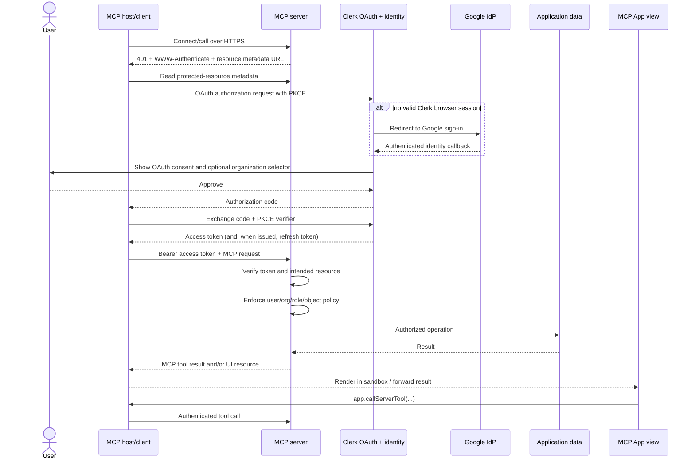

# Authenticating MCP Apps with Clerk

> **Scope:** a remote Model Context Protocol (MCP) server, optionally exposing an interactive MCP App view, with Clerk providing user identity and OAuth authorization. The concrete implementation uses Next.js App Router and Streamable HTTP, but the architecture applies equally to Express and other supported runtimes.
>
> **Currency:** reviewed against Clerk and MCP documentation available on **21 July 2026**. OAuth and MCP client-registration conventions are still evolving, so pin package versions and rerun the interoperability tests in this report before each production release.

## Executive summary

The recommended architecture uses Clerk in two distinct roles:

1. **Upstream user authentication:** the user signs in to Clerk through Google, Microsoft, GitHub, Apple, an enterprise SAML/OIDC connection, a passkey, or another enabled Clerk strategy.
2. **Downstream MCP authorization:** Clerk acts as the OAuth authorization server for the MCP host. The host obtains a Clerk-issued access token and presents it to the MCP server, which acts as the OAuth resource server.

The MCP App view itself should not run a separate Clerk sign-in flow, read Clerk cookies, or retain OAuth tokens. It runs in a host-controlled sandbox and should invoke protected operations with `app.callServerTool()`. The host owns the MCP OAuth flow and token storage.

The default production design should be:

| Concern | Recommendation |
|---|---|
| MCP transport | Streamable HTTP at a stable HTTPS URL such as `https://app.example.com/mcp` |
| Authentication boundary | Require a valid Clerk OAuth bearer token at the `/mcp` HTTP boundary |
| UI authentication | Host-mediated tool calls; no token handling in the MCP App iframe |
| Authorization | Server-side user, tenant, role, permission, and object-level checks on every tool |
| Public versus private tools | Use per-server authentication unless there is a real requirement for public tools |
| Identity providers | Enable Google and any other required providers as Clerk connections; Clerk remains the canonical user identity layer |
| Multi-tenancy | Use Clerk Organizations where appropriate, but still enforce application policy and resource ownership |
| OAuth scopes | Request only Clerk's minimal identity scopes; do not treat them as tool permissions |
| Client registration | Prefer pre-registration for controlled clients; enable Dynamic Client Registration only where target MCP hosts require it |
| OAuth consent | Keep Clerk's consent screen enabled; prefer the default Account Portal consent page |
| Token format | JWT for low-latency local validation; opaque tokens where immediate revocation is a stronger requirement |
| Environments | Clerk Development for local work; a separate Clerk application for production-like staging; the primary Clerk Production instance for live users |
| Promotion | Recreate production-only settings and credentials explicitly; do not treat production as a key-only change |
| User migration | Clerk Development users and identifiers do **not** transfer to Production |

The most important implementation constraint is that **authentication is not authorization**. Clerk proves who authorized the MCP client and can carry an organization selection. The application must still decide whether that identity may invoke a tool and access the specific record named in the tool arguments.

---

## 1. Scope and assumptions

This report covers delegated access by a human user. It assumes:

- a web application already uses Clerk;
- a remote MCP server is exposed over HTTP;
- MCP hosts connect as OAuth clients;
- the MCP server's tools access user- or organization-specific application data;
- Google is one of the sign-in methods, but not necessarily the only one;
- an optional MCP App UI is rendered by compatible hosts in a sandboxed iframe.

It does not treat the following as the same problem:

- **service-to-service authentication:** Clerk has machine-token functionality, but Clerk does not currently implement the standard OAuth client-credentials grant. A non-interactive MCP integration needs a separately designed machine-authentication scheme and host compatibility analysis;
- **access to Google APIs:** signing in with a Google account does not grant the MCP server access to Google Drive, Calendar, Gmail, or other Google APIs. That requires a separate Google authorization relationship, described in [Section 10](#10-when-tools-also-access-google-or-other-third-party-apis).

### 1.1 Terminology

| Term | Meaning in this report |
|---|---|
| MCP host | The AI application or IDE that presents the user experience and manages one or more MCP clients |
| MCP client | The protocol component inside the host that connects to this MCP server |
| MCP server | The application's HTTP service exposing tools, resources, prompts, and possibly UI resources |
| MCP App | An interactive UI resource rendered in a sandbox by an MCP host |
| Clerk Development instance | Clerk's non-production identity realm, with development keys and users |
| Clerk Production instance | Clerk's live identity realm, with production keys, domain, credentials, and users |
| Upstream identity provider | Google, Microsoft, GitHub, Apple, an enterprise IdP, or another method through which a user authenticates to Clerk |
| OAuth authorization server | Clerk, when issuing an access token to an MCP client |
| OAuth resource server | The protected MCP server that accepts that access token |
| OAuth client | The MCP client/host requesting delegated access on behalf of the user |

---

## 2. Recommended architecture and trust boundaries

### 2.1 The two identity relationships

It is useful to separate two flows that can otherwise look like one long OAuth redirect chain.

**Relationship A — user to Clerk**

```text
User -> Clerk sign-in -> Google or another identity provider -> Clerk user/session
```

Google authenticates the person to Clerk. Clerk creates or locates the canonical Clerk user and applies the application's sign-in, account-linking, organization, and session policy.

**Relationship B — MCP client to the MCP server**

```text
MCP host -> Clerk OAuth authorization -> Clerk access token -> MCP server
```

The MCP host is an OAuth client. Clerk presents sign-in and consent, then issues an access token for use at the MCP server. The MCP server verifies that token and derives the authoritative user identity from it.

These relationships should not be collapsed. In particular:

- the MCP client should receive a Clerk-issued token, not a Google access token;
- the MCP server should validate Clerk identity, not accept an email address asserted by the model or UI;
- a Google sign-in method should not be treated as proof that a user belongs to a particular application tenant;
- changing upstream providers should not change application ownership records, which should be keyed by stable Clerk user and organization identifiers within each environment.

### 2.2 Sequence diagram



A user with an existing Clerk browser session may not see Google on every MCP authorization. Clerk can go directly to consent. Google remains the upstream provider that originally authenticated the Clerk user.

### 2.3 Trust boundaries

Treat the following as separate security boundaries:

1. **MCP host and client:** stores bearer and refresh tokens; may be third-party software outside the application's control.
2. **Clerk:** authenticates users, obtains upstream IdP assertions, handles OAuth client authorization, and issues tokens.
3. **MCP server:** verifies tokens and enforces application authorization.
4. **MCP App iframe:** untrusted presentation surface relative to server secrets; it communicates through the host bridge.
5. **Application database and downstream APIs:** enforce tenant and record boundaries independently of the UI and model.
6. **Google or other downstream APIs:** use credentials that are distinct from MCP access tokens.

---

## 3. Authentication model: per-server or per-tool

MCP Apps documentation describes both per-server and per-tool authorization.

| Model | Behaviour | Use when | Operational cost |
|---|---|---|---|
| Per-server | Every request to `/mcp` requires a valid token | All useful tools or data are private | Lowest complexity; recommended default |
| Per-tool | Public operations work without a token; protected calls cause an HTTP `401` and OAuth escalation | The app has a genuine public experience that should load before sign-in | Higher complexity; HTTP request inspection and careful defence-in-depth required |

### 3.1 Recommended default: per-server authentication

Use Clerk's authenticated MCP handler with `required: true` when:

- all tools operate on user data;
- the tool catalogue itself is sensitive;
- the server has no useful anonymous mode;
- a connection-time login is acceptable.

This creates one obvious invariant: no MCP request reaches a tool without a verified identity.

### 3.2 Per-tool authentication

Use per-tool authorization only when public and protected functions are deliberately mixed. A protected invocation without a valid token must cause an **HTTP `401 Unauthorized`** response with an appropriate `WWW-Authenticate` challenge. Returning a successful HTTP response containing a tool-level "please log in" error is not a substitute: the host needs the HTTP challenge to discover and run OAuth.

A typical UI escalation is:

```ts
const result = await app.callServerTool({
  name: 'account_update',
  arguments: { /* validated input */ },
})
```

The host calls the server, receives `401`, runs OAuth, and retries. The MCP App code should not implement or store the OAuth transaction.

Even with HTTP-layer protection, the tool handler should reject a missing or malformed authorization context as defence in depth.

---

## 4. OAuth design decisions in Clerk

### 4.1 Scopes are identity disclosure, not the application's permission model

Clerk currently documents these OAuth scopes:

- `profile`
- `email`
- `public_metadata`
- `private_metadata`
- `openid`
- `user:org:read` when Organizations is enabled

Clerk does **not** currently support arbitrary custom OAuth scopes. Therefore a design based on scopes such as `projects:read`, `documents:write`, or one scope per tool cannot be implemented directly in Clerk today.

Recommended approach:

- request only the minimum Clerk identity data the MCP server actually needs;
- normally start with `profile` and `email` only if the tool needs both;
- add `user:org:read` only for an organization-scoped server;
- avoid `private_metadata` unless there is a specific, reviewed need to disclose it to the OAuth client;
- perform business authorization inside the MCP server using verified identity plus application policy.

The scope declared by protected-resource metadata tells clients what the resource supports. It must not be interpreted as granting access to every tool or record.

### 4.2 Organizations and tenant selection

When Clerk Organizations is enabled and the OAuth client requests `user:org:read`, Clerk's consent flow can let the user select an organization and include an `org_id` claim in the token.

This is useful but not sufficient by itself. For every organization-scoped tool:

1. obtain the organization identifier from the **verified** Clerk token/context, not from tool arguments;
2. verify that the user is still an active member where current state matters;
3. enforce the required organization role or permission;
4. query records with both tenant and record identifiers in the predicate;
5. reject an attempt to pass a different tenant ID in the input;
6. audit the organization, user, OAuth client, tool, target object, and outcome.

Do not use an email domain as the tenant authorization check. A Google or Microsoft email domain is an identity attribute, not an application membership decision.

### 4.3 Dynamic Client Registration, pre-registration, and CIMD

Clerk's current MCP guide tells implementers to enable **Dynamic Client Registration (DCR)** for broad MCP-client compatibility. DCR allows an MCP host to register itself without an administrator pre-creating an OAuth application.

DCR also creates a public, unauthenticated registration endpoint. Clerk explicitly warns that this permits anonymous client creation, introduces impersonation risk through misleading client branding, and increases monitoring and cleanup work. Clerk forces consent when DCR is enabled, which is an important control but does not eliminate all abuse.

Use this policy:

- **Known, controlled clients:** pre-register the client and exact redirect URIs where the host supports it. Leave DCR disabled.
- **Open ecosystem support:** enable DCR only after accepting the public-registration threat model; keep consent enabled and monitor registrations.
- **Enterprise deployment:** prefer an allowlisted client catalogue or pre-registration if the product controls the supported hosts.

The MCP 2025-11-25 specification says authorization servers and clients **should** support Client ID Metadata Documents (CIMD), while DCR **may** be supported. Clerk's public documentation reviewed for this report describes DCR but does not document CIMD support. Consequently:

- do not advertise `client_id_metadata_document_supported: true` unless the selected Clerk environment and package version demonstrably support it;
- test every target host rather than assuming one registration mechanism;
- track Clerk and MCP changes as a compatibility work item.

### 4.4 PKCE and consent

MCP clients are often public clients and cannot protect a client secret. Use authorization code with PKCE. Clerk supports public clients and PKCE; its advertised code challenge method is `S256`.

Keep the OAuth consent screen enabled. Clerk recommends its default Account Portal consent page. It shows the requesting client, requested scopes, and allow/deny controls. A custom consent route should be introduced only for a real product requirement; the safest customization is Clerk's `<OAuthConsent />` component rather than reimplementing approval logic.

Consent is especially important with DCR. Never auto-approve a dynamically registered client based only on the user already having a Clerk session.

### 4.5 JWT versus opaque access tokens

Clerk issues OAuth access tokens as JWTs by default and allows opaque access tokens as an alternative.

| Format | Advantages | Disadvantages | Suitable use |
|---|---|---|---|
| JWT | Local verification; lower latency; less dependency on Clerk during each request | Revocation normally takes effect no later than token expiry unless an additional current-state check is performed | Read-heavy tools and services where one-day maximum token lifetime is acceptable |
| Opaque | Server-side verification/introspection permits immediate revocation | Network call and authorization-server availability on validation path | High-risk operations or policies requiring immediate token invalidation |

Clerk currently documents a one-day access-token lifetime and refresh tokens that do not expire automatically. The MCP server normally sees access tokens only; the host retains refresh tokens. Operationally, this means:

- provide a clear way to revoke a client grant;
- treat host token storage as a sensitive dependency;
- never log bearer or refresh tokens;
- test revocation and reconnection;
- for destructive actions, re-check live user, organization, and resource state even when the access token is cryptographically valid.

### 4.6 Resource and audience validation

The MCP specification requires the client to send a resource indicator and the server to accept only tokens issued for that MCP resource. A valid signature and issuer are not enough.

Use Clerk's supported MCP verification helper, and make resource binding an explicit integration-test requirement. At minimum, negative tests must show that the server rejects:

- a token from a different issuer;
- a token issued for another Clerk application or OAuth client/resource;
- an expired or revoked token;
- a normal browser session token presented where an OAuth token is required;
- a token supplied in a URL query parameter rather than the `Authorization` header.

Do not replace the helper with a bare JWT decode. If a package version does not expose enough information to prove intended-resource validation, resolve that gap before production rather than assuming signature validation implies MCP compliance.

---

## 5. Reference implementation with Next.js

### 5.1 Packages

Assuming Clerk is already integrated into the Next.js application:

```bash
npm install mcp-handler @clerk/mcp-tools
```

For an interactive MCP App UI, the project will also normally use the official MCP SDK and Apps package:

```bash
npm install @modelcontextprotocol/sdk @modelcontextprotocol/ext-apps
```

Pin versions in the lockfile and review release notes before upgrading. MCP transport and authorization conventions have changed materially across specification versions.

### 5.2 Environment variables

A local development environment might contain:

```dotenv
# Clerk Development instance
NEXT_PUBLIC_CLERK_PUBLISHABLE_KEY=pk_test_REDACTED
CLERK_SECRET_KEY=sk_test_REDACTED

# Application-owned configuration
APP_BASE_URL=http://localhost:3000
MCP_RESOURCE_URL=http://localhost:3000/mcp
CLERK_AUTHORIZED_PARTIES=http://localhost:3000
```

Production should use a secret manager and live keys:

```dotenv
NEXT_PUBLIC_CLERK_PUBLISHABLE_KEY=pk_live_REDACTED
CLERK_SECRET_KEY=sk_live_REDACTED
APP_BASE_URL=https://app.example.com
MCP_RESOURCE_URL=https://app.example.com/mcp
CLERK_AUTHORIZED_PARTIES=https://app.example.com
```

Rules:

- never expose `CLERK_SECRET_KEY` to browser or MCP App bundles;
- do not put Google client secrets in application source. For a Clerk social connection, configure them in the selected Clerk instance;
- keep development, staging, and production secret stores distinct;
- fail startup when a production deployment receives `pk_test_` or `sk_test_` values;
- do not accept a caller-provided base URL for OAuth metadata or redirects.

### 5.3 Clerk middleware and resource-based protection

Clerk's Next.js `auth()` helper requires Clerk middleware/proxy integration. In current Next.js versions the file is normally named `proxy.ts`; Next.js 15 and earlier use `middleware.ts`.

`clerkMiddleware()` makes Clerk authentication available to the application, but it does not protect routes by default. Clerk's current guidance deprecates `createRouteMatcher()` for route protection and recommends enforcing access as close as possible to the code that reads or mutates the protected resource.

Keep these responsibilities separate:

- the proxy initialises Clerk request authentication and applies origin constraints;
- browser pages, Route Handlers, Server Actions, and service/data-layer functions enforce session, organization, role, permission, and object-level policy at the resource;
- `/mcp` explicitly accepts and validates Clerk `oauth_token` credentials in its Route Handler;
- `.well-known` discovery endpoints remain public and perform no authentication check.

Example proxy configuration:

```ts
// proxy.ts (or middleware.ts on Next.js 15 and earlier)
import { clerkMiddleware } from '@clerk/nextjs/server'

const authorizedParties = (process.env.CLERK_AUTHORIZED_PARTIES ?? '')
  .split(',')
  .map((value) => value.trim())
  .filter(Boolean)

export default clerkMiddleware(
  authorizedParties.length > 0 ? { authorizedParties } : {},
)

export const config = {
  matcher: [
    '/((?!_next|[^?]*\\.(?:html?|css|js(?!on)|jpe?g|webp|png|gif|svg|ttf|woff2?|ico|csv|docx?|xlsx?|zip|webmanifest)).*)',
    '/(api|trpc)(.*)',
    '/__clerk/(.*)',
  ],
}
```

Then gate an ordinary browser resource where that resource is served:

```tsx
// app/admin/layout.tsx
import { auth } from '@clerk/nextjs/server'
import { redirect } from 'next/navigation'
import type { ReactNode } from 'react'

export default async function AdminLayout({
  children,
}: {
  children: ReactNode
}) {
  const { isAuthenticated } = await auth()

  if (!isAuthenticated) {
    redirect('/sign-in')
  }

  // Enforce admin/org policy again in each Server Action, Route Handler,
  // and data/service function that reads or mutates protected data.
  return children
}
```

The layout check protects the browser experience; it is not a substitute for authorization in the mutation or data-access path. The `/.well-known/*` Route Handlers remain public because they contain no resource-level authentication check. Discovery must work before the MCP client has a token.

In production, set `authorizedParties` to the exact application origin or tightly controlled approved origins. Also configure Clerk's subdomain allowlist where sessions are shared across subdomains. Confirm with integration tests that these browser-session controls do not interfere with the OAuth-token path used by `/mcp`.

### 5.4 MCP route protected by Clerk OAuth

The following follows Clerk's current Next.js MCP pattern while avoiding the example anti-pattern of returning the entire Clerk user object.

```ts
// app/[transport]/route.ts
import { verifyClerkToken } from '@clerk/mcp-tools/next'
import { auth, clerkClient } from '@clerk/nextjs/server'
import { createMcpHandler, withMcpAuth } from 'mcp-handler'

const clerk = await clerkClient()

const handler = createMcpHandler((server) => {
  server.registerTool(
    'who_am_i',
    {
      description: 'Returns a minimal identity summary for the authorizing user',
    },
    async ({ authInfo }) => {
      const candidate = authInfo?.extra?.userId

      if (typeof candidate !== 'string' || candidate.length === 0) {
        return {
          isError: true,
          content: [{ type: 'text', text: 'Authenticated user context is missing.' }],
        }
      }

      const user = await clerk.users.getUser(candidate)
      const primaryEmail = user.emailAddresses.find(
        (address) => address.id === user.primaryEmailAddressId,
      )?.emailAddress

      // Return only fields deliberately intended for this MCP client/model.
      const result = {
        userId: user.id,
        primaryEmail: primaryEmail ?? null,
        displayName: [user.firstName, user.lastName].filter(Boolean).join(' ') || null,
      }

      return {
        content: [{ type: 'text', text: JSON.stringify(result) }],
        structuredContent: result,
      }
    },
  )
})

const authHandler = withMcpAuth(
  handler,
  async (_request, token) => {
    // Deliberately accept Clerk OAuth access tokens, not browser session tokens.
    const clerkAuth = await auth({ acceptsToken: 'oauth_token' })
    return verifyClerkToken(clerkAuth, token)
  },
  {
    required: true,
    resourceMetadataPath: '/.well-known/oauth-protected-resource/mcp',
  },
)

// POST is sufficient for Streamable HTTP. Export GET as well only where the
// chosen transport/library configuration requires it, such as SSE support.
export { authHandler as POST }
```

For the exact route arrangement supported by the installed `mcp-handler` version, follow its current API. Clerk's guide uses a dynamic `[transport]` route to support `/mcp` and `/sse`; a production service that supports only Streamable HTTP should avoid accidentally exposing additional transports.

### 5.5 Public OAuth metadata endpoints

Protected resource metadata:

```ts
// app/.well-known/oauth-protected-resource/mcp/route.ts
import {
  metadataCorsOptionsRequestHandler,
  protectedResourceHandlerClerk,
} from '@clerk/mcp-tools/next'

const handler = protectedResourceHandlerClerk({
  scopes_supported: ['profile', 'email'],
})

const corsHandler = metadataCorsOptionsRequestHandler()

export { handler as GET, corsHandler as OPTIONS }
```

If the MCP server is organization-scoped and Organizations is enabled, declare only the extra scope actually required:

```ts
scopes_supported: ['profile', 'email', 'user:org:read']
```

Compatibility authorization-server metadata endpoint:

```ts
// app/.well-known/oauth-authorization-server/route.ts
import {
  authServerMetadataHandlerClerk,
  metadataCorsOptionsRequestHandler,
} from '@clerk/mcp-tools/next'

const handler = authServerMetadataHandlerClerk()
const corsHandler = metadataCorsOptionsRequestHandler()

export { handler as GET, corsHandler as OPTIONS }
```

Current Clerk guidance says protected-resource metadata is required, while the application-level authorization-server endpoint may still be necessary for clients implementing older MCP discovery behaviour. Keep both until the tested client set no longer needs the compatibility endpoint.

Security requirements:

- both endpoints are unauthenticated;
- return metadata only, never secrets or user data;
- use the exact canonical HTTPS MCP resource URL in production;
- avoid broad application-wide CORS configuration merely to make metadata work; use the package's metadata CORS handler;
- verify that reverse proxies and CDNs do not cache environment-specific metadata across hostnames.

### 5.6 Server-side authorization pattern

Tool parameters are attacker-controlled. Never accept `userId`, `orgId`, `tenantId`, role, or permission in a tool argument as authoritative.

A record lookup should combine identity and target object in one authorization-aware query where possible:

```ts
async function getProjectForUser(input: {
  projectId: string
  clerkUserId: string
}) {
  const project = await db.project.findFirst({
    where: {
      id: input.projectId,
      memberships: {
        some: {
          clerkUserId: input.clerkUserId,
          status: 'active',
        },
      },
    },
  })

  if (!project) {
    // Avoid revealing whether the project exists for another user.
    throw new Error('Project not found or access denied')
  }

  return project
}
```

For organization-scoped data, include the verified production Clerk organization ID in the predicate. Centralize extraction of verified claims in one adapter so package-version changes cannot silently alter authorization context. Do not decode an unverified token to obtain `org_id`.

For each tool, define:

- who may call it;
- which organization context is required;
- required application role/permission;
- object ownership or membership predicate;
- whether current-state lookup is required despite a valid token;
- whether the action needs explicit confirmation, idempotency, or a dry-run mode;
- audit fields and retention.

### 5.7 MCP App view

The Apps SDK's `App` communicates with the host, and the host proxies calls to the MCP server. A minimal view pattern is:

```ts
import { App } from '@modelcontextprotocol/ext-apps'

const app = new App({ name: 'Example MCP App', version: '1.0.0' })

app.ontoolresult = (result) => {
  // Render only expected, schema-validated fields.
  renderResult(result.structuredContent)
}

await app.connect()

async function refreshPrivateData() {
  const result = await app.callServerTool({
    name: 'projects_list',
    arguments: {},
  })

  renderResult(result.structuredContent)
}
```

Best practice for the iframe:

- do not mount `<ClerkProvider>`, a Google sign-in button, or a custom token store solely for MCP authentication;
- do not assume access to host cookies or local storage;
- call server tools through the host bridge;
- validate tool results before inserting them into the DOM;
- apply a restrictive content security policy to the UI resource;
- avoid third-party scripts and remote asset dependencies where possible;
- use app-only tools for UI interactions that should not be exposed to the model, while applying the same server-side authorization checks;
- do not place secrets or long-lived credentials in tool results, UI resource HTML, `_meta`, logs, or model-visible content.

---

## 5A. Integration example: Express, the official MCP SDK, and Vercel

This section provides a complete alternative to the Next.js implementation in Section 5. It keeps the same Clerk and Google architecture, but uses:

- Express 5 as the HTTP application;
- the official MCP TypeScript SDK directly;
- Clerk's Express middleware and `@clerk/mcp-tools` for OAuth-token verification and metadata;
- Vercel's zero-configuration Express deployment support;
- a request-local, stateless Streamable HTTP transport suitable for Vercel Functions.

Google, Microsoft, GitHub, Apple, passkeys, and enterprise SSO remain upstream Clerk sign-in methods. The Express server does not receive or validate a Google token. It receives a Clerk OAuth token from the MCP host and derives the canonical Clerk user ID from verified MCP `authInfo`.

### 5A.1 Why this shape is appropriate for Vercel

At the date of this report, the official MCP TypeScript SDK's v2 packages are in beta and v1.x remains the supported production line. `@clerk/mcp-tools` version `0.6.0` depends on the official `@modelcontextprotocol/sdk` v1 package. The example therefore pins the tested v1 release rather than mixing Clerk's adapter with the newer split v2 packages.

| Decision | Implementation and rationale |
|---|---|
| MCP SDK | `@modelcontextprotocol/sdk@1.29.0`, the official supported v1 release used by the tested Clerk adapter |
| Express version | Express 5, matching the current peer requirements of `@clerk/mcp-tools` |
| Vercel entry point | `src/index.ts` default-exports the Express app; Vercel turns it into one Node.js Function |
| Transport | One stateless `StreamableHTTPServerTransport` per request, with no in-memory MCP session ID |
| Server instance | One `McpServer` per request, avoiding races when Fluid Compute executes requests concurrently in a warm instance |
| POST response | JSON response mode for ordinary request/response tools |
| GET and DELETE | Authenticated `405 Method Not Allowed`; this implementation intentionally has no standalone SSE stream or resumability |
| OAuth metadata | Public `.well-known` endpoints supplied by Clerk, restricted to one canonical application origin |
| Token verification | `mcpAuthClerk`, which accepts Clerk OAuth tokens and supplies MCP `AuthInfo` |
| Browser security | Exact `Origin` allowlist for `/mcp`; native clients that omit `Origin` remain supported |
| Application authorization | Tool code trusts only the verified Clerk user ID in `authInfo.extra.userId`, then applies normal tenant and object policy |
| Upstream identity provider | Configured in Clerk; Google and other providers require no provider-specific Express code |

Clerk also supplies a convenience `streamableHttpHandler(server)`. It is useful for a minimal conventional Express server. This Vercel example uses the official transport directly so it can create and close both the `McpServer` and transport per invocation, set JSON-response mode explicitly, and avoid sharing mutable MCP connection state between concurrent requests.

### 5A.2 Project layout

```text
clerk-mcp-express-vercel/
├── package.json
├── package-lock.json
├── tsconfig.json
├── .env.example
├── .gitignore
├── public/                   # Optional static MCP App assets
└── src/
    ├── config.ts             # Fail-fast environment and origin validation
    ├── mcp.ts                # MCP server and tools
    ├── index.ts              # Express app exported to Vercel
    └── local.ts              # Local-only listener bound to 127.0.0.1
```

No `vercel.json` is required for the basic deployment. Vercel recognizes `src/index.ts` as an Express entry point when it default-exports the app. Keep `app.listen()` out of that production entry point; the separate `local.ts` file exists only for local execution.

If the MCP App has static JavaScript, CSS, images, or fonts, put them under `public/`. Vercel's Express integration does not serve `express.static()` content.

### 5A.3 Dependencies and scripts

The following versions were installed and type-checked together on 21 July 2026. Commit `package-lock.json`, use `npm ci` in CI, and upgrade the Clerk and MCP packages as a tested set.

```json
{
  "name": "clerk-mcp-express-vercel",
  "version": "1.0.0",
  "private": true,
  "type": "module",
  "engines": {
    "node": "24.x"
  },
  "scripts": {
    "dev": "node --env-file=.env.local --import tsx src/local.ts",
    "typecheck": "tsc --noEmit"
  },
  "dependencies": {
    "@clerk/express": "2.1.43",
    "@clerk/mcp-tools": "0.6.0",
    "@modelcontextprotocol/sdk": "1.29.0",
    "cors": "2.8.5",
    "express": "5.2.1",
    "zod": "4.4.3"
  },
  "devDependencies": {
    "@types/cors": "2.8.19",
    "@types/express": "5.0.6",
    "@types/node": "24.10.4",
    "tsx": "4.21.0",
    "typescript": "5.9.3"
  }
}
```

The `zod` dependency satisfies the official SDK peer range and is available for real tool input schemas. Do not place the Clerk secret key, a Google client secret, or any other credential in a public-prefixed environment variable.

### 5A.4 TypeScript configuration

```json
{
  "compilerOptions": {
    "target": "ES2022",
    "module": "NodeNext",
    "moduleResolution": "NodeNext",
    "strict": true,
    "esModuleInterop": true,
    "forceConsistentCasingInFileNames": true,
    "skipLibCheck": true,
    "noEmit": true,
    "types": ["node"]
  },
  "include": ["src/**/*.ts"]
}
```

### 5A.5 Environment validation

`src/config.ts` fails during cold start if required values are absent or malformed. `APP_BASE_URL` is deliberately a single origin, not a path, so OAuth resource metadata and `WWW-Authenticate` challenges cannot vary by deployment alias.

```ts
function required(name: string): string {
  const value = process.env[name]?.trim()
  if (!value) {
    throw new Error(`Missing required environment variable: ${name}`)
  }
  return value
}

function parseOrigin(value: string, name: string): string {
  const url = new URL(value)
  const isHttp = url.protocol === 'http:' || url.protocol === 'https:'
  const isOriginOnly =
    !url.username &&
    !url.password &&
    url.pathname === '/' &&
    !url.search &&
    !url.hash

  if (!isHttp || !isOriginOnly) {
    throw new Error(`${name} must contain HTTP(S) origins only`)
  }

  return url.origin
}

const appBaseUrl = new URL(parseOrigin(required('APP_BASE_URL'), 'APP_BASE_URL'))

const allowedOrigins = new Set(
  (process.env.MCP_ALLOWED_ORIGINS ?? '')
    .split(',')
    .map((value) => value.trim())
    .filter(Boolean)
    .map((value) => parseOrigin(value, 'MCP_ALLOWED_ORIGINS')),
)

export const config = {
  appBaseUrl,
  allowedOrigins,
  clerkPublishableKey: required('CLERK_PUBLISHABLE_KEY'),
  clerkSecretKey: required('CLERK_SECRET_KEY'),
}
```

`MCP_ALLOWED_ORIGINS` controls browser-based MCP clients, not OAuth redirect URIs. Enter origins only, separated by commas, for example:

```dotenv
MCP_ALLOWED_ORIGINS=https://host.example.com,https://another-host.example.com
```

A native desktop MCP client commonly omits the `Origin` header. The middleware below permits an absent header but rejects every unlisted origin with `403`. Do not use `*` on the authenticated `/mcp` endpoint. Public, credential-free OAuth metadata may use wildcard CORS.

### 5A.6 MCP server and authenticated tool

`src/mcp.ts` creates a fresh MCP server for an invocation. The demonstration tool fetches only a minimal identity summary. It does not return the complete Clerk user object, provider tokens, private metadata, or session information.

```ts
import { createClerkClient } from '@clerk/express'
import { McpServer } from '@modelcontextprotocol/sdk/server/mcp.js'
import { config } from './config.js'

const clerk = createClerkClient({ secretKey: config.clerkSecretKey })

function requireUserId(authInfo: { extra?: Record<string, unknown> } | undefined): string {
  const userId = authInfo?.extra?.userId
  if (typeof userId !== 'string' || userId.length === 0) {
    throw new Error('Verified Clerk user context is missing')
  }
  return userId
}

export function createMcpServer(): McpServer {
  const server = new McpServer({
    name: 'example-clerk-mcp-server',
    version: '1.0.0',
  })

  server.registerTool(
    'who_am_i',
    {
      description: 'Returns a minimal identity summary for the authorizing user',
    },
    async ({ authInfo }) => {
      const userId = requireUserId(authInfo)
      const user = await clerk.users.getUser(userId)
      const primaryEmail = user.emailAddresses.find(
        (address) => address.id === user.primaryEmailAddressId,
      )?.emailAddress

      const result = {
        userId,
        displayName:
          [user.firstName, user.lastName].filter(Boolean).join(' ') || null,
        primaryEmail: primaryEmail ?? null,
      }

      return {
        content: [{ type: 'text', text: JSON.stringify(result) }],
        structuredContent: result,
      }
    },
  )

  return server
}
```

The Clerk user lookup is appropriate for this identity demonstration, but most domain tools should not fetch the Clerk profile on every request. Use `userId` as the verified identity key, perform authorization-aware application database queries as described in Section 5.6, and retrieve current Clerk state only where the policy requires it.

For audit records, `authInfo.clientId` identifies the registered OAuth client and `authInfo.scopes` records the Clerk scopes granted to it. Use those values server-side; do not let a tool argument override them.


At the tested `@clerk/mcp-tools` version, `verifyClerkToken()` maps the Clerk `userId` into `authInfo.extra`; it does not map an organization ID there. Do not assume that requesting `user:org:read` makes `authInfo.extra.orgId` available. For organization-scoped tools, treat an input organization ID only as the requested resource selector and verify the user's current membership and permission server-side. Where a cryptographically bound consent-selected organization is mandatory, add a separately reviewed Clerk verification adapter that exposes a verified claim and works for the selected token format; do not merely decode the raw bearer token.

### 5A.7 Express application exported to Vercel

`src/index.ts` implements the complete HTTP boundary:

- a minimal health endpoint;
- canonical scheme and host validation;
- public protected-resource and compatibility authorization-server metadata;
- MCP `Origin` validation and narrowly scoped CORS;
- Clerk OAuth-token verification;
- a request-local official SDK transport;
- authenticated `405` responses for unsupported GET and DELETE transports;
- non-sensitive JSON-RPC error handling.

```ts
import { clerkMiddleware } from '@clerk/express'
import {
  authServerMetadataHandlerClerk,
  mcpAuthClerk,
  protectedResourceHandlerClerk,
} from '@clerk/mcp-tools/express'
import { StreamableHTTPServerTransport } from '@modelcontextprotocol/sdk/server/streamableHttp.js'
import cors from 'cors'
import express, { type ErrorRequestHandler, type RequestHandler } from 'express'
import { config } from './config.js'
import { createMcpServer } from './mcp.js'

const app = express()
app.disable('x-powered-by')

function errorName(error: unknown): string {
  return error instanceof Error ? error.name : 'UnknownError'
}

// Vercel terminates TLS and supplies X-Forwarded-Proto. This lets Express
// derive the public scheme correctly for metadata and WWW-Authenticate URLs.
app.set('trust proxy', 1)

const validateCanonicalRequest: RequestHandler = (req, res, next) => {
  const expectedProtocol = config.appBaseUrl.protocol.slice(0, -1)
  const requestProtocol = req.protocol
  const requestHost = req.get('host')

  if (requestProtocol !== expectedProtocol || requestHost !== config.appBaseUrl.host) {
    res.status(400).json({ error: 'Request must use the canonical application origin' })
    return
  }

  next()
}

const validateMcpOrigin: RequestHandler = (req, res, next) => {
  const origin = req.get('origin')
  if (origin && !config.allowedOrigins.has(origin)) {
    res.status(403).json({
      jsonrpc: '2.0',
      error: { code: -32000, message: 'Origin is not allowed' },
      id: null,
    })
    return
  }

  next()
}

const mcpCors = cors({
  origin(origin, callback) {
    callback(null, !origin || config.allowedOrigins.has(origin))
  },
  methods: ['POST', 'GET', 'DELETE', 'OPTIONS'],
  allowedHeaders: [
    'Authorization',
    'Content-Type',
    'Accept',
    'MCP-Protocol-Version',
    'MCP-Session-Id',
    'Last-Event-ID',
  ],
  exposedHeaders: ['WWW-Authenticate', 'MCP-Session-Id'],
  maxAge: 86_400,
})

app.get('/healthz', (_req, res) => {
  res.json({ status: 'ok' })
})

// OAuth discovery is public. Canonical-host validation prevents preview or
// generated deployment URLs from producing different resource identifiers.
app.use(
  '/.well-known',
  validateCanonicalRequest,
  cors({ origin: '*', methods: ['GET', 'OPTIONS'], maxAge: 86_400 }),
)

app.get(
  '/.well-known/oauth-protected-resource/mcp',
  protectedResourceHandlerClerk({
    scopes_supported: ['profile', 'email'],
  }),
)

// Compatibility endpoint for clients implementing older MCP discovery.
app.get('/.well-known/oauth-authorization-server', authServerMetadataHandlerClerk)

// Apply browser-origin checks and CORS before authentication so an OAuth 401
// can expose WWW-Authenticate to an allowed browser client. Native clients
// usually omit Origin and remain supported.
app.use(
  '/mcp',
  validateCanonicalRequest,
  validateMcpOrigin,
  mcpCors,
  clerkMiddleware(),
  express.json({ limit: '1mb' }),
)

app.post('/mcp', mcpAuthClerk, async (req, res, next) => {
  // Vercel can run concurrent invocations in one warm instance. Create a
  // request-local server and stateless transport; do not keep sessions in RAM.
  const server = createMcpServer()
  const transport = new StreamableHTTPServerTransport({
    sessionIdGenerator: undefined,
    enableJsonResponse: true,
  })

  let closed = false
  const close = async () => {
    if (closed) return
    closed = true
    await server.close()
  }

  const closeAfterResponse = () => {
    void close().catch((error) => {
      console.error('Failed to close MCP request resources', {
        errorName: errorName(error),
      })
    })
  }

  res.once('finish', closeAfterResponse)
  res.once('close', closeAfterResponse)

  try {
    await server.connect(transport)
    await transport.handleRequest(req, res, req.body)
  } catch (error) {
    await close().catch(() => undefined)
    next(error)
  }
})

const methodNotAllowed: RequestHandler = (_req, res) => {
  res.status(405).set('Allow', 'POST').json({
    jsonrpc: '2.0',
    error: { code: -32000, message: 'Method not allowed' },
    id: null,
  })
}

// This example deliberately omits standalone SSE and stateful sessions.
app.get('/mcp', mcpAuthClerk, methodNotAllowed)
app.delete('/mcp', mcpAuthClerk, methodNotAllowed)

const errorHandler: ErrorRequestHandler = (error, req, res, _next) => {
  // Some upstream errors may include request data in their message. Log only a
  // classification and correlation value unless a scrubbed error sink is used.
  console.error('Unhandled request error', {
    errorName: errorName(error),
    requestId: req.get('x-vercel-id') ?? undefined,
  })
  if (res.headersSent) {
    res.end()
    return
  }

  res.status(500).json({
    jsonrpc: '2.0',
    error: { code: -32603, message: 'Internal server error' },
    id: null,
  })
}

app.use(errorHandler)

export default app
```

Several details are intentional:

- `app.set('trust proxy', 1)` allows Express to use Vercel's forwarded HTTPS scheme when Clerk constructs metadata and challenge URLs. The subsequent canonical protocol and host check prevents arbitrary forwarded values or generated aliases from changing the OAuth resource identifier.
- CORS and origin checks run before `mcpAuthClerk`, so an allowed browser client can read the `WWW-Authenticate` challenge. The `Authorization` header remains required for actual MCP requests.
- `mcpAuthClerk` replaces the request's authentication context with the MCP SDK's `AuthInfo`, including the verified Clerk `userId`, OAuth `clientId`, scopes, and token.
- `sessionIdGenerator: undefined` makes the transport stateless. No `MCP-Session-Id` is issued or accepted as an in-memory routing key.
- `enableJsonResponse: true` avoids holding a POST open as an SSE stream for ordinary tool responses.
- the response lifecycle closes the request-local MCP server and its owned transport.
- the generic error handler never serializes exception messages or stack traces to a client.

The MCP transport specification requires an HTTP server to validate a present `Origin` header. It also permits a server that does not offer a standalone SSE stream to return `405` for GET. This example follows that minimal stateless profile.

### 5A.8 Local-only listener

Vercel invokes the default-exported Express application directly. For local execution without Vercel CLI, `src/local.ts` starts a listener on loopback only:

```ts
import app from './index.js'

const port = Number.parseInt(process.env.PORT ?? '3000', 10)

app.listen(port, '127.0.0.1', () => {
  console.log(`MCP server listening on http://127.0.0.1:${port}`)
})
```

Binding to `127.0.0.1`, rather than `0.0.0.0`, follows the MCP transport security recommendation for local servers.

### 5A.9 Local environment and secret hygiene

Commit a redacted `.env.example`:

```dotenv
CLERK_PUBLISHABLE_KEY=pk_test_REDACTED
CLERK_SECRET_KEY=sk_test_REDACTED
APP_BASE_URL=http://localhost:3000
MCP_ALLOWED_ORIGINS=http://localhost:6274
```

The `http://localhost:6274` value is only an example browser-client or Inspector origin. Use the actual origin emitted by the client under test. Native clients that send no `Origin` do not need an entry.

Use a `.gitignore` that excludes all local environment files while retaining the example:

```gitignore
node_modules/
.vercel/
.env
.env.*
!.env.example
```

Create `.env.local` with keys from the selected **Clerk Development instance**:

```dotenv
CLERK_PUBLISHABLE_KEY=pk_test_REDACTED
CLERK_SECRET_KEY=sk_test_REDACTED
APP_BASE_URL=http://localhost:3000
MCP_ALLOWED_ORIGINS=http://localhost:6274
```

Then run:

```bash
npm ci
npm run typecheck
npm run dev
```

Alternatively, link the project and run through Vercel's local environment:

```bash
vercel link
vercel env pull .env.local --environment=development
npm run dev
# or use: vercel dev
```

The publishable and secret keys must come from the same Clerk instance. Never combine `pk_test_` with `sk_live_`, use a production Google connection with a Clerk Development instance, or copy a local `.env.local` into Vercel Production.

### 5A.10 Clerk and Google configuration for this server

The Clerk Dashboard work is the same as in Sections 6 through 9. For this Express deployment:

1. Configure Google and any other upstream providers on the Clerk instance used by the environment.
2. Configure Clerk as the OAuth authorization server, including its consent experience.
3. Enable Dynamic Client Registration only when the supported MCP client set requires it, and monitor registrations as described elsewhere in this report.
4. Put that instance's `CLERK_PUBLISHABLE_KEY` and `CLERK_SECRET_KEY` into the matching Vercel environment.
5. Set `APP_BASE_URL` to the stable public origin assigned to that environment.
6. Test the OAuth flow from the real MCP host, not only through Clerk's Account Portal.

There is no Google SDK or Google OAuth callback route in the Express server. The sequence remains:

```text
MCP host -> Clerk OAuth -> Google sign-in when needed -> Clerk access token -> /mcp
```

The implications are:

| Provider configuration | Effect on the Express MCP server |
|---|---|
| Google social connection | The user may authenticate to Clerk with Google; the server still receives a Clerk user ID |
| Microsoft, GitHub, or Apple | Same MCP code and same Clerk-token verification path |
| Enterprise SAML/OIDC | Same MCP code; tenant membership and role policy still require server-side enforcement |
| Passkey, email, or another Clerk factor | Same MCP code; authentication strength may affect application policy if explicitly recorded and checked |
| Google Drive, Calendar, or Gmail access | Separate downstream OAuth grant; not supplied by Google sign-in to Clerk |

A production Google client secret belongs in the Clerk Production connection. It does not need to be copied into Vercel for this authentication flow. Store a Google credential in Vercel only when separate application code directly calls Google APIs, and keep that downstream grant isolated as described in Section 10.

### 5A.11 Mapping Clerk environments to Vercel environments

Use stable public origins for any environment that will be registered with an MCP host. OAuth resource identifiers and discovery URLs should not change on every commit.

| Purpose | Vercel target | Clerk realm | Recommended MCP origin | Key pattern |
|---|---|---|---|---|
| Local development | Development/local | Primary app's Clerk Development instance | `http://localhost:3000` | `pk_test_` / `sk_test_` |
| Production-like staging | A stable Preview branch domain or Vercel custom environment | A separate Clerk application's Production instance | `https://mcp-staging.example.com` | That staging app's `pk_live_` / `sk_live_` |
| Live production | Vercel Production | Primary app's Clerk Production instance | `https://mcp.example.com` | Primary `pk_live_` / `sk_live_` |
| Ephemeral pull-request preview | Vercel Preview URL | Usually no externally registered OAuth realm | Generated URL, for code/health tests only | Avoid using production keys |

For each Vercel target set:

```text
CLERK_PUBLISHABLE_KEY
CLERK_SECRET_KEY
APP_BASE_URL
MCP_ALLOWED_ORIGINS
```

Operational rules:

- mark `CLERK_SECRET_KEY` as Sensitive in Vercel;
- scope every variable to the intended Development, Preview/custom, or Production environment;
- use branch-specific Preview variables where a staging branch shares a Vercel project;
- redeploy after changing an environment variable, because existing deployments retain their previous values;
- do not derive `APP_BASE_URL` from a commit-specific `VERCEL_URL`;
- do not reuse the live Clerk Production keys in general pull-request previews;
- use a separate Clerk application for production-like staging, as already recommended in Section 7.

The staging Clerk application can use its own Google Cloud test or staging project and branding. The primary Clerk Production instance should use the dedicated production Google project and production publishing status described in Section 6.

### 5A.12 Deploying to Vercel

The preferred release path is Git integration, which creates Preview deployments for branches and a Production deployment from the production branch. A CLI flow is also valid:

```bash
npm ci
npm run typecheck

vercel link
vercel                         # Preview deployment
vercel --prod                  # Production deployment
```

Before the first externally usable deployment:

1. Add a stable custom domain such as `mcp-staging.example.com` or `mcp.example.com`.
2. Assign a staging domain to the staging branch or custom environment where applicable.
3. Set `APP_BASE_URL` to that exact origin, including `https://` and no trailing path.
4. Configure the environment's Clerk keys and exact browser origins;
5. deploy again so the new environment values are present;
6. confirm that both metadata and the `WWW-Authenticate` challenge use the stable domain;
7. add that final MCP URL to the target host and complete the Clerk OAuth flow.

Vercel turns the Express application into one Vercel Function under Fluid Compute. Keep the following constraints in mind:

- a warm function instance can serve concurrent invocations, so do not keep user, token, transport, or MCP session state in module-level mutable variables;
- immutable configuration, an SDK client, and a correctly managed database pool may be reused across invocations;
- select a function region close to the application's primary data store;
- the entire Express application is one function bundle, so avoid unnecessary heavy dependencies;
- place static assets in `public/`, not behind `express.static()`;
- set maximum duration consciously for long-running tools, but prefer jobs or durable workflows for work that should outlive a client request;
- configure rate limits, bot controls, and other network policy through Vercel Firewall or an upstream gateway in addition to per-user application limits.

The canonical-origin middleware intentionally rejects `project-hash.vercel.app` and other generated aliases once `APP_BASE_URL` is a custom domain. This prevents one deployment from advertising multiple OAuth resource identifiers. Use the custom domain for MCP traffic and generated URLs only for deployment inspection or health checks.

### 5A.13 Vercel Deployment Protection

OAuth discovery and the MCP endpoint must be reachable by the MCP host before it possesses a Clerk token. Vercel Authentication, password protection, or another Deployment Protection layer can intercept those requests before Express and break discovery or token use.

For an externally tested staging environment, use one of these patterns:

- a separate staging Vercel project with a public stable domain, protected at `/mcp` by Clerk OAuth;
- a stable branch/custom-environment domain with a narrowly designed Deployment Protection exception;
- a controlled automation bypass only when the specific MCP host can supply it securely.

Adding `/mcp` to Vercel's OPTIONS Allowlist is not enough: it bypasses protection only for CORS preflight, while the required metadata GET and MCP POST requests remain protected.

The production network endpoint is normally public in the routing sense and private at the application layer: Clerk authenticates the bearer token, tool policy authorizes the operation, and Vercel Firewall/rate limiting mitigates network abuse. Do not expose an unauthenticated tool merely to avoid Deployment Protection conflicts.

### 5A.14 Stateless limitations and the path to stateful MCP

This example is deliberately stateless:

- every POST receives a fresh `McpServer` and transport;
- no session ID is generated;
- GET and DELETE return `405` after authentication;
- no server-initiated standalone SSE channel is maintained;
- no resumability or in-memory event history is promised.

That profile is a good match for conventional request/response tools on a horizontally scaled function platform. It is not sufficient when the protocol design requires long-lived server-initiated requests, resumable event streams, or state that spans invocations.

For stateful MCP on Vercel, design it explicitly:

1. issue and validate cryptographically strong session identifiers;
2. externalize session and event state to a durable store;
3. authorize every resumed connection against the original user and OAuth client;
4. handle concurrent requests and duplicate delivery;
5. define expiry, revocation, and cleanup;
6. test function cancellation, timeout, reconnect, and deployment rollover;
7. avoid assuming that a later request reaches the same warm instance.

Depending on the feature, a persistent service runtime may be simpler than reconstructing state around functions. Do not turn on session IDs in this sample without completing that design.

### 5A.15 Verification commands

#### Verify protected-resource metadata

```bash
curl -sS \
  https://mcp.example.com/.well-known/oauth-protected-resource/mcp \
  | jq
```

Confirm that:

- `resource` is exactly `https://mcp.example.com/mcp`;
- `authorization_servers` identifies the expected Clerk Production authorization server;
- only intended Clerk scopes are advertised;
- no development hostname or key-derived development Clerk domain appears.

#### Verify the unauthenticated OAuth challenge

```bash
curl -i https://mcp.example.com/mcp \
  -X POST \
  -H 'Content-Type: application/json' \
  -H 'Accept: application/json, text/event-stream' \
  -H 'MCP-Protocol-Version: 2025-11-25' \
  --data '{
    "jsonrpc": "2.0",
    "id": 1,
    "method": "initialize",
    "params": {
      "protocolVersion": "2025-11-25",
      "capabilities": {},
      "clientInfo": { "name": "smoke-test", "version": "1.0.0" }
    }
  }'
```

Expected result:

```text
HTTP/1.1 401 Unauthorized
WWW-Authenticate: Bearer resource_metadata=https://mcp.example.com/.well-known/oauth-protected-resource/mcp
```

The exact header capitalization is not significant. The scheme, host, path, and protected-resource URL are significant.

#### Verify browser-origin rejection

```bash
curl -i https://mcp.example.com/mcp \
  -X POST \
  -H 'Origin: https://evil.example' \
  -H 'Content-Type: application/json' \
  -H 'Accept: application/json, text/event-stream' \
  --data '{
    "jsonrpc": "2.0",
    "id": 1,
    "method": "initialize",
    "params": {
      "protocolVersion": "2025-11-25",
      "capabilities": {},
      "clientInfo": { "name": "origin-test", "version": "1.0.0" }
    }
  }'
```

Expected result: `403 Forbidden`, before OAuth-token processing.

For an allowed browser origin, the unauthenticated response should instead be `401` and should include both an origin-specific `Access-Control-Allow-Origin` value and `Access-Control-Expose-Headers` containing `WWW-Authenticate`.

#### Verify canonical-host rejection

Call the same metadata path through the deployment's generated `*.vercel.app` URL after configuring a custom `APP_BASE_URL`. This implementation should return `400`, demonstrating that the generated alias cannot mint a second resource identifier.

#### Verify the complete Google flow

1. Connect the target MCP host to `https://mcp.example.com/mcp`.
2. Let it discover metadata and register or use its configured OAuth client.
3. Complete Clerk authorization in the system browser.
4. Select **Continue with Google** when no valid Clerk session exists.
5. Approve consent and, where applicable, select the intended Clerk Organization;
6. Call `who_am_i` and confirm that it returns the expected production Clerk user;
7. Deny consent, revoke the grant, suspend the user, and remove organization membership in separate negative tests;
8. Repeat for every supported MCP host.

Apply all token, audience/resource, cross-tenant, object-authorization, revocation, and rollback tests in Section 12 to this implementation as well.

### 5A.16 Observability and operational controls

Log enough to reconstruct an authorization decision without logging credentials. After successful token verification, an audit event may contain:

```text
request correlation ID
Vercel request/region identifier
Clerk user ID
Clerk organization ID after verified/current-state resolution
OAuth client ID
MCP tool name
application resource ID
policy decision and reason code
duration and outcome
```

Never log:

```text
Authorization header
Clerk OAuth access or refresh token
Google authorization code or provider access token
Clerk secret key
Google client secret
full Clerk user/profile payload by default
unredacted tool arguments containing user data or secrets
```

Rate-limit at more than one level where appropriate: network/IP controls for abuse, verified OAuth client and Clerk user for fair use, and tool/resource-specific limits for expensive or destructive operations. Keep the authenticated `clientId` in audit records so a compromised or abusive registered client can be contained without disabling every user.

### 5A.17 Production checklist for the Express/Vercel variant

Before routing live MCP traffic, confirm that:

- the deployed `src/index.ts` default-exports the Express app and does not call `listen()`;
- Node.js and package versions are pinned and the lockfile is committed;
- the code type-checks and dependency/security review is clean;
- Vercel Production has only the primary Clerk Production keys;
- staging has its own Clerk application and stable domain;
- `APP_BASE_URL` is the exact canonical HTTPS origin in each deployed environment;
- generated Vercel deployment aliases cannot produce alternate metadata;
- `.well-known` endpoints are public and contain no secrets;
- `/mcp` requires `mcpAuthClerk` for POST, GET, and DELETE;
- a present unapproved `Origin` receives `403`;
- CORS exposes `WWW-Authenticate` only to approved browser origins;
- no user, token, transport, or MCP session state is stored in process memory;
- every tool enforces application authorization after identity verification;
- Deployment Protection does not intercept required discovery or MCP requests;
- Google sign-in, consent, denial, revocation, and account recovery work through the target hosts;
- Vercel logs and application audit records omit tokens and secrets;
- rollback has been tested against the stable domain and the corresponding Clerk configuration.

---

## 6. Configuring Google as the identity provider

Google is an **upstream Clerk social connection** in this architecture. The MCP client still authorizes against Clerk and receives a Clerk token.

### 6.1 Development instance

For a Clerk Development instance:

1. Open the selected Development instance in the Clerk Dashboard.
2. Navigate to **SSO connections**.
3. Select **Add connection** and **For all users**.
4. Select **Google**.
5. Enable it for sign-up and sign-in.

Clerk normally supplies shared Google OAuth credentials and redirect URIs for development, so no Google Cloud setup is required for the basic development path.

Shared credentials are for development convenience only. They are not the production configuration and should not be treated as evidence that the production redirect, branding, consent, or domain setup is correct.

### 6.2 Production instance

For Clerk Production, create custom Google credentials:

1. Select the **Production** instance in Clerk.
2. Add Google under **SSO connections** for all users.
3. Enable **sign-up and sign-in** and **Use custom credentials**.
4. Copy the **Authorized Redirect URI** generated by Clerk.
5. In a dedicated production Google Cloud project, configure the OAuth consent/branding information.
6. Create an OAuth client, normally of type **Web application**.
7. Add the canonical production application origins, such as `https://app.example.com`.
8. Paste Clerk's exact Authorized Redirect URI into Google's Authorized Redirect URIs.
9. Store the generated Google client ID and client secret securely.
10. Paste them into the Google connection in the **Clerk Production instance** and save.
11. Test through Clerk's production Account Portal and through a real MCP-host OAuth flow.

Google requires separate Cloud projects for testing and production deployment tiers. This is also operationally safer: changes to experimental scopes, branding, or test redirect URIs cannot destabilize the live sign-in client.

### 6.3 Google consent and publishing status

An external Google OAuth application starts in **Testing** status and is limited to a configured test audience, with a 100-test-user cap. Before a public launch:

- set the production project's publishing status to **In production**;
- complete any required brand, sensitive-scope, or restricted-scope verification;
- use a domain the organization owns and has verified;
- provide a public home page, support contact, privacy policy, and terms where applicable;
- ensure the app name, logo, and domain match the user experience;
- request only the minimum Google scopes needed for sign-in;
- keep project owners and security contacts current.

Basic Google sign-in normally needs identity scopes rather than Google API data scopes. Avoid adding Drive, Gmail, Calendar, or other API scopes to the sign-in connection merely because tools may later need those APIs. Separate authorization yields clearer consent and safer token handling.

### 6.4 Google-specific operational points

- **No embedded WebViews:** Google does not allow normal Google OAuth sign-in through embedded WebViews. Confirm each target MCP host launches an acceptable external/system browser flow.
- **Email subaddresses:** Clerk recommends keeping its Google **Block email subaddresses** setting enabled to prevent alias-related account risks. Test the impact on existing users before turning it on in a live population.
- **Workspace membership:** an authenticated `@example.com` address is not a substitute for Clerk Organization membership and application authorization.
- **Account recovery:** decide whether Google is the only permitted method or whether users may add passkeys, email verification, or another provider. For regulated enterprise tenants, this is a policy decision rather than a default UI choice.
- **Provider secrets:** rotate the Google client secret using an overlap or controlled maintenance plan, and update only the corresponding Clerk environment.

### 6.5 Testing Google through the full MCP flow

Do not stop after testing the Clerk Account Portal. Test:

1. a new Google user connecting from an MCP host;
2. an existing Clerk user with an active browser session;
3. consent approval and denial;
4. a user with multiple Google accounts;
5. an organization selector when `user:org:read` is requested;
6. blocked email aliases, if enabled;
7. the production Google project in **In production** status;
8. the target host's browser-launch behaviour;
9. revocation followed by reconnect;
10. a user removed or suspended in Clerk or the application database.

---

## 7. Other identity providers and authentication methods

Clerk can broker multiple upstream methods while preserving one downstream MCP OAuth integration.

### 7.1 Other social providers

Google, Microsoft, GitHub, Apple, and other Clerk social connections follow the same general pattern:

1. enable the connection in Clerk Development, often using Clerk's shared development credentials;
2. create a provider-owned production application/client;
3. configure the exact Clerk callback/redirect URI;
4. place provider credentials in the Clerk Production connection;
5. configure production branding, audience, and verification with the provider;
6. test new account creation, existing account sign-in, account linking, denial, and provider outage behaviour.

Provider details differ. For example, Apple has private email relay configuration, Microsoft has tenant/audience choices, and GitHub organization policy may affect access. Follow the provider-specific Clerk guide rather than copying Google's fields mechanically.

### 7.2 Enterprise SSO

For B2B products, use Clerk Organizations plus enterprise SAML or OIDC connections where customers require centrally managed identity. Prefer service-provider-initiated flows where possible. Map enterprise identity to Clerk users and organization membership, then enforce application roles and permissions in the MCP server.

Recommended enterprise policy:

- bind each enterprise connection to the intended organization/domain;
- require organization selection or derive a single allowed tenant safely;
- use invitations, verified domains, or enterprise provisioning according to the onboarding model;
- handle membership removal and role changes promptly;
- test IdP-disabled users and terminated employment scenarios;
- audit who configured or changed SSO connections;
- do not let an MCP tool select a tenant merely by passing a domain string.

### 7.3 Passwordless, passkeys, and MFA

These methods authenticate the user to Clerk and therefore can participate in the same MCP OAuth flow. They are useful as alternatives or recovery methods, but the application should define:

- which methods meet the assurance level for each tenant;
- whether MFA is mandatory for administrators;
- how account recovery is governed;
- which sensitive actions require recent reverification in the ordinary web application;
- whether an MCP-originated destructive action needs an out-of-band confirmation or approval workflow.

MCP OAuth consent is not the same as step-up authentication for a high-risk business action. For payments, privilege changes, bulk deletion, credential export, or equivalent actions, consider a browser approval/reverification flow bound to the verified MCP user.

---

## 8. Clerk development, staging, and production model

Clerk applications have Development and Production instances. Clerk does not provide a third native "staging instance" within the same application.

A robust environment model is:

| Deployment tier | Clerk realm | Domain | Identity data | Social credentials | Intended use |
|---|---|---|---|---|---|
| Local development | Primary app's Development instance | `localhost` and Clerk `accounts.dev` domain | Synthetic developers/test users | Clerk shared credentials where supported | Fast iteration |
| Preview/branch | Usually the Development instance with synthetic data, or an isolated test app for risky changes | Preview URL | Non-production only | Development/test credentials | Pull-request validation |
| Production-like staging | A **separate Clerk application**, normally using its own Production instance and staging domain | `staging.example.com` | Staging-only users | Dedicated staging provider clients | End-to-end release and domain/OAuth testing |
| Production | Primary app's Production instance | `app.example.com` | Live users | Dedicated production provider clients | Live service |

Do not use production Clerk keys and live users for routine preview deployments. Clerk explicitly warns against sharing production credentials for staging because it combines staging and live data and makes test configuration changes production changes.

### 8.1 Development and production are separate identity realms

Important consequences:

- Development is capped at 100 users.
- Development uses different keys and domains.
- Development and Production have distinct user pools and identifiers.
- Users cannot be migrated from the Clerk Development instance to the Production instance.
- Application records keyed by development Clerk user IDs do not become production records by changing environment variables.
- OAuth client registrations and grants are environment-specific.

Plan production onboarding as a fresh account creation or as a migration from an existing real identity system—not as promotion of development users.

### 8.2 Configuration drift

When a Production instance is created, Clerk can clone many Development settings, but it deliberately does not copy all sensitive settings. Clerk documents **SSO connections, integrations, and paths** as settings that must be recreated.

Treat Clerk configuration as release-controlled infrastructure:

- keep an environment inventory in version control;
- use the Clerk CLI's configuration commands where supported;
- review diffs rather than relying on dashboard memory;
- record manual settings that cannot yet be managed as code;
- assign an owner for Clerk, Google Cloud, DNS, webhooks, and MCP compatibility.

Useful Clerk CLI commands include:

```bash
clerk whoami
clerk link
clerk env pull
clerk config pull
clerk config patch
clerk deploy
clerk deploy status
clerk doctor
```

Do not commit pulled secrets. Use configuration export as review input, not as a reason to place credentials in the repository.

---

## 9. Development-to-production transition plan

### Phase 0 — define the production contract

Before creating credentials, write down:

- production web origin and canonical `/mcp` resource URL;
- target MCP hosts and their client-registration methods;
- required identity providers;
- whether Organizations is enabled;
- required OAuth scopes;
- per-server or per-tool authentication model;
- JWT or opaque token format;
- authorization matrix for every tool;
- audit, data retention, and incident requirements;
- staging and rollback model.

A change to the MCP resource URL after clients have authorized can invalidate discovery, audience assumptions, and cached client configuration. Choose it early.

### Phase 1 — inventory the Development instance

Capture:

- user/sign-in strategies;
- Google and other social connections;
- enterprise connections;
- Organizations, roles, and permissions;
- session and MFA settings;
- OAuth applications, DCR, consent, and token format;
- Account Portal and custom path settings;
- domains and redirect URLs;
- webhooks, signing secrets, and subscribed event types;
- integrations;
- email/SMS templates and legal acceptance;
- custom claims and metadata dependencies;
- MCP metadata URLs and scopes.

Mark which items are test-only and which must be recreated in Production.

### Phase 2 — create the Clerk Production instance

In Clerk:

1. select **Create production instance**;
2. choose whether to clone eligible Development settings or start from defaults;
3. review every cloned setting rather than assuming parity;
4. explicitly recreate SSO connections, integrations, and paths;
5. configure the production domain;
6. add required DNS records;
7. restrict Clerk's subdomain allowlist;
8. set exact `authorizedParties` in the application;
9. deploy Clerk certificates when the dashboard prerequisites are complete.

DNS propagation can take time. Begin this work before the planned cutover rather than making it a launch-day dependency.

### Phase 3 — configure production identity providers

For each provider:

- create a dedicated production provider project/application;
- configure exact production origins and Clerk callback URIs;
- set production branding and legal/support links;
- complete verification or publisher review;
- store credentials in the Clerk Production instance;
- test through the production Clerk Account Portal;
- test through the actual MCP OAuth flow.

For Google, use a separate production Cloud project and publish it appropriately. Do not reuse the development project or Clerk's shared development credentials.

### Phase 4 — configure Clerk as the MCP authorization server

In the **Production** instance:

- enable DCR only if required by the supported client set;
- otherwise create/pre-register the known OAuth clients and redirect URIs;
- keep OAuth consent enabled;
- configure OAuth app names, logos, and URLs accurately;
- select JWT or opaque token format deliberately;
- enable Organizations before advertising `user:org:read`;
- verify the authorization-server metadata endpoint;
- verify the protected-resource metadata points to the production Clerk issuer and production `/mcp` URL;
- do not claim CIMD support without a successful implementation test.

### Phase 5 — production application configuration

Set the production deployment's environment variables:

- `pk_live_...` publishable key;
- `sk_live_...` secret key;
- canonical production application and MCP URLs;
- exact authorized parties;
- production database and encryption keys;
- production webhook signing secrets;
- production logging and monitoring endpoints.

Add a deployment guard that rejects test keys in production. Redeploy after changing environment variables.

### Phase 6 — webhooks and application data

Create production webhook endpoints in the Clerk Production instance and use the production signing secret. Verify signatures, implement idempotency, and tolerate retries and out-of-order delivery.

If application data is keyed by Clerk IDs:

- create production records when production users are created;
- never copy a development `user_...` or `org_...` identifier into production as though it represented the same principal;
- store environment-qualified identifiers where datasets could be mixed operationally;
- if migrating real users from another identity provider, use a deliberate Clerk migration strategy and reconciliation plan;
- do not attempt to migrate Clerk Development users into Production.

### Phase 7 — production-like validation

Test at least one complete flow in a controlled production or staging environment:

1. unauthenticated connection receives a correct `401` challenge;
2. protected-resource metadata is public and correct;
3. authorization-server discovery is correct;
4. client registration succeeds through the mechanism used by each target host;
5. the external/system browser opens;
6. Google or another provider authenticates the user;
7. Clerk displays accurate client branding and minimal scopes;
8. consent denial returns safely;
9. consent approval yields a token accepted only by the intended MCP resource;
10. the tool reads only that user's or organization's records;
11. unauthorized object IDs are rejected without leaking existence;
12. refresh/reconnect works;
13. revocation takes effect according to the chosen token model;
14. user suspension, organization removal, and permission downgrade are enforced;
15. logs and traces contain no tokens or excessive personal data;
16. the MCP App view calls protected tools through the host and stores no credentials.

### Phase 8 — cutover

Recommended cutover order:

1. complete and verify Clerk DNS/certificates;
2. configure provider credentials and publish/verify provider applications;
3. deploy application code that supports both the intended production metadata and authorization policy;
4. set live Clerk keys in the production environment;
5. deploy and run smoke tests;
6. enable or publish the MCP connector URL to users;
7. monitor OAuth failures, `401`/`403` rates, tool errors, DCR registrations, and provider callbacks;
8. onboard a limited cohort before broad access where practical.

### Phase 9 — rollback

Rollback should normally mean reverting application code while **keeping the Clerk Production identity realm**. Switching live traffic back to Clerk Development is not a viable rollback because live users and identifiers do not exist there and its security posture is not intended for production.

Prepare:

- a previous known-good application deployment;
- reversible feature flags for the MCP connector and destructive tools;
- the ability to disable DCR or individual OAuth applications;
- a token/client revocation procedure;
- provider-secret rotation instructions;
- a customer communication path;
- database migration rollback or forward-fix procedures.

---

## 10. When tools also access Google or other third-party APIs

A Google identity connection answers **who the user is**. It does not authorize Google API access.

If an MCP tool needs Drive, Calendar, Gmail, or another third-party API, the MCP server has two distinct roles:

1. resource server for the MCP client, using a Clerk-issued MCP access token;
2. OAuth client of Google or the third-party API, using separate third-party access and refresh tokens.

Required separation:

- never pass a Google access token through the MCP client;
- never send the Clerk MCP token to Google;
- never accept a token obtained by the MCP host for some other service;
- have the user authorize the MCP server directly for the third-party service;
- store third-party credentials server-side, encrypted and bound to the verified Clerk user and tenant;
- keep third-party scopes minimal and incremental;
- expose connection status, revocation, and deletion controls;
- bind any external authorization initiation and callback to the same verified user to prevent account-confusion attacks.

A safe flow is:

```text
Authenticated MCP user
  -> tool reports that Google API connection is required
  -> host presents an explicit server-owned HTTPS connect URL
  -> server verifies the same Clerk user in the browser
  -> server starts Google OAuth as its own client
  -> Google redirects to the server
  -> server verifies state/PKCE and stores tokens for that Clerk user
  -> later MCP tool calls use server-side Google credentials
```

The URL must not itself contain credentials or provide pre-authenticated access. The user should see the destination domain before opening it. Use Google's vetted libraries and follow its separate-project, minimal-scope, consent, and verification rules.

For organization-wide Google Workspace access using service accounts or domain-wide delegation, treat that as a separate high-privilege integration with administrator approval, least privilege, key management, and audit controls. It is not a side effect of Google social sign-in.

---

## 11. Production security checklist

### Clerk and identity

- [ ] Production uses `pk_live_` and `sk_live_` values from the correct Clerk instance.
- [ ] Secret keys exist only in server-side secret storage.
- [ ] `authorizedParties` contains exact approved origins.
- [ ] Clerk's subdomain allowlist is restricted.
- [ ] CSP is configured for the web app and MCP App resources.
- [ ] Google and other providers use custom, environment-specific production credentials.
- [ ] Provider branding, support, privacy, terms, domains, and publishing status are complete.
- [ ] MFA/passkey/recovery policy is defined for users and administrators.
- [ ] Clerk Dashboard access follows least privilege and strong administrator authentication.

### OAuth and MCP

- [ ] `/mcp` uses HTTPS and Streamable HTTP unless another transport is explicitly supported.
- [ ] Missing/invalid access tokens receive HTTP `401` with a correct `WWW-Authenticate` challenge.
- [ ] Insufficient permission receives `403` where appropriate.
- [ ] Protected-resource metadata is public and points to the exact production resource and authorization server.
- [ ] Compatibility authorization-server metadata is exposed where tested clients need it.
- [ ] PKCE is used by public clients.
- [ ] Consent is enabled and accurately identifies the client and requested identity scopes.
- [ ] DCR is disabled unless required; when enabled, registrations are monitored.
- [ ] The server validates issuer, expiry, token type, and intended resource/audience.
- [ ] Tokens are accepted only in the `Authorization: Bearer` header.
- [ ] JWT versus opaque token format is an explicit risk decision.
- [ ] Grant revocation and reconnect have been tested.

### Authorization and data

- [ ] Every tool has a documented authorization rule.
- [ ] User and organization identifiers come from verified auth context, never tool input.
- [ ] Record queries enforce object-level ownership/membership.
- [ ] Role and membership changes take effect within the required risk window.
- [ ] Sensitive output is minimized and structured schemas are validated.
- [ ] Destructive tools use confirmation, idempotency, limits, or dry-run where appropriate.
- [ ] Rate limits exist by user, tenant, OAuth client, tool, and infrastructure source as appropriate.
- [ ] Audit events identify user, organization, client, tool, target, decision, and correlation ID without recording tokens.

### MCP App UI

- [ ] The iframe does not hold Clerk or provider tokens.
- [ ] UI-initiated calls use `app.callServerTool()`.
- [ ] App-only tools are still server-authorized.
- [ ] Tool output is schema-checked and safely rendered.
- [ ] Remote scripts and broad network access are avoided or explicitly allowlisted.
- [ ] No secrets appear in HTML resources, `_meta`, model-visible content, or browser storage.

### Operations

- [ ] Webhook signatures are verified and handlers are idempotent.
- [ ] Logs redact authorization headers, cookies, codes, and personal data.
- [ ] Alerts exist for OAuth failure spikes, repeated authorization denials, anomalous DCR activity, and destructive-tool errors.
- [ ] Dependencies and MCP host compatibility are tested on upgrade.
- [ ] Key, provider-secret, webhook-secret, and incident-revocation runbooks are rehearsed.
- [ ] Backups and data-retention controls include identity-to-record mappings.

---

## 12. Test plan

### 12.1 Protocol and discovery

```bash
# Must return 401 for a protected server and include WWW-Authenticate.
curl -i https://app.example.com/mcp

# Must be public JSON and identify the canonical resource/authorization server.
curl -i https://app.example.com/.well-known/oauth-protected-resource/mcp

# Keep for compatibility where required by tested clients.
curl -i https://app.example.com/.well-known/oauth-authorization-server
```

Verify caching, CORS preflight for metadata, content types, canonical hostnames, and proxy behaviour.

### 12.2 Token negative tests

Automate tests for:

- no header;
- wrong scheme;
- malformed token;
- expired token;
- wrong issuer;
- browser session token instead of OAuth token;
- token from the wrong environment;
- token from another resource/client context;
- revoked opaque token;
- bearer token in the query string;
- tampered JWT signature;
- organization claim absent where required.

### 12.3 Authorization tests

For every tool, cover:

- owner/member allowed;
- non-member denied;
- user from another tenant denied;
- valid user with insufficient role denied;
- object from another tenant denied;
- removed organization membership denied;
- role downgraded after token issuance;
- caller-supplied `userId` or `orgId` ignored;
- bulk and pagination endpoints cannot cross tenant boundaries;
- app-only tool is not less protected than a model-visible tool.

### 12.4 Identity-provider tests

For Google and each additional provider:

- new user;
- existing linked user;
- user cancels provider sign-in;
- user denies Clerk OAuth consent;
- provider account is disabled;
- provider callback URI mismatch is detected during staging rather than launch;
- production branding and legal links are correct;
- external browser flow works in each MCP host;
- account alias policy behaves as intended;
- enterprise tenant restrictions are enforced.

### 12.5 Lifecycle tests

- access token refresh;
- grant revocation;
- OAuth client removal;
- DCR client cleanup;
- user deletion/suspension;
- organization deletion or membership removal;
- provider client-secret rotation;
- Clerk secret-key rotation;
- webhook signing-secret rotation;
- rollback to a prior application release without changing identity realm.

---

## 13. Operational and incident guidance

### 13.1 Observability

Measure:

- OAuth start, success, denial, and failure counts by host/client and provider;
- `401` and `403` rates separately;
- token verification latency and errors;
- tool calls and authorization denials by tool and tenant;
- DCR registrations, abandoned clients, and suspicious branding/redirect patterns;
- downstream provider token refresh failures;
- destructive operations and approval outcomes.

Use opaque correlation IDs. Never log authorization codes, bearer tokens, refresh tokens, session cookies, client secrets, or full provider assertions.

### 13.2 Revocation and containment

Be able to:

- disable the MCP connector or selected tools with a server-side feature flag;
- disable DCR;
- remove or disable an OAuth client;
- revoke grants/tokens;
- suspend a Clerk user;
- remove an organization member;
- rotate Clerk and provider secrets;
- block a compromised domain/origin;
- invalidate stored third-party API credentials;
- identify affected tool calls from audit records.

JWT access tokens may remain usable until expiry unless the server performs an additional current-state check. For severe incidents, disable the affected operation or identity at the application policy layer rather than relying solely on token expiry.

---

## 14. Known limitations and watch items

1. **Custom Clerk OAuth scopes:** not available in current public documentation. Keep tool permissions in the application policy layer.
2. **CIMD support:** the current MCP specification prefers support, but the Clerk documentation reviewed here describes DCR rather than CIMD. Do not advertise unverified capability.
3. **Dynamic Client Registration:** useful for interoperability but exposes an unauthenticated client-registration endpoint and requires active monitoring.
4. **Resource/audience conformance:** make wrong-resource token rejection a release gate; do not infer it from successful signature verification.
5. **Refresh-token lifetime:** Clerk documents refresh tokens as non-expiring. Ensure grants can be revoked and host token storage is part of the risk assessment.
6. **No OAuth client-credentials grant:** Clerk currently states that the standard client-credentials flow is not supported. Do not use this human-delegation design for unattended agents without a separate architecture.
7. **No Development-to-Production user promotion:** development identities and IDs cannot be transferred to Production.
8. **No native staging instance:** use a separate Clerk application for production-like staging or accept the limitations of Development/preview testing.
9. **Host interoperability:** MCP hosts vary in discovery, registration, callback, browser, refresh, and Apps support. Maintain a tested compatibility matrix.
10. **Third-party API access:** upstream Google sign-in and downstream Google API authorization are distinct and must remain separate.

---

## 15. Definition of done

The implementation is production-ready when:

- the production Clerk instance, domain, DNS, keys, paths, connections, webhooks, and OAuth settings are complete;
- Google and other providers use dedicated production credentials and production publishing status;
- an unauthenticated MCP request receives a standards-compliant challenge;
- discovery metadata resolves correctly from every supported host;
- each client can register or use pre-registered credentials as designed;
- the server accepts only valid Clerk OAuth tokens intended for the production MCP resource;
- every tool enforces user, organization, role, and object policy server-side;
- the MCP App handles authentication only through host-mediated tool calls;
- no development identity data or keys are present in production;
- revocation, role change, membership removal, and rollback have been tested;
- audit and monitoring can explain who authorized which client to perform which operation;
- the known limitations above have explicit owners and review dates.

---

## References

All references below are primary documentation or official project material.

### Clerk

1. [Build an MCP server in a Next.js application with Clerk](https://clerk.com/docs/nextjs/guides/ai/mcp/build-mcp-server)
2. [Build an MCP server in an Express application with Clerk](https://clerk.com/docs/expressjs/guides/ai/mcp/build-mcp-server)
3. [How Clerk implements OAuth](https://clerk.com/docs/guides/configure/auth-strategies/oauth/how-clerk-implements-oauth)
4. [Set up a custom OAuth consent page](https://clerk.com/docs/nextjs/guides/configure/auth-strategies/oauth/custom-consent-page)
5. [Use OAuth for Single Sign-On / Clerk as an OAuth and OIDC provider](https://clerk.com/docs/guides/configure/auth-strategies/oauth/single-sign-on)
6. [Add Google as a social connection](https://clerk.com/docs/guides/configure/auth-strategies/social-connections/google)
7. [Social connections overview](https://clerk.com/docs/nextjs/guides/configure/auth-strategies/social-connections/overview)
8. [Organizations overview](https://clerk.com/docs/guides/organizations/overview)
9. [Enterprise SSO authentication flows](https://clerk.com/docs/guides/configure/auth-strategies/enterprise-connections/authentication-flows)
10. [Deploy a Clerk app to production](https://clerk.com/docs/guides/development/deployment/production)
11. [Instances and environments](https://clerk.com/docs/guides/development/managing-environments)
12. [Staging alternatives](https://clerk.com/docs/guides/development/deployment/staging-alternatives)
13. [Migrating data](https://clerk.com/docs/guides/development/migrating/overview)
14. [Clerk CLI](https://clerk.com/docs/cli)
15. [Sync Clerk data with webhooks](https://clerk.com/docs/guides/development/webhooks/syncing)
16. [Machine authentication](https://clerk.com/docs/guides/development/machine-auth/overview)
17. [Clerk MCP tools repository](https://github.com/clerk/mcp-tools)
18. [Clerk Next.js MCP example](https://github.com/clerk/mcp-nextjs-example)
19. [`clerkMiddleware()` SDK reference](https://clerk.com/docs/reference/nextjs/clerk-middleware)

### Model Context Protocol

20. [MCP Authorization specification, 2025-11-25](https://modelcontextprotocol.io/specification/2025-11-25/basic/authorization)
21. [MCP Security Best Practices](https://modelcontextprotocol.io/docs/tutorials/security/security_best_practices)
22. [MCP Apps authorization](https://apps.extensions.modelcontextprotocol.io/api/documents/authorization.html)
23. [MCP Apps quickstart](https://apps.extensions.modelcontextprotocol.io/api/documents/Quickstart.html)
24. [MCP Apps `App` class](https://apps.extensions.modelcontextprotocol.io/api/classes/app.App.html)

### Google

25. [Google OAuth 2.0 policies](https://developers.google.com/identity/protocols/oauth2/policies)
26. [Google OAuth production-readiness policy compliance](https://developers.google.com/identity/protocols/oauth2/production-readiness/policy-compliance)
27. [Google OAuth app state overview](https://developers.google.com/identity/protocols/oauth2/production-readiness/overview)
28. [Best practices for Sign in with Google](https://developers.google.com/identity/siwg/best-practices)
29. [Using OAuth 2.0 for web server applications](https://developers.google.com/identity/protocols/oauth2/web-server)
30. [Google OAuth consent-screen configuration](https://developers.google.com/workspace/guides/configure-oauth-consent)

### Express, MCP SDK, and Vercel

31. [`@clerk/mcp-tools` Express adapter source](https://github.com/clerk/mcp-tools/blob/main/express/index.ts)
32. [Official MCP TypeScript SDK](https://github.com/modelcontextprotocol/typescript-sdk)
33. [Official MCP TypeScript SDK v1 stateless Streamable HTTP example](https://github.com/modelcontextprotocol/typescript-sdk/blob/v1.x/src/examples/server/simpleStatelessStreamableHttp.ts)
34. [MCP Transport specification, 2025-11-25](https://modelcontextprotocol.io/specification/2025-11-25/basic/transports)
35. [Express on Vercel](https://vercel.com/docs/frameworks/backend/express)
36. [Vercel Functions and function lifecycle](https://vercel.com/docs/functions)
37. [Vercel request headers](https://vercel.com/docs/headers/request-headers)
38. [Vercel environment variables](https://vercel.com/docs/environment-variables)
39. [Vercel deployment environments](https://vercel.com/docs/deployments/environments)
40. [Assigning a domain to a Git branch](https://vercel.com/docs/domains/working-with-domains/assign-domain-to-a-git-branch)
41. [Vercel Deployment Protection](https://vercel.com/docs/deployment-protection)
42. [Vercel Deployment Protection OPTIONS Allowlist](https://vercel.com/docs/deployment-protection/methods-to-bypass-deployment-protection/options-allowlist)
43. [Supported Node.js versions on Vercel](https://vercel.com/docs/functions/runtimes/node-js/node-js-versions)
44. [Deploying Git repositories with Vercel](https://vercel.com/docs/git)
