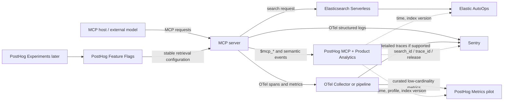

# PostHog, MCP and Elasticsearch Serverless Observability Plan

**Decision record and implementation guide**  
**Date:** 20 July 2026  
**Status:** Recommended target architecture  
**Scope:** An MCP application with a small or insignificant UI, an MCP server exposing tools and resources, an Elasticsearch Serverless deployment backing search, OpenTelemetry instrumentation, and Sentry as the general-purpose structured-log and diagnostic destination.

---

## Executive decision

Use PostHog to add the two kinds of visibility that are not already well covered by the existing stack:

1. **MCP protocol and capability analytics:** what clients and agents discover, call, read, abandon and struggle to use.
2. **Product and search-behaviour analytics:** whether searches return usable results, whether returned resources are subsequently consumed, which retrieval configurations perform best, and how behaviour changes by client, release and tenant.

Keep the existing systems authoritative for the concerns they already serve well:

- **Sentry remains the system of record for detailed structured logs, request investigation, operational diagnostics and errors.**
- **Elastic AutoOps remains the system of record for the health, utilisation and internal behaviour of the Elasticsearch Serverless project.**
- **OpenTelemetry remains the instrumentation standard and correlation substrate.**

Add only a curated subset of application and Elasticsearch-boundary metrics to **PostHog Metrics** as a pilot. This creates useful correlation between product behaviour and performance without duplicating the complete operational telemetry stream.

Do **not** add PostHog AI Observability. The MCP server does not call a model, choose a model, own prompts or generations, incur token costs, run an agent loop or make autonomous decisions. AI Observability would therefore describe a system that does not exist inside this service. A vector or semantic search can be represented as an AI span when it is a step inside an LLM trace, but an isolated search service without the surrounding generation is not a complete AI trace and should remain ordinary search and application telemetry.

### Decision summary

| Offering or practice | Decision | Rationale |
|---|---:|---|
| PostHog MCP Analytics | **Adopt now** | Adds protocol-level tool, resource, client, session, latency, error and capability insight. |
| PostHog Product Analytics, HogQL, dashboards and alerts | **Adopt now** | Adds behavioural funnels, retention-like usage analysis, release comparisons and search-usefulness proxies. |
| Privacy-safe identity and correlation contract | **Adopt now** | Required to join MCP events, search events, Sentry logs, OTel spans and releases without collecting content. |
| Elastic AutoOps | **Use as canonical Elastic deployment view** | Native to Serverless; provides project/index performance, recommendations, resource usage and billing dimensions. |
| OTel spans and metrics at the Elasticsearch boundary | **Adopt now** | Measures what the MCP service actually experiences and enables request-level diagnosis. |
| PostHog Metrics | **Pilot with a curated metric allow-list** | Useful for product/performance correlation, but currently alpha and should not be the sole SLO or paging system. |
| PostHog Feature Flags | **Adopt when the first controlled search change is ready** | Suitable for retrieval profiles, result formats, tool descriptions and safe rollout/rollback. |
| PostHog Experiments | **Adopt later** | Valuable only after traffic, assignment and outcome proxies are trustworthy. |
| Agent-intent capture | **Canary** | Potentially valuable, but agent-reported, schema-changing and privacy-sensitive. |
| Missing-capability reporting | **Canary later** | Valuable product discovery, but adds a model-visible virtual tool and needs an owner and triage process. |
| PostHog Logs | **Do not add initially** | Duplicates Sentry's general log role, storage, access model and query surface. |
| PostHog Error Tracking | **Do not add** | Duplicates Sentry issue ownership and operational workflow. |
| PostHog Distributed Tracing | **Do not add initially** | General tracing is alpha and would duplicate the existing OTel/Sentry path; revisit only for proven cross-product navigation value. |
| PostHog AI Observability | **Do not add** | No LLM calls, generations, model choices, token costs or agent decisions occur in the MCP server. |
| Session Replay, Web Analytics and Surveys | **Do not add** | There is no meaningful browser journey or dependable user-facing UI surface. |
| PostHog Elasticsearch warehouse source for monitoring | **Do not use** | It imports index documents by full refresh; it is not an Elasticsearch deployment-monitoring connector. |
| PostHog Sentry warehouse source as a log bridge | **Do not use for logs** | Its documented tables cover Sentry projects, issues, releases and related entities, not Sentry Logs. |
| PostHog conversation-ID injection | **Leave disabled** | Agent-controlled, visible to the agent and unnecessary when first-party IDs already provide correlation. |
| Raw tool parameters, responses, search queries or resource content in PostHog | **Prohibit by default** | Unnecessary for aggregate insight and creates disproportionate privacy and governance risk. |

---

## 1. System context and observability goals

### 1.1 Current architecture

The system comprises:

- An MCP application with little or no significant interface behaviour to analyse.
- An MCP server exposing tools and resources.
- A search tool backed by Elasticsearch Serverless.
- OpenTelemetry instrumentation, currently used at least for logging.
- Sentry as a general-purpose destination for structured logs and diagnostics, not merely an exception tracker.
- No model calls or autonomous decision-making inside the MCP server.

The last point is architecturally important. The MCP server is a deterministic capability provider. An external MCP host or model may decide to call a tool, but that decision is made outside the server. The server receives a protocol request, performs defined application work and returns a result.

### 1.2 Questions the proposed stack should answer

The combined system should be able to answer questions in four classes.

#### Protocol and capability questions

- Which MCP clients and client versions connect?
- Which tools and resources are advertised?
- Which advertised tools are actually called?
- Which resources are listed and read?
- Where do calls fail or become slow?
- What sequences of calls occur in an interaction?
- What capabilities appear to be missing?

#### Search-product questions

- How often is search used?
- What proportion of searches return no results?
- What proportion of returned result resources are subsequently read?
- Which result ranks are selected?
- How often is a search immediately reformulated?
- How long does it take from search completion to resource consumption?
- Which retrieval profiles, index versions, server releases or client families correlate with better use?

#### Operational questions

- What is the client-observed Elasticsearch latency distribution?
- How does client-observed duration compare with Elasticsearch's server-reported `took` value?
- How often do searches time out, partially complete, retry, fail or report shard failures?
- Did an application release or retrieval configuration cause a latency or error regression?
- Is the Serverless project constrained, expensive, imbalanced or otherwise unhealthy?

#### Outcome questions

- Did the final user receive a useful answer?
- Did the host model interpret the resource correctly?
- Did a tool result improve final-answer quality?

The first three groups are observable from this architecture. The final group is **not fully observable from the MCP server alone**. A resource read is a useful behavioural proxy, but the host may read an irrelevant result, ignore the result, misinterpret it or produce an unsatisfactory final answer. Genuine end-user outcome measurement would require an explicit feedback or outcome signal from the host application or another authoritative downstream system.

---

## 2. Principle: one authoritative owner per telemetry concern

The design should avoid the common failure mode of sending every signal to every vendor. That increases cost, creates contradictory dashboards and makes incident ownership unclear.

| Concern | Authoritative system | PostHog role |
|---|---|---|
| MCP tool/resource usage | PostHog MCP Analytics | Primary |
| Product behaviour and search-usefulness proxies | PostHog Product Analytics | Primary |
| Detailed structured logs | Sentry | No duplicate ingestion initially |
| Errors and operational issue workflow | Sentry | Keep `$mcp_is_error` for behavioural analysis, but no duplicate issue system |
| Individual request execution | OTel traces in the established diagnostic backend | Correlate by IDs; do not require PostHog tracing initially |
| Application-observed Elasticsearch aggregate SLIs | OTel Metrics; selected export to PostHog Metrics | Secondary analytical view |
| Elasticsearch Serverless internals | Elastic AutoOps | Link behaviour to time/release/configuration; do not replace AutoOps |
| Feature rollout | PostHog Feature Flags | Primary once adopted |
| Controlled causal comparison | PostHog Experiments | Later |
| LLM generations, token cost and model quality | Outside this service | No PostHog AI Observability in the MCP server |

This division creates a useful investigative path:

1. PostHog shows that search-to-resource-consumption fell for a particular retrieval profile and client version.
2. PostHog Metrics shows an associated latency increase.
3. A shared trace, request or search identifier locates detailed Sentry logs and OTel spans.
4. Elastic AutoOps shows whether the Serverless project or affected index experienced an internal performance or resource event.

---

## 3. Target architecture



A text equivalent for renderers without Mermaid support:

```text
MCP host/model
    │
    │ MCP calls
    ▼
MCP server ───────────────► Elasticsearch Serverless
    │                              │
    │                              └──► Elastic AutoOps
    │
    ├──► PostHog MCP Analytics + Product Analytics
    ├──► OTel structured logs ───► Sentry
    └──► OTel metrics/spans ─────► existing telemetry pipeline
                                      └──► curated metrics ─► PostHog Metrics pilot

PostHog Feature Flags control stable search configurations.
PostHog Experiments are added only after metrics and traffic are mature.
```

---

## 4. Adopt PostHog MCP Analytics

PostHog MCP Analytics instruments MCP servers and emits ordinary PostHog events for initialisation, tool discovery, tool calls, resource listing and reading, prompt operations and errors. It also provides a dedicated MCP view with sessions, per-tool quality and intent clustering. The product and SDK are currently beta/`0.x`, so the exact package version should be pinned and the raw `$mcp_*` schema should not be treated as a permanent external reporting contract.

Primary documentation:

- [MCP Analytics overview](https://posthog.com/docs/mcp-analytics)
- [Getting started and installation](https://posthog.com/docs/mcp-analytics/start-here)
- [Event and property reference](https://posthog.com/docs/mcp-analytics/events)
- [Privacy and sanitisation](https://posthog.com/docs/mcp-analytics/privacy)

### 4.1 Events to retain

The automatically generated events that matter most are:

| Event | Value to this system |
|---|---|
| `$mcp_initialize` | Client/server name and version adoption. |
| `$mcp_tools_list` | Which tools were advertised to a client. |
| `$mcp_tool_call` | Tool use, latency, error state and optionally agent intent. |
| `$mcp_resources_list` | Resource discovery activity. |
| `$mcp_resource_read` | Resource consumption, including result-resource reads. |
| `$mcp_missing_capability` | Unmet demand when the optional virtual tool is enabled. |

The MCP SDK can also emit `$exception` events. Disable this sibling exception capture because Sentry already owns detailed exception capture and issue workflow. Retain the error state on `$mcp_tool_call`; it is valuable for behavioural breakdowns without creating a second issue tracker.

### 4.2 Baseline configuration

The initial production configuration should be privacy conservative and behaviourally neutral:

```ts
import { PostHog } from "posthog-node"
import { instrument } from "@posthog/mcp"

const posthog = new PostHog(process.env.POSTHOG_PROJECT_API_KEY!, {
  // Select the host that matches the PostHog project region.
  host: process.env.POSTHOG_HOST ?? "https://eu.i.posthog.com",
})

const analytics = instrument(server, posthog, {
  // Sentry remains the exception and issue system of record.
  enableExceptionAutocapture: false,

  // Baseline does not alter every tool schema with an intent field.
  // A controlled intent pilot is described later in this report.
  context: false,

  // Do not ask the agent to echo a PostHog-created conversation ID.
  enableConversationId: false,

  // Do not add a new model-visible virtual tool until a canary is approved.
  reportMissing: false,

  identify: async (request, extra) => {
    const principal = await resolveAuthenticatedPrincipal(request, extra)

    if (!principal) {
      return null
    }

    return {
      // Use a stable pseudonymous identifier that the service genuinely knows.
      distinctId: principal.analyticsSubjectId,
      groups: principal.organisationId
        ? { organisation: principal.organisationId }
        : undefined,
      properties: {
        integration_type: principal.integrationType,
      },
    }
  },

  eventProperties: async (_request, extra) => ({
    environment: process.env.DEPLOYMENT_ENV ?? "unknown",
    deployment_sha: process.env.GIT_SHA ?? "unknown",
    server_version: process.env.SERVICE_VERSION ?? "unknown",
    request_id: readRequestId(extra),
    trace_id: readCurrentTraceId(),
  }),

  beforeSend: event => {
    const properties = event.properties

    if (properties) {
      // PostHog's sanitizer is a safety net, not the project's data policy.
      delete properties.$mcp_parameters
      delete properties.$mcp_response

      // Keep raw intent out of the baseline. A privacy-reviewed pilot can
      // selectively retain or transform it for an allow-listed cohort.
      delete properties.$mcp_intent
    }

    return event
  },
})

async function shutdown(): Promise<void> {
  await posthog.shutdown()
}

process.once("SIGTERM", () => void shutdown())
process.once("SIGINT", () => void shutdown())
```

Use an exact tested package version rather than an open range, for example:

```bash
npm install --save-exact @posthog/mcp@<tested-version> posthog-node@<tested-version>
```

The installation documentation also describes lifecycle requirements for long-running, serverless and edge runtimes. The service must flush or shut down the PostHog client appropriately so short-lived invocations do not lose events: [MCP Analytics installation](https://posthog.com/docs/mcp-analytics/installation).

### 4.3 Identity rules

PostHog's MCP SDK attributes events first to an identity returned by the `identify` callback, then to the MCP session ID and finally to an anonymous identifier. Anonymous sessions are sent without creating a person profile. See [Identifying users](https://posthog.com/docs/mcp-analytics/identifying-users).

Adopt these rules:

1. Use a stable pseudonymous person or integration ID only when the server actually knows it.
2. Use an organisation or tenant group when legitimately known.
3. Where the server knows only an API consumer or host integration, identify that integration—not a guessed end user.
4. Do not use generic identifiers such as `system`, `backend` or `anonymous-user`, which can merge unrelated activity.
5. Do not make protocol session IDs the durable business key.

The last point also protects against protocol evolution. MCP's standards-track work now includes a sessionless model based on explicit state handles. This is future-facing and may not describe every deployed client today, but it reinforces the need for first-party identity and correlation IDs rather than business logic tied to transport sessions: [SEP-2567: Sessionless MCP via Explicit State Handles](https://modelcontextprotocol.io/seps/2567-sessionless-mcp).

---

## 5. Add a small semantic search event model

The built-in `$mcp_tool_call` event says that a search tool was invoked. It does not by itself describe the search outcome in a stable, domain-specific form, nor does it prove that a returned result was used.

Add only the events needed to bridge that gap. Avoid duplicating every detail already available in `$mcp_tool_call`, Sentry logs or OTel spans.

### 5.1 Recommended events

#### `mcp:search_execute`

Emit once for each **logical search**, after all retries are complete and the final response has been classified.

Recommended properties:

| Property | Type | Purpose |
|---|---|---|
| `search_id` | opaque string | Correlates the search with later result-resource reads and diagnostic telemetry. |
| `trace_id` | string | Joins to OTel/Sentry request data. |
| `request_id` | string | Operational correlation where already available. |
| `tool_name` | bounded string | Distinguishes search tools without relying solely on the provisional `$mcp_*` schema. |
| `outcome` | enum | `ok`, `zero_results`, `partial`, `timeout`, `error`. |
| `result_count` | integer | Number of results returned to the MCP caller. |
| `is_zero_result` | boolean | Convenient stable dimension. |
| `is_timed_out` | boolean | Elasticsearch response status. |
| `failed_shard_count` | integer | Elasticsearch `_shards.failed`. |
| `retry_count` | integer | Number of client retries before the final outcome. |
| `application_duration_ms` | number | End-to-end duration observed by the MCP service. |
| `elasticsearch_took_ms` | number | Elasticsearch server-reported `took`. |
| `retrieval_profile` | bounded string | Effective search configuration, not merely a flag key. |
| `index_version` | bounded string | Corpus/index release identifier. |
| `server_version` | string | MCP server release. |
| `deployment_sha` | string | Exact deployment correlation. |
| `client_family` | bounded string | Coarse MCP client family when available. |
| `client_version` | string | Client compatibility and regression analysis. |
| `filter_count` | integer | Number of structured filters, not their values. |
| `is_fallback` | boolean | Whether a fallback retrieval path was used. |

Do not attach the raw query, raw filter values, document text, result bodies, authentication material or full resource URIs.

#### `mcp:search_result_consume`

Emit when a resource produced by a search result is subsequently read.

Recommended properties:

| Property | Type | Purpose |
|---|---|---|
| `search_id` | opaque string | Links back to `mcp:search_execute`. |
| `result_id` | opaque string | Identifies the returned item without exposing content. |
| `selected_rank` | integer | Online usefulness proxy. |
| `resource_type` | bounded string | Category of consumed resource. |
| `time_since_search_ms` | number | Friction and sequence analysis. |
| `retrieval_profile` | bounded string | Links consumption to effective search configuration. |
| `index_version` | bounded string | Links consumption to corpus/index release. |
| `trace_id` | string | Correlates the read with request telemetry. |

A resource read should not automatically be called a success. It is a **consumption event** and a useful proxy, not proof of final-answer quality.

#### `mcp:outcome_observe` — only when authoritative

Introduce this event only if the host application or a downstream service can report a meaningful outcome such as accepted answer, completed workflow, explicit feedback or verified task completion. Do not manufacture an outcome from a tool call, a successful HTTP status or a resource read.

### 5.2 Events that should be derived, not emitted

Derive these analytically from the two core semantic events:

- **Search abandonment:** no associated result consumption within a defined window.
- **Reformulation:** another search occurs before any result from the previous search is consumed.
- **Correction loop:** repeated searches or alternative tool calls before resource consumption.
- **Search-to-resource conversion:** a search has at least one associated result consumption.
- **Time to first consumption:** minimum time from search completion to result-resource read.

This avoids event proliferation and makes definitions amendable without redeploying the application.

### 5.3 Correlating search results with resource reads

A reliable correlation scheme is essential.

1. Generate an opaque `search_id` before executing the search.
2. Assign each returned item an opaque `result_id` and rank.
3. Return resource references that resolve server-side to `search_id`, `result_id`, rank and content locator.
4. Do not encode the raw query, document title or personal data in the resource URI.
5. On `resources/read`, resolve the opaque reference and emit `mcp:search_result_consume`.
6. Continue to emit the ordinary `$mcp_resource_read` event through MCP Analytics.

A simple conceptual resource URI is:

```text
mcp-resource://search-result/<opaque-result-token>
```

The token should resolve server-side to the correlation metadata. It should not be a base64-encoded copy of sensitive fields.

### 5.4 Example semantic capture

```ts
async function executeSearch(input: SearchInput): Promise<SearchOutput> {
  const searchId = crypto.randomUUID()
  const startedAt = performance.now()

  try {
    const response = await runElasticsearchSearch(input, searchId)
    const durationMs = performance.now() - startedAt
    const outcome = classifySearchOutcome(response)

    analytics.capture({
      event: "mcp:search_execute",
      properties: {
        search_id: searchId,
        trace_id: readCurrentTraceId(),
        request_id: readCurrentRequestId(),
        tool_name: "search",
        outcome,
        result_count: response.results.length,
        is_zero_result: response.results.length === 0,
        is_timed_out: response.timedOut,
        failed_shard_count: response.failedShardCount,
        retry_count: response.retryCount,
        application_duration_ms: durationMs,
        elasticsearch_took_ms: response.tookMs,
        retrieval_profile: response.retrievalProfile,
        index_version: response.indexVersion,
        server_version: process.env.SERVICE_VERSION,
        deployment_sha: process.env.GIT_SHA,
        is_fallback: response.usedFallback,
      },
    })

    return createResourceBackedSearchOutput(response, searchId)
  } catch (error) {
    const durationMs = performance.now() - startedAt

    analytics.capture({
      event: "mcp:search_execute",
      properties: {
        search_id: searchId,
        trace_id: readCurrentTraceId(),
        request_id: readCurrentRequestId(),
        tool_name: "search",
        outcome: "error",
        result_count: 0,
        is_zero_result: false,
        is_timed_out: isTimeout(error),
        failed_shard_count: readFailedShardCount(error),
        retry_count: readRetryCount(error),
        application_duration_ms: durationMs,
        retrieval_profile: currentRetrievalProfile(),
        index_version: currentIndexVersion(),
        server_version: process.env.SERVICE_VERSION,
        deployment_sha: process.env.GIT_SHA,
      },
    })

    throw error
  }
}
```

Production code should make analytics capture non-blocking and failure-isolated: telemetry failure must never fail the MCP tool.

---

## 6. Instrument the Elasticsearch boundary with OpenTelemetry

PostHog should not be used to infer Elasticsearch behaviour solely from MCP tool duration. Instrument the actual dependency boundary.

OpenTelemetry deliberately treats traces, metrics and logs as complementary signals:

- [OpenTelemetry signals](https://opentelemetry.io/docs/concepts/signals/)
- [OpenTelemetry metrics](https://opentelemetry.io/docs/concepts/signals/metrics/)
- [OpenTelemetry Collector](https://opentelemetry.io/docs/collector/)

### 6.1 Spans for individual request diagnosis

Create a client span around each logical Elasticsearch operation. Follow the database semantic conventions where supported:

- Span kind: `CLIENT`.
- `db.system.name = "elasticsearch"`.
- `db.operation.name = "search"`.
- A bounded collection, alias or logical index identifier when safe.
- Status and exception recording based on the final result.

The Elasticsearch-specific semantic conventions are still marked development, so version the instrumentation library and avoid depending on every attribute as a permanent contract:

- [OpenTelemetry database client spans](https://opentelemetry.io/docs/specs/semconv/db/database-spans/)
- [OpenTelemetry Elasticsearch semantic conventions](https://opentelemetry.io/docs/specs/semconv/db/elasticsearch/)

Recommended custom span attributes after the response is available:

```text
mcp.search.id
mcp.search.retrieval_profile
mcp.search.result_count
elasticsearch.response.took_ms
elasticsearch.response.timed_out
elasticsearch.response.failed_shards
elasticsearch.client.retry_count
```

Keep raw query text out of spans unless a separately reviewed sanitizer proves it safe. The OTel database conventions explicitly require sanitisation before collecting database query text.

### 6.2 Trace propagation to Elasticsearch

Use the W3C `traceparent` header for unique per-request tracing. Elasticsearch surfaces the trace ID in supported server, slow and deprecation logs.

Use `X-Opaque-Id` only for a **bounded origin label**, not as a unique request identifier. Elastic warns that a unique `X-Opaque-Id` per request can undermine log deduplication. Suitable examples are:

```text
mcp-search
mcp-search/hybrid-v3
mcp-resource-read
```

The official behaviour and constraints are documented in [Elasticsearch API conventions](https://www.elastic.co/docs/reference/elasticsearch/rest-apis/api-conventions).

This corrects a tempting but unsafe design: a request UUID belongs in `traceparent`, application logs and product events—not in an unbounded `X-Opaque-Id` value.

### 6.3 Compare client duration with Elasticsearch `took`

The search API's `took` field measures elapsed time from receipt on the coordinating node until the node is ready to send the response. It includes inter-node communication, queue time and execution time. It excludes sending the request to Elasticsearch, JSON response serialisation and sending the response to the client. See [Elasticsearch search API response fields](https://www.elastic.co/docs/api/doc/elasticsearch/operation/operation-search).

Capture both:

- `application_duration_ms`: the duration observed around the Elasticsearch client call or entire search operation.
- `elasticsearch_took_ms`: the response's `took` value.

The difference is useful but should not be labelled simply as “network latency”. Depending on the measurement boundary, it can also include client-side queuing, connection-pool waits, retries, deserialisation, application wrapping and response transformation.

### 6.4 Capture partial and timeout states

A successful HTTP response does not necessarily mean a complete search. Capture:

- `timed_out`.
- `_shards.failed`.
- Partial-result policy.
- Retry count.
- Final error category.

Elasticsearch documents that timed-out results may be partial or empty. Treat `partial` as its own outcome rather than silently merging it into `ok`.

### 6.5 Use the Profile API only on demand

Elasticsearch's search Profile API introduces non-negligible overhead and can disable optimisations. It is a diagnostic tool, not continuous production instrumentation. Use it for controlled investigation of representative queries, not every search: [Profile search requests](https://www.elastic.co/docs/reference/elasticsearch/rest-apis/search-profile).

---

## 7. Add a curated PostHog Metrics pilot

PostHog Metrics accepts standard OTLP metrics and is designed for application and infrastructure measurements. It is currently alpha, so use it as an analytical correlation surface—not as the sole SLO, paging or incident system.

Primary documentation:

- [PostHog Metrics](https://posthog.com/docs/metrics)
- [PostHog Metrics architecture and series model](https://posthog.com/docs/metrics/architecture)

### 7.1 Why metrics add value despite existing logs

A detailed log tells you what happened to one request. A histogram tells you that p95 latency for one retrieval profile changed across thousands of requests. Product events tell you which sessions or integrations were affected and what they did afterwards.

The useful combination is:

- **Metrics:** aggregate rate and distribution.
- **Product events:** behaviour, identity and sequence.
- **Logs/traces:** individual diagnosis.
- **AutoOps:** Elasticsearch internal health and utilisation.

### 7.2 Recommended metrics

Start with a minimal allow-list. Do not duplicate metrics already emitted automatically by existing HTTP or Elasticsearch instrumentation unless the domain metric has a clearer definition.

| Metric | Type | Unit | Notes |
|---|---|---|---|
| `mcp.search.requests` | Counter | `{request}` | Add bounded `outcome` dimension. |
| `mcp.search.duration` | Histogram | `ms` | End-to-end logical search duration after retries. |
| `mcp.search.results` | Histogram | `{result}` | Result-count distribution. |
| `elasticsearch.search.duration` | Histogram | `ms` | Client-observed dependency-call duration. |
| `elasticsearch.search.took` | Histogram | `ms` | Server-reported Elasticsearch `took`. |
| `elasticsearch.search.retries` | Counter | `{retry}` | Increment per retry. |
| `elasticsearch.search.shard_failures` | Counter | `{failure}` | Add failed-shard count. |
| `elasticsearch.search.response_size` | Histogram | `By` | Optional; useful for response-size regressions. |

Recommended bounded attributes:

```text
deployment.environment
service.name
mcp.tool.name
retrieval.profile
outcome
client.family
region
```

Potentially bounded but subject to a cardinality budget:

```text
server.version
index.version
release.channel
```

Never use these as metric attributes:

```text
user_id
organisation_id
session_id
request_id
trace_id
search_id
raw_query
resource_uri
result_id
document_id
```

A PostHog metric series is identified by the metric name, type, service name and full attribute set. OpenTelemetry likewise retains aggregation state for every distinct attribute combination. High-cardinality values therefore create cost and memory risk even at modest request volume. OpenTelemetry documents a default cardinality limit of 2,000 combinations per metric stream and explains the danger of identifiers and raw paths: [OpenTelemetry metric cardinality](https://opentelemetry.io/docs/concepts/signals/metrics/).

### 7.3 Collector fan-out

Keep the current Sentry log pipeline intact. Add a separate metrics pipeline that filters to the curated metric names before exporting to PostHog. The OTel Collector supports multiple pipelines and exporters: [Collector architecture](https://opentelemetry.io/docs/collector/architecture/) and [Collector configuration](https://opentelemetry.io/docs/collector/configuration/).

Illustrative configuration:

```yaml
exporters:
  otlphttp/posthog_metrics:
    metrics_endpoint: https://eu.i.posthog.com/i/v1/metrics
    headers:
      Authorization: "Bearer ${env:POSTHOG_PROJECT_API_KEY}"

processors:
  filter/posthog_metrics:
    error_mode: ignore
    metrics:
      metric:
        - 'not IsMatch(name, "^(mcp\\.search|elasticsearch\\.search)\\.")'

  batch/posthog_metrics: {}

service:
  pipelines:
    metrics/posthog:
      receivers: [otlp]
      processors: [filter/posthog_metrics, batch/posthog_metrics]
      exporters: [otlphttp/posthog_metrics]
```

Validate the exact filter syntax and component availability against the deployed Collector distribution and version before rollout. Select the US or EU PostHog endpoint that matches the project region.

### 7.4 Pilot success criteria

Continue the PostHog Metrics export only if it demonstrably provides at least one of these benefits:

- A product dashboard can correlate search conversion with latency or error rate without manual cross-system work.
- A release or retrieval-profile regression is found materially faster.
- Product and engineering stakeholders use the shared dashboard regularly.
- The series count and ingestion cost remain within the agreed budget.

If not, keep metrics in the operational telemetry backend and retain only product events in PostHog.

---

## 8. Use Elastic AutoOps as the canonical Serverless deployment view

Elastic AutoOps is automatically available for supported Elastic Cloud Serverless projects. It analyses Elasticsearch metrics, provides root-cause guidance, and offers project- and index-level performance views, curated dashboards, resource-utilisation insight and Serverless billing dimensions. Stack Monitoring is not available for Serverless because Elastic manages the underlying project infrastructure.

Primary documentation:

- [AutoOps overview](https://www.elastic.co/docs/deploy-manage/monitor/autoops)
- [AutoOps for Elastic Cloud Serverless](https://www.elastic.co/docs/deploy-manage/monitor/autoops/autoops-for-serverless)
- [Access AutoOps for Serverless](https://www.elastic.co/docs/deploy-manage/monitor/autoops/access-autoops-for-serverless)
- [AutoOps and Stack Monitoring comparison](https://www.elastic.co/docs/deploy-manage/monitor/autoops-vs-stack-monitoring)

### 8.1 What AutoOps should own

- Project- and index-level Elasticsearch performance.
- Search and indexing latency inside Elasticsearch.
- Search/index queues and rejections.
- CPU, memory, disk and resource pressure where exposed.
- Shard, index and mapping recommendations.
- Serverless search, ingest and machine-learning VCU usage.
- Elastic-generated events, recommendations and resolution paths.

AutoOps currently retains data for ten days and monitors Elasticsearch rather than the entire surrounding application. This makes it complementary to, not a replacement for, longer-lived application metrics and product analytics.

### 8.2 What application telemetry should own

- The latency observed by the MCP service.
- Connection-pool waits and retries.
- Client-side timeout policy.
- Result count and zero-result rate.
- The effective retrieval configuration.
- Whether returned results are subsequently consumed.
- Release, client and tenant impact.

A healthy AutoOps view does not prove that the application is using Elasticsearch effectively. Conversely, a slow application request may include substantial work outside Elasticsearch.

### 8.3 Operating review

Establish a recurring review that compares:

- AutoOps project/index events.
- PostHog search conversion and zero-result trends.
- PostHog/OTel latency histograms.
- Sentry log anomalies and retries.
- Deployment, index and retrieval-profile changes.

The review should answer whether a movement is caused by:

1. A change in demand or client mix.
2. A change in retrieval configuration.
3. A corpus/index release.
4. An application release.
5. Elasticsearch internal behaviour or resource usage.
6. A data-quality or relevance problem rather than a performance problem.

---

## 9. Keep Sentry as the general log and diagnostic destination

The existing architecture already routes structured telemetry to Sentry. Preserve that ownership rather than duplicating the entire stream into PostHog Logs.

### 9.1 Recommended wide request log

For each logical search, emit one structured completion record in addition to any necessary exception or retry records. Suggested fields:

```text
service.name
service.version
deployment.environment
deployment.sha
request_id
trace_id
search_id
mcp.tool.name
mcp.client.family
mcp.client.version
retrieval.profile
index.version
outcome
result_count
is_timed_out
failed_shard_count
retry_count
application_duration_ms
elasticsearch_took_ms
is_fallback
```

Do not include raw search text, resource content or result bodies by default. If operational diagnosis genuinely requires a query representation, use a separately governed, irreversible classification or fingerprint rather than copying user content.

### 9.2 Correlation contract

| Identifier | Product events | Logs | Traces | Metrics | Notes |
|---|---:|---:|---:|---:|---|
| `trace_id` | Yes | Yes | Native | No | Per-request correlation. |
| `request_id` | Yes | Yes | Optional attribute | No | Useful across gateways and application logs. |
| `search_id` | Yes | Yes | Span attribute | No | Links search to result consumption. |
| `deployment_sha` | Yes | Yes | Resource/span attribute | Bounded resource attribute | Release diagnosis. |
| `retrieval_profile` | Yes | Yes | Span attribute | Yes, bounded | Behaviour/performance comparison. |
| `index_version` | Yes | Yes | Span attribute | Only if cardinality-controlled | Corpus release analysis. |
| Person/tenant ID | Pseudonymous where lawful | Governed | Avoid unless necessary | Never | Do not create metric cardinality. |

### 9.3 Why not PostHog Logs now

PostHog Logs is an OTLP log backend whose main differentiator is direct correlation with PostHog events and users: [PostHog Logs](https://posthog.com/docs/logs).

That benefit does not currently outweigh:

- Duplicate ingestion and storage.
- A second log query language and saved-view system.
- Divergent retention and access controls.
- Conflicting alert ownership.
- More places in which sensitive data must be scrubbed.

Revisit only if a measured investigation workflow shows that direct navigation from a PostHog behavioural anomaly to a small, sampled set of colocated logs materially reduces diagnosis time. If revisited, fan out a sampled or curated stream—not the complete Sentry feed.

### 9.4 Why the PostHog Sentry source is not a log bridge

PostHog's Sentry warehouse source can import documented Sentry entities such as projects, releases, environments, monitors, issues and issue events. Its documented tables do not include Sentry Logs: [Linking Sentry as a source](https://posthog.com/docs/data-warehouse/sources/sentry).

It may later help answer release- or issue-impact questions in HogQL. It should not be selected on the assumption that it makes Sentry's general log data available in PostHog.

---

## 10. Explicitly do not add PostHog AI Observability

This is a firm architectural decision, not merely a scheduling choice.

PostHog describes AI Observability as capturing traces, generations and spans from AI and LLM products. A generation represents an LLM request and response, with model, provider, inputs, outputs, tokens, latency and cost. See:

- [PostHog AI Observability](https://posthog.com/docs/ai-observability)
- [AI Observability basics](https://posthog.com/docs/ai-observability/basics)
- [Generations](https://posthog.com/docs/ai-observability/generations)
- [AI spans](https://posthog.com/docs/ai-observability/spans)

The MCP server in scope:

- Does not call an LLM.
- Does not choose a provider or model.
- Does not own or version prompts.
- Does not receive a model generation as its output.
- Does not consume model tokens or incur token-based model cost.
- Does not run an agent loop.
- Does not decide which tool to call.
- Does not judge or transform a final answer.

Although PostHog's AI span model can represent vector searches or tool calls, those spans are defined as units within an LLM trace and require an AI trace context. Creating an isolated `$ai_span` for Elasticsearch search would produce an incomplete trace whose actual model generation, decision path and final result are absent. It would also duplicate an ordinary OTel dependency span.

Therefore do not add:

- `@posthog/ai` or equivalent wrappers.
- `$ai_generation`, `$ai_trace` or `$ai_span` events.
- AI cost tracking.
- Prompt management.
- AI evaluations over nonexistent generations.
- LLM-based intent fallback merely to enrich analytics.

Reconsider this only if the MCP server itself later adds one of these responsibilities:

- LLM query rewriting.
- Model-based reranking.
- Generative summarisation.
- LLM classification.
- Agentic tool orchestration.
- Model-based evaluation.

Even then, instrument only the model-owning component. Do not infer the external host's model behaviour from MCP calls.

---

## 11. Agent intent: valuable, but canary it

PostHog MCP Analytics can inject a required `context` field into every tool's input schema. The agent is asked to describe the user's underlying goal, and the SDK removes the field before invoking the actual handler. The value becomes `$mcp_intent`. See [Capturing agent intent](https://posthog.com/docs/mcp-analytics/intent).

### 11.1 Benefits

- Groups tool calls by purpose rather than only by tool name.
- Reveals when one tool is used for several unexpected jobs.
- Helps interpret repeated searches or correction loops.
- Supports capability planning.

### 11.2 Risks

- It changes every advertised tool schema.
- Clients may not populate it consistently.
- Agent-written text can include names, identifiers, quoted content or raw search terms.
- It is agent-reported interpretation, not authoritative user intent.
- It can increase payload size and potentially affect tool selection.

### 11.3 Recommended pilot

1. Keep `context: false` in the baseline.
2. Enable it for an allow-listed client family or small release cohort.
3. Use a privacy-specific description:

```ts
context: {
  description:
    "Describe the high-level user goal without names, email addresses, identifiers, quoted source content, or full search terms.",
}
```

4. Apply a `beforeSend` transformation that maps raw text to an approved category where possible, or samples raw intent only into a restricted project/property.
5. Measure tool-schema compatibility and completion coverage.
6. Compare call selection, error rate and latency with the baseline.
7. Do not add an LLM-based `intentFallback`. That would introduce a model call into a service whose deliberate architecture has none.

Treat intent as untrusted text. Never use it for authorisation, auditing, policy enforcement or user-impact claims.

---

## 12. Missing-capability reporting: useful only with a feedback loop

With `reportMissing: true`, the MCP SDK adds a model-visible virtual tool named `get_more_tools`. When called, it emits `$mcp_missing_capability` with agent-supplied reasoning: [Tracking missing capabilities](https://posthog.com/docs/mcp-analytics/missing-capability).

This can reveal unmet demand that ordinary tool telemetry cannot see, but it changes the advertised tool surface and depends on clients using the tool appropriately.

Enable it only when all of the following are true:

- A named product/engineering owner reviews the feed.
- There is a regular triage cadence.
- Requests are classified into duplicate, unsupported, already-supported-but-undiscovered and genuinely missing.
- The team can update tool descriptions, resources or capabilities in response.
- Privacy handling for free text is approved.

Canary by client version before broad rollout. Keep it disabled if it produces noise without action.

---

## 13. Feature Flags for controlled search changes

PostHog Feature Flags are a good fit for server-side configuration changes whose impact can be measured through the same analytics project.

Suitable flag-controlled changes include:

- Lexical, semantic or hybrid retrieval profiles.
- RRF weights and retriever combinations.
- Reranking strategy.
- Result count and result truncation.
- Metadata-rich versus concise result representations.
- Resource-link format.
- Tool descriptions or schemas.
- Fallback behaviour.
- A new search tool or resource type.
- An emergency kill switch for an expensive or degraded path.

Current best-practice guidance is documented in [Feature flag best practices](https://posthog.com/docs/feature-flags/best-practices).

### 13.1 Evaluation rules

- Resolve identity before evaluation when targeting depends on user, organisation or integration.
- Evaluate on the server where the relevant context exists.
- Prefer local evaluation on the hot path where supported.
- Evaluate once for the chosen stable assignment boundary.
- Keep the value stable throughout an MCP interaction or integration session.
- Define a safe deterministic default if flag evaluation is unavailable.
- Remove stale flags once rollout is complete.

### 13.2 Record the effective configuration

Do not record only:

```text
flag search-v4 = true
```

Record:

```text
retrieval_profile = hybrid_rrf_v4
result_format = resources_v2
```

The effective configuration remains intelligible after the temporary flag is deleted and supports both PostHog events and OTel metric breakdowns.

---

## 14. Experiments only after metric maturity

PostHog Experiments can compare retrieval profiles, tool descriptions and result formats, but experimentation should come after the data contract is trusted: [PostHog Experiments](https://posthog.com/docs/experiments).

### 14.1 Preconditions

- `mcp:search_execute` is complete and reconciles with operational logs.
- `mcp:search_result_consume` has high correlation coverage.
- Identity and assignment are stable.
- Traffic is sufficient for the chosen effect size.
- The treatment does not change mid-interaction.
- The team accepts that resource consumption is a proxy, not final-answer quality.

### 14.2 Assignment unit

Use, in descending preference depending on the product model:

1. Organisation/tenant.
2. Authenticated integration or API consumer.
3. Stable person.
4. MCP interaction/session when nothing more durable exists.

Do not randomise each query. Per-query assignment exposes the same agent to inconsistent tool behaviour and contaminates both user experience and causal interpretation.

### 14.3 Suggested metrics

Primary:

- Search-to-result-resource-consumption conversion.

Secondary:

- Time to first consumption.
- Selected-rank distribution.
- Repeat-search/reformulation rate.
- Consumed resources per search.

Guardrails:

- p95/p99 logical search duration.
- Elasticsearch timeout and partial-result rate.
- Tool error rate.
- Zero-result rate.
- Retry rate.

For low-volume systems, offline relevance evaluation and staged rollout are often more informative than an underpowered A/B test.

---

## 15. Offline retrieval evaluation remains necessary

Online resource consumption is useful but cannot establish relevance on its own. Maintain a representative evaluation set and compute deterministic retrieval measures such as:

- Recall@k.
- Precision@k.
- Mean Reciprocal Rank.
- NDCG@k.
- Zero-result rate on known-answer queries.
- Latency and response-size distributions.

Version each run by:

```text
evaluation_set_version
retrieval_profile
index_version
server_version
run_timestamp
```

Use the same `retrieval_profile` and `index_version` values in online PostHog events. This enables comparison between offline relevance evidence and real usage.

### Optional PostHog ingestion

A small `mcp:search_evaluation_run` event or a compact warehouse table can make evaluation results visible alongside online behaviour. Do not emit one PostHog event per judged document unless there is a clear analytical need.

PostHog has an Elasticsearch warehouse source, but it is alpha and performs a full refresh by rereading the selected index each sync. It imports index documents; it does not monitor the Elasticsearch deployment: [Linking Elasticsearch as a source](https://posthog.com/docs/data-warehouse/sources/elasticsearch).

If used at all, connect only a small purpose-built evaluation index—not the production content/search indices.

---

## 16. Dashboards and analytical definitions

### 16.1 MCP adoption dashboard

Include:

- Initialisations by MCP client and version.
- Active anonymous sessions, identified integrations and organisations.
- Tool calls by tool/client/version.
- Advertised-versus-called tools.
- Resource list and read volume.
- Tool error rate.
- p50, p95 and p99 tool duration.
- Server version and deployment breakdown.

### 16.2 Search usefulness dashboard

Include:

- Logical search volume.
- Unique integrations/organisations using search.
- Zero-result rate.
- Partial and timeout rate.
- Search-to-result-consumption conversion.
- Time to first result consumption.
- Selected-rank distribution.
- Reformulation rate.
- Searches per consumed result.
- Breakdown by retrieval profile, index version, server version and client family.

Recommended definitions:

```text
Search-to-consumption conversion
= unique search_id values with >= 1 result-consume event
  / unique search_id values with a completed search event
```

```text
Reformulation rate
= searches followed by another search before any associated result is consumed
  / completed searches
```

```text
Zero-result rate
= search events where outcome = zero_results
  / all completed logical search events
```

Use a documented consumption window appropriate to the MCP host behaviour and test sensitivity to that window.

### 16.3 Elasticsearch dependency dashboard

Include:

- Client-observed search duration p50/p95/p99.
- Elasticsearch `took` p50/p95/p99.
- Difference between the two distributions.
- Retry rate.
- Timeout rate.
- Partial-result rate.
- Failed-shard rate.
- Response-size distribution.
- Breakdown by retrieval profile and release.

Do not label the duration difference as pure network latency.

### 16.4 Release and configuration dashboard

Break down core behavioural and performance measures by:

- `deployment_sha`.
- `server_version`.
- `index_version`.
- `retrieval_profile`.
- `client_family` and `client_version`.
- Environment and region.

This dashboard should answer “what changed?” before an engineer opens logs.

### 16.5 Capability dashboard

Once canaries are enabled:

- Intent-category distribution.
- Tool-by-intent matrix.
- Intent coverage rate.
- Advertised but unused tools.
- Missing-capability clusters.
- Missing asks that are actually discoverability failures.

PostHog dashboards are intended for recurring metric tracking: [PostHog dashboards](https://posthog.com/docs/product-analytics/dashboards).

---

## 17. Alerts and ownership

PostHog supports threshold and anomaly alerts on trends, funnels and HogQL insights: [PostHog alerts](https://posthog.com/docs/alerts).

Recommended PostHog alerts:

- Search-to-consumption conversion drops materially.
- Zero-result rate rises.
- p95 logical search duration rises.
- Timeout or partial-result rate rises.
- Expected MCP traffic disappears.
- Tool error rate rises.
- A client version shows a disproportionate regression.
- Missing-capability volume spikes after the canary is enabled.

Ownership rules:

- **PostHog alerts:** product behaviour, adoption and user-impact proxies.
- **Sentry alerts:** detailed operational failures, errors and log-derived incidents.
- **Elastic AutoOps notifications:** Elasticsearch internal health, resource and configuration events.

Do not page three teams from three systems for the same symptom. Document which alert is primary and make the others contextual.

---

## 18. Privacy, security and governance

### 18.1 Data classification

| Data | PostHog | Sentry/operational telemetry | Metrics |
|---|---:|---:|---:|
| Raw search query | No by default | Only if separately justified and scrubbed | Never |
| Tool parameters/response | Strip | Governed and minimised | Never |
| Resource/document content | No | No by default | Never |
| Agent intent | Canary, restricted or categorised | Optional, governed | Never |
| Pseudonymous integration ID | Yes when lawful | Yes when needed | Never |
| Organisation ID | Group property when lawful | Yes when needed | Never |
| `trace_id`, `request_id`, `search_id` | Yes | Yes | Never |
| Retrieval profile | Yes | Yes | Yes, bounded |
| Result count/rank | Yes | Yes | Aggregate only |
| Release/index version | Yes | Yes | Yes if bounded |

### 18.2 Controls

- Treat PostHog's built-in MCP sanitizer as a fallback, not the data policy.
- Strip `$mcp_parameters` and `$mcp_response` in `beforeSend`.
- Review every custom property against an allow-list.
- Keep analytics tokens and personal API keys distinct.
- Use the PostHog region and retention policy appropriate to the organisation's requirements.
- Restrict raw intent access if retained.
- Avoid dynamic event names and property keys.
- Define deletion and subject-access behaviour for identified analytics.
- Ensure telemetry failures are isolated from request handling.
- Audit event schemas in code review.

### 18.3 Naming contract

Follow one stable convention for custom events and properties. PostHog recommends explicit outcome events and consistent names rather than relying on broad autocapture: [Product analytics best practices](https://posthog.com/docs/product-analytics/best-practices).

The examples in this report use:

```text
mcp:<object>_<action>
```

with lower-case property names such as:

```text
is_timed_out
failed_shard_count
application_duration_ms
```

Do not interpolate tool names, tenants or versions into event names. Put them in properties.

---

## 19. Explicit non-adoption decisions

### 19.1 PostHog Logs — no initial adoption

**Why:** Sentry already receives general structured logs. Full duplication adds cost, governance and operational ambiguity.  
**Revisit when:** A sampled PostHog log stream demonstrably reduces investigation time through direct product-event correlation.  
**Evidence:** [PostHog Logs](https://posthog.com/docs/logs) is itself an OTLP log backend, so adopting it would be a second destination rather than a missing instrumentation capability.

### 19.2 PostHog Error Tracking — do not adopt

**Why:** Sentry remains the issue and error system of record. Parallel grouping, assignment, alerts and resolution states create conflict.  
**Implementation consequence:** Set `enableExceptionAutocapture: false` in MCP Analytics while retaining `$mcp_is_error` on tool-call events.  
**Evidence:** [MCP Analytics privacy and exception capture](https://posthog.com/docs/mcp-analytics/privacy).

### 19.3 PostHog Distributed Tracing — do not adopt initially

**Why:** General PostHog distributed tracing is currently alpha, while the system already uses OTel and has an established Sentry diagnostic destination. The immediate need is correct span instrumentation and propagation, not another tracing backend.  
**Revisit when:** Direct navigation from PostHog behavioural events to PostHog-hosted traces is proven to reduce investigation time enough to justify duplicate or migrated storage.  
**Evidence:** [PostHog Distributed Tracing](https://posthog.com/docs/distributed-tracing).

If no trace backend is currently retaining the new Elasticsearch spans, route them through the existing OTel pipeline to the organisation's chosen mature trace backend. Do not select PostHog tracing merely to complete a vendor suite.

### 19.4 PostHog AI Observability — do not adopt

**Why:** No LLM generation or agent decision exists within the MCP server. See the detailed rationale in section 10.  
**Revisit when:** The server itself starts making model calls.  
**Evidence:** [AI Observability](https://posthog.com/docs/ai-observability) and [Generations](https://posthog.com/docs/ai-observability/generations).

### 19.5 Session Replay and Web Analytics — do not adopt

**Why:** There is no significant UI journey, DOM interaction or browser session to replay. Protocol and resource events are the relevant behavioural surface.

### 19.6 Surveys — do not adopt

**Why:** There is no dependable first-party UI surface on which to target and deliver a survey. Host-side explicit feedback could be ingested later as an outcome event.

### 19.7 PostHog Elasticsearch warehouse source for monitoring — do not adopt

**Why:** It syncs selected Elasticsearch index documents by full refresh. It does not provide Serverless deployment health, AutoOps metrics or operational monitoring.  
**Revisit when:** A small evaluation index needs to be joined with online PostHog behaviour.  
**Evidence:** [PostHog Elasticsearch data source](https://posthog.com/docs/data-warehouse/sources/elasticsearch).

### 19.8 PostHog Sentry source as a general log import — do not adopt for this purpose

**Why:** The documented connector tables do not include Sentry Logs.  
**Revisit when:** Release, issue, environment or monitor data would enrich product-impact analysis.  
**Evidence:** [PostHog Sentry data source](https://posthog.com/docs/data-warehouse/sources/sentry).

### 19.9 PostHog conversation ID — leave disabled

**Why:** It is agent-controlled, can be visible in tool interaction and is not a security or identity boundary. First-party `search_id`, `trace_id`, request ID and authenticated identity are stronger.  
**Evidence:** [MCP Analytics conversation IDs](https://posthog.com/docs/mcp-analytics/conversation-id).

### 19.10 Raw analytics payload capture — prohibit by default

**Why:** Full parameters and responses add little to aggregate product insight, can contain sensitive content and duplicate operational telemetry.  
**Evidence:** [MCP Analytics privacy](https://posthog.com/docs/mcp-analytics/privacy).

---

## 20. Implementation sequence

### Phase 0 — establish governance and ownership

Deliverables:

- Written system-of-record matrix.
- Event and property schema in source control.
- Data classification and allow-list.
- Named dashboard and alert owners.
- Agreed correlation IDs.
- Retention and access decisions.
- A tested exact version of the MCP SDK.

Exit criteria:

- No unresolved question about which system owns logs, errors, metrics, traces, product events or Elastic health.

### Phase 1 — baseline MCP Analytics

Actions:

- Install exact package versions.
- Add `instrument()` or `PostHogMCP` as appropriate to the server architecture.
- Disable exception autocapture.
- Disable context, conversation ID and missing capability initially.
- Add identification and groups.
- Add environment, release and correlation properties.
- Strip parameters, responses and intent.
- Implement flush/shutdown behaviour.

Exit criteria:

- Initialisation, tools, calls and resource reads appear.
- No raw query, result or content is visible in sampled events.
- Anonymous calls do not create unnecessary person profiles.
- Analytics outages do not affect MCP responses.

### Phase 2 — semantic search and resource correlation

Actions:

- Generate `search_id` and result tokens.
- Emit `mcp:search_execute` once per logical search.
- Emit `mcp:search_result_consume` on related resource reads.
- Classify zero, partial, timeout and error outcomes.
- Record retrieval, index and release versions.

Exit criteria:

- Search-to-consumption conversion can be calculated.
- Event counts reconcile with Sentry completion logs.
- Direct resource reads remain distinguishable from search-originated reads.

### Phase 3 — Elasticsearch observability

Actions:

- Confirm AutoOps access and notification ownership.
- Add OTel client spans around Elasticsearch operations.
- Propagate `traceparent`.
- Use bounded `X-Opaque-Id` origin values.
- Capture `took`, timeout and failed shards.
- Add low-cardinality OTel metrics.
- Pilot the filtered metrics export to PostHog.

Exit criteria:

- An engineer can move from a PostHog anomaly to a Sentry log/trace using shared IDs.
- Client-observed and server-reported durations are both visible.
- Timeout, partial and shard-failure behaviour is measurable.
- Metric series count remains within budget.

### Phase 4 — dashboards and alerts

Actions:

- Build adoption, usefulness, dependency and release dashboards.
- Document every derived metric.
- Add product alerts in PostHog.
- Confirm Sentry and AutoOps remain primary for operational incidents.

Exit criteria:

- Each alert has one owner and one response path.
- No duplicate paging for the same condition.

### Phase 5 — Feature Flags

Actions:

- Select a concrete search configuration for controlled rollout.
- Evaluate server-side at a stable assignment boundary.
- Record effective configuration on events, spans and metrics.
- Define fallback and rollback behaviour.

Exit criteria:

- A retrieval change can be rolled out and compared without redeployment or mid-interaction inconsistency.

### Phase 6 — intent and missing-capability canaries

Actions:

- Canary privacy-constrained intent capture.
- Measure schema compatibility, coverage and signal quality.
- Add classification/retention controls.
- Canary `reportMissing` only after establishing triage ownership.

Exit criteria:

- Free text creates net product value without unacceptable privacy or client-compatibility cost.

### Phase 7 — experiments

Actions:

- Confirm sample size and stable assignment.
- Select primary, secondary and guardrail metrics.
- Run one narrowly scoped experiment.
- Compare online proxy movement with offline retrieval evaluation.

Exit criteria:

- The team can make a decision from the evidence without overstating resource consumption as final user success.

---

## 21. Verification and quality gates

### 21.1 Privacy tests

- Send representative tool calls containing email-like strings, tokens, document text and identifiers.
- Confirm `$mcp_parameters` and `$mcp_response` are absent.
- Confirm raw intent is absent outside the canary.
- Query recent PostHog events for prohibited property names.
- Verify Sentry scrubbing independently; PostHog controls do not protect Sentry and vice versa.

### 21.2 Event completeness tests

For a controlled test window, reconcile:

- `$mcp_tool_call` count.
- `mcp:search_execute` count.
- Sentry logical search completion logs.
- Elasticsearch client call count, accounting for retries.

Expected relationship:

```text
one search tool call
→ one logical search event
→ one completion log
→ one or more Elasticsearch attempts
```

Retries must not inflate logical search conversion denominators.

### 21.3 Failure-injection tests

Exercise:

- Zero results.
- Elasticsearch `429` and retry/backoff.
- Client timeout.
- Elasticsearch `timed_out = true`.
- Partial results.
- Failed shards.
- Network interruption.
- PostHog unavailable.
- Sentry unavailable.
- Short-lived process termination before queue flush.

Confirm each condition maps to the expected event outcome, metric increment, span status and log fields.

Elasticsearch recommends backoff after `429` responses and cautions that poorly chosen client timeouts and retries can increase load: [Elasticsearch API conventions](https://www.elastic.co/docs/reference/elasticsearch/rest-apis/api-conventions).

### 21.4 Tool-schema compatibility tests

Use the MCP Inspector to compare tools and resources before and after any intent or missing-capability pilot: [MCP Inspector](https://modelcontextprotocol.io/docs/tools/inspector).

Validate:

- Tool schemas remain valid.
- Major clients still discover and call the expected tools.
- The injected context field does not leak to the business handler.
- The virtual missing-capability tool does not distort ordinary tool selection.

### 21.5 Metric-cardinality tests

- Enumerate every metric attribute.
- Estimate the cross-product of possible values.
- Alert on or inspect overflow aggregation.
- Prevent IDs and raw paths in code review.
- Remove unused dimensions rather than relying only on backend limits.

### 21.6 Dashboard validation

- Compare p95 values with the operational telemetry backend.
- Verify time zones and release boundaries.
- Validate conversion joins against sampled search/resource sequences.
- Check that direct resource reads are excluded from search-consumption numerators where appropriate.
- Document late-arriving and out-of-order event behaviour.

PostHog advises not to build application logic around cross-client event arrival order: [Product analytics best practices](https://posthog.com/docs/product-analytics/best-practices).

---

## 22. Risks and mitigations

| Risk | Consequence | Mitigation |
|---|---|---|
| MCP Analytics beta schema changes | Broken dashboards or reporting contracts | Pin version; wrap critical reporting in custom stable events/properties; review release notes before upgrades. |
| PostHog Metrics alpha changes | Export or dashboard instability | Treat as pilot/secondary; retain canonical OTel instrumentation and operational backend. |
| Raw content leaks into analytics | Privacy, compliance and trust failure | Strip raw fields, allow-list properties, test with adversarial payloads, restrict intent pilot. |
| High-cardinality metrics | Memory/cost growth and unusable charts | No IDs on metrics; bounded dimensions; series budget and review. |
| Resource read mistaken for success | Overstated product quality | Name it consumption; retain caveat; add host outcome signal if possible. |
| Agent intent treated as truth | Misleading product decisions | Label as agent-reported; aggregate cautiously; never use for security decisions. |
| Duplicate operational alerts | Alert fatigue and unclear ownership | One canonical owner per condition; PostHog for behavioural impact, Sentry/AutoOps for operations. |
| Per-query experiment assignment | Inconsistent behaviour and contaminated results | Stable assignment by organisation, integration, user or interaction. |
| Unique `X-Opaque-Id` per request | Elasticsearch log-deduplication problems | Use `traceparent` for per-request correlation; keep `X-Opaque-Id` bounded. |
| Analytics outage affects MCP service | Product outage caused by telemetry | Async, failure-isolated capture; bounded queue; no telemetry call in the critical response path. |
| Session semantics change in MCP | Broken longitudinal attribution | First-party identity/search IDs; do not rely on transport session as business identity. |

---

## 23. Recommended initial backlog

### Must have

- Pin and install MCP Analytics.
- Disable PostHog exception autocapture.
- Strip parameters, responses and raw intent.
- Implement authenticated pseudonymous identity and organisation groups where available.
- Add `request_id`, `trace_id`, `deployment_sha` and `server_version` to events and logs.
- Implement `search_id` and result-resource correlation.
- Emit `mcp:search_execute` and `mcp:search_result_consume`.
- Add OTel spans around Elasticsearch and propagate `traceparent`.
- Capture `took`, `timed_out`, failed shards and retries.
- Establish AutoOps ownership.
- Build the first adoption, search-usefulness and dependency dashboards.

### Should have

- Curated OTel metric instruments.
- Filtered PostHog Metrics pilot.
- PostHog product alerts.
- Retrieval-profile feature flag with safe default.
- Offline retrieval evaluation linked by profile and index version.

### Could have after evidence

- Agent-intent canary.
- Missing-capability canary.
- Sentry warehouse source for release/issue impact.
- Small Elasticsearch evaluation-index warehouse source.
- First controlled experiment.
- Sampled PostHog log fan-out if investigation-value evidence supports it.

### Explicitly out of scope

- PostHog AI Observability.
- PostHog Error Tracking.
- Full PostHog log duplication.
- Session Replay, Web Analytics and Surveys.
- Continuous Elasticsearch Profile API use.
- Production-content index import into PostHog for monitoring.
- Raw search query or resource-content analytics.

---

## 24. What success looks like

The implementation is successful when the team can answer, with evidence:

- Which clients and integrations use each MCP capability?
- Which tools are advertised but not used?
- How often does search lead to a related resource read?
- Which retrieval profile and index version perform best online and offline?
- Did a release change usage, zero-result rate, latency or failures?
- Is a latency increase inside Elasticsearch, around the client boundary or elsewhere in the MCP request?
- Which exact logs and traces explain a behavioural anomaly?
- Did Elastic AutoOps report a corresponding project/index/resource event?
- Which requested capabilities are genuinely missing rather than poorly described?

It should also be clear what the system **cannot** claim:

- It cannot observe the external host model's full reasoning.
- It cannot measure model tokens, provider cost or generation quality from this server.
- It cannot prove final user satisfaction from a resource read.
- It cannot replace Elastic-native deployment monitoring with application analytics.

That clarity is a feature of the architecture, not a deficiency.

---

## 25. Primary-source reference index

All links below point directly to original vendor or standards documentation.

### PostHog MCP Analytics

- [MCP Analytics](https://posthog.com/docs/mcp-analytics)
- [Getting started with MCP Analytics](https://posthog.com/docs/mcp-analytics/start-here)
- [MCP Analytics installation](https://posthog.com/docs/mcp-analytics/installation)
- [MCP event and property reference](https://posthog.com/docs/mcp-analytics/events)
- [MCP Analytics privacy](https://posthog.com/docs/mcp-analytics/privacy)
- [Identifying MCP users](https://posthog.com/docs/mcp-analytics/identifying-users)
- [Custom MCP events and metadata](https://posthog.com/docs/mcp-analytics/custom-events)
- [Capturing agent intent](https://posthog.com/docs/mcp-analytics/intent)
- [Tracking missing capabilities](https://posthog.com/docs/mcp-analytics/missing-capability)
- [MCP conversation IDs](https://posthog.com/docs/mcp-analytics/conversation-id)
- [Instrumenting a custom MCP server](https://posthog.com/docs/mcp-analytics/custom-servers)

### PostHog analytics and delivery

- [Product analytics best practices](https://posthog.com/docs/product-analytics/best-practices)
- [Dashboards](https://posthog.com/docs/product-analytics/dashboards)
- [Alerts](https://posthog.com/docs/alerts)
- [Feature flag best practices](https://posthog.com/docs/feature-flags/best-practices)
- [Experiments](https://posthog.com/docs/experiments)
- [PostHog Metrics](https://posthog.com/docs/metrics)
- [PostHog Metrics architecture](https://posthog.com/docs/metrics/architecture)
- [PostHog Logs](https://posthog.com/docs/logs)
- [PostHog Distributed Tracing](https://posthog.com/docs/distributed-tracing)

### PostHog AI products and non-adoption evidence

- [AI Observability](https://posthog.com/docs/ai-observability)
- [AI Observability basics](https://posthog.com/docs/ai-observability/basics)
- [AI generations](https://posthog.com/docs/ai-observability/generations)
- [AI spans](https://posthog.com/docs/ai-observability/spans)

### PostHog warehouse connectors

- [Sentry data source](https://posthog.com/docs/data-warehouse/sources/sentry)
- [Elasticsearch data source](https://posthog.com/docs/data-warehouse/sources/elasticsearch)

### Elastic

- [AutoOps](https://www.elastic.co/docs/deploy-manage/monitor/autoops)
- [AutoOps for Elastic Cloud Serverless](https://www.elastic.co/docs/deploy-manage/monitor/autoops/autoops-for-serverless)
- [Access AutoOps for Serverless](https://www.elastic.co/docs/deploy-manage/monitor/autoops/access-autoops-for-serverless)
- [AutoOps and Stack Monitoring comparison](https://www.elastic.co/docs/deploy-manage/monitor/autoops-vs-stack-monitoring)
- [Elasticsearch search API](https://www.elastic.co/docs/api/doc/elasticsearch/operation/operation-search)
- [Elasticsearch API conventions, trace context, `X-Opaque-Id`, retries and client behaviour](https://www.elastic.co/docs/reference/elasticsearch/rest-apis/api-conventions)
- [Profile search requests](https://www.elastic.co/docs/reference/elasticsearch/rest-apis/search-profile)

### OpenTelemetry

- [Signals](https://opentelemetry.io/docs/concepts/signals/)
- [Metrics](https://opentelemetry.io/docs/concepts/signals/metrics/)
- [Collector](https://opentelemetry.io/docs/collector/)
- [Collector architecture](https://opentelemetry.io/docs/collector/architecture/)
- [Collector configuration](https://opentelemetry.io/docs/collector/configuration/)
- [Database client spans](https://opentelemetry.io/docs/specs/semconv/db/database-spans/)
- [Elasticsearch semantic conventions](https://opentelemetry.io/docs/specs/semconv/db/elasticsearch/)

### Model Context Protocol

- [MCP server concepts](https://modelcontextprotocol.io/docs/learn/server-concepts)
- [MCP Inspector](https://modelcontextprotocol.io/docs/tools/inspector)
- [SEP-2567: Sessionless MCP via Explicit State Handles](https://modelcontextprotocol.io/seps/2567-sessionless-mcp)

---

## Final recommendation

Adopt **PostHog MCP Analytics and Product Analytics now**, with a strict event/privacy contract and first-party search-to-resource correlation. Instrument Elasticsearch with **OTel spans and low-cardinality metrics**, retain **Sentry as the detailed operational and log system**, and use **Elastic AutoOps as the canonical Serverless deployment view**. Pilot only a curated metrics stream in PostHog so product behaviour can be compared with performance. Add Feature Flags for controlled search changes and defer Experiments until outcomes and sample sizes are trustworthy.

Equally importantly, keep **AI Observability, duplicate logs, duplicate error tracking, Session Replay, broad warehouse imports and agent-controlled conversation IDs out of the design**. Each exclusion follows from the actual service boundary and prevents a larger but less trustworthy telemetry estate.
