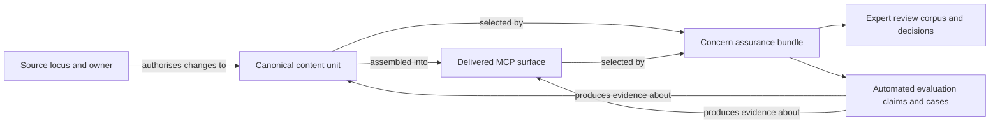

# MCP agent-influence content organisation exploration

## Boundary

This note explores how the MCP content that influences agent behaviour might be
made easier to update, review, and evaluate. It does not choose an architecture,
propose an implementation plan, or authorise content moves.

The intended grouping has two explicit purposes: put all material relevant to
a concern in front of human experts, and make that same concern amenable to
automated evaluation. This clarification reopens the initial synthesis. The
question is not merely where prose should live; it is what a concern grouping
must contain and guarantee if both humans and machines are to rely on it.

The starting evidence is the 13 July 2026
[agent-facing content audit](../reports/mcp-agent-facing-content-audit/report.md),
its [716-item registry](../reports/mcp-agent-facing-content-audit/registry.md),
the [rendered wholes](../reports/mcp-agent-facing-content-audit/rendered-wholes.md),
and the current
[assessment-methodology research](../plans/effectiveness-and-impact/current/mcp-content-assessment-methodology-research.plan.md).
The method follows Oak's
[durable exploration practice](../practice-core/decision-records/PDR-004-explorations-as-durable-design-space-tier.md):
observe, frame the problem, examine contrasting possibilities, then state a
provisional synthesis with warrants and falsifiers.

## Movement 1: observations before categories

### The inventory is not one kind of thing

The audit found 716 content fragments in 143 files. Those fragments include
server instructions, tool descriptions, parameter descriptions, prompt
templates, recovery copy, resources, and configuration-adjacent behaviour.
They are useful as the smallest traceable editing and review candidates, but
they are not all independently delivered to an agent.

The rendered-wholes view exposes a second unit: the surfaces an agent actually
receives. It assembles server instructions, per-response hints, 42 tool
definitions, seven prompts, and resources. Several behaviours only become
visible in composition. The orientation instruction, for example, is repeated
through server instructions and generated tool guidance; reviewing either
fragment alone cannot establish whether the whole is coherent or excessive.

The assessment research introduces a third unit: behaviour across a task or
trajectory. Tool selection, prerequisite compliance, recovery, pedagogical
quality, and context cost cannot be reduced to the correctness of one string.

There is also a fourth, independent dimension: where the words are owned. Of
the 716 fragments, 589 are authored in this repository, 116 originate in the
in-house Open Curriculum API, nine are external third-party content, and two
come from Oak Skills. The generated `get-key-stages-subject-assets` parameter,
for example, exposes a known wording defect here but must be corrected in the
upstream OpenAPI source rather than in its generated copy.

This gives four related but non-identical structures:

1. **Content unit** — the smallest thing someone can author, trace, or change.
2. **Delivered surface** — the assembled context the agent can actually see.
3. **Behaviour under evaluation** — the outcome or trajectory that evidence
   can support or refute.
4. **Source locus** — the repository or authority that owns the words.

### Human review and automated evaluation share a slice, not a shape

Both purposes need a complete pedagogy, safety, or accuracy slice. They do not
consume that slice in the same representation.

A human expert needs readable context, provenance, surrounding composition,
and a way to record judgement. An automated evaluation needs stable identities,
deterministic assembly, executable cases, claims or oracles, and reproducible
results. Giving the expert only a machine manifest would not bring the material
together in a useful sense. Giving the evaluator only a rendered review book
would not make the concern executable.

The deeper shape is at least three-dimensional:

1. **Concern** — pedagogy, safety, accuracy, accessibility, tool usability, and
   so on.
2. **Unit of analysis** — content fragment, assembled surface, or end-to-end
   trajectory.
3. **Assurance modality** — expert review or automated evaluation.

Source locus remains an orthogonal ownership dimension. A pedagogy grouping is
therefore best understood initially as a complete slice through those
dimensions, not as proof that every selected artifact has one physical parent.

### Concern is overlapping, not partitioning

The registry assigns each item one deterministic `review_domain`, but the
audit explicitly treats this as a routing heuristic rather than ground truth.
The distribution is useful: tool usability (304), recovery copy (151),
pedagogy (99), engineering structural (90), curriculum accuracy (27), legal
(19), UX/accessibility (16), externally sourced pedagogy (eight), and other
(two). Yet 81 of the 143 files contain more than one primary review domain.

Safety demonstrates the limitation particularly clearly. It is not one
exclusive review domain in the snapshot. It cuts across content through flags
such as user-input interpolation, PII adjacency, possible defects, and boundary
decisions. The 166 user-input-interpolation items span seven review domains.
Optional teacher `classNotes`, for example, are pedagogical input, a potential
privacy boundary, and part of an end-to-end prompt behaviour at the same time.

Accuracy is similarly plural. It can mean curriculum truth, accurate tool
contract prose, faithful recovery guidance, or avoiding stub data in a live
environment. Placing each fragment in exactly one concern folder would force a
false choice between these meanings.

### The snapshot is evidence, not yet a maintainable content system

The registry generator preserves the current snapshot and its provenance, but
the raw audit-pass inputs are no longer present. The 716-item inventory is
therefore a strong survey artifact, not yet a reproducible extraction and
classification pipeline. Any enduring organisation has to distinguish
canonical content from generated indexes and from time-bounded audit evidence.

The current workspace topology also matters. A new top-level workspace tier is
an architectural choice under
[ADR-041](../../docs/architecture/architectural-decisions/041-workspace-structure-option-a.md),
not merely a tidier folder name. A concern deserves a package or workspace
boundary only if it has an independent contract, consumers, or lifecycle—not
solely because a reviewer needs a convenient queue.

## Movement 2: the problem space

### Problem statement

Agent-influencing content is distributed according to runtime construction and
source ownership, while people need complete, durable concern slices for expert
review and automated evaluation. Today the audit bridges those views as a
snapshot, but the repository has no settled model that keeps authoring,
assembly, concern membership, human decisions, executable evaluations, and
upstream stewardship connected as the content changes.

This is a content-governance and assurance problem before it is a folder-layout
problem.

### Where the architectural tension lives

The user-proposed grouping is not internally contradictory: both human review
and automated evaluation benefit from a concern boundary. The tension appears
when “grouped together” is assumed to mean one of several stronger things:

- **one physical owner** — difficult when one artifact affects several
  concerns;
- **one representation** — difficult when experts need legibility and eval
  runners need executable structure;
- **one unit of analysis** — difficult when wording review, assembled-context
  review, and behavioural evidence answer different questions;
- **one source authority** — impossible for locally rendered upstream content
  unless ownership is deliberately changed;
- **one workspace contract** — premature if a review collection has no runtime
  dependency or release boundary of its own.

The tension in the existing repository is the inverse. Runtime construction and
code generation have legitimate physical homes, but concern completeness is not
a first-class maintained structure. The audit temporarily reconstructs that
structure; it does not yet make it live.

### Mechanism of harm

If physical location is asked to encode all of these views, one of four things
happens:

- cross-cutting concerns are made artificially exclusive;
- canonical text is duplicated into review-oriented collections and drifts;
- evaluations attach to fragments even when they make claims about assembled
  or end-to-end behaviour;
- generated or upstream-owned content is edited at the wrong source.

The likely result is locally convenient updating but incomplete assurance—or a
complete review inventory that is too expensive to maintain.

### Constraints a useful model must survive

- Controlled prose should have one clear source of truth; upstream prose should
  be pointed to and highlighted rather than copied into a local replacement.
- One content unit may participate in several delivered surfaces and several
  concerns.
- Review and evaluation have different objects. Review can inspect wording;
  evaluation needs claims, tasks, baselines, corpora, or trajectories.
- High-impact content needs stronger review and evaluation protocols than
  simple configuration.
- Localisation requires content identity and composition to remain stable
  enough to translate without making translated text a detached fork.
- A workspace boundary carries dependency and release meaning. It should not
  be introduced merely as a filing device.
- Evaluation definitions should remain version-controlled with the artifacts
  they grade, while still allowing a concern owner to see the whole assurance
  surface.

### What success would feel like

An author can answer “where do I change this?”; a reviewer can answer “show me
everything relevant to safety and pedagogy”; an evaluator can answer “which
assembled surfaces and behaviours does this claim exercise?”; and a steward can
answer “which upstream authority must accept this correction?” without any of
them maintaining a second copy of the content.

## Movement 3: contrasting organising directions

These are lenses, not candidates in a decision process.

### Concern-owned workspaces

An `agent-influence/mcp/` area containing `pedagogy/`, `safety/`, `accuracy/`,
and similar workspaces would make ownership and review intent highly visible.
It would give each concern a natural home for rubrics, evaluation definitions,
corpora, and explanatory material.

Its weakness as the sole content source is structural: concerns overlap. A
single prompt could be pedagogical, privacy-sensitive, accessibility-relevant,
and accuracy-critical. Either one concern wins arbitrarily or the prompt is
duplicated. Concern workspaces are therefore strongest as assurance views and
protocol ownership, not necessarily as exclusive ownership of every string.

They would also have to carry two different products deliberately: a rendered,
contextual review corpus for humans and executable evaluation assets for
machines. Merely placing existing files under a concern name would provide
neither guarantee.

### Concern as tags or generated filters

The smallest response would be to add multi-valued concern metadata and
generate filtered reports. This handles overlap and can put all selected
material in one readable output without moving canonical sources.

It may be too weak for the stated intent. A tag gives discoverability, but it
does not establish accountable scope, reviewer decisions, evaluation claims,
coverage expectations, or an executable contract. A regenerable report is a
useful product of a concern grouping; it is not necessarily the grouping
itself.

### Delivery-surface ownership

Content could be organised around server instructions, tools, prompts,
resources, and recovery responses. This mirrors what the MCP client receives
and makes whole-surface review easier.

It is weaker for reusable fragments and end-to-end behaviours. The same
orientation rule appears in several surfaces, and a tool-selection trajectory
spans many tool definitions. Surface ownership alone can hide shared intent and
encourage repeated prose.

### Construction- or source-owned content

Canonical content could remain beside the code, schema, template, or upstream
authority that constructs it. This gives authors the shortest path from change
to runtime contract and respects generated-code boundaries.

It is weak as a human assurance interface. Reviewers must rediscover the
inventory across packages, and concern coverage is hard to see without a
projection. This is close to the present physical reality, so retaining it
without a stronger index would not resolve the audit's usability problem.

### One central typed catalogue

A central catalogue could assign stable identities and describe source locus,
composition, audience, risk, concerns, and evaluation links. Multiple indexes
could then be generated from the same facts.

This makes relationships explicit, but a catalogue can become a hand-maintained
shadow of the code. It is only credible if canonical prose is either authored
there intentionally or extracted reproducibly, and if drift checks establish
that its links and generated projections are current.

### Concern assurance bundles over canonical authoring

A hybrid treats each concern as a durable assurance boundary while separating
its products deliberately:

- canonical content stays at an earned authoring boundary;
- composition records which units form each delivered surface;
- a concern owns its inclusion rules and a multi-valued membership manifest;
- a human review product renders every selected unit in relevant context and
  records expert decisions;
- automated evaluation definitions attach to the fragment, assembled surface,
  or behaviour they actually grade;
- a coverage view connects concern membership, review status, evaluation
  claims, and evidence without treating them as interchangeable.

This avoids asking the directory tree to be the data model. Its cost is that
identities, mappings, deterministic assembly, and generation become real
infrastructure that must earn their maintenance burden. A thin manually curated
index would provide the appearance of integration while drifting from runtime
truth. Conversely, a bundle that only runs evals would fail the expert-review
purpose even if its checks were green.

## Movement 4: provisional synthesis

### Current hypothesis

**Concern should be a first-class, multi-valued assurance boundary that joins
expert review and automated evaluation, but it need not be the sole physical
ownership boundary for agent-influencing content.**

The evidence currently favours two connected planes:

1. an **authoring and composition plane**, where canonical content has a clear
   source locus and delivered surfaces can be reconstructed; and
2. an **assurance plane**, where each concern owns its scope, expert-review
   corpus and decisions, evaluation claims and cases, and evidence of coverage
   over those surfaces.



This is a claim about relationships, not a proposed repository tree. If the
relationships survived further exploration, one illustrative projection could
look like this:

```text
agent-influence/
  mcp/
    content/       # canonical units or pointers, plus composition identities
    concerns/
      pedagogy/
        scope/     # inclusion rules and membership
        review/    # expert corpus, protocol, and decisions
        evals/     # executable claims, cases, and oracles
        coverage/  # joined review and evaluation evidence
      safety/
      accuracy/
    projections/   # generated views by concern, surface, risk, and source
```

Even this sketch leaves open whether `agent-influence/` should be a top-level
workspace tier, a documentation-and-evaluation namespace, or an MCP-local
boundary. One consumer is not yet evidence for a generic cross-channel
framework. If implementation were ever considered, a new tier would require
an explicit reconciliation with ADR-041.

### Consequences of the hypothesis

- “Separated by concern” means separable responsibility and navigability, not
  mutually exclusive storage.
- Concern areas may own scope, expert-review artifacts, and evaluation assets
  without owning every source string they assess.
- Human review and automated evaluation should be co-located conceptually by
  concern but remain distinct evidence modalities; neither stands in for the
  other.
- Item-level registry entries provide traceability; fragments and assembled
  surfaces are complementary review objects; end-to-end outcomes are the
  behavioural evaluation object.
- Upstream content participates through provenance and issue routing, not by
  being wrapped or forked locally.
- Safety is modelled as a cross-cutting assurance concern. It is not forced
  into the current scalar `review_domain` field.
- Generated concern views are disposable outputs. Their reproducible inputs and
  drift checks would be the durable contract.

### Warrants and falsifiers

| Provisional claim | Warrant in the survey | Evidence that would weaken or falsify it |
| --- | --- | --- |
| A concern should be a durable assurance boundary, not only a tag. | The explicit intent requires a complete expert-review corpus and executable evaluations, with coverage visible across both. | A generated filtered report plus centrally owned generic evals proves sufficient for accountable expert review, repeatable evaluation, and drift detection. |
| Concern cannot be the only ownership axis. | 81 of 143 files mix primary review domains; safety-related interpolation crosses seven domains. | A reclassification study shows that nearly all meaningful content has one stable accountable concern and cross-concern cases are negligible. |
| Review and evaluation need different units. | The audit inventories fragments and rendered wholes, while the methodology research includes tool selection and trajectories. | Representative evaluations reliably attribute outcome quality to isolated fragments without assembled or trajectory context. |
| Canonical content and assurance views should be separable. | Content has four source loci, including generated upstream prose that must be changed elsewhere. | Moving all controlled and upstream-derived text into one local authority proves compatible with source ownership, code generation, and drift control. |
| Projections are more faithful than a single concern tree. | Items and files participate in multiple concerns, surfaces, flags, and source loci. | A small physical taxonomy supports authoring, multi-concern review, evaluation attachment, and upstream routing without duplication or hidden joins. |
| A generic top-level `agent-influence/` tier is not yet earned. | The concrete evidence is MCP-specific and current workspace tiers carry architectural meaning. | A second agent channel presents the same identities, composition model, lifecycle, and assurance needs with clear shared consumers. |

## Exploration disposition

The survey and the clarified dual purpose support the user's family of
directions more strongly than a tag-and-report interpretation would. A
concern-oriented `agent-influence/mcp/` boundary could be the durable place
where an expert sees the whole pedagogy corpus and where the corresponding
automated evaluations live and run. It does not yet follow that those concern
areas should be exclusive physical owners of every selected source string.

The most resilient current framing is therefore **canonical authoring plus
multi-concern assurance bundles, each joining a human review product and an
automated evaluation product through explicit membership, composition, and
coverage identities**. That framing remains an active hypothesis. Whether
those bundles should be workspaces, documentation-and-evaluation directories,
or generated views remains unresolved. No folder, workspace, migration,
evaluation suite, or implementation plan is proposed by this note.
