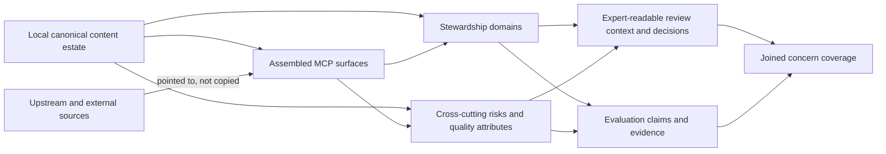

# MCP agent-influence content organisation exploration

## Boundary

This note explores how MCP content that influences agent behaviour can become
easy for domain experts to review and update while also supporting automated
evaluation. It does not choose a repository architecture, define evaluation
protocols, propose an implementation plan, or authorise content moves.

The 13 July 2026 agent-facing content audit already settled the direction that
Oak-controlled content moves into one or more content workspaces and that those
workspaces become the source of truth. This exploration does not reopen that
decision. It examines the remaining conceptual and architectural tension:

- what a “concern” is;
- what it means to put all concern-relevant material together;
- whether concern should determine physical ownership, assurance ownership, or
  both; and
- how human review and automated evaluation can share complete scope without
  being forced into the same representation.

The evidence base is the audit's
[716-item registry](../../.agent/reports/mcp-agent-facing-content-audit/registry.md),
its [rendered wholes](../../.agent/reports/mcp-agent-facing-content-audit/rendered-wholes.md),
the [audit report](../../.agent/reports/mcp-agent-facing-content-audit/report.md),
and the current
[assessment-methodology research plan](../../.agent/plans/effectiveness-and-impact/current/mcp-content-assessment-methodology-research.plan.md).
The method follows Oak's
[durable exploration practice](../../.agent/practice-core/decision-records/PDR-004-explorations-as-durable-design-space-tier.md):
observe, frame the problem, work contrasting possibilities against concrete
evidence, then state a provisional synthesis with warrants and falsifiers.

## Movement 1: ratify the problem before the categories

### Settled direction

The audit records seven owner-settled decisions that constrain this
exploration:

1. Expert review will happen and will vary by content intent and audience.
2. Oak-controlled content moves into separate content workspace or workspaces
   to reduce the cognitive load of finding and changing it.
3. Those workspaces are the source of truth; consumers read from them.
4. High-impact content carries review and evaluation protocols; simple string
   configuration does not inherit the same protocol burden.
5. Upstream content is highlighted and routed to its owner, not wrapped as a
   false local source of truth.
6. Review and evaluation rigour follows impact and risk, including for
   upstream-authored material.
7. The content organisation is localisation-ready even though language
   localisation is not current scope.

The open question is therefore not “workspace or no workspace”. It is which
boundaries the workspace estate should embody and which relationships need a
different, overlapping structure.

### The survey contains four different objects

The audit found 716 fragments in 143 files. A fragment is useful for identity,
provenance, editing, and review routing, but it is not always what an agent
receives or what an evaluation grades.

The evidence exposes four related objects:

1. **Content unit** — the smallest canonical thing that can be authored,
   traced, translated, or changed.
2. **Delivered surface** — the assembled server instruction, tool definition,
   prompt, resource, or response that an agent receives.
3. **Behaviour under assurance** — an outcome or trajectory such as correct
   tool selection, safe use of teacher input, pedagogical quality, or faithful
   evidence use.
4. **Source locus** — the authority that owns the words and can accept a
   correction.

The source-locus distinction is material: 589 fragments are authored in this
repository, 116 originate in the in-house Open Curriculum API, nine are
external third-party content, and two are derived from Oak Skills. A complete
review slice includes all four loci, but only Oak-controlled local content can
become canonical in this repository's content workspace estate.

### “Concern” currently mixes different kinds of thing

The examples pedagogy, safety, and accuracy sound like siblings, but the audit
shows that they are not naturally the same type:

| Kind                       | Question it answers                                   | Examples                                                                      | Natural structure                                            |
| -------------------------- | ----------------------------------------------------- | ----------------------------------------------------------------------------- | ------------------------------------------------------------ |
| Expert stewardship domain  | Who is qualified and accountable to judge the intent? | pedagogy, curriculum accuracy, legal/licensing, accessibility, tool usability | a review regime and a plausible primary stewardship boundary |
| Cross-cutting risk concern | Where can a particular harm arise?                    | privacy, prompt injection, unsafe interpolation                               | a multi-domain slice or assurance campaign                   |
| Quality attribute          | What property must remain true?                       | accuracy, faithfulness, clarity, coherence                                    | claims applied across several domains and units of analysis  |
| Impact tier                | How much assurance is proportionate?                  | high-impact, simple configuration                                             | protocol depth, not subject ownership                        |
| Assurance instrument       | How can evidence be produced?                         | expert review, deterministic check, behavioural evaluation, production signal | a method selected for a claim, not a content category        |

Pedagogy can identify a coherent expert community and a substantial body of
content. Safety cuts across those communities. Unqualified “accuracy” includes
curriculum truth, tool-contract correctness, evidence faithfulness, and
operational truth; each has a different reviewer and evidence method.

A flat directory tree of `pedagogy/`, `safety/`, and `accuracy/` would therefore
encode a category error before it encoded an architecture. The tree would make
unlike concepts look interchangeable and would conceal their overlaps.

### A concern is an assurance contract, not merely a label

For this exploration, an **assurance concern** means a governed question about
agent-influencing content that has:

- an explicit inclusion rule;
- an accountable expert discipline or decision owner;
- a stated unit or units of analysis;
- claims about what must be true;
- a completeness denominator; and
- human-review and automated-evidence routes proportionate to its risk.

Concern membership is multi-valued. One content unit, delivered surface, or
behaviour can participate in several concerns without acquiring several
canonical copies.

This definition is stronger than a tag. A tag says “this looks relevant”. An
assurance concern says which complete set must be considered, by whom, against
which questions, and how missing evidence becomes visible.

### “All the material together” is a completeness promise

The expert-review goal does not require every relevant string to have the same
physical parent. It requires one navigable concern entry point that can account
for:

1. every in-scope content unit;
2. every delivered surface in which those units gain meaning;
3. every behaviour claim that the concern intends to assure;
4. provenance and the valid change route for each source locus; and
5. review, evaluation, exemption, and unresolved states against a known
   denominator.

Humans and machines need different projections of that set. Experts need
readable assembled context, provenance, and an edit or issue route. Evaluation
runners need stable identities, executable cases, claims, baselines, and
reproducible evidence. The two products must join through the same identities
and scope; they should not be collapsed into one artefact.

## Movement 2: locate the architectural tension

### Problem statement

Oak has decided to extract controlled agent-influencing content into a
canonical content estate. The current repository, however, organises that
content mainly by runtime construction and source ownership, while expert
review and evaluation need durable, complete, overlapping concern slices.

The gap harms three groups through different mechanisms:

- experts cannot reliably see all relevant meaning in assembled context or
  route a correction to its valid source;
- evaluators cannot state a concern's coverage or attach evidence to the right
  unit of analysis; and
- authors cannot tell whether a local update preserved the other concerns and
  delivered surfaces in which the same content participates.

Success is not a tidy directory. It is a system in which an author can answer
“where do I change this?”, an expert can answer “show me the complete concern
slice in context”, and an evaluator can answer “which claims, surfaces, and
behaviours remain unassured?” without maintaining a second copy of the words.

### The tension exists in three places

#### In the initial proposal

A folder hierarchy gives each file one parent, while concern membership is
many-to-many. If physical location alone carries concern membership, overlap
becomes duplication, arbitrary primary ownership, or hidden cross-links.

#### In the concepts

Stewardship domains, cross-cutting risks, and quality attributes have different
cardinalities and accountabilities. Treating them as peer “areas of impact”
creates a false symmetry. A useful architecture must preserve their
differences rather than normalise them away.

#### In the existing repository

Runtime and generation boundaries are legitimate engineering homes, but they
do not expose concern completeness. The audit reconstructs that view as a
snapshot. Conversely, moving canonical content into workspaces will improve
authoring but will not by itself create assembled review views, behavioural
claims, or cross-repository issue routing.

### Constraints a useful model must survive

- Oak-controlled content has one canonical home in the content workspace
  estate; generated consumers do not become rival authorities.
- Upstream or external content remains reviewable and evaluable without being
  copied into a false local source of truth.
- One unit can affect several concerns and several delivered surfaces.
- Review can judge wording and intent; evaluation can target a fragment, an
  assembled surface, or an end-to-end trajectory.
- High-impact content needs both expert and automated assurance, but the two
  evidence modalities do not substitute for one another.
- Safety can cross the boundary between content and mechanism. Some harms
  cannot be assured by reviewing prose alone.
- Localisation needs stable content identity and composition without turning
  translations into detached forks.
- A workspace boundary carries dependency and lifecycle meaning under
  [ADR-041](../architecture/architectural-decisions/041-workspace-structure-option-a.md);
  it should not be introduced only as a convenient filter.
- Evaluation methodology remains governed by the separate research programme;
  this exploration must not improvise protocols or runners.

## Movement 3: three vertical slices

The cheapest way to test the concepts is to trace representative concerns
through the complete loop:

```text
canonical source
  → concern inclusion
  → expert-readable assembled context
  → expert decision and valid change route
  → runtime composition
  → automated evidence at the appropriate unit
  → joined coverage state
```

These are conceptual probes against the survey, not implementation designs.

### Slice 1: pedagogy — a stewardship domain with cross-cutting facets

The education-expert slice contains 134 registry items: 99 pedagogy, 27
curriculum-accuracy, and eight externally sourced pedagogy items. Its source
loci are already mixed: 124 local items, two Oak Skills-derived prompt
workflows, and eight external EEF items.

| Loop stage          | Evidence from the survey                                                                                                                           | What the concern must provide                                                                                                         |
| ------------------- | -------------------------------------------------------------------------------------------------------------------------------------------------- | ------------------------------------------------------------------------------------------------------------------------------------- |
| Canonical source    | Local prompt names and templates such as C179 and C202; Oak Skills-derived lesson planning C198; external EEF content and locally authored framing | an editable local source for controlled content plus explicit pointers and correction routes for upstream and external material       |
| Concern inclusion   | the 134-item education slice, with accessibility, safety, faithfulness, and licensing overlaps                                                     | an expert-ratified denominator rather than reliance on the current scalar `review_domain` heuristic alone                             |
| Expert context      | all seven assembled prompts, the `eef://interpretation` resource, and the `curriculum://model` surface                                             | a readable review book organised around complete workflows, with item identities and provenance available without exposing TypeScript |
| Expert decision     | pedagogical suitability, curriculum fidelity, caveat preservation, teacher agency, and source attribution                                          | decisions tied to the exact content and assembled surface, with local edits or routed upstream issues                                 |
| Runtime composition | prompt descriptions, arguments, conditional fragments, shared orientation guidance, resources, and tool calls compose the delivered workflow       | traceability from reviewed units to the assembled prompt actually received by the agent                                               |
| Automated evidence  | content-level rubric checks, faithfulness over evidence use, workflow/tool-contract checks, and end-to-end planning behaviour across models        | evaluation claims ratified from expert intent and attached to the unit they genuinely assess                                          |
| Coverage            | review and evaluation state across all 134 items and their assembled workflows                                                                     | one joined view that distinguishes reviewed, evaluated, exempt, routed upstream, and unresolved                                       |

Pedagogy supports a strong case for a first-class stewardship area: it has a
coherent expert community, a large controlled corpus, and recognisable review
protocols. It still cannot be an exclusive physical partition. C196 and C204
are pedagogical content and privacy-sensitive input handling; C202 is
pedagogical guidance and a faithfulness/licensing surface; C198 is reviewed
locally but changed in Oak Skills.

The slice therefore supports **primary stewardship plus overlapping assurance
facets**, not one-folder exclusivity.

### Slice 2: safety — a cross-cutting risk, not a content department

The registry flags 166 user-input-interpolation items across seven review
domains: 89 tool-usability, 47 recovery-copy, 18 pedagogy, five
curriculum-accuracy, four engineering-structural, two legal/licensing, and one
UX/accessibility. Those items also span local, Open Curriculum API, and Oak
Skills source loci. The flag is deliberately a heuristic superset, not a
validated safety denominator.

The clearest concrete path is teacher `classNotes`:

- C196 invites optional free-text notes and is both pedagogy and PII-adjacent;
- C204 interpolates those notes into the assembled `continue-progression`
  prompt and asks the agent to reason over them; and
- the rendered whole shows the user-supplied notes adjacent to workflow
  instructions without a described delimiting or sanitisation defence.

| Loop stage          | What the `classNotes` path exposes                                                                                                                                                    |
| ------------------- | ------------------------------------------------------------------------------------------------------------------------------------------------------------------------------------- |
| Canonical source    | controlled prompt argument and template content belongs in the content estate, while any delimiting, validation, or trust-boundary mechanism may belong outside the content catalogue |
| Concern inclusion   | safety scope must be derived from data-flow and harm mechanisms, not from a primary review-domain folder                                                                              |
| Expert context      | a safety reviewer needs the full assembled prompt, the interpolation boundary, provenance, and the intended pedagogical use of the notes                                              |
| Expert decision     | the review must preserve the useful readiness signal while setting privacy and injection constraints; prose review alone cannot accept mechanism risk                                 |
| Runtime composition | the risk emerges when a benign pedagogical argument is inserted into a behaviour-shaping prompt                                                                                       |
| Automated evidence  | deterministic boundary checks and adversarial end-to-end behaviour may both be relevant; the methodology programme decides valid instruments                                          |
| Coverage            | the 166-item heuristic must be validated into included, excluded-with-reason, and additionally discovered paths before “all safety material” is a defensible claim                    |

Safety is therefore a poor candidate for exclusive canonical ownership. Its
natural form is a cross-cutting assurance concern that selects content,
composition paths, and behaviour from several stewardship domains. It may own
scope, protocol, threat questions, evaluations, and evidence without owning
the underlying pedagogical or tool-description strings.

This slice also shows why a content-only architecture is insufficient. An
assurance concern must be able to cross from words into the mechanism that
assembles or interprets them when the harm arises at that boundary.

### Slice 3: accuracy — one word concealing several concerns

The registry's narrow `curriculum-accuracy` review domain contains 27 local
items and is coherent enough for curriculum experts. Broad “accuracy”,
however, reaches much further:

| Accuracy meaning          | Representative evidence                                                                                                   | Accountable discipline                                   | Likely unit of assurance                            |
| ------------------------- | ------------------------------------------------------------------------------------------------------------------------- | -------------------------------------------------------- | --------------------------------------------------- |
| Curriculum-model truth    | C172 and C173 describe the curriculum orientation tool and its domain model                                               | curriculum expert                                        | content unit and assembled `curriculum://model`     |
| Tool-contract correctness | C624 says a question-returning tool limits “lessons”; the wording is owned by the upstream Open Curriculum API            | API/tooling expert plus upstream owner                   | generated tool definition against the live contract |
| Evidence faithfulness     | C202 and `eef://interpretation` require EEF claims, caveats, and attribution to survive agent reasoning                   | education/evidence expert, with legal input where needed | assembled surface and produced answer               |
| Operational truth         | C709 allows stub payloads when configured, raising whether agent-visible data can differ from the represented live system | runtime/security engineering owner                       | running-system behaviour                            |

Putting these under one `accuracy/` workspace would create the appearance of
one reviewer and one protocol where neither exists. Narrowing the name to
`curriculum-accuracy` produces a plausible stewardship domain; retaining broad
accuracy makes it a quality attribute that attaches different claims to
different domains.

This slice therefore falsifies the idea that every familiar concern word is a
ready-made workspace axis. The architecture needs typed concerns or precise
names before it needs folders.

### Cross-slice result

The three probes produce an asymmetric topology:

- **pedagogy** can be a primary stewardship boundary, but needs overlapping
  safety, accessibility, faithfulness, and licensing views;
- **safety** is a cross-cutting risk concern spanning content and mechanism;
  and
- **accuracy** must either be narrowed into stewardship domains or treated as
  a quality attribute composed of distinct claims.

Uniform sibling workspaces are therefore not the natural result. The common
thing is the assurance contract; its physical expression depends on the kind
of concern.

## Movement 4: contrasting organising directions

### Option A: concern-owned canonical workspaces

Each named concern owns its content, review material, evaluation definitions,
and evidence. In its strongest form, every item has a primary concern owner and
cross-concern indexes project the overlaps.

**Strengths**

- An expert gets a legible home with direct authoring and accountability.
- Review intent, protocol, and evaluation assets can evolve together.
- The structure makes concern ownership highly visible.

**Failure modes**

- Cross-cutting concerns require arbitrary primary ownership or pervasive
  projection machinery anyway.
- `pedagogy`, `safety`, and `accuracy` look like peers despite having different
  conceptual types.
- A content unit's location can be mistaken for its complete assurance scope.
- Upstream material still needs pointers and cross-repository evidence, so the
  workspace is never literally complete as an authoring authority.

This direction is strongest for validated stewardship domains and weakest as
a universal rule.

### Option B: shared canonical content estate with generated concern views

One content estate owns local canonical units and composition identities.
Concern membership is multi-valued metadata; expert review books, evaluation
manifests, and coverage reports are generated as projections.

**Strengths**

- Canonical content remains singular while overlap is represented honestly.
- Assembly, localisation, source locus, and consumer generation can share
  stable identities.
- New cross-cutting concerns do not force content moves.

**Failure modes**

- A generated report can become a read-only inventory that does not make
  expert updating easy.
- Generic central ownership can weaken domain accountability and hide the
  review protocol behind metadata.
- A hand-maintained catalogue can drift into a shadow of runtime truth.
- “Everything is tagged” can masquerade as complete assurance without a
  denominator, claims, or decisions.

This direction represents overlap well but must prove the human authoring and
accountability experience rather than assume it.

### Option C: canonical content estate plus typed concern assurance areas

Local controlled content lives in the settled canonical content workspace
estate. Stewardship domains may shape workspace boundaries where they have
independent expert ownership and lifecycle. Separately, every assurance
concern owns its scope, expert view, claims, protocols, evaluations, and
coverage evidence. Cross-cutting risks and quality attributes remain
multi-valued projections over canonical units, assembled surfaces, and
behaviours.

**Strengths**

- It preserves the settled source-of-truth direction without asking a
  directory tree to encode every relationship.
- It gives pedagogy-like domains a coherent home while allowing safety-like
  concerns to span them.
- Human and automated products share scope and identity but remain fit for
  their consumers.
- Upstream content participates through provenance, review, evaluation, and
  issue routing without becoming a local copy.

**Failure modes**

- The join between canonical content and concern areas becomes real
  infrastructure; if it is manual, it will drift.
- Experts may experience indirection if the concern view cannot lead cleanly
  to the canonical edit or upstream issue route.
- Typed concern kinds can become abstract taxonomy unless expert review and
  real evaluation claims validate them.
- Too many physical packages can turn conceptual separation into workspace
  sprawl.

This option currently explains all three vertical slices with the fewest false
equivalences. It remains a hypothesis, not an architectural decision.

### Comparison against the two intended outcomes

| Direction                                  | Human expert review and updating                                        | Automated evaluation                                                | Main unresolved risk                                                     |
| ------------------------------------------ | ----------------------------------------------------------------------- | ------------------------------------------------------------------- | ------------------------------------------------------------------------ |
| Concern-owned canonical workspaces         | strongest direct home for a primary domain                              | natural local protocol and eval ownership                           | overlap and mixed concern kinds force arbitrary placement                |
| Shared content estate with generated views | complete navigable view is possible; editable round-trip must be proven | strongest single identity and composition substrate                 | tags and reports may provide visibility without accountability           |
| Canonical estate plus typed concern areas  | domain home where earned, cross-cutting review where required           | claims can attach to units, surfaces, and behaviours across domains | the content-to-assurance join must be deterministic and easy for experts |

## Provisional synthesis

The evidence supports a distinction between **where controlled content is
canonically authored** and **how concern assurance is owned**.

The surviving model is:

1. The settled content workspace estate is the authoring and composition plane
   for Oak-controlled agent-influencing content.
2. Primary stewardship domains may justify boundaries within that estate when
   expert ownership, contract, and lifecycle genuinely align.
3. Assurance concerns are typed and multi-valued. Cross-cutting risks and
   quality attributes are not forced into exclusive content ownership.
4. Each concern produces a human review projection and automated evidence at
   the appropriate unit of analysis, joined through stable content and surface
   identities.
5. Upstream and external material is present in the concern denominator and
   review context, but its correction route preserves the real source locus.
6. “Together” is satisfied by complete navigability, editable or routable
   provenance, and joined coverage—not by duplicating every relevant string
   under one parent directory.



This synthesis changes the original family of directions in one important
way. A future `agent-influence/mcp/` namespace, if earned, should not imply
that every concern is the same kind of workspace. It could contain a canonical
content estate and concern assurance areas, but the exact package and directory
topology remains an architectural decision for a later phase.

## Warrants and falsifiers

| Provisional claim                                                               | Warrant in the evidence                                                                                                       | Evidence that would weaken or falsify it                                                                                                                                       |
| ------------------------------------------------------------------------------- | ----------------------------------------------------------------------------------------------------------------------------- | ------------------------------------------------------------------------------------------------------------------------------------------------------------------------------ |
| Pedagogy, safety, and broad accuracy should not be peer physical partitions.    | The three slices have different reviewer cardinality, scope, and units of assurance.                                          | Expert scope validation shows they have stable, mutually intelligible ownership and independent lifecycles as peer workspaces.                                                 |
| Concern must be stronger than a tag.                                            | The dual intent requires complete review and evaluation coverage with accountable decisions.                                  | A generated filtered view, without concern-owned scope or decisions, proves sufficient for durable expert review, reproducible evaluation, and missing-evidence detection.     |
| Concern cannot be the sole ownership axis.                                      | 81 of 143 files mix primary review domains; the 166 interpolation flags cross seven domains and three source loci.            | Expert reclassification finds nearly every meaningful unit has one stable concern and cross-concern cases are negligible.                                                      |
| Human review and automated evaluation need distinct products over shared scope. | Experts require assembled legibility and judgement; runners require executable claims, cases, and reproducibility.            | One representation proves equally usable for expert editing and machine execution without adapters or loss of context.                                                         |
| Safety is naturally cross-cutting.                                              | The `classNotes` risk emerges through pedagogy content, interpolation mechanics, privacy, and agent behaviour.                | A validated safety inventory forms an independent content corpus with little dependence on other stewardship domains or runtime mechanisms.                                    |
| Broad accuracy must be decomposed or treated as an attribute.                   | Curriculum truth, tool-contract wording, evidence faithfulness, and runtime truth have different owners and evidence methods. | One accountable expert discipline and protocol reliably judges all four without hiding specialist decisions.                                                                   |
| The typed hybrid is simpler than uniform concern workspaces.                    | It preserves one local source of truth while matching the asymmetry exposed by all three slices.                              | Concern areas require independent dependencies, release cadence, and authoring contracts often enough that separate canonical workspaces reduce joins and duplication overall. |
| A generic top-level `agent-influence/` tier is not yet earned.                  | The survey evidence is MCP-specific and workspace tiers carry architectural meaning.                                          | A second agent channel exhibits the same identity, composition, authoring, and assurance contracts with real shared consumers.                                                 |

## Research questions still open

1. After expert validation, which `review_domain` values are genuine primary
   stewardship domains and which are only useful routing heuristics? The
   assessment-methodology plan's greater-than-10% reassignment trigger is the
   current falsification mechanism.
2. Can an expert move from a generated concern review view to a safe canonical
   edit or upstream issue without needing to understand repository plumbing?
   This is the decisive usability test for the easy-updating goal.
3. What is the exact completeness denominator for a concern: content units,
   assembled surfaces, behaviour claims, or a typed combination of all three?
4. Which safety concerns require the assurance boundary to include runtime
   mechanism as well as content, and how is that boundary kept legible to a
   content reviewer?
5. Should validated stewardship domains partition the canonical workspace
   estate, or should that estate partition by composition/consumer while
   stewardship remains an assurance layer?
6. What stable identities and composition facts are required to make concern
   projections reproducible rather than manually curated snapshots?
7. Which evaluation instruments are valid for each concern and unit of
   analysis? This remains with the authoritative assessment-methodology
   research programme, not this exploration.
8. Does another non-MCP agent channel establish a real second consumer for a
   generic `agent-influence/` tier?

## Exploration disposition

This second pass resolves the conceptual tension far enough to prevent a
premature uniform concern-tree design. It establishes that the architecture
must distinguish primary stewardship domains, cross-cutting risks, quality
attributes, impact tiers, assurance instruments, and units of analysis.

The current leading hypothesis is **a canonical content estate plus typed
concern assurance areas**. Pedagogy-like domains may earn primary workspace
boundaries; safety-like concerns remain cross-cutting; broad qualities such as
accuracy must be decomposed into accountable claims. Human review and
automated evaluation meet through shared scope, identities, and coverage, not
through identical files or exclusive physical ownership.

The exploration remains `active` because expert validation, concern
denominators, editable round-trip usability, and evaluation-methodology
research can still falsify the topology. No schema, package, generator,
migration, evaluation suite, or implementation plan follows from this note.

## Informs

- a future architectural decision about the partition and contracts of the
  agent-influencing content workspace estate;
- the concern and coverage model consumed by the MCP content assessment
  methodology research; and
- any later build-session plan for moving controlled content and connecting its
  consumers.

## References

- [MCP agent-facing content audit report](../../.agent/reports/mcp-agent-facing-content-audit/report.md)
- [MCP agent-facing content registry](../../.agent/reports/mcp-agent-facing-content-audit/registry.md)
- [MCP rendered wholes](../../.agent/reports/mcp-agent-facing-content-audit/rendered-wholes.md)
- [MCP content assessment methodology research plan](../../.agent/plans/effectiveness-and-impact/current/mcp-content-assessment-methodology-research.plan.md)
- [PDR-004: Explorations as Durable Design-Space Tier](../../.agent/practice-core/decision-records/PDR-004-explorations-as-durable-design-space-tier.md)
- [ADR-041: Workspace Structure Option A](../architecture/architectural-decisions/041-workspace-structure-option-a.md)
